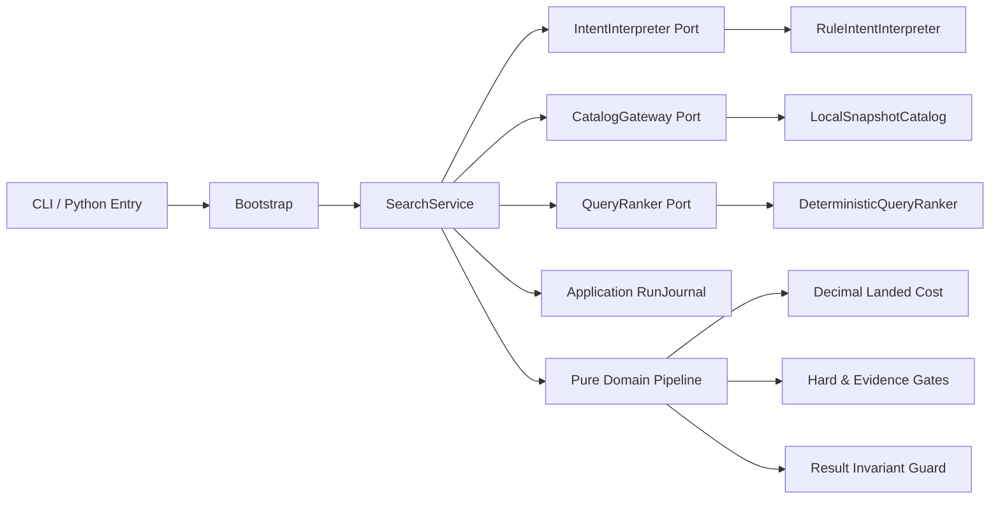

# Glodex M0 技术实施计划

| 字段 | 值 |
|---|---|
| Plan ID | `GLO-PLAN-000` |
| Plan 版本 | `0.1.2` |
| 对应规格 | [`GLO-SPEC-000`](./spec.md) v0.1.2（Approved） |
| 状态 | Completed |
| 范围 | M0：本地可复现的购物检索垂直切片 |
| 创建日期 | 2026-07-23 |
| 最后更新 | 2026-07-28 |
| 批准日期 | 2026-07-23 |

## 1. 计划目标

本计划把已批准的产品规格转换成可实施的技术设计。M0 的目标不是制作一次性 UI 演示，而是建立一条可保留、可扩展的领域基线：

`SearchRequest → 结构化意图 → 版本化商品快照 → 聚合与到手价 → 硬门 → Query-first 排序 → 证据化 Top 3`

M0 完成后，FastAPI、真实 LLM、Provider fan-out、OpenSearch 和 AG-UI 可以作为外围适配器接入，不重写金额、硬约束、证据、结果校验和终态语义。

## 2. 技术约束

### 2.1 选定技术

| 领域 | 选择 | 说明 |
|---|---|---|
| 语言 | Python 3.12 | 固定 `.python-version`；优先成熟生态和后续 LangGraph/OpenSearch 兼容性。 |
| 项目管理 | `uv` | 使用 `pyproject.toml`、提交 `uv.lock`，CI 和验收使用 `--locked`。 |
| 数据合同 | Pydantic 2 | 严格校验、禁止额外字段、冻结模型、稳定 JSON Schema。 |
| 金额计算 | 标准库 `decimal.Decimal` | 禁止 `float` 进入金额和汇率管线。 |
| 测试 | pytest 9 | 严格 marker/config；单元、合同、验收、NFR 分层。 |
| 禁网 | `pytest-socket` | 默认测试进程禁用 socket。 |
| 代码质量 | Ruff、mypy | 格式、lint 和静态类型门禁。 |
| 运行数据 | 版本化 JSON/JSONL fixture | manifest、SHA-256、记录数和 schema 版本。 |
| M0 入站界面 | CLI + Python 应用入口 | stdout 输出结构化 JSON；HTTP 延后至 M1。 |

运行时依赖仅保留 Pydantic。测试和质量工具放在 `dependency-groups.dev`，精确版本由 `uv.lock` 冻结。

### 2.2 M0 明确不引入

- FastAPI、LangGraph、LangChain；
- HTTP 客户端、电商 Provider SDK；
- OpenSearch、Redis、Postgres；
- LLM、embedding 或 reranker SDK；
- Pandas、NumPy；
- Typer、Rich 或额外 CLI 框架；
- Docker 服务依赖；
- `.env`、密钥和 live/network 模式。

## 3. 架构方案

采用“纯领域核心 + 应用编排 + 端口/适配器”的单体模块化结构。



边界规则：

1. `domain` 只能依赖 Python 标准库和共享数据模型，不能执行 I/O。
2. `application` 可以依赖 domain 和端口，不能依赖具体适配器。
3. `adapters` 实现端口，可以依赖合同和应用接口。
4. CLI 只负责解析参数、组装应用和映射退出码。
5. M0 不创建未来模块的空壳，不创建通用 `utils.py` 或无需求的基类层。

对应决策记录：

- [`ADR-0001`](./adr/0001-deterministic-domain-core.md)：M0 使用确定性领域核心，不使用 Agent 框架。
- [`ADR-0002`](./adr/0002-money-fx-and-rounding.md)：金额、汇率和舍入语义。
- [`ADR-0003`](./adr/0003-hard-gates-and-ranking-degradation.md)：硬门、Query-first 和排序降级。

## 4. 应用管线

唯一应用用例：

```text
SearchService.search(SearchRequest) -> SearchResponse
```

应用方法为 `async`，领域函数保持同步、纯函数。CLI 只调用一次 `asyncio.run()`。这样 M1 接入模型和 Provider I/O 时不改变应用入口。

固定阶段：

1. **输入校验**
   - 创建 run 前校验 query、locale、display currency 格式、top_k 和 snapshot version 格式。
   - 非法输入返回 `RequestRejected`，不生成 run ID，不读取快照。
2. **建立运行**
   - 从注入的 `RunIdProvider` 和 `Clock` 获取运行标识和起始时间。
   - 状态从 `NEW` 进入 `RUNNING`。
3. **解释请求**
   - `IntentInterpreter` 产生 Required、Preferred 和 source span。
   - 应用层独立复核 schema、span 和原文一致性。
4. **加载快照**
   - 校验 manifest、文件 SHA-256、记录数、schema 和 snapshot version。
   - 校验 display currency 和查询预算币种均被该快照支持；不支持时产生带 run ID 的 `FAILED`。
   - 隔离允许隔离的脏记录；核心合同错误终止运行。
5. **Canonical 聚合**
   - 按 `product_id` 聚合。
   - Offer 按 `(provider_id, offer_id)` 保存，禁止覆盖。
6. **到手价计算**
   - 对每个 Offer 转换商品价、运费、税费和关税。
   - 同时得到展示币种精确值；若存在 BudgetMax，再得到预算币种精确值用于硬门比较。
   - 未知分量产生不可证明报价，不以零代替。
7. **商品级硬门**
   - 固定顺序：品类 → 商品本体 → 明确排除项 → 必需商品证据。
8. **报价级硬门**
   - 固定顺序：来源 → 库存 → 费用完整性 → 汇率 → 预算。
   - 在售和费用完整性是 M0 系统资格条件；预算 gate 只在存在 BudgetMax 时启用。
9. **形成合格商品**
   - 商品至少有一个合格 Offer 才能进入 scorer。
   - 选择最低精确到手价的 Offer 作为 selected offer。
10. **Query-first 排序**
    - scorer 只能为输入候选打分，不能增加、删除或改写候选。
    - 非法批次整体作废，进入稳定降级排序。
11. **Top K 与结果组装**
    - 从 Verified Claims 生成确定性理由和 evidence 引用。
12. **最终不变量校验**
    - 重新验证硬约束、唯一性、selected offer、证据和 schema。
    - 任一最终不变量失败时清空结果并返回 `FAILED`。
13. **提交唯一终态**
    - `COMPLETED`、`NO_MATCH` 或 `FAILED`。

## 5. 核心领域模型

所有集合字段使用 tuple 等不可变结构；不在冻结模型内部暴露可变 list/dict。

### 5.1 请求与意图

| 模型 | 关键字段与规则 |
|---|---|
| `SearchRequest` | 原始 query、trim 后 query、locale、display currency、top_k、snapshot version。 |
| `SourceSpan` | 基于 trim 后但未做 Unicode 归一化的 query；Unicode code point 半开区间 `[start, end)`；必须满足 `query[start:end] == text`。 |
| `InterpretedRequest` | Required、Preferred、解析器版本。 |
| `RequiredConstraint` | `BudgetMax`、`TargetCategory`、`StockRequired`、`Exclusion` 的判别联合。 |
| `PreferredCriterion` | 仅参与 Query 排序，不能改变合格成员集合。 |

排名可以对 query 使用 NFKC/casefold，但 source span 永远引用 trim 后的原文，避免归一化改变偏移。

`BudgetMax` 保存查询原文中的精确金额和币种；查询未声明币种时继承 `display_currency`。`StockRequired` 只表示用户明确说出了库存条件，不承担系统“只推荐在售报价”的资格规则。

### 5.2 商品、报价与证据

| 模型 | 关键字段与规则 |
|---|---|
| `CanonicalProduct` | product ID、title、标准品类、entity kind、结构化属性、snapshot ordinal、字段证据。 |
| `Offer` | offer ID、product ID、provider、market、库存三态、四个费用分量、采集时间、字段证据。 |
| `EvidenceRef` | evidence ID、snapshot version、entity、field path、provider/source、captured at。 |
| `VerifiedClaim` | claim type、确定性 value、一个或多个 evidence ID、可选算法版本。 |
| `EligibleOffer` | 原 Offer、精确到手价、通过的硬门、拒绝原因为空。 |
| `EligibleProduct` | Canonical Product、至少一个 Eligible Offer、selected offer、Verified Claims。 |

`entity_kind` 至少包含：

- `PRIMARY_PRODUCT`
- `ACCESSORY`
- `REPLACEMENT_PART`
- `DECORATION`
- `UNKNOWN`

M0 只有 `PRIMARY_PRODUCT` 能进入目标商品结果。系统不能仅根据标题猜测 entity kind。

### 5.3 结果与问题

| 模型 | 关键字段与规则 |
|---|---|
| `SearchResult` | 唯一 product ID、selected offer、eligible offers、精确和展示金额、matched requirements、unknowns、reason、evidence。 |
| `SearchResponse` | run ID、唯一终态、snapshot/config/algorithm 版本、interpreted request、results、filter summary、warnings、diagnostics。 |
| `Issue` | code、stage、severity、entity ref、结构化 details。 |
| `FilterSummary` | 固定门顺序的 before/after 漏斗，以及独立的多标签 reason counts。 |

错误和业务拒绝分开：

- `RequestRejected`：输入非法，无 run ID；
- 致命 `Issue`：运行终态 `FAILED`，结果为空；
- 可隔离数据 `Issue`：记录并继续；
- 过滤原因：可能形成 `NO_MATCH`，不用异常表示；
- scorer 降级：继续产生可信结果并标记 `degraded`。

## 6. 金额、汇率与到手价

### 6.1 数据表示

- JSON 中金额与汇率只能是十进制字符串。
- 解析后使用 `Decimal`，拒绝 float、NaN、Infinity 和负数。
- `"0.00"` 是有证据的已知零；`null` 不能表示已知零。
- 精确 Decimal 的规范 JSON 使用 fixed-point、禁止指数、去除无意义尾随零；整数保留为 `"0"`、`"1"` 等。
- 展示 Decimal 严格保留目标币种 `minor_units` 位，例如 USD `"1.20"`。
- 费用使用判别联合：
  - `KnownCost(amount, evidence_id)`
  - `UnknownCost(reason)`

### 6.2 汇率模型

汇率快照声明一个 `base_currency`。每种支持币种提供正数 `base_per_unit` 和 `minor_units`（M0 允许 0–4）：

```text
1 source_currency = source_base_per_unit × base_currency
1 display_currency = display_base_per_unit × base_currency
```

转换：

```text
display_amount =
    source_amount
    × source_base_per_unit
    ÷ display_base_per_unit
```

不搜索汇率路径，不使用网络，不自动推导缺失币种。

### 6.3 精度与舍入

- 所有计算在局部 Decimal context 中进行：precision 28、`ROUND_HALF_EVEN`。
- 各费用分量先转换但不量化，精确值求和后才生成展示金额。
- 预算门把精确总额转换到 BudgetMax 的币种后比较；只有未声明预算币种时才使用 display currency。
- 展示金额按币种 minor unit 量化。
- 选中报价按以下稳定键：
  `(exact_landed_cost, provider_id, offer_id)`。

## 7. 硬门与过滤统计

硬门实现为纯函数，每个 gate 接收不可变候选并返回：

- 保留候选；
- 被拒绝候选；
- 每个实体的原因集合；
- before/after 数量。

统计同时提供两种视图：

1. **顺序漏斗**：按固定门顺序记录 before/after；每个候选在首次淘汰后不再进入后续门。
2. **多标签原因**：对原始候选计算所有可确定的拒绝原因；同一实体同一原因只计一次，总和不要求等于淘汰数。

商品统计和 Offer 统计分开，不能把报价数量当作商品数量。

不可配置的不变量：

- 未知费用不等于零；
- M0 的 Eligible Offer 必须 `IN_STOCK` 且具有完整 Landed Cost；
- 预算 gate 只在存在 BudgetMax 时启用；
- Preferred 不得升级为 Required；
- 硬门必须先于 scorer；
- scorer 不能恢复候选；
- 预算不能自动放宽；
- 最终 guard 不能关闭。

## 8. M0 Query-first 排序

### 8.1 `lexical-v1` 基线

排序器只读取：

- trim 后的当前 query；
- Preferred source span；
- Product title；
- 标准品类；
- 有证据的结构化属性。

不读取长期画像、无证据 description 或 Provider 营销文案。

归一化和 token：

1. Unicode NFKC；
2. 拉丁字符 casefold；
3. 拉丁/数字连续片段；
4. CJK 单字和 bigram；
5. 只统计唯一 token。

整数评分：

- title token overlap：每项 4 分；
- category token overlap：每项 3 分；
- verified attribute name/value overlap：每项 2 分；
- Preferred span overlap：额外每项 3 分。

正常排序键：

```text
(
  -query_score,
  -verified_preference_coverage,
  selected_landed_cost_exact,
  product_id,
)
```

### 8.2 批次校验与降级

scorer 必须为每个输入 product ID 返回且只返回一个有限整数分数。出现以下任一情况，整个评分批次作废：

- 异常或超时；
- 缺失输入 ID；
- 重复 ID；
- 返回输入集合之外的 ID；
- 非整数、NaN 或 Infinity；
- 试图修改候选内容。

降级排序键：

```text
(snapshot_ordinal, product_id)
```

降级不改变合格候选集合，响应必须记录 `ranker_degraded`。

## 9. 理由与证据

M0 不调用 LLM 生成推荐理由。理由由确定性模板消费 `VerifiedClaim`：

- “满足预算：到手价 {amount} {currency} ≤ {budget}”
- “有库存：{provider}/{market}”
- “匹配偏好：{attribute_name}={verified_value}”

每条 claim 必须指向 EvidenceRef；派生金额还必须引用四个费用分量、汇率快照和 `pricing-v1` 算法版本。

EvidenceRef 不能只验证“ID 存在”，还必须满足：

| 事实 | Evidence entity 与 field path 规则 |
|---|---|
| title | 同一 product 的 `product.title` |
| category | 同一 product 的 `product.category` |
| entity kind | 同一 product 的 `product.entity_kind` |
| attribute | 同一 product 的 `product.attributes.{name}` |
| inventory | 同一 offer/provider 的 `offer.inventory` |
| 商品价/运费/税费/关税 | 同一 offer/provider 的对应 `offer.cost_components.*` |
| 汇率 | 同一 snapshot、对应 currency 的 `exchange_rate.base_per_unit` |
| Landed Cost | 对应 Offer 的全部费用证据、所用汇率证据及 `pricing-v1` 算法版本闭包 |

Evidence 的 snapshot version 必须与当前 run 一致；跨 product、跨 offer、跨 provider 或跨 snapshot 的错误引用，即使 evidence ID 存在也必须被 final guard 拒绝。

禁止：

- 从 title/description 推断未结构化的规格；
- 使用“最佳”“最耐用”等无可验证定义的文案；
- 在 unknown 项上生成肯定结论；
- 输出任何没有 claim→evidence 关系的推荐理由。

## 10. 版本化快照合同

目录：

```text
data/snapshots/m0-v1/
├── manifest.json
├── products.jsonl
├── offers.jsonl
├── evidence.jsonl
└── exchange_rates.json
```

### 10.1 Manifest

至少包含：

- `schema_version`
- `snapshot_version`
- 固定 `created_at`
- `base_currency`
- 每个文件的相对路径、SHA-256 和原始记录数
- Provider、market、category 和 currency 清单
- fixture generator/version

路径必须解析在配置的 snapshot 根目录内，拒绝绝对路径和目录穿越。

### 10.2 Record 规则

- Products 和 Offers 分离，以 `product_id` 关联。
- 每个可输出字段通过 `field_evidence` 或 attribute evidence 引用 EvidenceRef。
- 库存使用 `IN_STOCK`、`OUT_OF_STOCK`、`UNKNOWN`。
- 费用分量独立存储，不能只提供不透明总价。
- 相同 canonical product 的核心身份字段冲突时，隔离整个商品，不能任选其一。

### 10.3 错误边界

整次运行失败：

- manifest 不存在或 schema/version 不支持；
- 文件 hash 不匹配；
- snapshot 版本混用；
- 基础币种或汇率表无效；
- 核心文件无法解析。

记录级隔离：

- 缺稳定 product/offer ID；
- 缺 Provider/source；
- 字段证据引用不存在；
- 单条记录 schema 非法。

## 11. 端口与 M0 适配器

### 11.1 端口

| 端口 | 责任 |
|---|---|
| `IntentInterpreter` | 从当前请求产生结构化意图；应用层仍执行独立安全校验。 |
| `CatalogGateway` | 返回单版本 CatalogBatch、汇率和隔离问题。 |
| `QueryRanker` | 只对硬门后的候选打分。 |
| `RunIdProvider` | 生成 run ID；测试使用顺序 ID。 |
| `Clock` | 产生 UTC 时间和单调计时；测试使用固定时钟。 |

端口使用 `typing.Protocol`，不创建 repository/service 抽象基类。

`RunJournal` 是应用内不可变状态的一部分，不是外部 I/O 端口。阶段事件、漏斗和终态与 SearchResponse 在同一次纯状态转换中组装，因此 M0 不存在“业务结果已提交但外部终态写失败”的双重真相。M1 的 AG-UI 或持久事件流是 RunJournal 的投影，需由 M1 Spec 定义投影失败语义。

### 11.2 M0 实现

| 实现 | 对应端口 |
|---|---|
| `RuleIntentInterpreter` | `IntentInterpreter` |
| `LocalSnapshotCatalog` | `CatalogGateway` |
| `DeterministicQueryRanker` | `QueryRanker` |
| `UuidRunIdProvider` / `SequentialRunIdProvider` | `RunIdProvider` |
| `SystemClock` / `FixedClock` | `Clock` |

规则解析器只覆盖 fixture 验收所需的有限中文语义：预算、币种、库存、品类、明确排除项和有限软偏好。每个 Required 必须由实际匹配产生精确 source span。

## 12. 工程目录

```text
glodex/
├── .python-version
├── pyproject.toml
├── uv.lock
├── glodex.toml
├── README.md
├── data/
│   └── snapshots/
│       └── m0-v1/
├── scripts/
│   ├── verify_m0.py
│   ├── check_traceability.py
│   └── generate_perf_snapshot.py
├── src/
│   └── glodex/
│       ├── __init__.py
│       ├── __main__.py
│       ├── bootstrap.py
│       ├── cli.py
│       ├── config.py
│       ├── contracts.py
│       ├── application/
│       │   ├── ports.py
│       │   ├── search_service.py
│       │   ├── state.py
│       │   └── journal.py
│       ├── domain/
│       │   ├── issues.py
│       │   ├── intent.py
│       │   ├── catalog.py
│       │   ├── evidence.py
│       │   ├── pricing.py
│       │   ├── eligibility.py
│       │   ├── ranking.py
│       │   └── assembly.py
│       └── adapters/
│           ├── rule_intent.py
│           ├── local_snapshot.py
│           └── deterministic_ranker.py
└── tests/
    ├── builders.py
    ├── fixtures/
    ├── golden/
    ├── unit/
    ├── contract/
    ├── acceptance/
    ├── architecture/
    └── nfr/
```

不复制历史截图中的 `app/agent/`、`tools/`、`memory/` 等全量目录。

## 13. 配置

`glodex.toml` 只包含运行位置和默认请求参数：

```toml
[app]
data_dir = "data/snapshots"
default_snapshot = "m0-v1"

[search]
default_locale = "zh-CN"
default_currency = "USD"
default_top_k = 3
```

优先级：

```text
CLI > GLODEX_* 环境变量 > glodex.toml > 代码默认值
```

配置文件发现顺序：

1. CLI `--config PATH`；
2. `GLODEX_CONFIG`；
3. 从已安装/可编辑的 `glodex` 包位置解析项目根目录下的 `glodex.toml`。

不搜索当前工作目录或任意父目录。显式配置路径不存在时 fail-closed；默认文件不存在时才使用代码默认值。

规则：

- 未知键、非法币种格式、非法 top_k fail-closed；
- 币种是否被选定 snapshot 支持在建立 run 后校验，不属于 pre-run 配置错误；
- 相对 data directory 以配置文件位置为基准；
- 汇率、库存和费用属于快照，不属于配置；
- 硬门顺序、未知费用语义、预算不放宽和 tie-break 不能做成配置开关；
- 有效配置生成稳定 fingerprint，并写入响应。

## 14. CLI 合同

计划提供：

```bash
uv run --locked glodex demo

uv run --locked glodex search \
  --config glodex.toml \
  --query "推荐 800 美元以内、有库存、适合出差的轻薄本" \
  --snapshot m0-v1 \
  --currency USD \
  --top-k 3

uv run --locked glodex validate-snapshot m0-v1
```

CLI 规则：

- stdout 只输出结构化 JSON；
- 诊断性文字写 stderr；
- `COMPLETED`、`NO_MATCH`：退出码 0；
- 可信执行失败：退出码 1；
- 输入拒绝：退出码 2；
- 不使用当前工作目录推导数据位置；
- 不读取 `.env` 或任何密钥。

## 15. 测试与验证

### 15.1 测试分层

| 层 | 目的 |
|---|---|
| Unit | 金额、汇率、聚合、每个 gate、排序键、证据和状态机。 |
| Contract | Intent、Catalog、Ranker 端口、RunJournal 及输入输出 schema。 |
| Generated Invariant | 用固定 seed 的组合生成器验证跨输入业务不变量。 |
| Acceptance/Golden | 黑盒执行 `AC-001` 至 `AC-012`。 |
| Architecture | 禁止 domain/application import 外部框架或 adapters。 |
| NFR | 禁网、20 次确定性、20k/100 次性能、安全和 traceability。 |

pytest 配置使用 `--strict-config`、`--strict-markers`，声明：

- `unit`
- `contract`
- `acceptance`
- `architecture`
- `nfr`
- `performance`

每个测试必须通过 marker 或元数据引用至少一个 `GLO-P0-*`、`GLO-NFR-*` 或 `AC-*`。`check_traceability.py` 校验：

- 每个 P0 需求至少有测试；
- 每个 AC 至少有一个黑盒测试；
- NFR 有测试或明确的人工门禁；
- 不存在指向未知规格 ID 的测试。

### 15.2 Golden 语义投影

Golden 比较：

- status；
- snapshot/config/algorithm version；
- interpreted request 和 source span；
- product 顺序；
- selected/eligible Offer；
- 精确金额、费用分量和汇率证据；
- evidence ID；
- filter summary、warnings 和 degraded 状态。

排除：

- run ID；
- wall-clock 时间；
- 阶段耗时。

Golden 更新必须生成 diff 并显式执行，CI 不自动接受。

### 15.3 禁网

- pytest 默认 `--disable-socket`；
- 清除代理、模型和云服务环境变量；
- 架构测试禁止引入网络、数据库和模型 SDK；
- Fake/spy 断言外部调用数始终为 0。

### 15.4 性能

`GLO-NFR-005` 固定测量口径：

1. 固定 seed 生成 20,000 个商品快照；
2. 数据生成和进程启动不计时；
3. 快照预热后执行 10 次 warm-up；
4. 顺序执行 100 个领域请求；
5. 使用 `perf_counter_ns`；
6. 用固定 nearest-rank 算法计算 p95；
7. 所有环境都执行完整工作负载；参考 CI 环境以 `GLODEX_REFERENCE_CI=1` 标识并强制 p95 不超过 2 秒，本地环境报告同一指标但阈值为信息性；
8. 输出 p50/p95/max、Python/OS、snapshot hash 和算法版本。

M0 DoD 必须保存一次完整 20k/100 成功结果及其环境信息。本地结果不得声称满足参考 CI 的 2 秒阈值；只有实际配置并标记了参考 CI 时，才追加该硬门证据。

## 16. 一键门禁

最终命令：

```bash
uv run --locked python scripts/verify_m0.py
```

按顺序执行：

1. `uv lock --check`
2. Ruff format check
3. Ruff lint
4. mypy
5. 架构边界测试
6. unit/contract/generated invariant tests
7. `AC-001`–`AC-012`
8. Golden diff
9. 20 次确定性验证
10. traceability 检查
11. 20k/100 次性能工作负载；参考 CI 强制阈值，本地生成信息性报告

任一步失败，整体退出非零。

## 17. 可观测与状态

应用内 `RunJournal` 保存最小 `RunEvent`：

- `run_started`
- `stage_started`
- `stage_completed`
- `stage_degraded`
- `run_completed`
- `run_no_match`
- `run_failed`

事件至少携带 run ID、stage、sequence number、snapshot version 和 UTC time。候选漏斗通过 stage result 派生，domain 函数不直接写日志。Journal 与 SearchResponse 由应用状态原子组装，不调用外部 sink。

状态只允许：

```text
NEW → RUNNING → COMPLETED
              → NO_MATCH
              → FAILED
```

每个 run 只有一个终态。最终响应和 RunJournal 的终态必须一致。

确定性比较排除 run ID、UTC time 和 duration；业务投影必须一致。

## 18. 安全边界

- snapshot 路径必须位于配置根目录；
- 单文件最大 128 MiB、单 JSONL 文件最多 500,000 条记录；
- ID 最大 128 个 Unicode code point，普通文本字段最大 16,384，source URI 最大 4,096；query 继续使用规格的 2,000 上限；
- JSON 解析不执行动态代码；
- fixture URL 只作为证据文本，不发起访问；
- 输出只渲染 Verified Claims；
- 配置、fixture、日志和测试中禁止密钥；
- M0 不持久化真实用户请求；
- 错误 details 不暴露本机绝对路径和堆栈给最终用户。

## 19. M0 实施阶段

### Phase A：Walking Skeleton

- 项目元数据、锁文件、配置、公共合同；
- CLI 空管线贯通唯一终态；
- 测试、lint、类型和禁网基线。

退出条件：固定请求可产生 schema 合法的占位 `NO_MATCH`，且一键门禁可运行。

### Phase B：快照与意图

- m0-v1 manifest 和 30+ 商品 fixture；
- 快照校验与脏记录隔离；
- Rule Intent 和 source span 校验。
- Canonical 聚合、核心身份冲突处理与 Offer 守恒。

退出条件：`GLO-P0-001`–`004` 对应合同测试通过。

### Phase C：价格与硬门

- Decimal、汇率、费用完整性和 Landed Cost；
- 商品级、Offer 级硬门和过滤统计。

退出条件：`AC-002`–`006` 通过；首个核心 Red/Green 是 `GLO-P0-006`。

### Phase D：排序、证据与结果

- lexical-v1；
- scorer 批次校验和降级；
- Verified Claims、Top K、最终 guard。

退出条件：`AC-001`、`AC-007`、`AC-008`、`AC-011` 通过。

### Phase E：M0 验收

- 全部 AC、Golden、确定性、禁网、性能和 traceability；
- CLI demo；
- README 更新为真实完成度。

退出条件：规格中的 M0 Definition of Done 全部勾选。

## 20. 向 M1/M2 演进

### M1

- FastAPI 入站适配器调用同一个 `SearchService`；
- LLM Intent 实现同一个端口，并继续经过 source span 校验；
- Provider fan-out 实现 `CatalogGateway`，部分失败进入 CatalogBatch；
- AG-UI sink 投影应用内 RunJournal；投影失败、重连和补发由 M1 Spec 定义；
- Category Insight 作为经过新 Spec 批准的显式阶段加入。

### M2

- OpenSearch/Hybrid/cross-encoder 在 `QueryRanker` 内部实现，输入仍是硬门后集合；
- Postgres 队列和 checkpoint 包裹应用服务，不进入 domain；
- Redis 只作为可丢失缓存，不能承载硬约束真相；
- 长期记忆不能注入 Required，也不能改变当前 Query 的精排分数；
- User-only 候选和 Reflect 必须由独立 Spec 定义，并继续受最终 guard 约束。

## 21. 风险与应对

| 风险 | 计划应对 |
|---|---|
| 规则式中文解析覆盖有限 | 明确 M0 词法范围、source span fail-closed；M1 用同合同替换 LLM。 |
| fixture 过拟合 | 设置单原因 sentinel、组合场景和固定 seed 生成不变量测试。 |
| Pydantic frozen 是浅冻结 | 嵌套集合使用 tuple/显式不可变模型，不暴露可变容器。 |
| 排序评分随实现漂移 | 固定 `lexical-v1`、Golden 和 algorithm version。 |
| 金额边界出错 | 独立 ADR、Decimal、精确预算比较和生成式组合测试。 |
| 后续框架侵入 domain | 架构 import 测试和端口合同测试。 |
| 性能环境波动 | 固定预热、样本、p95 算法和环境报告；只在参考 CI 作为硬门。 |

## 22. 规格到实现的追踪

### 22.1 功能需求

| 规格 ID | 计划落点 | 主要验证 |
|---|---|---|
| `GLO-P0-001` | contracts、CLI 输入校验、SearchService 运行建立边界 | 输入边界合同测试、下游零调用 spy |
| `GLO-P0-002` | intent 模型、RuleIntentInterpreter、source span validator | 中文 span、否定语境、非法引用故障注入 |
| `GLO-P0-003` | LocalSnapshotCatalog、manifest/hash/schema/version validator | 正常与损坏快照合同测试 |
| `GLO-P0-004` | catalog canonical aggregation | Offer 守恒、冲突和缺 ID 隔离测试 |
| `GLO-P0-005` | pricing、exchange rate、Known/Unknown Cost | Decimal、汇率、未知费用和舍入测试 |
| `GLO-P0-006` | eligibility 商品级和报价级 gates | 每个 gate 单测、scorer 输入 spy、零命中测试 |
| `GLO-P0-007` | DeterministicQueryRanker、batch validator、degraded ordering | tie-break、非法批次和候选不复活测试 |
| `GLO-P0-008` | entity/evidence gates、VerifiedClaim | 配件、替换件和证据缺失测试 |
| `GLO-P0-009` | assembly、selected offer、final invariant guard | Top K、唯一性、证据和输出变异测试 |
| `GLO-P0-010` | SearchService 的 NO_MATCH 分支、FilterSummary | NO_MATCH/FAILED 区分和无重试 spy |
| `GLO-P0-011` | application state、RunJournal、diagnostics | 状态转换、sequence 单调、响应与 Journal 唯一终态一致 |
| `GLO-P0-012` | pytest 配置、verify_m0、traceability、禁网与 CLI demo | 单命令验收、socket 禁用、重复执行 |

### 22.2 验收场景

| 场景 | 黑盒测试主题 |
|---|---|
| `AC-001` | 正常跨市场 Top 3 |
| `AC-002` | 超预算高分候选不能进入 scorer 结果 |
| `AC-003` | 零命中且预算不放宽 |
| `AC-004` | Canonical 去重且报价不丢失 |
| `AC-005` | 未知费用不能伪装预算内 |
| `AC-006` | 商品本体与配件隔离 |
| `AC-007` | 输出理由只消费 Verified Claims |
| `AC-008` | 跨币种金额与汇率证据可重算 |
| `AC-009` | 非法 source span fail-closed |
| `AC-010` | 脏记录隔离与核心快照失败 |
| `AC-011` | scorer 整批降级且不破坏硬门 |
| `AC-012` | 默认完整离线、结果确定 |

### 22.3 非功能需求

| 规格 ID | 计划门禁 |
|---|---|
| `GLO-NFR-001` | 每个结果的最终硬约束复核，违规率 0%。 |
| `GLO-NFR-002` | claim→evidence 引用校验和 Golden 完整率 100%。 |
| `GLO-NFR-003` | canonical aggregation 与 final guard 双重唯一性校验。 |
| `GLO-NFR-004` | 固定依赖连续运行 20 次并比较语义投影。 |
| `GLO-NFR-005` | 固定 seed 20k 快照、预热、100 次请求、nearest-rank p95。 |
| `GLO-NFR-006` | 运行依赖无网络 SDK，pytest socket 禁用，外部调用计数为 0。 |
| `GLO-NFR-007` | 显式状态机和单一终态测试。 |
| `GLO-NFR-008` | RunEvent 和候选漏斗完整性测试。 |
| `GLO-NFR-009` | 路径边界、密钥扫描和 VerifiedClaim 渲染边界。 |
| `GLO-NFR-010` | M0 无用户画像或请求持久化适配器。 |
| `GLO-NFR-011` | architecture import tests 和端口合同测试。 |

## 23. Plan 审批门禁

进入 Tasks 前必须确认：

- [x] 同意 Python 3.12、uv、Pydantic 和 pytest 的 M0 技术基线。
- [x] 同意确定性领域核心与端口/适配器边界。
- [x] 同意 CLI 是 M0 入站界面，HTTP/AG-UI 延后至 M1。
- [x] 同意金额、汇率、硬门和排序降级 ADR。
- [x] 同意目录结构、快照合同和一键验证命令。
- [x] 同意 Phase A–E 的实现顺序。
- [x] 不存在会改变 M0 用户行为的未决技术问题。

## 24. 调研依据

- Pydantic 当前文档支持冻结模型，同时明确嵌套可变对象仍需主动避免：
  <https://docs.pydantic.dev/latest/concepts/models/#faux-immutability>
- pytest 9 支持严格配置、严格 marker、fixture 和参数化测试：
  <https://docs.pytest.org/en/stable/reference/customize.html>
- uv 的 lockfile 是跨平台精确解析结果，应提交版本控制；`--locked` 可拒绝过期锁文件：
  <https://docs.astral.sh/uv/concepts/projects/layout/>
