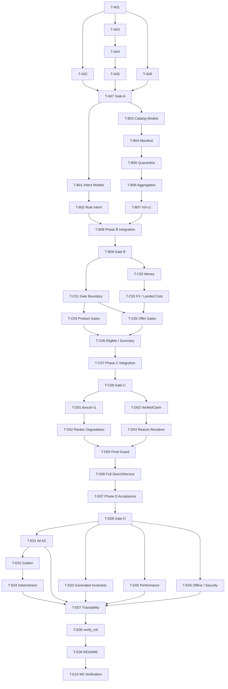

# Glodex M0 实施任务

| 字段 | 值 |
|---|---|
| Task Set ID | `GLO-TASKS-000` |
| 版本 | `0.1.1` |
| 对应规格 | [`GLO-SPEC-000`](./spec.md) v0.1.2（Approved） |
| 对应计划 | [`GLO-PLAN-000`](./plan.md) v0.1.2（Approved） |
| 状态 | Approved / Completed |
| 创建日期 | 2026-07-23 |
| 最后更新 | 2026-07-28 |
| 批准日期 | 2026-07-23 |

## 1. 执行约定

标记：

- `[P]`：满足依赖后，可与同一波次的其他 `[P]` 任务并行。
- `[RED→GREEN]`：先提交能因目标缺口而失败的测试，再做最小实现使其通过。
- `[GATE]`：阶段门禁；未通过时不得开始下一阶段。
- `[DATA]`：版本化 fixture 或 Golden。
- `[DOC]`：文档和验证证据。

执行规则：

1. 任务必须按依赖执行；勾选表示该任务的验证命令已成功。
2. `[RED→GREEN]` 任务必须保存“预期失败 → 最小实现通过”的证据，不能先写实现再补测试。
3. 每个测试使用 `@pytest.mark.spec(...)` 引用真实的 `GLO-P0-*`、`GLO-NFR-*` 或 `AC-*`。
4. 发现会改变用户行为的歧义时停止实现，先修改 Spec；只改变内部实现时先修改 Plan/ADR。
5. 任务只能修改列出的主要路径；确需扩展时先更新本任务说明。
6. Phase Gate 必须通过后才能进入下一阶段；不得用 skip、xfail 或自动接受 Golden 绕过门禁。
7. 不创建 M1/M2 空壳，不引入 Plan 未批准的运行依赖。
8. 所有命令使用 `uv run --locked`；锁文件变更必须来自明确依赖变更。

## 2. 已冻结的实现语义

Tasks 开始前，下列审计问题已在 Spec v0.1.1、Plan v0.1.1 和 ADR 中收敛：

1. **两阶段输入校验**：query、locale、top_k、币种格式在 run 前校验；snapshot 和币种兼容性在 run 内校验，失败时返回带 run ID 的 `FAILED`。
2. **预算币种**：查询明确币种时按该币种精确比较；未声明时继承 display currency；输出按 display currency 展示。
3. **报价资格**：M0 无条件要求 `IN_STOCK` 和完整 Landed Cost；预算 gate 只在存在 BudgetMax 时启用。
4. **运行真相**：M0 使用应用内不可变 RunJournal，与响应原子组装；没有外部 Event Sink。
5. **配置发现**：`--config` → `GLODEX_CONFIG` → 包位置对应项目根的 `glodex.toml`；不搜索 cwd。
6. **金额 JSON**：精确值用无指数 fixed-point 规范串；展示值严格保留 snapshot 中 `minor_units` 位。
7. **Evidence closure**：不仅检查 evidence ID，还检查 entity、field path、provider 和 snapshot 归属。
8. **性能门禁**：所有环境执行 20k/100 工作负载；2 秒阈值只在标记的参考 CI 强制，本地输出信息性结果。
9. **Phase B 边界**：Canonical 聚合与 Offer 守恒属于 Phase B。

## 3. 依赖主链

## 4. Phase A：Walking Skeleton

### `T-A01` `[SETUP]` 初始化 Git、Python 和 uv 工程

- [x] 状态：已完成
- 依赖：无
- 追踪：`GLO-P0-012`、`GLO-NFR-006`、`GLO-NFR-011`
- 路径：`.git/`、`.gitignore`、`.python-version`、`pyproject.toml`、`uv.lock`、`src/glodex/__init__.py`
- 工作：
  - 确认当前目录不是其他仓库的子工作树后初始化 Git。
  - 保留现有 `项目架构/` 和 `specs/`，忽略 `.DS_Store`、`.venv`、缓存、构建与运行产物。
  - 固定 Python 3.12、src layout、`glodex` console script。
  - 运行依赖仅 Pydantic 2；dev group 为 pytest 9、pytest-socket、Ruff、mypy。
  - pytest 启用 strict config/markers，并声明 unit、contract、acceptance、architecture、nfr、performance、spec marker。
- 完成：`uv.lock` 可重复解析，包能导入，现有资料未被改名或移动。
- 验证：`uv sync --locked --dev && uv lock --check && uv run --locked python -c "import glodex, pydantic"`

### `T-A02` `[P] [RED→GREEN]` 建立默认禁网和架构边界

- [x] 状态：已完成
- 依赖：`T-A01`
- 追踪：`GLO-P0-012`、`AC-012`、`GLO-NFR-006`、`GLO-NFR-009`、`GLO-NFR-010`、`GLO-NFR-011`
- 路径：`tests/conftest.py`、`tests/architecture/test_offline_boundary.py`、`test_import_boundaries.py`、`test_dependency_allowlist.py`
- RED：真实 socket 探针能够联网，或 domain/application 能导入被禁框架。
- GREEN：
  - pytest 默认 `--disable-socket`；
  - 测试环境清除代理、模型、云服务和数据库变量；
  - AST/import 测试保证 domain 无 I/O/框架依赖、application 不反向依赖 adapters；
  - 运行依赖 allowlist 只允许 Pydantic。
- 完成：网络探针被拒绝，架构违例 fixture 会令测试失败。
- 验证：`uv run --locked pytest -q tests/architecture`

### `T-A03` `[P] [RED→GREEN]` 公共合同、配置和两阶段校验

- [x] 状态：已完成
- 依赖：`T-A01`
- 追踪：`GLO-P0-001`、`GLO-P0-009`、`GLO-P0-011`、`GLO-NFR-007`、`GLO-NFR-008`、`GLO-NFR-011`
- 路径：`glodex.toml`、`src/glodex/contracts.py`、`src/glodex/config.py`、`tests/contract/test_public_schema.py`、`test_config_contract.py`
- RED：
  - 空白/2001 字 query、top_k 0/4、非法 locale/币种格式和额外字段；
  - `--config`、`GLODEX_CONFIG`、默认配置发现及从其他 cwd 启动；
  - snapshot 不支持币种不能在 pre-run 被误报为无 run 的输入拒绝；
  - frozen 模型嵌套集合不能被修改。
- GREEN：
  - 严格、冻结、禁止额外字段的公共 DTO；
  - `RequestRejected` 与带 run ID 的 `SearchResponse` 分离；
  - 配置优先级、稳定 fingerprint 和不依赖 cwd 的路径解析。
- 完成：pre-run 错误不调用下游；snapshot 兼容性被保留为 run 内检查。
- 验证：`uv run --locked pytest -q tests/contract/test_public_schema.py tests/contract/test_config_contract.py`

### `T-A04` `[RED→GREEN]` 应用状态、RunJournal 与占位 NO_MATCH

- [x] 状态：已完成
- 依赖：`T-A03`
- 追踪：`GLO-P0-001`、`GLO-P0-010`、`GLO-P0-011`、`GLO-NFR-007`、`GLO-NFR-008`
- 路径：`src/glodex/application/ports.py`、`state.py`、`journal.py`、`search_service.py`、`src/glodex/bootstrap.py`、`tests/unit/application/test_run_state.py`、`tests/contract/test_walking_skeleton.py`
- RED：
  - 非法状态转换、重复终态、非单调 sequence；
  - 非法请求生成 run ID；
  - Journal 与响应终态不一致。
- GREEN：
  - 注入 RunIdProvider、Clock 和三个 async I/O 端口；
  - 应用内不可变 RunJournal；
  - 固定请求走 `NEW → RUNNING → NO_MATCH`，明确标记为 walking skeleton。
- 完成：有效 run 有唯一终态和最小诊断；非法请求不建立 run。
- 验证：`uv run --locked pytest -q tests/unit/application/test_run_state.py tests/contract/test_walking_skeleton.py`

### `T-A05` `[RED→GREEN]` CLI walking skeleton

- [x] 状态：已完成
- 依赖：`T-A04`
- 追踪：`GLO-P0-001`、`GLO-P0-010`、`GLO-P0-012`
- 路径：`src/glodex/cli.py`、`src/glodex/__main__.py`、`tests/acceptance/test_cli_walking_skeleton.py`
- RED：stdout/stderr 混用、退出码错误、其他 cwd 无法启动、非法输入仍创建 run。
- GREEN：
  - 使用 argparse 实现 `demo` 和 `search`；
  - stdout 只输出单个 JSON，诊断走 stderr；
  - `COMPLETED/NO_MATCH=0`、`FAILED=1`、`RequestRejected=2`。
- 完成：CLI 能从其他 cwd 执行；Phase A 不伪造 `validate-snapshot` 成功。
- 验证：`uv run --locked pytest -q tests/acceptance/test_cli_walking_skeleton.py`

### `T-A06` `[P] [RED→GREEN]` 规格引用与追踪检查骨架

- [x] 状态：已完成
- 依赖：`T-A01`
- 追踪：`GLO-P0-012`
- 路径：`scripts/check_traceability.py`、`tests/unit/scripts/test_traceability_checker.py`
- RED：未知/拼错规格 ID、无 `spec` marker 或重复无效引用不能被发现。
- GREEN：
  - 从 Spec 读取真实 P0、NFR、AC ID；
  - 从 pytest collection 读取 `@pytest.mark.spec(...)`；
  - 提供 `--mode references` 供开发阶段检查引用合法性，最终 coverage 模式留到 `T-E07`。
- 完成：未知引用非零退出，报告正向/反向关系。
- 验证：`uv run --locked python scripts/check_traceability.py --mode references`

### `T-A07` `[GATE]` Phase A 一键门禁

- [x] 状态：已完成
- 依赖：`T-A02`、`T-A05`、`T-A06`
- 追踪：`GLO-P0-012`
- 路径：`scripts/verify_m0.py`、`tests/unit/scripts/test_verify_m0_runner.py`
- 工作：
  - 使用参数数组调用子进程，禁止 `shell=True`；
  - 固定仓库根并净化环境；
  - Phase A profile 执行 lock、format、lint、mypy、architecture、references 和当前测试；
  - 不把 Phase A 成功表述为 M0 完成。
- 完成：walking skeleton、禁网和质量门禁稳定通过。
- 验证：`uv run --locked python scripts/verify_m0.py --phase A`

## 5. Phase B：快照、意图与 Canonical 聚合

### `T-B01` `[P] [RED→GREEN]` 意图模型与独立 source-span 校验

- [x] 状态：已完成
- 依赖：`T-A07`
- 追踪：`GLO-P0-002`、`AC-009`
- 路径：`src/glodex/domain/intent.py`、`tests/unit/domain/test_intent.py`
- RED：Unicode 越界、空 span、trim 偏移错误、`query[start:end] != text`、伪造 Required、Preferred 升级。
- GREEN：
  - BudgetMax、TargetCategory、StockRequired、Exclusion 和 Preferred 判别联合；
  - span 基于 trim 后、未 NFKC 的 Unicode code-point 半开区间；
  - BudgetMax 保存精确金额和可选原文币种。
- 完成：独立 validator 不信任适配器自校验，产生稳定 issue code。
- 验证：`uv run --locked pytest -q tests/unit/domain/test_intent.py`

### `T-B02` `[RED→GREEN]` RuleIntentInterpreter

- [x] 状态：已完成
- 依赖：`T-B01`
- 追踪：`GLO-P0-002`、`AC-009`
- 路径：`src/glodex/adapters/rule_intent.py`、`tests/unit/adapters/test_rule_intent.py`、`tests/contract/test_intent_interpreter_contract.py`
- RED：中文预算/币种、库存、品类、排除项、软偏好、否定语境、重复执行。
- GREEN：表驱动确定性解析；每个 Required 返回精确原文 span；无法安全解释核心条件时 fail-closed。
- 完成：无网络/LLM，无凭空 Required，相同输入结果一致。
- 验证：`uv run --locked pytest -q tests/unit/adapters/test_rule_intent.py tests/contract/test_intent_interpreter_contract.py`

### `T-B03` `[P] [RED→GREEN]` Catalog、Evidence 与 snapshot 模型

- [x] 状态：已完成
- 依赖：`T-A07`
- 追踪：`GLO-P0-003`、`GLO-P0-004`、`GLO-P0-008`
- 路径：`src/glodex/domain/catalog.py`、`evidence.py`、`issues.py`、`tests/builders.py`、`tests/unit/domain/test_catalog_models.py`、`test_evidence_models.py`
- RED：空 ID/provider/source、额外字段、非法库存/entity kind、可变嵌套集合、跨 snapshot EvidenceRef。
- GREEN：不可变 Product、Offer、EvidenceRef、CatalogBatch、库存和 entity kind 模型；稳定 issue 分类。
- 完成：领域模型无 I/O；测试 builders 不依赖具体 adapter。
- 验证：`uv run --locked pytest -q tests/unit/domain/test_catalog_models.py tests/unit/domain/test_evidence_models.py`

### `T-B04` `[RED→GREEN]` Manifest、路径与币种兼容性

- [x] 状态：已完成
- 依赖：`T-B03`
- 追踪：`GLO-P0-003`、`GLO-NFR-009`
- 路径：`src/glodex/adapters/local_snapshot.py`、`tests/contract/test_local_snapshot_manifest.py`
- RED：
  - manifest 缺失/版本错误、hash/记录数不符、核心 JSON 损坏；
  - 绝对路径、`..`、symlink 逃逸；
  - display/budget currency 不在 FX snapshot；
  - 超过 128 MiB、500k 记录或字段长度上限。
- GREEN：根目录安全解析、manifest/hash/schema/version/limits 校验；run 内币种兼容性返回结构化 fatal issue。
- 完成：核心错误不返回部分 CatalogBatch，错误不泄露绝对路径或堆栈。
- 验证：`uv run --locked pytest -q tests/contract/test_local_snapshot_manifest.py`

### `T-B05` `[RED→GREEN]` 记录隔离与 Evidence 引用完整性

- [x] 状态：已完成
- 依赖：`T-B04`
- 追踪：`GLO-P0-003`、`GLO-P0-004`、`AC-010`
- 路径：`src/glodex/adapters/local_snapshot.py`、`src/glodex/domain/issues.py`、`tests/contract/test_local_snapshot_quarantine.py`
- RED：缺 ID/source、孤儿 Offer、无效 evidence 引用、重复 evidence ID、单条 schema 错误和核心语法错误边界。
- GREEN：逐行验证、稳定隔离和 warning 计数；合法记录继续，核心文件错误终止。
- 完成：每条隔离记录恰有安全 issue；合法数据不被污染。
- 验证：`uv run --locked pytest -q tests/contract/test_local_snapshot_quarantine.py`

### `T-B06` `[RED→GREEN]` Canonical 聚合与 Offer 守恒

- [x] 状态：已完成
- 依赖：`T-B05`
- 追踪：`GLO-P0-004`、`AC-004`、`GLO-NFR-003`
- 路径：`src/glodex/domain/catalog.py`、`tests/unit/domain/test_catalog_aggregation.py`
- RED：同款去重、Offer 不覆盖、重复 `(provider_id, offer_id)`、核心身份冲突、孤儿 Offer、snapshot ordinal 稳定。
- GREEN：纯 canonical aggregation、冲突隔离和 Offer 守恒检查。
- 完成：合法 Offer 集合聚合前后守恒，product ID 唯一，顺序确定。
- 验证：`uv run --locked pytest -q tests/unit/domain/test_catalog_aggregation.py`

### `T-B07` `[DATA] [RED→GREEN]` 建立并校验 `m0-v1`

- [x] 状态：已完成
- 依赖：`T-B03`–`T-B06`
- 追踪：`GLO-P0-003`、`GLO-P0-004`、`GLO-P0-005`、`GLO-P0-006`、`GLO-P0-008`
- 路径：`data/snapshots/m0-v1/`、`tests/contract/test_m0_snapshot_fixture.py`
- RED：fixture 缺少规格要求的 30 商品、3 品类、3 Provider/市场、3 币种或 sentinel。
- GREEN：
  - 增加 manifest、products.jsonl、offers.jsonl、evidence.jsonl、exchange_rates.json；
  - 包含跨平台同款、预算边界、缺货、未知费用、配件/替换件、脏记录和同价 tie-break；
  - FX currency 定义 `base_per_unit` 和 `minor_units`。
- 完成：manifest hash/计数准确，无密钥，sentinel 有稳定 ID。
- 验证：`uv run --locked pytest -q tests/contract/test_m0_snapshot_fixture.py`

### `T-B08` `[RED→GREEN]` Phase B 应用与 CLI 集成

- [x] 状态：已完成
- 依赖：`T-B02`、`T-B07`
- 追踪：`GLO-P0-001`、`GLO-P0-002`、`GLO-P0-003`、`GLO-P0-004`、`AC-004`、`AC-009`、`AC-010`
- 路径：`src/glodex/application/search_service.py`、`src/glodex/cli.py`、`tests/contract/test_search_service_phase_b.py`、`tests/acceptance/test_ac_004_009_010.py`
- RED：
  - pre-run 错误零下游调用；
  - 伪造 span 时 Catalog 调用数为 0；
  - snapshot/币种不兼容为带 run ID 的 FAILED；
  - 可隔离记录继续；聚合后同款唯一、Offer 不丢。
- GREEN：固定 intent → snapshot → aggregate 阶段，加入真实 `validate-snapshot` CLI；Phase B 仍可用合法 NO_MATCH 收口。
- 完成：`GLO-P0-001`–`GLO-P0-004` 的领域前置合同闭合。
- 验证：`uv run --locked pytest -q tests/contract/test_search_service_phase_b.py tests/acceptance/test_ac_004_009_010.py`

### `T-B09` `[GATE]` Phase B 门禁

- [x] 状态：已完成
- 依赖：`T-B08`
- 追踪：`GLO-P0-001`、`GLO-P0-002`、`GLO-P0-003`、`GLO-P0-004`
- 路径：`scripts/verify_m0.py`
- 完成：Phase A 全绿；Intent、snapshot、quarantine、aggregation、fixture 和 `AC-004/009/010` 全绿。
- 验证：`uv run --locked python scripts/verify_m0.py --phase B`

## 6. Phase C：金额与硬门

### `T-C01` `[P] [RED→GREEN]` 冻结“硬门先于 scorer”边界

- [x] 状态：已完成
- 依赖：`T-B09`
- 追踪：`GLO-P0-006`、`AC-002`
- 路径：`src/glodex/domain/eligibility.py`、`tests/unit/domain/test_eligibility_order.py`
- RED：使用预先定价 builder，证明超预算/错品类候选仍会到达 scorer；Preferred 改变成员集合。
- GREEN：不可变 GateResult、固定商品/Offer gate 管线接口；本任务不实现排序。
- 完成：scorer 输入只能从 eligible 输出构造，无放宽或恢复入口。
- 验证：`uv run --locked pytest -q tests/unit/domain/test_eligibility_order.py`

### `T-C02` `[P] [RED→GREEN]` Decimal、KnownCost 与 UnknownCost

- [x] 状态：已完成
- 依赖：`T-B09`
- 追踪：`GLO-P0-005`
- 路径：`src/glodex/domain/pricing.py`、`tests/unit/domain/test_money_types.py`
- RED：int/float/bool、负数、NaN、Infinity、无证据零、可变费用模型、非法 minor_units。
- GREEN：严格金额/费用/汇率类型，precision 28、ROUND_HALF_EVEN，规范 exact/display JSON。
- 完成：金额管线不存在 binary float，Known zero 与 Unknown 严格区分。
- 验证：`uv run --locked pytest -q tests/unit/domain/test_money_types.py`

### `T-C03` `[RED→GREEN]` FX、Landed Cost 与预算币种

- [x] 状态：已完成
- 依赖：`T-C02`、`T-B07`
- 追踪：`GLO-P0-005`、`AC-005`、`AC-008`
- 路径：`src/glodex/domain/pricing.py`、`catalog.py`、`evidence.py`、`src/glodex/adapters/local_snapshot.py`、`tests/builders.py`、`tests/unit/domain/test_catalog_models.py`、`tests/unit/domain/test_pricing.py`、`tests/contract/test_local_snapshot_quarantine.py`
- RED：
  - base_per_unit 公式、缺汇率和未知费用；
  - wire `UnknownCost.reason` 必须无损穿过 snapshot → catalog → pricing，禁止降成 `None` 或伪造为零；
  - 四分量先转换、求和后展示量化；
  - EUR 预算/USD 展示与未声明预算币种；
  - 精确边界比较和完整 trace 重算。
- GREEN：保留 Known/Unknown 判别联合并接入纯 FX/Landed Cost 计算；同时产生 display exact、budget exact、display quantized 和 `pricing-v1` trace。
- 迁移：Phase B 的 `CostComponents(Decimal | None)` 及其测试构造器必须迁移为显式 `KnownCost | UnknownCost`，不得保留会吞掉 unknown reason 的兼容入口。
- 完成：未知费用没有预算内路径，展示舍入不影响预算判断。
- 验证：`uv run --locked pytest -q tests/unit/domain/test_pricing.py`

### `T-C04` `[P] [RED→GREEN]` 商品级硬门

- [x] 状态：已完成
- 依赖：`T-C01`、`T-B06`
- 追踪：`GLO-P0-006`、`GLO-P0-008`、`AC-006`
- 路径：`src/glodex/domain/eligibility.py`、`tests/unit/domain/test_eligibility_order.py`、`tests/unit/domain/test_product_gates.py`
- RED：品类、PRIMARY_PRODUCT、排除项、必需 Evidence；高相关配件/替换件/UNKNOWN 必须拒绝。
- GREEN：固定顺序的纯 gate 与稳定 reason code；禁止从 title/description 猜 entity kind。
- 边界迁移：公开 `run_product_gates` 只能绑定本任务的固定业务 predicates；C01 的任意 callback executor 继续保持 module-private。
- 完成：单原因 sentinel 在预期首门淘汰，多原因可完整诊断。
- 验证：`uv run --locked pytest -q tests/unit/domain/test_product_gates.py`

### `T-C05` `[RED→GREEN]` Offer 级资格和预算 gate

- [x] 状态：已完成
- 依赖：`T-C01`、`T-C03`
- 追踪：`GLO-P0-005`、`GLO-P0-006`、`AC-003`、`AC-005`
- 路径：`src/glodex/domain/eligibility.py`、`tests/unit/domain/test_eligibility_order.py`、`tests/unit/domain/test_offer_gates.py`
- RED：
  - 来源、库存、费用、汇率、预算固定顺序；
  - 未显式要求库存时 OUT_OF_STOCK/UNKNOWN 仍拒绝；
  - 无预算时未知费用仍拒绝，但预算 gate 不运行；
  - 等于预算通过，精确超出即拒绝。
- GREEN：系统资格 gate 与条件预算 gate 分离，生成 EligibleOffer 和原因。
- 边界迁移：公开 `run_offer_gates` 必须绑定固定规则和 Offer↔Pricing 一一对应验证；C01 的任意 callback executor 继续保持 module-private。
- 完成：只存在 IN_STOCK、完整 Landed Cost 的 eligible offer。
- 验证：`uv run --locked pytest -q tests/unit/domain/test_offer_gates.py`

### `T-C06` `[RED→GREEN]` FilterSummary、EligibleProduct 与 selected offer

- [x] 状态：已完成
- 依赖：`T-C04`、`T-C05`
- 追踪：`GLO-P0-006`、`GLO-P0-009`、`GLO-P0-010`、`GLO-NFR-008`
- 路径：`src/glodex/domain/eligibility.py`、`tests/unit/domain/test_eligibility_order.py`、`tests/unit/domain/test_eligibility_pipeline.py`、`tests/unit/domain/test_filter_summary.py`
- RED：顺序漏斗、多标签计数、商品/Offer 统计分离、至少一个合法 Offer、同价 tie-break。
- GREEN：组合 pricing 与两级 gates，保留全部 eligible offers，按 `(exact_cost, provider_id, offer_id)` 选择。
- 完成：商品唯一、selected 属于 eligible、统计可稳定复算。
- 验证：`uv run --locked pytest -q tests/unit/domain/test_eligibility_pipeline.py tests/unit/domain/test_filter_summary.py`

### `T-C07` `[RED→GREEN]` Phase C SearchService 与硬门验收

- [x] 状态：已完成
- 依赖：`T-B08`、`T-C06`
- 追踪：`GLO-P0-005`、`GLO-P0-006`、`GLO-P0-008`、`GLO-P0-010`、`AC-002`、`AC-003`、`AC-005`、`AC-006`
- 路径：`src/glodex/application/search_service.py`、`tests/acceptance/test_ac_002_003_005_006.py`
- RED：超预算高分候选不进入 ranker spy；零命中无重试/放宽；未知费用、缺货和配件拒绝。
- GREEN：接入 pricing → product gates → offer gates → eligible assembly；零候选提交唯一 NO_MATCH。
- 完成：四个黑盒场景通过，硬约束违反率为 0。
- 验证：`uv run --locked pytest -q tests/acceptance/test_ac_002_003_005_006.py`

### `T-C08` `[GATE]` Phase C 门禁

- [x] 状态：已完成
- 依赖：`T-C07`
- 追踪：`GLO-P0-005`、`GLO-P0-006`、`GLO-P0-008`、`GLO-P0-010`
- 路径：`scripts/verify_m0.py`
- 完成：Phase A/B 回归全绿，Money/FX/Hard Gate 和 `AC-002/003/005/006` 全绿。
- 验证：`uv run --locked python scripts/verify_m0.py --phase C`

## 7. Phase D：排序、证据与结果

### `T-D01` `[P] [RED→GREEN]` `lexical-v1`

- [x] 状态：已完成
- 依赖：`T-C08`
- 追踪：`GLO-P0-007`
- 路径：`src/glodex/domain/ranking.py`、`src/glodex/adapters/deterministic_ranker.py`、`tests/unit/domain/test_ranking_lexical_v1.py`
- RED：NFKC、Latin casefold、Latin/数字片段、CJK 单字+bigram、唯一 token 和固定权重。
- GREEN：只读取当前 query、Preferred、title/category/verified attributes 的整数 scorer，标记 `lexical-v1`。
- 完成：description、营销文案和长期画像不影响分数。
- 验证：`uv run --locked pytest -q tests/unit/domain/test_ranking_lexical_v1.py`

### `T-D02` `[RED→GREEN]` Ranker 批次校验与整批降级

- [x] 状态：已完成
- 依赖：`T-D01`
- 追踪：`GLO-P0-007`、`AC-011`
- 路径：`src/glodex/domain/ranking.py`、`src/glodex/application/search_service.py`、`tests/contract/test_query_ranker_contract.py`、`tests/unit/domain/test_ranking_batch.py`
- RED：异常/超时、缺/重/额外 ID、bool/float/NaN/Infinity、候选改写及稳定 tie-break。
- GREEN：全批原子校验；正常键与 `(snapshot_ordinal, product_id)` fallback；eligible 集合不变。
- 完成：不接受部分有效批次，所有故障产生同一确定性降级。
- 验证：`uv run --locked pytest -q tests/contract/test_query_ranker_contract.py tests/unit/domain/test_ranking_batch.py`

### `T-D03` `[P] [RED→GREEN]` VerifiedClaim 与 Evidence closure

- [x] 状态：已完成
- 依赖：`T-C08`
- 追踪：`GLO-P0-008`、`GLO-P0-009`、`GLO-NFR-002`、`AC-007`、`AC-008`
- 路径：`src/glodex/domain/evidence.py`、`assembly.py`、`tests/unit/domain/test_verified_claims.py`
- RED：
  - 存在但跨 product/offer/provider/snapshot/field 的错误 evidence；
  - Landed Cost 缺费用、FX 或算法引用；
  - Unknown 产生肯定 claim。
- GREEN：按 Plan evidence matrix 验证 closure，建立预算/库存/品类/属性 claim builder。
- 完成：价格、库存、品类和理由 evidence 完整率 100%。
- 验证：`uv run --locked pytest -q tests/unit/domain/test_verified_claims.py`

### `T-D04` `[RED→GREEN]` 确定性理由与 unknowns

- [x] 状态：已完成
- 依赖：`T-D03`
- 追踪：`GLO-P0-008`、`GLO-P0-009`、`AC-007`
- 路径：`src/glodex/domain/assembly.py`、`tests/unit/domain/test_reason_renderer.py`
- RED：无证据能力被补写、unknown 被肯定、claim 顺序不稳定。
- GREEN：只消费 VerifiedClaim 的固定模板；unknown 显式列出。
- 完成：同 claim 集理由相同，删除 claim 后对应语句消失或整体失败。
- 验证：`uv run --locked pytest -q tests/unit/domain/test_reason_renderer.py`

### `T-D05` `[RED→GREEN]` Top K 和最终 invariant guard

- [x] 状态：已完成
- 依赖：`T-D02`、`T-D04`
- 追踪：`GLO-P0-009`、`GLO-NFR-001`、`GLO-NFR-002`、`GLO-NFR-003`
- 路径：`src/glodex/domain/assembly.py`、`tests/unit/domain/test_result_assembly.py`、`test_final_guard.py`
- RED：重复 product、越预算、错误 selected offer、缺 evidence、超 top_k、schema 变异。
- GREEN：组装结果并复用同一 gate/evidence 谓词做不可关闭 final guard；失败时结果整体清空。
- 完成：全部 mutation case fail-closed，guard 不信任 scorer。
- 验证：`uv run --locked pytest -q tests/unit/domain/test_result_assembly.py tests/unit/domain/test_final_guard.py`

### `T-D06` `[RED→GREEN]` 完整 SearchService、RunJournal 与 CLI demo

- [x] 状态：已完成
- 依赖：`T-D05`、`T-A04`
- 追踪：`GLO-P0-007`、`GLO-P0-009`、`GLO-P0-010`、`GLO-P0-011`、`GLO-NFR-007`、`GLO-NFR-008`
- 路径：`src/glodex/application/search_service.py`、`state.py`、`journal.py`、`src/glodex/cli.py`、`tests/contract/test_search_service_phase_d.py`
- RED：重复终态、sequence 非单调、response/Journal 不一致、FAILED 带部分结果、degraded 不可见。
- GREEN：接入 ranking → claims → Top K → final guard → 原子终态；`demo` 返回真实 fixture 结果。
- 完成：`COMPLETED/NO_MATCH/FAILED` 语义互斥，Journal 与响应一致。
- 验证：`uv run --locked pytest -q tests/contract/test_search_service_phase_d.py`

### `T-D07` `[RED→GREEN]` Phase D 黑盒验收

- [x] 状态：已完成
- 依赖：`T-D06`
- 追踪：`AC-001`、`AC-007`、`AC-008`、`AC-011`
- 路径：`tests/acceptance/test_ac_001_007_008_011.py`
- RED：跨市场 Top 3、理由越界、FX 无法重算、ranker 异常恢复候选。
- GREEN：只修复领域/应用集成缺口，禁止按 fixture ID 特判。
- 完成：四个黑盒场景通过，并与 Phase C 证明“硬门决定成员、排序只决定顺序”。
- 验证：`uv run --locked pytest -q tests/acceptance/test_ac_001_007_008_011.py`

### `T-D08` `[GATE]` Phase D 门禁

- [x] 状态：已完成
- 依赖：`T-D07`
- 追踪：`GLO-P0-007`、`GLO-P0-008`、`GLO-P0-009`、`GLO-P0-011`
- 路径：`scripts/verify_m0.py`
- 完成：Phase A–C 回归全绿，ranking/evidence/assembly 和 `AC-001/007/008/011` 全绿。
- 验证：`uv run --locked python scripts/verify_m0.py --phase D`

## 8. Phase E：M0 验收与质量闭环

### `T-E01` `[RED→GREEN]` 收口 `AC-001`–`AC-012`

- [x] 状态：已完成
- 依赖：`T-D08`
- 追踪：全部 `GLO-P0-*`、`AC-001`–`AC-012`、`GLO-NFR-001`、`GLO-NFR-002`、`GLO-NFR-003`、`GLO-NFR-007`、`GLO-NFR-008`
- 路径：`tests/acceptance/`
- RED：追踪扫描发现任一 AC 无公共 Python 入口或 CLI 黑盒测试。
- GREEN：补齐 12 个场景；故障仅通过批准端口注入；每个测试带 spec marker。
- 完成：12 个 AC 独立可定位、全部通过。
- 验证：`uv run --locked pytest -q tests/acceptance -m acceptance`

### `T-E02` `[DATA] [RED→GREEN]` Golden 语义投影

- [x] 状态：已完成
- 依赖：`T-E01`
- 追踪：`GLO-P0-003`、`GLO-P0-005`、`GLO-P0-009`、`GLO-P0-011`、`GLO-P0-012`、`GLO-NFR-002`、`GLO-NFR-004`
- 路径：`tests/golden_support.py`、`tests/golden/m0-v1/`、`tests/acceptance/test_golden_outputs.py`、`scripts/update_goldens.py`
- RED：业务输出变化未被检测，或 run ID/时间造成虚假漂移。
- GREEN：
  - 投影比较状态、版本、意图/span、商品/报价顺序、金额、证据、filter/warnings/degraded；
  - 排除 run ID、时间和耗时；
  - `--check` 只比较，`--write` 先显示 unified diff，CI 不自动接受。
- 完成：Golden 经过人工 diff 审核并固定。
- 验证：`uv run --locked python scripts/update_goldens.py --check`

### `T-E03` `[P] [RED→GREEN]` 固定 seed 生成式不变量

- [x] 状态：已完成
- 依赖：`T-D08`
- 追踪：`GLO-NFR-001`、`GLO-NFR-002`、`GLO-NFR-003`、`GLO-NFR-004`
- 路径：`tests/generated/test_domain_invariants.py`
- RED：随机组合可产生硬门违规、Offer 不守恒、金额非单调、错误 span 或 final guard 漏检。
- GREEN：固定 seed 组合生成器覆盖 Money、aggregation、gates、ranker fault 和输出 mutation。
- 完成：失败能复现输入 seed/case，不引入新的运行依赖。
- 验证：`uv run --locked pytest -q tests/generated/test_domain_invariants.py`

### `T-E04` `[P] [RED→GREEN]` 20 次跨进程确定性

- [x] 状态：已完成
- 依赖：`T-E02`
- 追踪：`GLO-P0-011`、`GLO-P0-012`、`AC-008`、`AC-012`、`GLO-NFR-004`、`GLO-NFR-007`
- 路径：`tests/nfr/test_determinism.py`
- RED：不同 PYTHONHASHSEED 或子进程导致语义投影漂移。
- GREEN：同输入/快照/配置/算法运行 20 次，比较业务投影；所有 Golden 场景离线重复两轮。
- 完成：状态、商品/报价顺序和金额完全一致。
- 验证：`uv run --locked pytest -q tests/nfr/test_determinism.py -m nfr`

### `T-E05` `[P] [RED→GREEN]` 20k/100 性能工作负载

- [x] 状态：已完成
- 依赖：`T-D08`
- 追踪：`GLO-P0-012`、`GLO-NFR-005`
- 路径：`scripts/generate_perf_snapshot.py`、`src/glodex/domain/eligibility.py`、`src/glodex/domain/assembly.py`、`src/glodex/application/search_service.py`、`tests/unit/domain/test_eligibility_pipeline.py`、`tests/unit/domain/test_result_assembly.py`、`tests/nfr/test_performance.py`
- RED：生成器 hash 不稳定、计时包含生成/冷启动、p95 算法错误或参考 CI 不强制阈值。
- GREEN：
  - 固定 seed 生成恰好 20,000 商品，不提交生成数据；
  - 预热 10 次、顺序 100 次、`perf_counter_ns`、nearest-rank p95；
  - seal 中的候选身份归属使用线性 identity 索引，禁止 diagnostics×候选全集二次扫描；
  - 结果组装先对全量证据做一次线性校验，再仅携带最终候选商品、合格报价和汇率证据闭包，禁止对无关证据做重复深扫描；
  - 所有环境执行；`GLODEX_REFERENCE_CI=1` 时 p95≤2s 为硬门，本地为信息性。
- 完成：输出 p50/p95/max、Python/OS、snapshot hash 和算法版本。
- 验证：`uv run --locked pytest -q tests/nfr/test_performance.py -m performance -s`

### `T-E06` `[P] [RED→GREEN]` 离线、安全、隐私和依赖边界

- [x] 状态：已完成
- 依赖：`T-D08`
- 追踪：`GLO-P0-012`、`AC-012`、`GLO-NFR-006`、`GLO-NFR-009`、`GLO-NFR-010`、`GLO-NFR-011`
- 路径：`tests/nfr/test_offline_and_external_calls.py`、`test_security_boundaries.py`、`tests/architecture/`
- RED：证据 URL 被访问、外部调用非零、路径逃逸、密钥模式未发现、出现用户画像/请求持久化。
- GREEN：补齐 spy、secret scan、path/size/field limits、import allowlist 和隐私断言。
- 完成：M0 完整路径无网络/模型/Provider/数据库调用，无密钥或长期画像。
- 验证：`uv run --locked pytest -q tests/nfr/test_offline_and_external_calls.py tests/nfr/test_security_boundaries.py tests/architecture`

### `T-E07` `[RED→GREEN]` 完整 Spec↔Test 追踪

- [x] 状态：已完成
- 依赖：`T-E01`、`T-E03`、`T-E04`、`T-E05`、`T-E06`
- 追踪：`GLO-P0-012`、全部 P0、AC 和 NFR
- 路径：`scripts/check_traceability.py`、`tests/unit/scripts/test_traceability_checker.py`
- RED：任一 P0/AC/NFR 无覆盖、测试无引用、未知引用或 AC 只有非黑盒测试。
- GREEN：实现 coverage 模式和正/反向矩阵；NFR 只能由自动测试或带命令的明确人工门禁满足。
- 完成：12 P0、12 AC、11 NFR 全部闭合。
- 验证：`uv run --locked python scripts/check_traceability.py --mode coverage`

### `T-E08` `[GATE]` 最终 `verify_m0`

- [x] 状态：已完成
- 依赖：`T-E02`–`T-E07`
- 追踪：`GLO-P0-012`、`AC-001`–`AC-012`、`GLO-NFR-001`–`GLO-NFR-011`
- 路径：`scripts/verify_m0.py`、`tests/unit/scripts/test_verify_m0_runner.py`
- 工作：默认无参数依次运行 lock、format、lint、mypy、architecture、unit/contract/generated、全部 AC、Golden、确定性、traceability 和性能。
- 完成：任一步失败整体非零；默认不 skip/xfail/更新 Golden；参考 CI 强制性能阈值。
- 验证：`uv run --locked python scripts/verify_m0.py`；指定参考 CI 另以 `GLODEX_REFERENCE_CI=1` 执行硬阈值。

### `T-E09` `[DOC]` README 与三个真实 CLI 命令

- [x] 状态：已完成
- 依赖：`T-E08`
- 追踪：`GLO-P0-003`、`GLO-P0-012`、`GLO-NFR-011`
- 路径：`README.md`、必要的 CLI help 文案
- 工作：
  - 只描述真实 M0，明确 M1/M2 延期；
  - 文档化安装、配置、demo/search/validate-snapshot、退出码、快照、Golden、门禁和故障排查；
  - 链接 Spec、Plan、Tasks 和 ADR。
- 完成：从非项目 cwd 按 README 可运行三个命令，示例不含随机字段。
- 验证：`uv run --locked glodex --help && uv run --locked glodex validate-snapshot m0-v1 && uv run --locked glodex demo`

### `T-E10` `[GATE] [DOC]` 关闭 M0 DoD

- [x] 状态：已完成
- 依赖：`T-E09`
- 追踪：全部 P0、AC、NFR 和 M0 Definition of Done
- 路径：`specs/000-glodex-mvp/verification.md`、`spec.md`、`plan.md`、`tasks.md`
- 工作：
  - 保存 Python/uv 版本、源码身份、snapshot hash、Golden、traceability、完整性能结果和环境标识；
  - 从非项目 cwd 执行 CLI smoke；
  - 只有最终门禁成功后勾选 Spec DoD，并把 Plan/Tasks 标记完成。
- 完成：`verification.md` 可重现全部证据，没有未说明失败或延期。
- 验证：`uv run --locked python scripts/verify_m0.py`；指定参考 CI 另以 `GLODEX_REFERENCE_CI=1` 执行硬阈值。

## 9. 并行波次

| 波次 | 可执行任务 |
|---|---|
| Wave 1 | `T-A01` |
| Wave 2 | `T-A02`、`T-A03`、`T-A06` |
| Wave 3 | `T-A04` → `T-A05` → `T-A07` |
| Wave 4 | `T-B01`、`T-B03` |
| Wave 5 | Intent 线 `T-B02`；Snapshot 线 `T-B04` → `T-B05` → `T-B06` → `T-B07` |
| Wave 6 | `T-B08` → `T-B09` |
| Wave 7 | `T-C01`、`T-C02`、`T-C04` |
| Wave 8 | `T-C03` → `T-C05`；完成后 `T-C06` → `T-C07` → `T-C08` |
| Wave 9 | `T-D01`、`T-D03` |
| Wave 10 | `T-D02`、`T-D04`；完成后 `T-D05` → `T-D06` → `T-D07` → `T-D08` |
| Wave 11 | `T-E01`、`T-E03`、`T-E05`、`T-E06` |
| Wave 12 | `T-E02` → `T-E04`；随后 `T-E07` → `T-E08` → `T-E09` → `T-E10` |

共享文件由依赖链中的单一任务负责；并行任务不能同时修改 `pyproject.toml`、`contracts.py`、`search_service.py` 或 `verify_m0.py`。

## 10. 追踪矩阵

### 10.1 P0

| ID | 主要任务 |
|---|---|
| `GLO-P0-001` | `T-A03`、`T-A04`、`T-A05`、`T-B08` |
| `GLO-P0-002` | `T-B01`、`T-B02`、`T-B08` |
| `GLO-P0-003` | `T-B03`、`T-B04`、`T-B05`、`T-B07`、`T-B08` |
| `GLO-P0-004` | `T-B03`、`T-B05`、`T-B06`、`T-B08` |
| `GLO-P0-005` | `T-B07`、`T-C02`、`T-C03`、`T-C05` |
| `GLO-P0-006` | `T-C01`、`T-C04`、`T-C05`、`T-C06`、`T-C07` |
| `GLO-P0-007` | `T-D01`、`T-D02`、`T-D06` |
| `GLO-P0-008` | `T-B03`、`T-C04`、`T-D03`、`T-D04`、`T-D05` |
| `GLO-P0-009` | `T-A03`、`T-C06`、`T-D03`、`T-D04`、`T-D05`、`T-D06` |
| `GLO-P0-010` | `T-A04`、`T-C06`、`T-C07`、`T-D06` |
| `GLO-P0-011` | `T-A04`、`T-D06`、`T-E04` |
| `GLO-P0-012` | `T-A01`、`T-A02`、`T-A05`、`T-A06`、`T-A07`、`T-E01`–`T-E10` |

### 10.2 AC

| ID | 主要任务 |
|---|---|
| `AC-001` | `T-D07`、`T-E01` |
| `AC-002` | `T-C01`、`T-C07` |
| `AC-003` | `T-C05`、`T-C07` |
| `AC-004` | `T-B06`、`T-B08` |
| `AC-005` | `T-C03`、`T-C05`、`T-C07` |
| `AC-006` | `T-C04`、`T-C07` |
| `AC-007` | `T-D03`、`T-D04`、`T-D07` |
| `AC-008` | `T-C03`、`T-D03`、`T-D07`、`T-E04` |
| `AC-009` | `T-B01`、`T-B02`、`T-B08` |
| `AC-010` | `T-B04`、`T-B05`、`T-B08` |
| `AC-011` | `T-D02`、`T-D07` |
| `AC-012` | `T-A02`、`T-E01`、`T-E04`、`T-E06` |

### 10.3 NFR

| ID | 主要任务 |
|---|---|
| `GLO-NFR-001` | `T-C07`、`T-D05`、`T-E01`、`T-E03` |
| `GLO-NFR-002` | `T-D03`、`T-D05`、`T-E02`、`T-E03` |
| `GLO-NFR-003` | `T-B06`、`T-D05`、`T-E03` |
| `GLO-NFR-004` | `T-E02`、`T-E03`、`T-E04` |
| `GLO-NFR-005` | `T-E05`、`T-E08` |
| `GLO-NFR-006` | `T-A01`、`T-A02`、`T-E06` |
| `GLO-NFR-007` | `T-A03`、`T-A04`、`T-D06`、`T-E04` |
| `GLO-NFR-008` | `T-A03`、`T-A04`、`T-C06`、`T-D06` |
| `GLO-NFR-009` | `T-A02`、`T-B04`、`T-D03`、`T-E06` |
| `GLO-NFR-010` | `T-A02`、`T-E06` |
| `GLO-NFR-011` | `T-A01`、`T-A02`、`T-E07`、`T-E09` |

## 11. Tasks 审批门禁

进入实现前必须确认：

- [x] 同意 42 个任务及 Phase A–E 顺序。
- [x] 同意第二节的 9 条语义冻结。
- [x] 每个 P0、AC、NFR 都至少映射到一个任务。
- [x] 所有 `[RED→GREEN]` 任务都有目标测试、实现路径和验证命令。
- [x] 依赖图无环，可并行任务不共享高冲突文件。
- [x] Phase Gate 和最终 DoD 不允许 skip/xfail/自动 Golden 更新。
- [x] 不存在会改变 M0 用户行为的开放问题。
