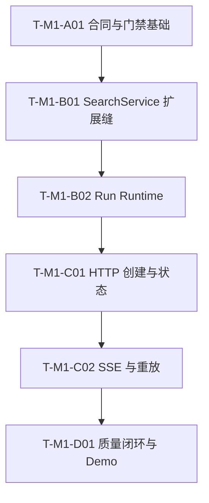

# Glodex M1a API 实施任务

| 字段 | 值 |
|---|---|
| Task Set ID | `GLO-TASKS-001` |
| 版本 | `0.1.0` |
| 状态 | Approved / Completed |
| 对应规格 | [`GLO-SPEC-001`](./spec.md) v0.3.2（Approved） |
| 对应计划 | [`GLO-PLAN-001`](./plan.md) v0.1.2（Approved） |
| 创建日期 | 2026-07-28 |
| 最后更新 | 2026-07-28 |
| 批准日期 | 2026-07-28 |

## 1. 执行约定

标记：

- `[RED→GREEN]`：先提交因目标缺口而失败的测试，再做最小实现使其通过。
- `[GATE]`：任务结尾同时是对应 Phase Gate；未通过不得开始下一 Phase。
- `[DOC]`：只在能力和门禁真实通过后更新文档与验证证据。

执行规则：

1. 本任务集固定为 6 个可审查的垂直任务，不按 DTO、路由、错误码或单个 AC 继续拆分。
2. 每个任务必须先获得可解释的 RED，再做 GREEN；不得先写实现后补测试。
3. 每个 M1a 测试使用 `@pytest.mark.spec(...)` 引用真实的
   `GLO-M1-P0-*`、`GLO-M1-NFR-*` 或 `M1-AC-*`。
4. 勾选任务前，列出的验证命令必须成功；不得使用 skip、skipif、xfail、
   `-k` 规避或自动更新 Golden。
5. 改变 API、事件、状态或用户可见失败语义时停止实现，先修改 Spec；
   只改变内部技术选择时先修改 Plan。
6. 自动测试保持 `--disable-socket`，不启动真实 Uvicorn，不使用 sleep
   证明实时性。
7. 不新增 AG-UI、WebSocket、取消、数据库、Repository/UoW、通用事件总线、
   周期 sweeper、前端或未来能力空壳。
8. 所有依赖与验证命令使用 `uv` 和 `--locked`；锁文件只由 `T-M1-A01`
   修改。

## 2. 已冻结的实现语义

实现开始前固定以下边界，Tasks 不再自行解释：

1. **应用兼容**：保留 `SearchService.search(request)` 和
   `execute(request)` 的签名、校验顺序与行为；新增
   `execute_run(request, *, run_id, observer=None)`。
2. **ID 边界**：通用 `execute_run` 继续接受现有 `Identifier`；只有 API
   Coordinator 生成边界额外禁止 `run_id` 包含 `:`，默认格式为
   `run-<uuid-hex>`。
3. **实时观察**：observer 是每次执行独立的同步 port，只观察非终态 Journal
   事件；`RunJournal` 的结构、状态机、sequence 与零 I/O 特性不变。
4. **阶段名**：`stepName` 原样使用 `intent`、`snapshot`、`aggregation`、
   `eligibility`、`ranking`、`result_assembly`，不创建 `rank` 等展示别名。
5. **202 顺序**：runner 先等待 start gate；只有 `202` 的最后一个
   `http.response.body` 已发送后，FastAPI background callback 才释放 gate。
   未释放或 runner 中断最终进入 `ABORTED`，不得伪造 `FAILED`。
   对外统一使用 `RUN_ABORTED / "Run execution was aborted."`。
6. **运行真相**：`SearchResponse` 与 `RunJournal` 是业务真相；
   `STATE_SNAPSHOT + terminal` 先完整构造再同步提交。投影失败只把
   `projection_status` 改为 `DEGRADED`。
7. **资源模型**：单 ASGI event loop、同步无 await 的 Registry mutation；
   create/status/subscribe/capacity 入口惰性清理 TTL，不创建周期任务。
8. **有界默认值**：活动 Run `16`、终态 Run `128`、TTL `900s`、单 Run
   事件 `128`、Subscriber `4`、请求体 `16384 bytes`、timeout `30s`、
   heartbeat `15s`。
9. **事件与重放**：公共 sequence 从 1 连续递增，SSE ID 为
   `{runId}:{sequence}`；非法、错 Run 或超前 cursor 均为
   `400 INVALID_EVENT_CURSOR`。
10. **门禁隔离**：M0 与 M1a 使用独立 traceability profile 和 test root；
    最终 M1a 门禁必须先完整执行 M0 门禁。

## 3. 依赖主链



任务数量刻意保持为 6。跨 Phase 不并行；任务内部可并行编写互不共享文件的
测试 fixture，但合入前仍由该任务的单一 Gate 收口。

## 4. Phase A：合同与 Walking Skeleton

### `T-M1-A01` `[RED→GREEN] [GATE]` 合同、依赖与门禁基础

- [x] 状态：已完成
- 依赖：无
- 追踪：`GLO-M1-P0-001`、`GLO-M1-P0-007`、`GLO-M1-P0-009`；
  `M1-AC-002`、`M1-AC-009`；
  `GLO-M1-NFR-001`、`GLO-M1-NFR-006`、`GLO-M1-NFR-007`、
  `GLO-M1-NFR-008`、`GLO-M1-NFR-009`、`GLO-M1-NFR-010`
- 主要路径：
  - `pyproject.toml`、`uv.lock`
  - `src/glodex/api/{__init__,settings,contracts,events,app,routes}.py`
  - `scripts/check_traceability.py`、`scripts/verify_m0.py`
  - 现有 architecture / traceability runner tests
  - `tests/m1a/{conftest.py,architecture/,contract/,unit/test_traceability_m1a.py}`
- RED：
  - 当前依赖门禁拒绝所有 FastAPI，或允许 FastAPI/Starlette 越过 API 层；
  - M1a ID 无法识别，M1a marker 污染 M0 exact inventory；
  - strict HTTP、error、event DTO 接受 coercion、额外字段或非法 Thread；
  - `ApiSettings` 接受 bool、coercion、零值或负值，或改变 M0 config fingerprint；
  - app factory 导入时读取配置/启动任务，OpenAPI 缺少三个批准的路径；
  - FastAPI 默认自由 `detail` 或请求回显进入错误合同。
- GREEN：
  - runtime 只新增 `fastapi>=0.135,<1`；dev 只新增 `httpx>=0.28,<1`
    与 `uvicorn>=0.35,<1`；
  - FastAPI/Starlette 只允许在 `glodex.api`，HTTPX 只允许在 tests；
  - 建立 strict/frozen HTTP、error、event DTO 与独立 `ApiSettings`；
  - 所有 API settings 是 strict positive integer，不增加任意机器相关上界；
  - 建立无导入副作用的 `create_app` walking skeleton，注册三个路径但不伪造
    成功业务结果；
  - traceability 增加 `m0` / `m1a` profile；M0 保持 `12/12/11`，
    M1a 固定 `9/10/10`；
  - 历史 M0 phase profile 排除 `tests/m1a`，最终 M0 profile 显式选择
    原有 test roots。
- 完成：
  - 依赖锁、DTO schema、错误 envelope、factory 与边界测试通过；
  - `GlodexConfig` 和 M0 fingerprint 未改变；
  - 未出现业务 Run、runner 或 SSE 假实现。
- 验证：

```bash
uv lock --check
uv run --locked python -m pytest -q -p scripts.verify_m0 \
  tests/architecture tests/m1a/architecture \
  tests/m1a/contract tests/m1a/unit/test_traceability_m1a.py
uv run --locked python scripts/check_traceability.py --profile m0 --mode references
uv run --locked python scripts/check_traceability.py --profile m1a --mode references
uv run --locked ruff check .
uv run --locked mypy
```

## 5. Phase B：实时应用缝与 Run Runtime

### `T-M1-B01` `[RED→GREEN]` `execute_run` 与实时 observer

- [x] 状态：已完成
- 依赖：`T-M1-A01`
- 追踪：`GLO-M1-P0-003`、`GLO-M1-P0-004`、`GLO-M1-P0-008`；
  `M1-AC-001`、`M1-AC-003`、`M1-AC-005`；
  `GLO-M1-NFR-001`、`GLO-M1-NFR-002`、`GLO-M1-NFR-003`、
  `GLO-M1-NFR-004`、`GLO-M1-NFR-008`
- 主要路径：
  - `src/glodex/application/ports.py`
  - `src/glodex/application/search_service.py`
  - `src/glodex/bootstrap.py`
  - `tests/m1a/unit/test_search_service_observer.py`
  - 必要的现有 SearchService contract tests
- RED：
  - 显式 run ID 仍调用 `RunIdProvider`，或 response/journal ID 分叉；
  - observer 只能在终态后看到批量事件；
  - 两个并发执行共享 observer 或串入彼此事件；
  - 阶段名被改写，或 terminal event 在完整 `SearchExecution` 前公开；
  - 旧 `search/execute` 的 DTO、Golden、时钟或 provider 调用行为改变。
- GREEN：
  - 增加 framework-free `RunEventObserver.on_event(RunEvent)`；
  - 增加 `execute_run`，由旧 `execute` 分配 ID 后委托；
  - 在每个非终态 Journal 转换完成后同步通知本次执行 observer；
  - observer 不进入构造器单例状态，不修改 `RunJournal`；
  - 锁定六个真实阶段名与旧入口等价性。
- 完成：
  - 可控阶段闩锁证明事件在运行中可见；
  - M0 SearchService contracts 与 Golden 无差异。
- 验证：

```bash
uv run --locked python -m pytest -q -p scripts.verify_m0 \
  tests/m1a/unit/test_search_service_observer.py \
  tests/unit/application/test_run_state.py \
  tests/contract/test_walking_skeleton.py \
  tests/contract/test_search_service_phase_b.py \
  tests/contract/test_search_service_phase_d.py
uv run --locked python scripts/update_goldens.py --check
uv run --locked ruff check src/glodex/application src/glodex/bootstrap.py \
  tests/m1a/unit/test_search_service_observer.py
uv run --locked mypy
```

### `T-M1-B02` `[RED→GREEN] [GATE]` Run Registry、Projector 与 Coordinator

- [x] 状态：已完成
- 依赖：`T-M1-B01`
- 追踪：`GLO-M1-P0-002`、`GLO-M1-P0-003`、`GLO-M1-P0-004`、
  `GLO-M1-P0-005`、`GLO-M1-P0-006`、`GLO-M1-P0-007`；
  `M1-AC-003`、`M1-AC-004`、`M1-AC-005`、`M1-AC-006`、
  `M1-AC-007`、`M1-AC-008`；
  `GLO-M1-NFR-002`、`GLO-M1-NFR-003`、`GLO-M1-NFR-004`、
  `GLO-M1-NFR-005`、`GLO-M1-NFR-006`、`GLO-M1-NFR-009`
- 主要路径：
  - `src/glodex/api/events.py`
  - `src/glodex/api/runtime.py`
  - `tests/m1a/unit/{test_run_registry,test_event_projection,test_sse_cursor}.py`
  - 必要的 `tests/m1a/conftest.py`
- RED：
  - 同 Thread 竞争出现双成功，或不同 Run 的状态/事件串流；
  - 重复生成的 run ID 覆盖已有 Run；
  - 活动 Run 被 TTL/终态容量驱逐，终态 Run 过期后仍能读取；
  - 慢 Subscriber 产生无界队列或反压业务；
  - 事件满时截断已有前缀，而不是停止投影并标记 `DEGRADED`；
  - public sequence 不连续、`ranking` 被改写或终态二事件半提交；
  - timeout、未释放 start gate、task 异常或 shutdown 被伪造成业务
    `FAILED`；
  - Registry/task/traceback 在终态后继续持有 request/query。
- GREEN：
  - 实现单 event-loop `RunResource` / `RunRegistry` 的同步原子 mutation；
  - 实现活动/终态容量、Thread 预留、终态释放、TTL 惰性清理和整体驱逐；
  - 每次 terminal commit 同步执行终态数量驱逐；
  - 共享事件列表配合每 Subscriber 容量 1 的 token queue；
  - 实现独立 public sequence、cursor parser 和七种严格事件投影；
  - `STATE_SNAPSHOT + terminal` 预构造后同步提交；
  - Coordinator 跟踪强引用 task、start gate、timeout、`ABORTED` 和异常消费；
  - 所有 transport-only 中断统一投影安全的 `RUN_ABORTED` code/message；
  - API 生成的 run ID 在登记前额外检查不含 `:`。
- 完成：
  - 纯 unit tests 闭合 Run 生命周期、事件前缀、资源上限和故障隔离；
  - Gate B 继续通过 B01 的 M0 等价与 Golden 检查。
- 内部审查检查点：
  1. Registry + Projector 全绿后再接 Coordinator；
  2. Coordinator + task lifecycle 全绿后再执行 Gate B。
- 验证：

```bash
uv run --locked python -m pytest -q -p scripts.verify_m0 \
  tests/m1a/unit/test_search_service_observer.py \
  tests/m1a/unit/test_run_registry.py \
  tests/m1a/unit/test_event_projection.py \
  tests/m1a/unit/test_sse_cursor.py
uv run --locked python scripts/update_goldens.py --check
uv run --locked ruff check src/glodex/api src/glodex/application \
  tests/m1a/unit
uv run --locked mypy
```

## 6. Phase C：HTTP、SSE 与验收

### `T-M1-C01` `[RED→GREEN]` POST 与状态查询垂直切片

- [x] 状态：已完成
- 依赖：`T-M1-B02`
- 追踪：`GLO-M1-P0-001`、`GLO-M1-P0-002`、`GLO-M1-P0-003`、
  `GLO-M1-P0-007`、`GLO-M1-P0-008`；
  `M1-AC-001`、`M1-AC-002`、`M1-AC-003`、`M1-AC-005`、
  `M1-AC-006`、`M1-AC-008`、`M1-AC-009`；
  `GLO-M1-NFR-001`、`GLO-M1-NFR-002`、`GLO-M1-NFR-004`、
  `GLO-M1-NFR-006`、`GLO-M1-NFR-007`、`GLO-M1-NFR-009`
- 主要路径：
  - `src/glodex/api/{contracts,runtime,routes,app,__init__}.py`
  - `tests/m1a/conftest.py`
  - `tests/m1a/contract/test_http_api_contract.py`
  - HTTP/状态相关 acceptance scenarios
- RED：
  - 非法 body、Thread 或 M0 request 创建了 ID、task、事件或下游调用；
  - 极快 service 在 `202` body 发出前完成；
  - 请求体上限只信任 `Content-Length`，chunked body 可绕过；
  - 实际 body 超过 `16384 bytes` 时未返回
    `413 REQUEST_BODY_TOO_LARGE`；
  - 409、503、404、422、415、500 使用错误 code/status 或泄露 `detail`；
  - `FAILED` 与 `ABORTED` 混用，状态 response/error 组合不合法；
  - lifespan 未停止接单、回收 task 或释放 Thread。
- GREEN：
  - 正式实现 `POST /api/v1/runs` 与 `GET /api/v1/runs/{run_id}`；
  - POST 复用 `validate_search_request`，校验通过后才预留 Run；
  - FastAPI `BackgroundTasks` 只在 202 body 发完后释放 start gate；
  - 请求体 middleware 在 JSON 解析前累计并限制实际字节；
  - 超限 body 使用稳定的 `413 REQUEST_BODY_TOO_LARGE`；
  - 统一安全 exception handlers 与完整状态 DTO；
  - app factory 支持固定 Clock、ID、service double 和小容量 settings。
- 完成：
  - HTTPX ASGI tests 覆盖 create/status、错误、生命周期和三种业务终态；
  - 直接 ASGI send recorder 证明最后一个 202 body chunk 发送后才释放 gate；
  - API 与直接 SearchService 的最终 `SearchResponse` 等价。
- 验证：

```bash
uv run --locked python -m pytest -q -p scripts.verify_m0 \
  tests/m1a/unit tests/m1a/contract/test_http_api_contract.py
uv run --locked python scripts/update_goldens.py --check
uv run --locked ruff check src/glodex/api tests/m1a
uv run --locked mypy
```

### `T-M1-C02` `[RED→GREEN] [GATE]` SSE、游标、重放与 AC-001～009

- [x] 状态：已完成
- 依赖：`T-M1-C01`
- 追踪：`GLO-M1-P0-001`、`GLO-M1-P0-004`、`GLO-M1-P0-005`、
  `GLO-M1-P0-006`、`GLO-M1-P0-007`；
  `M1-AC-003`、`M1-AC-004`、`M1-AC-005`、`M1-AC-006`、
  `M1-AC-007`、`M1-AC-008`、`M1-AC-009`；
  `GLO-M1-NFR-002`、`GLO-M1-NFR-003`、`GLO-M1-NFR-004`、
  `GLO-M1-NFR-005`、`GLO-M1-NFR-006`、`GLO-M1-NFR-007`、
  `GLO-M1-NFR-009`
- 主要路径：
  - `src/glodex/api/{events,runtime,routes,app}.py`
  - `tests/m1a/conftest.py`
  - `tests/m1a/unit/test_sse_cursor.py`
  - `tests/m1a/contract/test_sse_contract.py`
  - `tests/m1a/acceptance/test_m1_ac_001_005.py`
  - `tests/m1a/acceptance/test_m1_ac_006_010.py`（本任务只覆盖 006～009）
- RED：
  - Accept 不兼容或 cursor 非法时仍建立 stream；
  - 首次连接漏掉早期事件，重连重算或补发错误前缀；
  - HTTPX 缓冲被误当成实时进度；
  - heartbeat 占用 sequence，断线或发送失败取消 runner；
  - 一个慢 Subscriber 阻塞其他 Subscriber 或业务；
  - projection degraded 改写 canonical response，或终态 stream 不关闭。
- GREEN：
  - 使用 FastAPI `EventSourceResponse` / `ServerSentEvent` 实现事件端点；
  - 首次读取完整缓存，合法 `Last-Event-ID` 只补发后缀；
  - comment heartbeat 不占 sequence，generator `finally` 只注销 Subscriber；
  - 直接 ASGI harness 捕获真实 response body chunk，以 `asyncio.Event`
    控制进度，不 sleep、不开放 socket；
  - 自动化 `M1-AC-001`～`009`，证明隔离、重放、错误和安全前缀。
- 完成：
  - 三个正式端点和七种事件全部可用；
  - Phase C Gate 通过 unit、contract、AC-001～009、Ruff、mypy 与 M0 Golden。
- 内部审查检查点：
  1. SSE framing + cursor/replay 全绿；
  2. Subscriber 故障隔离 + AC-001～009 全绿后再执行 Gate C。
- 验证：

```bash
uv run --locked python -m pytest -q -p scripts.verify_m0 \
  tests/m1a/unit tests/m1a/contract tests/m1a/acceptance
uv run --locked python scripts/check_traceability.py --profile m1a --mode references
uv run --locked python scripts/update_goldens.py --check
uv run --locked ruff check .
uv run --locked mypy
```

## 7. Phase D：质量闭环与文档

### `T-M1-D01` `[RED→GREEN] [DOC] [GATE]` AC-010、完整门禁与 Demo

- [x] 状态：已完成
- 依赖：`T-M1-C02`
- 追踪：全部 `GLO-M1-P0-001`～`009`、`M1-AC-001`～`010`、
  `GLO-M1-NFR-001`～`010` 及 M1a Definition of Done
- 主要路径：
  - `tests/m1a/architecture/test_m1a_boundaries.py`
  - `tests/m1a/nfr/test_m1a_offline_security.py`
  - `tests/m1a/unit/{test_traceability_m1a,test_verify_m1a_runner}.py`
  - `tests/m1a/acceptance/test_m1_ac_006_010.py`
  - `scripts/{check_traceability,verify_m0,verify_m1a}.py`
  - `README.md`
  - `specs/001-glodex-m1-api/{spec,plan,tasks,verification}.md`
- RED：
  - FastAPI 越层、默认 CORS、真实 socket/外部服务调用或日志/事件泄密未失败；
  - M1a 实时测试使用 `time.sleep` / `asyncio.sleep` 或机器耗时断言仍可通过；
  - 9 P0、10 AC、10 NFR 任一缺失、未知、重复或仅由 skip/xfail 覆盖；
  - `M1-AC-010` 只有 runner unit test，没有 acceptance marker 与真实门禁证据；
  - `verify_m1a.py` 未先执行完整 M0、使用 `shell=True`、错误 cwd/env，
    或漏掉 M1a 某层测试仍返回 0；
  - 固定场景的 API、直接 SearchService 与 CLI 业务投影在金额、排序、
    Evidence、漏斗或终态上不一致；
  - README 描述未实现能力或把单 Worker Demo 写成生产服务；
  - 一键门禁无法证明 CLI、Golden、determinism、security 与外部调用为零。
- GREEN：
  - 补齐 architecture/offline/security 与 `M1-AC-010`；
  - 增加结构测试，拒绝 M1a 实时测试中的 sleep 和真实 socket；
  - 两个 traceability profile 均 exact coverage；
  - `M1-AC-010` 同时由 acceptance 测试和最终真实 `verify_m1a.py` 证明；
  - 固定场景比较 API、直接入口和 CLI 的业务投影，忽略纯 transport 字段；
  - `verify_m1a.py` 依次执行完整 M0、M1a architecture/NFR、
    unit/contract、acceptance 和 coverage；
  - runner 固定项目 cwd、参数数组、`shell=False`、环境清理和失败传播；
  - README 给出真实的本机 Uvicorn、POST、`curl -N` SSE、状态 GET，
    明确单进程、单 Worker、无认证、无恢复、无生产 SLA；
  - `verification.md` 记录版本、源码身份、门禁结果与限制。
- 完成：
  - 最终命令无 skip/xfail、无外部调用并完整通过；
  - 仅在证据成立后，把 Spec DoD、Plan 与 Tasks 状态标为完成；
  - 源码中不存在 AG-UI、WebSocket、取消、数据库或前端空壳。
- 验证：

```bash
uv run --locked python scripts/verify_m1a.py
git diff --check
```

人工演示只在自动门禁后执行：

```bash
uv run --locked uvicorn glodex.api.app:create_app \
  --factory \
  --host 127.0.0.1 \
  --port 8000
```

## 8. 执行波次与共享文件

| 波次 | 任务 | Gate |
|---|---|---|
| Wave 1 | `T-M1-A01` | Phase A |
| Wave 2 | `T-M1-B01` → `T-M1-B02` | Phase B |
| Wave 3 | `T-M1-C01` → `T-M1-C02` | Phase C |
| Wave 4 | `T-M1-D01` | M1a Final |

共享文件严格按以下所有权顺序修改：

| 文件组 | 顺序 |
|---|---|
| `pyproject.toml`、`uv.lock` | 仅 `T-M1-A01` |
| `scripts/check_traceability.py`、`scripts/verify_m0.py` | `T-M1-A01` → `T-M1-D01` |
| `application/ports.py`、`search_service.py`、`bootstrap.py` | 仅 `T-M1-B01` |
| `api/settings.py`、`api/contracts.py` | `T-M1-A01` → `T-M1-C01` |
| `api/events.py` | `T-M1-A01` → `T-M1-B02` → `T-M1-C02` |
| `api/runtime.py` | `T-M1-B02` → `T-M1-C01` → `T-M1-C02` |
| `api/app.py`、`api/routes.py`、`api/__init__.py` | `T-M1-A01` → `T-M1-C01` → `T-M1-C02` |
| `tests/m1a/conftest.py` | `T-M1-A01` → `T-M1-B02` → `T-M1-C01` → `T-M1-C02` |
| README / verification docs | 仅 `T-M1-D01` |

后续任务若发现必须改变前序任务拥有的合同或共享文件，应回到相应任务修复并重跑其
Gate，不以“顺手修改”绕过依赖链。

## 9. 追踪矩阵

### 9.1 P0

| ID | 主要任务 |
|---|---|
| `GLO-M1-P0-001` | `T-M1-A01`、`T-M1-C01`、`T-M1-C02` |
| `GLO-M1-P0-002` | `T-M1-B02`、`T-M1-C01` |
| `GLO-M1-P0-003` | `T-M1-B01`、`T-M1-B02`、`T-M1-C01`、`T-M1-D01` |
| `GLO-M1-P0-004` | `T-M1-B01`、`T-M1-B02`、`T-M1-C02` |
| `GLO-M1-P0-005` | `T-M1-B02`、`T-M1-C02` |
| `GLO-M1-P0-006` | `T-M1-B02`、`T-M1-C02` |
| `GLO-M1-P0-007` | `T-M1-A01`、`T-M1-B02`、`T-M1-C01`、`T-M1-C02`、`T-M1-D01` |
| `GLO-M1-P0-008` | `T-M1-B01`、`T-M1-C01`、`T-M1-D01` |
| `GLO-M1-P0-009` | `T-M1-A01`、`T-M1-D01` |

### 9.2 AC

| ID | 主要任务 |
|---|---|
| `M1-AC-001` | `T-M1-B01`、`T-M1-C01`、`T-M1-D01` |
| `M1-AC-002` | `T-M1-A01`、`T-M1-C01` |
| `M1-AC-003` | `T-M1-B01`、`T-M1-B02`、`T-M1-C01`、`T-M1-C02` |
| `M1-AC-004` | `T-M1-B02`、`T-M1-C02` |
| `M1-AC-005` | `T-M1-B01`、`T-M1-B02`、`T-M1-C01`、`T-M1-C02` |
| `M1-AC-006` | `T-M1-B02`、`T-M1-C01`、`T-M1-C02` |
| `M1-AC-007` | `T-M1-B02`、`T-M1-C02` |
| `M1-AC-008` | `T-M1-B02`、`T-M1-C01`、`T-M1-C02` |
| `M1-AC-009` | `T-M1-A01`、`T-M1-C01`、`T-M1-C02`、`T-M1-D01` |
| `M1-AC-010` | `T-M1-D01` |

### 9.3 NFR

| ID | 主要任务 |
|---|---|
| `GLO-M1-NFR-001` | `T-M1-A01`、`T-M1-B01`、`T-M1-C01`、`T-M1-D01` |
| `GLO-M1-NFR-002` | `T-M1-B01`、`T-M1-B02`、`T-M1-C01`、`T-M1-C02` |
| `GLO-M1-NFR-003` | `T-M1-B01`、`T-M1-B02`、`T-M1-C02` |
| `GLO-M1-NFR-004` | `T-M1-B01`、`T-M1-B02`、`T-M1-C01`、`T-M1-C02` |
| `GLO-M1-NFR-005` | `T-M1-B02`、`T-M1-C02` |
| `GLO-M1-NFR-006` | `T-M1-A01`、`T-M1-B02`、`T-M1-C01`、`T-M1-C02` |
| `GLO-M1-NFR-007` | `T-M1-A01`、`T-M1-C01`、`T-M1-C02`、`T-M1-D01` |
| `GLO-M1-NFR-008` | `T-M1-A01`、`T-M1-B01`、`T-M1-D01` |
| `GLO-M1-NFR-009` | `T-M1-A01`、`T-M1-B02`、`T-M1-C01`、`T-M1-C02`、`T-M1-D01` |
| `GLO-M1-NFR-010` | `T-M1-A01`、`T-M1-D01` |

## 10. Tasks 审批门禁

进入实现前必须确认：

- [x] 用户批准 6 个任务及 Phase A→D 顺序；
- [x] 每个 P0、AC、NFR 至少映射到一个任务；
- [x] 每个任务都有 RED、GREEN、主要路径和验证命令；
- [x] 用户接受跨 Phase 不并行，优先减少共享文件冲突；
- [x] 用户接受 `verify_m1a.py` 必须先完整执行 M0；
- [x] 没有 AG-UI、WebSocket、取消、数据库、前端或生产部署任务。
