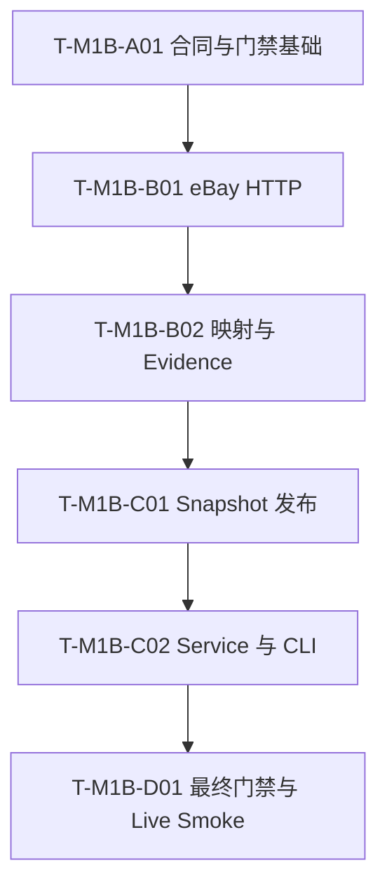

# Glodex M1b 单 Provider Capture 实施任务

| 字段 | 值 |
|---|---|
| Task Set ID | `GLO-TASKS-002` |
| 版本 | `0.2.0` |
| 状态 | Approved |
| 对应规格 | [`GLO-SPEC-002`](./spec.md) v0.2.1（Approved） |
| 对应计划 | [`GLO-PLAN-002`](./plan.md) v0.2.0（Approved） |
| 创建日期 | 2026-07-29 |
| 最后更新 | 2026-07-29 |
| 批准日期 | 2026-07-29 |

## 1. 执行约定

1. 固定 6 个 `RED→GREEN` 垂直任务，严格单链执行；不按 DTO、错误码或单个
   AC 继续拆分。
2. 中间任务只跑定向测试；完整 M0/M1a、lint、type、Golden 只在 D01 的最终
   `verify_m1b.py` 统一执行。
3. 默认测试使用 fake transport 并保持 `--disable-socket`；真实 eBay 只在最终
   live smoke 中显式调用。
4. 每个 M1b 测试必须引用真实的 P0、AC 或 NFR ID；禁止 skip、xfail、`-k`
   规避或自动接受 Golden。
5. `.env` 只由显式 `--env-file` 读取，不打印、不复制进 fixture、不进入 Git。
6. 不新增 runtime dependency，不修改 `pyproject.toml` 或 `uv.lock`。
7. 改变用户可见行为先回 Spec；改变技术路线先回 Plan。
8. 不新增第二 Provider、分页、retry、getItem、数据库、队列、缓存、LLM、
   AG-UI 或前端。

## 2. 保留的项目亮点与精简边界

必须保留：

- Capture-first：真实 Provider 只负责生成 snapshot，现有搜索/API/SSE 继续离线；
- 一次 OAuth 加一次单页 Search，请求数不超过 2；
- eBay itemId 无损编码、UNKNOWN 库存、UnknownCost、identity FX 与 Evidence；
- hidden staging 经现有 loader/aggregation 验证后，以同文件系统 rename 发布；
- `REJECTED / FAILED / PUBLISHED` 精确 receipt 和单 JSON stdout；
- 默认离线、exact `6 P0 / 6 AC / 6 NFR`、父门禁优先和真实 live smoke。

明确不实现：

- 多进程 publisher、全局 publish lock、stale-lock 恢复或 rename-no-replace 模拟；
- 自定义 JSON parser、depth/string/duplicate-key 等 Provider 专用扩展限制；
- 凭据内存清零或对象生命周期内省测试；
- 每个 syscall 的穷举故障注入；
- live smoke wrapper 或第二套 stdout schema。

M1b publisher 的前提是本地单 Operator、单进程 writer。发布最小链路为：

```text
hidden staging
  → canonical manifest v1
  → LocalSnapshotCatalog + aggregation
  → final lstat
  → os.rename commit
```

rename 前失败无 final；rename 成功后保持 `PUBLISHED`，cleanup 只做 best effort。

## 3. 依赖主链



## 4. Phase A：合同与窄边界

### `T-M1B-A01` `[RED→GREEN] [GATE]` Capture 合同、Preflight 与门禁基础

- [x] 状态：已完成
- 依赖：无
- 追踪：`GLO-M1B-P0-001`、`GLO-M1B-P0-002`、`GLO-M1B-P0-006`；
  `M1B-AC-001`、`M1B-AC-005`、`M1B-AC-006`；
  `GLO-M1B-NFR-001`、`GLO-M1B-NFR-004`、`GLO-M1B-NFR-005`、
  `GLO-M1B-NFR-006`
- 主要路径：
  - `src/glodex/capture/{__init__,contracts,config,ports}.py`
  - `scripts/check_traceability.py`、`scripts/verify_m0.py`
  - `tests/conftest.py`、`tests/architecture/test_import_boundaries.py`
  - `tests/unit/scripts/test_verify_m0_runner.py`
  - `tests/m1b/{conftest,unit,architecture}/`
- RED：
  - receipt 字段、状态、退出码或计数不精确；
  - 缺 `--live`、query、output root 或凭据时仍分配 ID/外呼；
  - Provider host/market/category/currency/limit 可被输入改写；
  - 默认测试保留 `EBAY_*`，M1b traceability 污染 M0/M1a；
  - 网络 allowlist 放宽到唯一 transport 文件之外。
- GREEN：
  - 建立 strict receipt、固定 eBay profile、最小 env-file/preflight 与 ports；
  - M1b profile 精确为 `6/6/6`，M0/M1a inventory 不变；
  - 默认环境清除 `EBAY_*`，历史 M0 phase 忽略 `tests/m1b`；
  - 只允许未来 `capture/ebay_http.py` 使用 `http.client`；
  - 此任务不修改 `src/glodex/cli.py`，不创建 transport/publisher 空壳。
- 完成：
  - 合同、配置、traceability 和 architecture 定向测试通过；
  - `.env` 仍被 Git 忽略，runtime dependencies 不变。
- 验证：

```bash
uv lock --check
uv run --locked python -m pytest -q -p scripts.verify_m0 \
  tests/unit/scripts/test_verify_m0_runner.py \
  tests/m1b/unit/test_capture_contracts.py \
  tests/m1b/unit/test_capture_config.py \
  tests/m1b/unit/test_traceability_m1b.py \
  tests/m1b/architecture/test_m1b_boundaries.py
uv run --locked python scripts/check_traceability.py --profile m1b --mode references
```

## 5. Phase B：Provider Transport 与映射

### `T-M1B-B01` `[RED→GREEN]` OAuth、单页 Search 与必要资源边界

- [x] 状态：已完成
- 依赖：`T-M1B-A01`
- 追踪：`GLO-M1B-P0-001`、`GLO-M1B-P0-002`、`GLO-M1B-P0-005`；
  `M1B-AC-002`、`M1B-AC-004`、`M1B-AC-005`；
  `GLO-M1B-NFR-004`、`GLO-M1B-NFR-005`
- 主要路径：
  - `src/glodex/capture/ebay_http.py`
  - `tests/m1b/contract/test_ebay_http_contract.py`
- RED：
  - OAuth/Search method、path、header、query 或固定 filter 漂移；
  - redirect、retry、next link 或额外 endpoint 增加请求；
  - body、item、timeout/deadline 上限未生效；
  - auth、429、5xx、timeout、截断、非法 root 映射不稳定；
  - outcome、stdout/stderr 或 exception 暴露 credential/token/body。
- GREEN：
  - 唯一标准库 HTTPS client，固定 production host/path；
  - attempt 在出站前计数，任一路径最多 auth 1 次、search 1 次；
  - bounded read：OAuth 64 KiB、Search 256 KiB、item 最多 10；
  - timeout 为 10s/15s，总 deadline 30s；
  - 使用标准 `json` 加必要 root/itemSummaries schema 检查；
  - fake connection 覆盖 success、empty 和 Spec 指定的代表性失败。
- 完成：
  - wire shape、两次请求预算、上限及安全失败映射合同通过；
  - 测试不打开真实 socket。
- 验证：

```bash
uv run --locked python -m pytest -q -p scripts.verify_m0 \
  tests/m1b/contract/test_ebay_http_contract.py
```

### `T-M1B-B02` `[RED→GREEN] [GATE]` Item 映射、Evidence 与 Identity FX

- [x] 状态：已完成
- 依赖：`T-M1B-B01`
- 追踪：`GLO-M1B-P0-003`、`GLO-M1B-P0-004`、`GLO-M1B-P0-005`；
  `M1B-AC-002`、`M1B-AC-003`、`M1B-AC-004`；
  `GLO-M1B-NFR-002`、`GLO-M1B-NFR-003`、`GLO-M1B-NFR-005`
- 主要路径：
  - `src/glodex/capture/ebay_mapping.py`
  - `tests/m1b/fixtures/{ebay_search_success,ebay_search_empty}.json`
  - `tests/m1b/unit/test_ebay_mapping.py`
  - `tests/m1b/contract/test_ebay_mapping_contract.py`
- RED：
  - itemId 不能无损 round-trip，或非法/重复记录进入输出；
  - title/source/USD price/marketplace 不合法仍形成 Product/Offer；
  - 库存被推断为 IN_STOCK，多运费被任选最低价，tax/duty 被补零；
  - Evidence、snapshot ID、captured_at 或 identity FX 不闭合；
  - empty page 与非空全 quarantine 被混为同一结果。
- GREEN：
  - itemId 使用 unpadded base64url，合法记录稳定映射；
  - 每 listing 独立 Product/Offer，库存固定 UNKNOWN；
  - shipping 仅唯一明确 USD cost 为 Known，tax/duty Unknown；
  - Product、Offer、Evidence 与 USD identity FX 完整闭合；
  - empty 可发布，mixed 只保留合法记录，非空全坏返回 Provider failure；
  - fixture 全部人工构造且脱敏。
- 完成：
  - mapper 产物通过现有 domain 构造和 aggregation；
  - identity、UNKNOWN、UnknownCost、Evidence、quarantine 边界通过。
- 验证：

```bash
uv run --locked python -m pytest -q -p scripts.verify_m0 \
  tests/m1b/contract/test_ebay_http_contract.py \
  tests/m1b/unit/test_ebay_mapping.py \
  tests/m1b/contract/test_ebay_mapping_contract.py \
  tests/unit/domain/test_catalog_aggregation.py
uv run --locked python scripts/check_traceability.py --profile m1b --mode references
```

## 6. Phase C：Snapshot 与 CLI 闭环

### `T-M1B-C01` `[RED→GREEN]` Manifest v1、反向验证与原子 rename

- [x] 状态：已完成
- 依赖：`T-M1B-B02`
- 追踪：`GLO-M1B-P0-003`、`GLO-M1B-P0-005`；
  `M1B-AC-002`、`M1B-AC-003`、`M1B-AC-004`；
  `GLO-M1B-NFR-002`、`GLO-M1B-NFR-003`、`GLO-M1B-NFR-004`
- 主要路径：
  - `src/glodex/capture/snapshot_publisher.py`
  - `tests/m1b/unit/test_snapshot_publisher.py`
  - `tests/m1b/contract/test_m1b_snapshot_roundtrip.py`
- RED：
  - canonical JSON/JSONL、hash、count 或 inventory 与 loader 合同不一致；
  - empty snapshot 缺 USD identity FX；
  - raw response/query/token/quarantine item 被写入 staging；
  - 未经过 loader/aggregation 就发布，或其 fatal/quarantine/count 不一致仍发布；
  - target 已存在被覆盖，验证/rename 失败留下 final；
  - rename 已成功却返回 FAILED。
- GREEN：
  - 在 output root 内创建 0700 hidden staging，写 0600 manifest v1 文件；
  - 使用现有 loader + aggregation 验证并比较 Product/Offer count；
  - final `lstat` 后用 `os.rename` 提交，不使用 `os.replace`；
  - rename 前失败无 final；rename 后 cleanup best effort 且结果保持 PUBLISHED。
- 完成：
  - success、empty 和 mixed-quarantine snapshot 可由现有 loader 加载；
  - target-existing、一次验证失败、rename 失败和 post-rename cleanup 失败四类
    代表性测试通过；
  - 不实现 publish lock 或并发 writer。
- 验证：

```bash
uv run --locked python -m pytest -q -p scripts.verify_m0 \
  tests/m1b/unit/test_snapshot_publisher.py \
  tests/m1b/contract/test_m1b_snapshot_roundtrip.py \
  tests/contract/test_local_snapshot_manifest.py \
  tests/contract/test_local_snapshot_quarantine.py \
  tests/unit/domain/test_catalog_aggregation.py
```

### `T-M1B-C02` `[RED→GREEN] [GATE]` CaptureService、Receipt 与 CLI

- [x] 状态：已完成
- 依赖：`T-M1B-C01`
- 追踪：`GLO-M1B-P0-001`、`GLO-M1B-P0-002`、`GLO-M1B-P0-003`、
  `GLO-M1B-P0-004`、`GLO-M1B-P0-005`；
  `M1B-AC-002`、`M1B-AC-003`、`M1B-AC-004`、`M1B-AC-005`；
  `GLO-M1B-NFR-001`、`GLO-M1B-NFR-003`、`GLO-M1B-NFR-004`、
  `GLO-M1B-NFR-005`、`GLO-M1B-NFR-006`
- 主要路径：
  - `src/glodex/capture/{service,bootstrap}.py`
  - `src/glodex/cli.py`
  - `tests/m1b/unit/test_capture_service.py`
  - `tests/m1b/contract/test_capture_cli_contract.py`
  - `tests/m1b/acceptance/test_m1b_ac_002_005.py`
- RED：
  - Capture argparse 错误落入 M0 DTO，或 capture 分支先加载普通配置；
  - preflight 失败仍分配 ID/外呼，request/record count 不守恒；
  - Provider 或 publish 失败静默回退，empty/mixed/all-bad 状态错误；
  - receipt key、issue、stdout 行数或 0/1/2 exit code不符合 Spec；
  - 普通 CLI/API/SSE 导入或实例化 live client。
- GREEN：
  - Service 编排 preflight、ID、transport、mapper、publisher 和 receipt；
  - Capture 在 `load_config()` 前独立分发并惰性组合；
  - 三种 receipt 精确输出一个 JSON，失败只返回稳定 issue；
  - fake transport 闭合 success、empty、mixed、Provider failure 和 publish failure；
  - normal demo/search/validate 与 M1a public contracts 不变。
- 完成：
  - `M1B-AC-002` 至 `M1B-AC-005` 自动化通过；
  - 发布 snapshot 可由现有 validate/search 路径读取。
- 验证：

```bash
uv run --locked python -m pytest -q -p scripts.verify_m0 \
  tests/m1b/unit/test_capture_service.py \
  tests/m1b/contract/test_capture_cli_contract.py \
  tests/m1b/acceptance/test_m1b_ac_002_005.py \
  tests/acceptance/test_cli_walking_skeleton.py
uv run --locked python scripts/check_traceability.py --profile m1b --mode references
```

## 7. Phase D：最终门禁、文档与 Live Smoke

### `T-M1B-D01` `[RED→GREEN] [DOC] [GATE]` 完整离线验证与真实采集

- [x] 状态：已完成
- 依赖：`T-M1B-C02`
- 追踪：全部 `6 P0 / 6 AC / 6 NFR` 与 M1b Definition of Done
- 主要路径：
  - `scripts/verify_m1b.py`
  - `tests/m1b/{architecture,nfr,acceptance}/`
  - `tests/m1b/unit/test_verify_m1b_runner.py`
  - `README.md`
  - `specs/002-glodex-m1b-provider/{spec,plan,tasks,verification}.md`
- RED：
  - 默认 CLI/API/SSE 会联网或读取 `.env`；
  - 网络 import 超出唯一 transport 文件，环境 sanitizer 留下 `EBAY_*`；
  - receipt/snapshot/Git 泄漏 secret、token、raw payload 或 live data；
  - traceability 缺失、重复或由 skip/xfail 覆盖；
  - `verify_m1b.py` 未先完整执行 `verify_m1a.py`；
  - `.env`、live snapshot/receipt、cassette 或 26 张 PNG 进入 Git；
  - README/verification 声称不存在的库存、覆盖率或 SLA。
- GREEN：
  - `verify_m1b.py` 先执行完整 M1a，再执行 M1b architecture/NFR、
    unit/contract、AC 和 exact coverage；
  - runner 固定 cwd、参数数组、sanitized environment 并首错停止；
  - README 记录 opt-in、query disclosure、UNKNOWN/UnknownCost、数据时效和无 SLA；
  - 直接使用 `capture-provider --live`、`validate-snapshot`、`search` 做三步 smoke，
    不实现 wrapper 或第二套 JSON；
  - verification 只记录真实执行后的脱敏计数和结论。
- 完成：
  - 完整离线门禁通过且无真实外呼；
  - 本机 `.env` 的真实 Capture 为 PUBLISHED、request_count=2，至少一个
    Product/Offer；
  - 外部 snapshot 可由现有 validate/search 加载，搜索为可信 COMPLETED 或
    NO_MATCH；
  - Git inventory 不含 secret、live data 或 PNG。
- 验证：

```bash
uv run --locked python scripts/verify_m1b.py
git diff --check
```

默认门禁通过后独立执行：

```bash
install -d -m 700 /absolute/external/glodex-snapshots

uv run --locked glodex capture-provider --live \
  --env-file .env \
  --output-root /absolute/external/glodex-snapshots \
  --query "smartphone"

# 从 receipt 取得真实值
CAPTURE_ID="capture-..."

GLODEX_DATA_DIR=/absolute/external/glodex-snapshots \
uv run --locked glodex validate-snapshot "$CAPTURE_ID" --currency USD

GLODEX_DATA_DIR=/absolute/external/glodex-snapshots \
uv run --locked glodex search \
  --snapshot "$CAPTURE_ID" \
  --currency USD \
  --query "smartphone"
```

## 8. 文件所有权与 Gate

| 文件组 | Owner |
|---|---|
| `capture/{contracts,config,ports}.py`、traceability、sanitizer、import gate | `A01` |
| `capture/ebay_http.py` | `B01` |
| `capture/ebay_mapping.py`、synthetic fixtures | `B02` |
| `capture/snapshot_publisher.py` | `C01` |
| `capture/{service,bootstrap}.py`、`src/glodex/cli.py` | `C02` |
| `verify_m1b.py`、README、verification/status docs | `D01` |
| `pyproject.toml`、`uv.lock`、M0/M1a public contracts、Golden、API/SSE | 不修改 |

发现前序合同缺口时回到原 Owner 并重跑其 Gate，不在后续任务“顺手修改”。

## 9. 追踪矩阵

### 9.1 P0

| ID | 主要任务 |
|---|---|
| `GLO-M1B-P0-001` | `A01`、`B01`、`C02`、`D01` |
| `GLO-M1B-P0-002` | `A01`、`B01`、`C02`、`D01` |
| `GLO-M1B-P0-003` | `B02`、`C01`、`C02` |
| `GLO-M1B-P0-004` | `B02`、`C02`、`D01` |
| `GLO-M1B-P0-005` | `B01`、`B02`、`C01`、`C02` |
| `GLO-M1B-P0-006` | `A01`、`D01` |

### 9.2 AC

| ID | 主要任务 |
|---|---|
| `M1B-AC-001` | `A01`、`D01` |
| `M1B-AC-002` | `B01`、`B02`、`C01`、`C02` |
| `M1B-AC-003` | `B02`、`C01`、`C02` |
| `M1B-AC-004` | `B01`、`B02`、`C01`、`C02` |
| `M1B-AC-005` | `A01`、`B01`、`C02` |
| `M1B-AC-006` | `A01`、`D01` |

### 9.3 NFR

| ID | 主要任务 |
|---|---|
| `GLO-M1B-NFR-001` | `A01`、`C02`、`D01` |
| `GLO-M1B-NFR-002` | `B02`、`C01`、`D01` |
| `GLO-M1B-NFR-003` | `B02`、`C01`、`C02` |
| `GLO-M1B-NFR-004` | `A01`、`B01`、`C01`、`C02`、`D01` |
| `GLO-M1B-NFR-005` | `A01`、`B01`、`C02` |
| `GLO-M1B-NFR-006` | `A01`、`C02`、`D01` |

## 10. Tasks 审批门禁

进入 Implementation 前确认：

- [x] 用户批准 6 个任务及严格单链；
- [x] 用户确认项目亮点全部保留；
- [x] 用户接受单 Operator、单进程 writer，不实现 publish lock；
- [x] 用户接受中间任务只跑定向测试，完整父回归在 D01 统一执行；
- [x] 用户接受真实 smoke 直接运行三个 CLI 命令，不新增 wrapper；
- [x] 用户接受 `.env` 只被显式读取且永不进入 Git；
- [x] 没有第二 Provider、分页、retry 或未来能力空壳。
