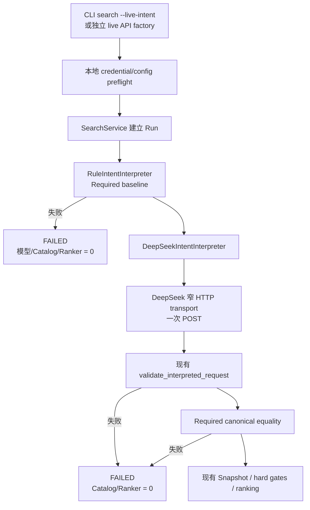

# Glodex M1c DeepSeek Intent 技术实施计划

| 字段 | 值 |
|---|---|
| Plan ID | `GLO-PLAN-003` |
| 版本 | `0.1.0` |
| 状态 | Approved |
| 对应规格 | [`GLO-SPEC-003 v0.1.1`](./spec.md)（Approved） |
| 父基线 | [`GLO-SPEC-000`](../000-glodex-mvp/spec.md)、[`GLO-SPEC-001`](../001-glodex-m1-api/spec.md)、[`GLO-SPEC-002`](../002-glodex-m1b-provider/spec.md) |
| 里程碑 | M1c：单一 DeepSeek Intent 安全接入 |
| 创建日期 | 2026-07-29 |
| 最后更新 | 2026-07-29 |
| 批准日期 | 2026-07-29 |

## 1. 计划目标与实现预算

本 Plan 只交付一条真实 DeepSeek Intent 垂直切片：

```text
显式 live composition
  → RuleIntentInterpreter 形成 Required baseline
  → DeepSeekIntentInterpreter 发出一次固定请求
  → 现有 Intent validator
  → Required 等值比较
  → 现有 Catalog / hard gates / ranking / API / SSE
```

实现预算固定为：

- 最多新增 3 个 production source file：adapter、窄 HTTP transport、薄 live API
  factory 各一个；
- 最多新增 3 个行为类型：`DeepSeekIntentInterpreter`、一个 Run 内安全异常、一个
  preflight 安全异常；
- 只新增 `httpx` 这 1 个 runtime dependency；
- 不新增 LLM/Provider 通用 Port、SDK wrapper、registry、router、retry、cache 或 receipt；
- 不改变公开 Search DTO、HTTP/SSE 合同、Run 状态或领域排序。

超过该预算必须先回到 Spec，不得在 Tasks 中自行扩张。

## 2. 当前扩展缝

| 现有能力 | 直接复用方式 |
|---|---|
| `application.ports.IntentInterpreter` | DeepSeek 直接实现；不增加 `ModelGateway`。 |
| `RuleIntentInterpreter` | live 模式的 `rules-zh-cn-v1` Required baseline。 |
| `validate_interpreted_request()` | 对模型重建出的领域对象执行现有 span、语义和分区校验。 |
| `SearchService` | 继续拥有 Intent 阶段、失败终态和下游调用顺序。 |
| `_intent_adapter_issue()` | 继续把 adapter 的安全 code 投影为公开 `Issue`。 |
| `build_service(..., intent_interpreter=...)` | 注入 DeepSeek，并增加一个可选 baseline interpreter；默认值保持现状。 |
| `bootstrap.py` | 用一个局部导入的共享 live builder 供 CLI/API 复用，默认 import 不加载 HTTPX。 |
| CLI `_emit()` / `exit_code_for()` | live preflight 仍返回现有 `RequestRejected` 与 exit `2`。 |
| `create_app(service=...)` | live API factory 只构造 service，再委托现有 API。 |
| `ApiSettings.run_timeout_seconds=30` | live factory 校验其严格大于固定 LLM deadline `15s`。 |
| RunJournal / EventProjector | 继续产生既有 `STATE_SNAPSHOT → RUN_ERROR`，不增加模型事件。 |

`application.ports.py`、公共 contracts、API routes/events、配置文件 schema 均不修改。

## 3. 分层与调用顺序



### 3.1 SearchService 最小改动

`SearchService.__init__()` 与 `build_service()` 增加：

```python
required_baseline_interpreter: IntentInterpreter | None = None
```

默认组合传 `None`，因此仍只调用一次 `RuleIntentInterpreter`。live 组合传：

```python
intent_interpreter=DeepSeekIntentInterpreter(...)
required_baseline_interpreter=RuleIntentInterpreter()
```

live Intent 阶段顺序固定为：

1. 调用 baseline interpreter；
2. baseline 抛错或未通过现有 validator：
   `intent.required-baseline-failed`，立即 `FAILED`；
3. baseline 合法后才调用 DeepSeek；
4. DeepSeek 结果先通过现有 validator；
5. 调用新的纯函数 `required_constraints_match(baseline, candidate)`；
6. 不等值时 `intent.required-incomplete`，立即 `FAILED`；
7. 等值时才完成 Intent 阶段并进入 Catalog。

两次 validator 调用都在应用层完成。DeepSeek adapter 只负责线协议解析和领域对象
重建，不拥有完整性决策。

### 3.2 Required 等值函数

在 `domain/intent.py` 增加一个纯函数，不新增 DTO 或 Port。输入必须是已经验证的
两个 `InterpretedRequest`，只比较 Required：

- budget：`Decimal` amount、currency、span；
- category：canonical category、span；
- stock：固定真值语义、span；
- exclusion：canonical value、span。

双方按规格的 `(start, end, kind, canonical value)` 形成排序后的不可变 signature。
仅顺序不同返回 `True`；遗漏、降级、改值、改 span、冲突或新增均返回 `False`。

## 4. 单一 DeepSeek Adapter 与窄 Transport

### 4.1 固定常量

下列常量只分布在 `deepseek_intent.py` 与 `deepseek_http.py`：前者拥有
model/parser/schema/prompt 上限，后者拥有 URL/credential/deadline/body 上限。它们
不得由请求、TOML 或额外环境变量覆盖：

| 常量 | 值 |
|---|---|
| URL | `https://api.deepseek.com/chat/completions` |
| model | `deepseek-v4-flash` |
| credential name | `DEEPSEEK_API_KEY` |
| parser version | `deepseek-intent-v1` |
| total deadline | `15s` |
| max response body | `65,536` decoded bytes |
| max output | `1024` tokens |
| max Required / Preferred | `10 / 4` |
| max string | `2,000` Unicode code points |
| locale | `zh-CN` |

其余固定请求值集中在一个 payload builder，不建立 `Config`、`Profile` 或
`Credentials` 类。

### 4.2 Adapter / Transport 边界

把现有 dev dependency `httpx>=0.28,<1` 提升为 runtime dependency，不引入
DeepSeek/OpenAI SDK。

`deepseek_intent.py` 定义一个 DeepSeek 专用窄 callable type：

```python
type DeepSeekTransport = Callable[[bytes], Awaitable[bytes]]
```

`DeepSeekIntentInterpreter` 只构造固定 payload bytes、调用该 callable、解析
Provider envelope/business JSON 并重建领域对象；它不读取或持有 credential，也不
导入 HTTPX。

`deepseek_http.py` 的一个 builder 校验 `DEEPSEEK_API_KEY`，并返回实现上述 callable
的 async closure。credential 只捕获在该 transport closure 中。该文件是唯一允许
导入 HTTPX、设置 Authorization 或访问 DeepSeek URL 的 production 文件。不新增
通用 HTTP/LLM Protocol、client class 或连接池管理器。

每次 transport 调用：

1. 创建并在 `async with` 中关闭一个 `httpx.AsyncClient`；
2. 使用固定完整 URL，不使用 `base_url`；
3. 显式创建 `httpx.AsyncHTTPTransport(retries=0, trust_env=False)`；contract
   test 可向 builder 注入 `httpx.MockTransport`；
4. 固定 `follow_redirects=False`、`trust_env=False`，请求
   `Accept-Encoding: identity`；
5. HTTPX timeout 与 `asyncio.timeout()` 均以 `15s` 为上限；
6. 只执行一个 `POST`，无重试；
7. 只接受 `2xx`；redirect 和其他非成功状态均不读取或公开第三方正文；
8. 响应 `Content-Encoding` 只接受缺失或 `identity`；
9. 使用 `client.stream()`；先检查 `Content-Length`，再增量读取 decoded bytes，
   第 `65,537` byte 立即失败；
10. 捕获 HTTPX/timeout 异常并转换为安全 transport error。

`trust_env=False` 用于防止代理环境改变批准的网络目标；CA 使用 HTTPX/系统默认，
不开放自定义 CA、proxy 或 origin 配置。

### 4.3 固定请求

动态内容只有 trimmed query 与固定 locale。请求 body 固定包含：

```json
{
  "model": "deepseek-v4-flash",
  "messages": [
    {"role": "system", "content": "<固定 system instruction，包含 json 与示例>"},
    {"role": "user", "content": "{\"query\":\"<query>\",\"locale\":\"zh-CN\"}"}
  ],
  "stream": false,
  "thinking": {"type": "disabled"},
  "response_format": {"type": "json_object"},
  "temperature": 0,
  "max_tokens": 1024,
  "tool_choice": "none"
}
```

省略 `tools`、`reasoning_effort`、user ID、logprobs 和批量字段。system instruction
必须把 user message 视为数据，要求只返回 JSON，不输出解释或思维链，并列出当前
允许的 variant/canonical value、Unicode code-point span 规则和一个完整示例。
user message 必须由 `json.dumps()` 从 `{query, locale}` 构造，不拼接或格式化
query 到 JSON 字符串。

### 4.4 业务 JSON

根对象精确只有 `required` 与 `preferred`。每项只允许以下 keys：

| kind | 精确 keys |
|---|---|
| `budget_max` | `kind, amount, currency, start, end, text` |
| `target_category` | `kind, category, start, end, text` |
| `stock_required` | `kind, start, end, text` |
| `exclusion` | `kind, value, start, end, text` |
| `preferred` | `kind, value, start, end, text` |

约束：

- `amount` 是普通十进制字符串，不接受指数、NaN 或 Infinity；
- `start/end` 是 exact integer，不能是 bool；
- collection、字符串、currency、category 与 canonical value 均按 Spec 上限校验；
- 未知或缺失 key、未知 variant、额外 root key（含模型自报 `parser_version`）均拒绝；
- adapter 使用现有领域 dataclass 重建结果，并按 source span 排序；
- `parser_version` 只由本地写入 `deepseek-intent-v1`。

Provider envelope 允许无关元数据，但必须满足：

- `choices` 恰好一项且 `index == 0`；
- `finish_reason == "stop"`；
- `message.content` 为非空字符串；
- `tool_calls` 不存在或为空；
- `reasoning_content` 不存在、为空或 `null`。

envelope 与业务 content 都使用拒绝 duplicate keys 的 JSON decoder，不能接受
last-key-wins。JSON/envelope/schema/body cap 任一失败均为
`intent.provider-response-invalid`。

### 4.5 安全错误映射

现有 `IntentIssueCode` 增加四个 Run 内 code；不新建 Provider 错误枚举。
`DeepSeekIntentError.code` 必须是该 `StrEnum` 的成员，使现有
`_intent_adapter_issue()` 能保留公开 code；`SearchService` 直接使用
baseline/completeness 成员。Run 外另用 `DeepSeekPreflightError` 携带两个固定大写
code：

| 场景 | code |
|---|---|
| key 缺失或空 | `INTENT_LIVE_CREDENTIALS_MISSING` |
| key 含换行/非法类型、API timeout `<= 15` | `INTENT_LIVE_CONFIG_INVALID` |
| timeout、连接错误、redirect、非成功状态 | `intent.provider-unavailable` |
| envelope/content/schema/上限非法 | `intent.provider-response-invalid` |
| baseline 抛错或自身校验失败 | `intent.required-baseline-failed` |
| Required 不等值 | `intent.required-incomplete` |

异常字符串只包含稳定 code 与固定安全消息；不附带 URL、key、query、response、
HTTPX 异常或第三方 body。

## 5. Activation 与 Preflight

### 5.1 CLI

只给 `search` 增加 `--live-intent`。`demo` 不接受该 flag。

CLI live 分支顺序：

1. 完成 argparse 与普通 Glodex config；
2. 惰性调用 `bootstrap.build_live_intent_service()`，完成固定配置和 credential
   preflight；
3. preflight 通过后调用现有 `submit_search()` 做 `SearchRequest` pre-run 校验；
4. 合法请求才建立 Run，baseline 通过后才发生模型调用。

普通 `search` 即使环境中存在 key，也不得读取 key、导入 HTTPX/live adapter 或发生
模型调用。CLI preflight 失败返回 field=`intent`、既定 code、exit `2`。

### 5.2 FastAPI

新增 `src/glodex/api/live_app.py`，只提供薄 `create_live_app()`：

1. 构造或接收现有 `ApiSettings`；
2. 在创建 FastAPI app 前校验 credential 与 `run_timeout_seconds > 15`；
3. 使用与 CLI 相同的 `bootstrap.build_live_intent_service()`；
4. 将同一个 clock 与 run-id provider 同时传给 live service 和 `create_app()`；
5. 返回现有 `create_app(settings=..., service=...)`。

preflight 只做本地常量、timeout 与 credential 检查，不探测 DeepSeek 网络。

启动命令固定为：

```bash
uv run --locked uvicorn glodex.api.live_app:create_live_app \
  --factory --host 127.0.0.1 --port 8000
```

默认 `glodex.api.app:create_app` 和 `glodex.api.__init__` 不导入 live module。HTTP
request/header/query 不能启用或覆盖模型设置，OpenAPI 与三个端点保持不变。

## 6. 文件变更

### 6.1 新增 production files

| 文件 | 职责 |
|---|---|
| `src/glodex/adapters/deepseek_intent.py` | 固定 payload、窄 transport callable、严格解析、领域重建与 Run 内安全异常。 |
| `src/glodex/adapters/deepseek_http.py` | credential preflight、固定 HTTPX 调用、deadline/body cap 与 Run 外安全异常。 |
| `src/glodex/api/live_app.py` | 独立 live factory，随后委托现有 `create_app()`。 |

### 6.2 修改 production/build files

| 文件 | 最小改动 |
|---|---|
| `src/glodex/domain/intent.py` | 增加四个 Run issue code 与纯 Required equality 函数。 |
| `src/glodex/application/search_service.py` | baseline → model → validator → completeness 顺序与两项安全失败。 |
| `src/glodex/bootstrap.py` | 透传可选 baseline，并以局部 import 提供 CLI/API 共用的 `build_live_intent_service()`；默认 import/组合不变。 |
| `src/glodex/cli.py` | `search --live-intent`、live-only 预校验和惰性组合。 |
| `pyproject.toml` / `uv.lock` | HTTPX 从 dev-only 提升为唯一新增 runtime dependency。 |
| `tests/architecture/test_dependency_allowlist.py` | runtime allowlist 精确增加 HTTPX。 |
| `tests/architecture/test_import_boundaries.py` | 只为 `deepseek_http.py` 增加 HTTPX carve-out。 |
| `tests/m1a/architecture/test_m1a_boundaries.py` | 删除“HTTPX 必须 dev-only”的旧断言，同时继续禁止其他源码导入。 |
| `tests/conftest.py`、`scripts/verify_m0.py` | sanitizer 增加 `DEEPSEEK_`。 |
| `scripts/check_traceability.py` | 增加 M1c exact `6/6/6` profile，不重构旧 profile。 |
| `README.md` | activation、query disclosure、限制和独立 smoke。 |

不新增 `glodex/llm/` 包、配置文件字段、模型 DTO、模型事件、receipt、fixture/cassette
或 live pytest marker。

## 7. 测试与 Traceability

只新增以下 8 个测试模块和一个共享 `tests/m1c/conftest.py`：

| 文件 | 主要职责 |
|---|---|
| `unit/test_live_intent.py` | payload、严格 parser、边界、Required mutation 与 Fake 重复性。 |
| `contract/test_deepseek_http.py` | 固定 URL/header、HTTP 状态/异常、deadline/body cap、无 redirect/retry，且 transport/client 均 `trust_env=False`。 |
| `contract/test_live_activation.py` | CLI/API activation、credential/config preflight、默认零读取。 |
| `acceptance/test_m1c_ac_001_003.py` | AC-001～003：默认、合法 Fake、非法请求与 injection。 |
| `acceptance/test_m1c_ac_004_006.py` | AC-004～006：故障、Required 失败和分轨。 |
| `architecture/test_m1c_boundaries.py` | 唯一 HTTPX import、无通用模型层、父层依赖边界。 |
| `nfr/test_m1c_offline_security.py` | fresh-process 禁网、环境/日志/Git 泄漏检查。 |
| `unit/test_m1c_verification.py` | exact inventory、traceability 与 runner 合同。 |

adapter/service 测试的 Fake 实现窄 async callable，捕获最终 payload bytes 并返回
原始 Provider-shaped bytes；HTTP contract 再用 `httpx.MockTransport` 检查唯一真实
transport 的 URL/header/stream/body cap。两者都禁止直接返回
`InterpretedRequest`。

### 7.1 需求追踪

| P0 | 主要自动证据 | AC |
|---|---|---|
| `GLO-M1C-P0-001` | activation、fresh-process default | `001,003` |
| `GLO-M1C-P0-002` | HTTP contract、request count | `002,003,004` |
| `GLO-M1C-P0-003` | strict parser mutation table | `002,004` |
| `GLO-M1C-P0-004` | baseline/completeness table、downstream spies | `005` |
| `GLO-M1C-P0-005` | full service/API/SSE、完整 M1b 回归 | `001,002` |
| `GLO-M1C-P0-006` | offline/security、runner、人工 smoke | `006` |

| NFR | 主要自动证据 |
|---|---|
| `GLO-M1C-NFR-001` | M1b-first runner、default fresh process |
| `GLO-M1C-NFR-002` | outbound request allowlist、日志/事件/Git sentinel |
| `GLO-M1C-NFR-003` | Required mutation、Catalog/Ranker call count |
| `GLO-M1C-NFR-004` | timeout/cap/exactly-once、API startup relation |
| `GLO-M1C-NFR-005` | Fake repeat + 既有 determinism/Golden |
| `GLO-M1C-NFR-006` | import/dependency boundary、lint/type |

AC marker 放在对应 black-box test 上，不以文件级 marker 虚报全部 18 个 ID。

## 8. 实施阶段

### Phase A：安全核心

- 先扩展 traceability 与 failing tests；
- 加入 Required equality 和 SearchService baseline 顺序；
- 实现 DeepSeek payload/严格解析、窄 HTTP transport 与安全错误；
- 证明 default Rule 与完整 M1b 不变。

### Phase B：Activation

- 加入 CLI flag/preflight/lazy import；
- 加入薄 live API factory 与 timeout startup check；
- 完成 API/SSE、injection、故障和泄漏测试。

### Phase C：门禁与文档

- 新增 `scripts/verify_m1c.py`；
- 完成 exact coverage、README、独立 smoke 指令，并在取得证据后创建
  `verification.md`；
- 运行完整离线门禁；真实 smoke 只在凭据可用时人工执行。

Tasks 只能按这三个阶段拆分，不得插入通用 Provider 基础设施。

## 9. 验证命令

默认离线总门禁：

```bash
uv run --locked python scripts/verify_m1c.py
```

runner 固定五步：

1. 完整 `scripts/verify_m1b.py`；
2. M1c architecture + NFR；
3. M1c unit + contract；
4. M1c acceptance；
5. M1c exact traceability coverage。

第 2～4 步的每个 pytest 子进程都必须加载
`-p scripts.verify_m0` strict-outcome plugin，使 skip/xfail/xpass 失败；
`test_m1c_verification.py` 同时断言 runner 不含 `-k`、`--lf`、`--ff`、单节点选择、
自动 Golden 更新或 live 标记过滤。

独立 live smoke：

```bash
read -r -s DEEPSEEK_API_KEY
export DEEPSEEK_API_KEY
uv run --locked glodex search --live-intent \
  --query "推荐 800 美元以内、有库存、适合出差的轻薄本" \
  --snapshot m0-v1 --currency USD --top-k 3
unset DEEPSEEK_API_KEY
```

只接受 `COMPLETED` 或可信 `NO_MATCH`；不把 terminal 输出、query、prompt、response、
key 或 live artifact 写入仓库。默认 runner 不读取 key、不联网、不执行 smoke。

真实 smoke 不增加公共 request-count DTO 或 usage side channel。`calls=1` 的证据链固定
为：真实命令使用 production composition 并到达合法搜索终态；production transport
只有一个无循环的 `POST` 调用点；离线 HTTP contract 以计数 Fake 证明每个成功/失败
路径最多一次且无 retry。`verification.md` 只记录 Provider、请求 model、
`calls=1`、安全终态和上述自动门禁引用。

## 10. 主要风险与闭合

| 风险 | 闭合方式 |
|---|---|
| JSON mode 不是 JSON Schema | 本地 exact parser + 现有 validator。 |
| 模型漏掉硬条件 | Rule baseline 先于网络，validated Required exact equality。 |
| prompt injection 改写目标 | 固定 URL/body fields；query 只在 user JSON 中。 |
| HTTPX 读取代理/证书环境、隐式 retry 或无界 body | transport 与 client 均 `trust_env=False`、`retries=0`、stream + 64 KiB one-more；contract 覆盖 proxy、`SSL_CERT_FILE` 与 `SSL_CERT_DIR`。 |
| 外层 API timeout 先触发 | live factory 强制 `run_timeout_seconds > 15`。 |
| key/query/原始响应泄漏 | 固定安全异常、无第三方 body、日志/事件/Git sentinel。 |
| `deepseek-v4-flash` 后端漂移 | 固定请求 ID、独立 smoke；不宣称远程确定性。 |
| M1c 变成通用模型平台 | 3-file/3-type/1-dependency 预算与 architecture test。 |

## 11. 调研依据

- DeepSeek：
  [Chat Completion](https://api-docs.deepseek.com/zh-cn/api/create-chat-completion)、
  [JSON Output](https://api-docs.deepseek.com/zh-cn/guides/json_mode)、
  [Thinking Mode](https://api-docs.deepseek.com/guides/thinking_mode/)；
- HTTPX：
  [Async Support](https://www.python-httpx.org/async/)、
  [Timeouts](https://www.python-httpx.org/advanced/timeouts/)、
  [Transports](https://www.python-httpx.org/advanced/transports/)。

## 12. Plan 审批门禁

- [x] Plan 状态改为 `Approved` 并记录日期；
- [x] 用户同时批准 `GLO-SPEC-003 v0.1.1` 的 64 KiB response-body 勘误；
- [x] 用户接受 HTTPX 作为唯一新增 runtime dependency；
- [x] 用户接受 SearchService 的可选 baseline interpreter，不新增 Port；
- [x] 用户接受 live composition preflight 先于 `SearchRequest` pre-run 校验；
- [x] 用户接受独立 `glodex.api.live_app:create_live_app` factory；
- [x] 用户接受最多 3 个新 production file、3 个行为类型；
- [x] 用户确认 Tasks 不加入 SDK、registry、retry/cache 或未来占位层；
- [x] `6 P0 / 6 AC / 6 NFR` 的测试与门禁映射完整。
