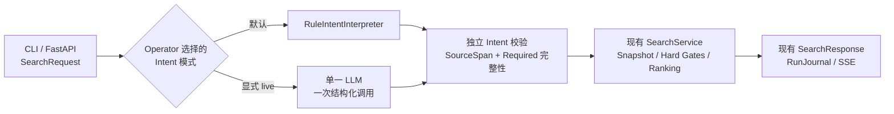

# Glodex M1c 真实 LLM Intent 安全接入规格

| 字段 | 值 |
|---|---|
| Spec ID | `GLO-SPEC-003` |
| 版本 | `0.1.1` |
| 状态 | Approved |
| 里程碑 | M1c：单一真实 LLM Intent 适配器 |
| 实现候选 | `GLO-P1-001` |
| 父规格 | [`GLO-SPEC-000`](../000-glodex-mvp/spec.md)、[`GLO-SPEC-001`](../001-glodex-m1-api/spec.md)、[`GLO-SPEC-002`](../002-glodex-m1b-provider/spec.md) |
| 创建日期 | 2026-07-29 |
| 最后更新 | 2026-07-29 |
| 批准日期 | 2026-07-29；`v0.1.1` 勘误于 2026-07-29 批准 |

## 1. 文档目的与权威边界

本规格定义 Glodex 第一次在用户 Run 内调用真实 LLM 时，Intent 阶段必须表现出的
产品行为和安全边界。M1c 只证明一个窄的垂直切片：

LLM 是 `IntentInterpreter` 端口后面的不可信适配器，不是业务真相源、搜索执行器、
推荐理由生成器或 AgentLoop。

父规格是基线；本规格获批后，只有下面两项明确修订在 M1c live mode 内优先于
父规格，其余条款继续由父规格约束：

1. `GLO-SPEC-002` 第 4 节“只有 Capture 可出站”修订为：只有独立 Capture 和
   Operator 显式启用的单一 LLM Intent adapter 可以访问各自批准的固定目标；
2. `GLO-SPEC-000` 的确定性要求继续完整适用于默认 Rule/Fake 和 LLM 之后的领域
   管线；真实远程模型本身不承诺跨调用返回相同 Intent。

`GLO-SPEC-000 v0.1.3` 与 `GLO-SPEC-002 v0.2.2` 已记录“M1c 批准包”修订，
并与本规格于 2026-07-29 一同生效。

除上述两项外，权威顺序仍为：
`已批准父 Spec > 本 Spec > 已接受 ADR > Plan/Tasks > PNG 参考材料`。
默认 Rule 组合、Capture 之外的 Catalog、domain、ranking、API transport 和 SSE
投影仍不得联网。

Provider SDK、HTTP 细节和代码布局进入 Plan；产品边界、外发数据、失败语义与
验收条件由本规格冻结。

## 2. 问题与目标

### 2.1 当前问题

M0 已用 `RuleIntentInterpreter` 证明 Required、Preferred、连续 `source_span` 和
fail-closed 语义；M1a 已把同一个 `SearchService` 暴露为 FastAPI 与 SSE；M1b 已
接入真实商品数据。但当前还没有证明：

- 真实模型能否在不改写公共 DTO 的前提下实现现有 `IntentInterpreter`；
- prompt injection、模型幻觉、漏字段或恶意结构是否会穿过领域边界；
- 模型漏掉预算、品类、库存或排除项时，系统是否会错误放宽硬条件；
- 凭据、query、prompt、原始响应、思维链和 Provider 错误是否会泄漏；
- 默认离线、确定性门禁能否与独立 live smoke 共存。

现有 `validate_interpreted_request()` 能验证模型已经返回的 criterion，却不能完整
证明模型没有遗漏查询中明确、且当前规则词法可以识别的 Required。仅把 LLM 输出
交给现有 validator 不足以构成 M1c 的信任边界。

### 2.2 M1c 目标

M1c 交付“真实 LLM Intent 安全接入证明”，而不是自然语言能力全面升级：

1. 默认继续使用 Rule Intent，现有行为与 Golden 不变；
2. Operator 可在进程组合阶段显式启用固定的 DeepSeek 配置；
3. 一个已建立的 live Run 至多进行一次非流式、无工具的结构化模型调用；
4. 模型输出必须映射为现有 `InterpretedRequest`，并接受应用层独立校验；
5. 当前规则词法能识别的 Required 必须被模型完整、等值保留；
6. 有效 Intent 之后完整复用现有 Snapshot、金额、硬门、排序、Evidence、终态和
   SSE；
7. 默认自动化使用生产 adapter + Fake transport 且禁网，另以一次显式 live smoke
   证明真实链路。

M1c 的价值是建立可替换、可测试的模型信任边界，而不是宣称模型已经理解任意购物
语言。

## 3. 范围

### 3.1 In Scope

- 一个批准的 hosted LLM Provider、一个固定模型和一个固定 operation；
- 现有 `zh-CN`、`SearchRequest`、Intent DTO 与有限语义表；
- `IntentInterpreter` 的一个真实模型适配器，以及注入该生产适配器下方的确定性
  Fake transport；
- Operator 级、进程组合时显式启用 live LLM；
- CLI 与 FastAPI 复用同一个组合规则；HTTP 请求体不能选择模型；
- 每个 live Run 至多一次非流式模型调用；
- 严格结构化输出、未知字段拒绝和有界响应；
- 现有 source span、语义、分区校验；
- 当前受支持 Required 的确定性完整性校验；
- prompt injection、拒答、超时、传输和非法响应的安全失败；
- 凭据、query、prompt、响应、日志、事件和 Git 边界；
- 默认离线门禁与独立人工 live smoke；
- 文档披露 query 会发送给所选模型 Provider。

### 3.2 Out of Scope

- 扩大语言、品类、同义词，或增加翻译、Query 改写与澄清对话；
- AgentLoop、Planner、tool calling、子 Agent、多模型路由/fallback/retry；
- request-time 商品联网、网页搜索、RAG、搜索基础设施或长期记忆；
- LLM 生成商品事实、价格、库存、Evidence、排序或最终推荐理由；
- 新 UI/公开协议、训练/自托管、持久任务、生产认证、计费或公网 SLA；
- 通用 Model Gateway、Provider registry、prompt registry、缓存及任何仅为未来准备的
  抽象或占位实现。

以上能力不能以占位接口、隐藏配置、可选依赖或“以后会用”的空壳进入 M1c。

## 4. 继承且不得破坏的不变量

1. `SearchRequest`、`SearchResponse`、CLI JSON、退出码、三个 HTTP 端点和七种
   `glodex.event.v1` 事件不变；
2. LLM 只产生待校验 Intent，不能绕过 `SearchService`；
3. 金额、汇率、预算、库存、费用完整性、商品本体和 Evidence 硬门不变；
4. Required 不得被模型遗漏、降为 Preferred、改值或凭空增加；
5. Preferred 只能影响硬门后的排序，不能改变候选成员；
6. 每个 criterion 继续绑定 trimmed query 上的半开 Unicode code-point span；
7. 模型输出在进入 Catalog 前由应用层重新验证，prompt 或 Provider schema
   不能替代该验证；
8. `NO_MATCH`、`FAILED`、RunJournal 单终态和 SSE 投影语义不变；
9. LLM 不读取 snapshot、商品、Offer、Evidence、Thread ID、Run ID 或用户身份；
10. 默认 Rule/Fake 组合保持零模型调用、禁网和可重复；
11. M1b Capture 仍是独立 Operator 链路，不与 LLM 请求串联；
12. 给定同一原始 `SearchRequest`、已验证 `InterpretedRequest`、snapshot、业务
    配置和算法实现/版本，后续领域投影继续确定；
13. 真实远程模型跨次输出不承诺逐字或逐结构一致，不得伪称 temperature 设置能提供
    M0 级确定性；
14. API/SSE 不输出 prompt、原始模型响应、思维链、凭据、token 或第三方正文；
    现有 `interpreted_request.source_span.text` 摘要仍按父合同进入
    `SearchResponse` 与 `STATE_SNAPSHOT`。

## 5. 已冻结的产品决策

| ID | 决策 |
|---|---|
| `M1C-D-001` | Rule 仍是默认；`demo` 与默认 API 永远离线，只有 `search --live-intent` 和独立 live API factory 可显式启用。 |
| `M1C-D-002` | 目标固定为第 14 节 DeepSeek 配置；请求、query、header 不能修改 model、origin、operation 或 schema。 |
| `M1C-D-003` | 每个 live Run 至多一次非流式、无工具请求；不 retry、fallback、缓存或级联模型。 |
| `M1C-D-004` | 动态外发只允许 trimmed query 与 locale；不发送 snapshot、商品、结果、身份、Thread 或 Run 数据。 |
| `M1C-D-005` | adapter 严格解析并重建现有 Intent，且自行写入固定 `parser_version`。 |
| `M1C-D-006` | `rules-zh-cn-v1` Required baseline 必须与模型 Required 等值；遗漏、降级、冲突或新增均失败。 |
| `M1C-D-007` | baseline/模型故障直接形成可信 `FAILED`，Catalog/Ranker 零调用；不修补或回退 Rule。 |
| `M1C-D-008` | 不保存或记录完整 query、prompt、原始响应、思维链、凭据或第三方错误正文。 |
| `M1C-D-009` | 默认门禁使用生产 adapter + Fake transport 且离线；真实 smoke 独立、显式、仅使用非敏感 query。 |
| `M1C-D-010` | 只增加固定 DeepSeek adapter 与窄 transport；不增加通用兼容层、registry、路由、编排框架或未来占位层。 |

## 6. 术语

| 术语 | 含义 |
|---|---|
| Live LLM mode | Operator 显式选择、允许一个批准模型目标出站的进程组合。 |
| Required baseline | 固定 `rules-zh-cn-v1` 语义策略对同一 query 可确定识别出的 Required 集合。 |
| Completeness check | 证明 LLM Required 与 Required baseline 等值，且没有遗漏、降级、冲突或新增。 |

## 7. 运行流程

默认 CLI/API 继续使用 Rule，不读取模型配置或访问模型网络。显式 live 模式在接收
请求前完成本地 preflight；合法请求建立 Run 后，先形成 Required baseline，再进行
一次模型调用。只有通过结构、span、语义、分区与完整性校验的 Intent 才进入现有
Catalog 管线。任一步失败均在 `intent` 阶段闭合，且不 retry、不 fallback。

Query 中的“忽略 schema”“切换 endpoint”“调用工具”或伪造 JSON 都只是数据，
不能改变固定请求、调用次数或本地校验。

## 8. 模型输入与输出信任合同

### 8.1 输入 allowlist

一次模型请求的动态用户数据只允许：

- `query`：已经由 `SearchRequest` trim 且长度不超过现有 2,000 code points；
- `locale`：M1c 固定为现有 `zh-CN`。

静态内容只允许批准的 system instruction 与结构化 schema。不得加入：

- snapshot/version、Product、Offer、Evidence 或搜索结果；
- `run_id`、`thread_id`、IP、header、cookie 或用户标识；
- 本地路径、环境、secret、日志、历史会话或长期记忆；
- Capture 原始数据或 Provider 凭据。

README 和 live 入口必须明确披露完整 query 会发送给模型 Provider，禁止在 smoke
query 中放入敏感信息。

### 8.2 严格结构化输出

模型响应只能表达现有变体：

- Required：`budget_max`、`target_category`、`stock_required`、`exclusion`；
- Preferred：`preferred`；
- 每项包含该变体所需值，以及 `start`、`end`、`text` source span；
- collection 必须有界，字段、类型和 discriminant 必须精确；
- amount 以可精确转换为 `Decimal` 的十进制文本表达；
- currency 只能是现有大写三位代码或 `null`；
- 业务 JSON 的额外字段、未知变体、重复核心约束、非有限数字和模型自报
  `parser_version` 均拒绝。

Provider 的 structured-output 功能只是第一层约束。adapter 必须把响应视为不可信
数据，并由应用层构造新的领域对象；不得反序列化任意类或执行模型返回内容。

DeepSeek 的 JSON Output 只用于约束 JSON 语法，不视为严格 JSON Schema。响应必须
只有一个 choice、非空 `message.content` 且 `finish_reason == "stop"`，然后通过
本节的精确字段解析；空 content、额外 choice、tool call、未知字段或其他
`finish_reason` 均归入 `intent.provider-response-invalid`，且不重试。

### 8.3 SourceSpan 与语义校验

每个 span 必须：

1. 使用 trimmed query 上的 Unicode code-point 半开区间；
2. 满足 `query[start:end] == text`；
3. 绑定当前领域批准的正向/否定语义；
4. 不把 Preferred 放进 Required，或把 Required 放进 Preferred；
5. 通过现有 `validate_interpreted_request()`。

M1c 不以模型置信度、自然语言解释或第二次模型判断替代这些条件。

### 8.4 Required 完整性

应用层必须在模型调用前，使用固定 `rules-zh-cn-v1` 语义策略独立取得同一 query
的 Required baseline。若 baseline 因否定/多重/非法预算、多正向品类或其他已知
歧义无法安全形成，Run 在 `intent` 阶段返回 `FAILED`，模型、Catalog 与 Ranker
调用均为零。

baseline 可形成时，再与已经通过结构和 span 校验的 LLM Required 比较：

- variant、规范化 value、金额、币种和 source span 必须等值；
- baseline 中任一项缺失，判定失败；
- baseline Required 被放到 Preferred，判定失败；
- 同一 span/value 冲突，判定失败；
- LLM 新增 baseline 不存在的 Required，判定失败；
- 不自动合并、修补、补齐或回退 Rule。

比较前双方按 `(source_span.start, source_span.end, kind, canonical value)` 排序，
因此仅 collection 顺序不同不构成失败；通过后的公开 Intent 仍按 source span
顺序输出。baseline 策略变更必须产生新的 parser revision，不能静默改变
live 接受条件。

该检查只覆盖当前已批准规则词法，不借机扩张自然语言、品类或同义词范围。

### 8.5 稳定失败分类

本地 preflight 发生在 Run 之外，不使用 `SearchResponse.issues`：

- CLI live 配置非法返回现有 `RequestRejected`、field=`intent`、
  code=`INTENT_LIVE_CONFIG_INVALID`、exit `2`；
- CLI credential 缺失返回 `RequestRejected`、field=`intent`、
  code=`INTENT_LIVE_CREDENTIALS_MISSING`、exit `2`；
- live API factory 配置非法时以相同安全 code 启动失败，不监听端口，也不新增
  HTTP 错误合同。

已建立 Run 内的新公开 issue code 固定为：

- `intent.provider-unavailable`；
- `intent.provider-response-invalid`；
- `intent.required-baseline-failed`；
- `intent.required-incomplete`。

其中认证/限流/超时/连接/redirect/非成功状态统一为
`intent.provider-unavailable`；M1c 不为单一 Provider 建立细粒度错误分类框架。

现有 `IntentIssueCode` 与安全 `intent.ambiguous-*` / `intent.unsafe-*` 继续允许。
公开输出不得包含 endpoint、credential、Authorization、prompt、完整 query、模型
原文、第三方 response body、traceback 或底层异常文本；现有、经过验证的
`source_span.text` 摘要不属于新增泄漏。

## 9. 启用、配置与资源边界

1. 默认组合不读取 `DEEPSEEK_API_KEY` 或 `.env`；`demo` 与默认 API factory 永远
   Rule，只有 `search --live-intent` 与独立 live API factory 可以启用；
2. 请求、query、header 和 SSE cursor 不能修改第 14 节固定目标；
3. 缺失/空 credential 或非法本地配置在 Run 外 fail closed，零外呼、零 Run；
4. 每个 Run 至多一次调用；不 retry、streaming、tool call、fallback 或缓存；
5. LLM total deadline 必须大于 0 且严格小于 effective API
   `run_timeout_seconds`，collection、字符串和输出 token 必须有固定上限；
6. credential 只存在于 transport 边界，不进入 service、RunJournal、事件或公开 DTO。

第 14 节冻结具体 Provider、model、operation、deadline、body 与 token 常量；
公共请求不能提供或覆盖任一常量。

## 10. P0 功能需求

| ID | 需求 | 失败或降级行为 |
|---|---|---|
| `GLO-M1C-P0-001` | Rule 是默认模式；live LLM 只能由 Operator 通过固定 DeepSeek 配置显式启用。 | 未启用时读取模型配置、导入 live transport 或发生模型调用，M1c 失败；用户输入能够切换模式或目标时 fail closed。 |
| `GLO-M1C-P0-002` | 每个已建立 live Run 至多向固定模型目标发送一次有界、非流式、无工具请求。 | pre-run 拒绝必须零调用；redirect、retry、第二模型、tool call 或额外 endpoint 一律拒绝。 |
| `GLO-M1C-P0-003` | 严格解析模型结构并重新构造现有 `InterpretedRequest`；adapter 自己写入安全 `parser_version`。 | 非法 JSON/schema、未知字段/变体、超限、类型或金额错误产生安全 `FAILED`，不得保留原始响应。 |
| `GLO-M1C-P0-004` | 应用层先形成版本化 Required baseline，再独立验证 source span、语义、Required/Preferred 分区和完整性。 | baseline 不安全时模型/Catalog/Ranker 零调用；遗漏、降级、冲突、新增 Required 或伪造引用时 Catalog/Ranker 零调用并返回 `FAILED`；不修补、不 fallback。 |
| `GLO-M1C-P0-005` | 有效 Intent 完整复用现有 Snapshot、金额、hard gates、ranking、Evidence、终态、CLI、API 和 SSE。 | LLM 影响候选事实、价格、库存、Evidence、最终 guard 或公共合同，M1c 失败。 |
| `GLO-M1C-P0-006` | 默认自动化使用生产 adapter + Fake transport 且禁网；独立 live smoke 使用非敏感 query 验证一次真实调用和完整搜索闭环。 | 默认门禁读取真实凭据/联网，或 live 证据泄漏本次完整 query、prompt、响应、secret 时，M1c 失败。 |

## 11. Given-When-Then 验收场景

### `M1C-AC-001` 默认行为与全部父里程碑不变

**Given** 未显式启用 live LLM，且模型环境变量已从测试进程移除

**When** 执行普通 CLI、FastAPI/SSE 与完整 M0/M1a/M1b 门禁

**Then** 使用 Rule Intent、模型调用为零，公共 DTO、Golden、终态、事件和 Capture
行为保持通过。

覆盖：`GLO-M1C-P0-001`、`005`、`006`

### `M1C-AC-002` 合法结构化 Intent 完成搜索

**Given** 一个合法 SearchRequest，以及注入生产 LLM adapter 下方、只返回当前受
支持 Required/Preferred 与正确 source span 的确定性 Fake transport

**When** 通过 live composition 执行 CLI 与注入同一 service 的 FastAPI Run

**Then** 每个 Run 恰好一次模型调用，Intent 校验通过，Catalog 恰好执行一次；
有合格候选时 Ranker 恰好一次并可 `COMPLETED`，无合格候选时 Ranker 零次并可信
`NO_MATCH`；SSE 仍使用现有事件。

覆盖：`GLO-M1C-P0-002`–`005`

### `M1C-AC-003` Pre-run 与 Query injection 不能改写调用边界

**Given** 一个已通过 live 配置 preflight 的 composition

**When** 分别提交空 query、非法 locale/currency/top_k、未知字段，以及包含切换
model/origin、忽略 system/schema、泄漏 secret、调用工具或重复调用指令的合法
query

**Then** 非法 SearchRequest 沿现有 CLI/API pre-run 合同拒绝，零 Run、零模型、
零 Catalog/Ranker；合法 injection query 只作为数据进入固定请求，目标、schema、
调用次数和禁用工具规则不变，模型若返回非法内容则 Run 安全 `FAILED`。

覆盖：`GLO-M1C-P0-001`–`004`

### `M1C-AC-004` Provider 与响应故障在 Intent 阶段闭合

**Given** timeout、连接失败、认证拒绝、限流、redirect、非成功状态、超限或不完整
body、非法 JSON、未知字段、错误类型、重复约束或 tool call 的逐项故障注入

**When** 执行一个已建立 live Run

**Then** request count 不超过 1，Run 返回安全 `FAILED`，Catalog/Ranker 调用为零，
API 在 LLM deadline 内提交业务 `FAILED`，SSE 使用既有 `STATE_SNAPSHOT` →
`RUN_ERROR` 而不是 `ABORTED`；公开 issue、日志和新增事件字段不含凭据、完整 query、
prompt、响应正文、endpoint 或异常文本。

覆盖：`GLO-M1C-P0-002`–`004`、`006`

### `M1C-AC-005` Required 遗漏或改写必须失败

**Given** 当前 `rules-zh-cn-v1` 可识别的预算、单一品类、库存或排除项 query

**When** 生产 adapter 下方的 Fake transport 分别让模型遗漏该项、将其降为
Preferred、修改值/span、返回冲突项或新增另一个 Required

**Then** 结构/完整性边界拒绝输出，Catalog/Ranker 调用为零，Run 为 `FAILED`，
系统不回退 Rule，也不静默放宽用户条件。

**And Given** 否定/多个/非法或不支持的预算，以及多个正向品类使 baseline 无法安全
形成

**When** 执行 live Run

**Then** 模型、Catalog、Ranker 调用均为零，Intent 阶段以稳定 code `FAILED`。

覆盖：`GLO-M1C-P0-003`–`005`

### `M1C-AC-006` 离线门禁与真实 smoke 分轨

**Given** 完整离线门禁已经通过，Operator 单独提供固定 DeepSeek 配置与真实凭据，并使用
README 披露的非敏感示例 query

**When** 执行一次真实 live Intent 搜索

**Then** 只有一个批准模型请求，返回 Intent 通过独立校验，搜索终态为
`COMPLETED` 或可信 `NO_MATCH`；验证记录只保存 Provider/model、调用数和安全终态，
不保存本次完整 query、prompt、响应或 secret；README 可以公开固定的非敏感
示例 query。

覆盖：`GLO-M1C-P0-002`–`006`、`GLO-M1C-NFR-002`、`004`、`005`

## 12. 非功能需求

| ID | 要求 | 验证方式 |
|---|---|---|
| `GLO-M1C-NFR-001` | **兼容与默认离线**：Rule 为默认，M0/M1a/M1b 全门禁和公共合同不变；普通进程零模型网络与凭据读取。 | 完整父门禁、fresh-process import/socket spy、DTO/OpenAPI/SSE/CLI Golden。 |
| `GLO-M1C-NFR-002` | **安全与隐私**：动态外发只含 query/locale；secret、完整 query、prompt、原始响应、CoT 和第三方正文不得进入日志、Git、错误或新增事件字段。现有已验证 `source_span.text` 继续进入 SearchResponse/STATE_SNAPSHOT。 | fake transport 捕获 allowlist、stdout/stderr/log/event 扫描、Git inventory。 |
| `GLO-M1C-NFR-003` | **硬约束保真**：当前受支持 Required 的遗漏、降级、冲突、新增和伪造 span 接受率为 0；非法 Intent 进入 Catalog/Ranker 的次数为 0。 | 表驱动 mutation/边界测试、调用 spy、正反向 traceability。 |
| `GLO-M1C-NFR-004` | **单 Run 资源与成本有界**：pre-run 为 0 调用，live Run 至多 1 调用；LLM deadline 严格小于 API Run timeout，并有 string/token/collection 上限，无 retry/tool/stream/cache。 | fake clock/transport、边界值与 one-more 测试、请求清单断言。 |
| `GLO-M1C-NFR-005` | **诚实的可复现性**：生产 adapter + Fake transport 与默认门禁确定；真实模型不承诺跨次同输出，但同一 SearchRequest、已验证 Intent、snapshot、业务配置和算法实现/版本的下游投影保持确定。 | Fake 重复运行、既有 determinism/Golden、live 文档与 verification 审查。 |
| `GLO-M1C-NFR-006` | **架构隔离**：模型 SDK/HTTP 只在批准 adapter/transport 与 composition root；domain/application 不依赖具体 Provider，API/SSE 不解析模型协议。 | import/AST boundary、dependency inventory、完整 type/lint/test gate。 |

## 13. 验证分轨

### 13.1 默认自动化

默认自动化必须完整回归 M1b，并在移除模型 credential、代理且禁用真实 socket 的
环境中运行。测试使用生产 adapter 下方的确定性 Fake transport 与
Provider-shaped response，不得用 Fake interpreter 绕过生产解析。architecture、
security、unit、contract、acceptance 必须覆盖精确 `6 P0 / 6 AC / 6 NFR`，无
skip/xfail；具体 runner 与执行顺序进入 Plan。

### 13.2 独立 live smoke

live smoke 只能在完整离线门禁通过后由 Operator 显式执行。它必须：

- 使用第 14 节固定 DeepSeek 配置和显式 secret 注入；
- 使用文档化、非敏感 query；
- 证明恰好一次模型调用；
- 复用生产 adapter、validator、SearchService 与现有 CLI/API 合同；
- 接受 `COMPLETED` 或可信 `NO_MATCH`；
- 不把本次完整 query、prompt、原始响应、secret 或 live artifact 提交到 Git；
- 不把一次 smoke 写成质量、可用性、延迟、成本或确定性 SLA。

## 14. Provider / Model 批准门禁

M1c 只批准下面一个固定配置；它是文档和代码常量，不是运行时 profile 系统：

| 项目 | 冻结值 |
|---|---|
| Provider / Model | DeepSeek Open Platform / `deepseek-v4-flash`。这是固定请求 ID，但接受 Provider 在同一 ID 后更新后端的风险，不宣称模型输出确定。 |
| Operation | `POST /chat/completions`；精确发送 `model="deepseek-v4-flash"`、`stream=false`、`thinking={"type":"disabled"}`、`response_format={"type":"json_object"}`、`temperature=0`、`max_tokens=1024`、`tool_choice="none"`；省略 `tools`、`reasoning_effort`、user ID、logprobs 与批量字段。静态 system instruction 必须包含单词 `json` 和一个目标结构示例。 |
| Origin / Auth | 只允许 `https://api.deepseek.com`，不跟随 redirect、不接受可配置 `base_url`；使用 `Authorization: Bearer $DEEPSEEK_API_KEY`。 |
| Credential | live 入口只读取进程环境 `DEEPSEEK_API_KEY`，拒绝缺失、空值或换行；不自动读取 `.env`，不得提交、打印或写入 artifact。 |
| Activation | CLI 仅 `search --live-intent`；`demo` 与默认 API factory 永远 Rule；API 仅独立 live factory 可启用。 |
| Data handling | 动态外发只有 trimmed query 与 `zh-CN`。README 必须说明 DeepSeek 会接收完整 query；只允许本地 Demo 使用非敏感内容，不发送用户 ID。项目不承诺控制 DeepSeek 的训练、地域或保留策略。 |
| Resource bounds | 每个 Run 最多 1 次调用；覆盖连接、TLS、上传、等待与完整读取的 total deadline 为 `15s`，且 live API `run_timeout_seconds > 15`；完整 decoded response body 最大 `65,536` bytes；输出最多 `1024` tokens；业务 JSON 中每个字符串最多 `2,000` code points，Required 最多 `10` 项、Preferred 最多 `4` 项。 |
| Response envelope | `choices` 恰好一项且 `index == 0`；`finish_reason == "stop"`；`message.content` 是非空字符串；`tool_calls` 不存在或为空；`reasoning_content` 不存在、为空或 `null`。DeepSeek envelope 的其他元数据不进入业务 DTO。 |
| Parser identity | adapter 固定写入 `deepseek-intent-v1`；schema、prompt、baseline 或 DeepSeek 配置行为改变时人工升级该常量，不生成动态指纹。 |
| Live example | `推荐 800 美元以内、有库存、适合出差的轻薄本`。这是可公开的非敏感示例，且包含非空 Required baseline。 |

> **已批准勘误（M1c Plan 批准包，2026-07-29 生效）**：`v0.1.1` 为 Resource
> bounds 补入完整 decoded response body 最大 `65,536` bytes，超限映射为
> `intent.provider-response-invalid`。这是对既有“有界响应”的数值补全，不增加
> Provider、调用次数、公开 DTO 或功能范围。

DeepSeek 当前 JSON Output 文档说明 JSON mode 可能返回空 `content`，因此本规格要求
空响应直接失败且不重试。其隐私政策说明输入可能被用于提供、改进或训练技术，并在
中华人民共和国存储/处理；保留期由处理目的、数据类型、敏感性和法律要求决定。
M1c 因此只允许 Operator 在本地对非敏感 query 显式启用。相关依据：
[Chat Completion](https://api-docs.deepseek.com/zh-cn/api/create-chat-completion)、
[JSON Output](https://api-docs.deepseek.com/zh-cn/guides/json_mode)、
[Privacy Policy](https://cdn.deepseek.com/policies/en-US/deepseek-privacy-policy.html?os=..)。

实现上只允许一个 DeepSeek adapter、一个窄 HTTP transport 和现有 composition
root 接线。不得为了“OpenAI-compatible”提前增加基类、SDK wrapper、动态 profile、
Provider registry、模型路由、retry/backoff、缓存、遥测数据库或 prompt 管理系统。

## 15. 进入 Plan 的 Definition of Ready

- [x] Spec 状态改为 `Approved`，记录批准日期；
- [x] 用户确认 M1c 只是安全接入证明，不扩大自然语言覆盖；
- [x] 第 14 节单一 DeepSeek Provider/model 配置已冻结；
- [x] 用户确认 live 模式会把完整 query 发送给该 Provider；
- [x] 用户确认 M1c 仍是本地、单进程、无认证 Demo；
- [x] `6 P0 / 6 AC / 6 NFR` ID 唯一且可追踪；
- [x] Required completeness、失败语义和父规格的两项 amendment 随本规格获批；
- [x] Out of Scope 没有以空接口、可选依赖或通用模型层进入。

## 16. Definition of Done

- [x] 一个固定 DeepSeek adapter 实现同一 `IntentInterpreter` 端口；
- [x] 默认 Rule 组合与全部父里程碑门禁继续通过；
- [x] preflight、单次调用、严格响应、Required completeness 与资源边界自动化通过；
- [x] 所有非法 Intent/Provider 故障在 Intent 阶段闭合，Catalog/Ranker 零调用；
- [x] CLI、FastAPI、SSE 与 SearchResponse 合同不变；
- [x] query disclosure、凭据、日志、事件和 Git 安全检查通过；
- [x] 默认验证先回归完整 M1b，再通过 `6 P0 / 6 AC / 6 NFR`，无 skip/xfail；
- [x] 独立真实 live smoke 成功且 verification 只记录脱敏证据；
- [x] README 只描述真实能力和限制，且没有通用 LLM 平台或 M2 空壳。

## 17. 后续候选

原始架构图中的 AgentLoop、fork、三塔召回、长期记忆、AG-UI、Rubric、Token 预算
和安全护栏没有被删除；它们仍是目标态参考，只是不属于 M1c，后续必须分别走
Spec → Plan → Tasks。

## 18. 变更治理

1. 改变公共合同、终态或 Required 语义，必须先修改本 Spec；
2. 改变 Provider、model、origin、operation、外发字段或调用次数，必须重新批准
   固定配置并更新 contract/live smoke；
3. 扩大语言、品类、同义词或允许模型新增 Required，必须新建语义与评测 Spec；
4. 引入 tool calling、AgentLoop、fallback model、retry 或多 Provider，必须新建
   独立里程碑；
5. 架构图、prompt、SDK 或模型文档不能覆盖本规格，也不能替代运行时校验。
