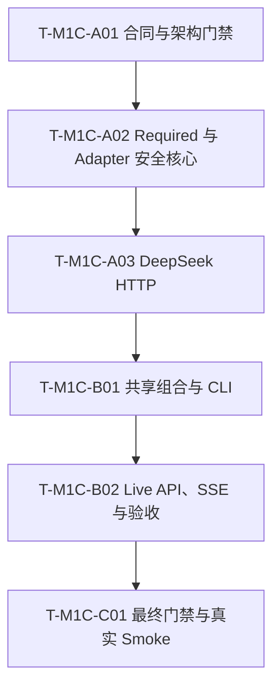

# Glodex M1c DeepSeek Intent 实施任务

| 字段 | 值 |
|---|---|
| Task Set ID | `GLO-TASKS-003` |
| 版本 | `0.1.0` |
| 状态 | Approved |
| 对应规格 | [`GLO-SPEC-003`](./spec.md) v0.1.1（Approved） |
| 对应计划 | [`GLO-PLAN-003`](./plan.md) v0.1.0（Approved） |
| 父基线 | `GLO-SPEC-000 v0.1.3`、`GLO-SPEC-001`、`GLO-SPEC-002 v0.2.2` |
| 创建日期 | 2026-07-29 |
| 最后更新 | 2026-07-29 |
| 批准日期 | 2026-07-29 |

## 1. 执行约定

1. 固定 6 个 `RED→GREEN` 任务，按
   `A01 → A02 → A03 → B01 → B02 → C01` 严格单链执行；不得按错误码、字段或单个
   AC 再拆任务。
2. 每项必须先提交能因目标能力缺失而失败的测试，再写最小实现；不得以 production
   空壳、skip、xfail、宽松断言或 Fake interpreter 制造假进度。
3. M1c 的模型测试必须经过 production `DeepSeekIntentInterpreter`，并在其下方注入
   Provider-shaped bytes 的窄 async callable；只有 HTTP contract 使用
   `httpx.MockTransport`。
4. 中间任务只运行所列定向门禁；`T-M1C-A03` 额外完整回归 M1b；
   `T-M1C-C01` 才运行完整 `verify_m1c.py`。不得用 `-k`、节点选择、`--lf`、
   `--ff` 或自动更新 Golden 缩小门禁。
5. 所有 M1c pytest 子进程显式加载 `-p scripts.verify_m0`，使
   skip/xfail/xpass 直接失败。默认测试移除 `DEEPSEEK_*` 和代理变量并禁用真实网络。
6. 真实 DeepSeek smoke 只能在完整离线门禁通过后人工执行；不进入 pytest、runner、
   fixture、cassette 或 CI。
7. 用户可见行为变化先回 Spec；技术路线、文件预算或依赖变化先回 Plan。Tasks 不得
   自行增加范围。
8. 不提交 key、`.env`、真实 query/response、terminal 输出、live artifact 或 26 张
   本地 PNG 架构图。

统一 pytest 形式：

```bash
uv run --locked python -m pytest -q -p scripts.verify_m0 <固定测试路径>
```

## 2. 保留亮点与不过度实现边界

必须保留：

- Rule 默认离线，live 只能由 Operator 显式启用；
- Rule baseline → 现有 validator → 一次 DeepSeek → 现有 validator → Required
  等值比较；
- 生产 adapter + 窄 Fake transport 的确定性离线验证；
- 固定 Provider/model/origin、单 POST、15s deadline、64 KiB decoded body；
- 继续复用 Catalog、hard gates、ranking、Evidence、CLI、API、SSE 与既有终态；
- exact `6 P0 / 6 AC / 6 NFR`、父门禁优先、独立真实 smoke。

只允许新增以下 3 个 production source file：

- `src/glodex/adapters/deepseek_intent.py`
- `src/glodex/adapters/deepseek_http.py`
- `src/glodex/api/live_app.py`

只允许修改 Plan 已批准的 production/build 路径：

- `src/glodex/domain/intent.py`
- `src/glodex/application/search_service.py`
- `src/glodex/bootstrap.py`
- `src/glodex/cli.py`
- `pyproject.toml`
- `uv.lock`

明确不实现：

- 第四个 production 新文件或第四个行为类型；
- `glodex/llm/`、`providers/`、通用 gateway/registry/router/config/profile/credentials；
- SDK wrapper、第二 Provider、可配置 model/base URL、retry/backoff、fallback、cache；
- tool calling、AgentLoop、RAG、持久化、遥测数据库或 prompt 管理系统；
- 新 Port、公共 DTO、API route/event、配置 schema、receipt 或调用计数 side channel；
- live smoke wrapper、额外 fixture/snapshot/cassette 或新的性能基准。

唯一新增 runtime dependency 是 `httpx`。超出这些边界，当前任务立即停止并返回
Spec/Plan 重新审批。

## 3. 依赖主链



## 4. Phase A：安全核心

### `T-M1C-A01` `[RED→GREEN] [GATE]` 合同、追踪与唯一网络边界

- [x] 状态：已完成
- 依赖：无
- 关联需求（primary/supporting 归属见 §8）：`GLO-M1C-P0-001`、
  `GLO-M1C-P0-006`；
  `M1C-AC-001`、`M1C-AC-006`；
  `GLO-M1C-NFR-001`、`GLO-M1C-NFR-002`、`GLO-M1C-NFR-006`
- 主要路径：
  - `pyproject.toml`、`uv.lock`
  - `scripts/check_traceability.py`、`scripts/verify_m0.py`
  - `tests/conftest.py`
  - `tests/architecture/test_dependency_allowlist.py`
  - `tests/architecture/test_import_boundaries.py`
  - `tests/m1a/architecture/test_m1a_boundaries.py`
  - `tests/unit/scripts/test_verify_m0_runner.py`
  - `tests/m1c/conftest.py`
  - `tests/m1c/architecture/test_m1c_boundaries.py`
  - `tests/m1c/unit/test_m1c_verification.py`
- RED：
  - M1c traceability profile 缺失或不是 exact `6/6/6`；
  - 默认测试环境未清除 `DEEPSEEK_*` 与代理变量；
  - 历史 M0 phase 的 broad `tests` 命令误收集 `tests/m1c`；
  - HTTPX 仍是 dev-only，或 runtime allowlist 能接受第二个新依赖；
  - HTTPX import、`api.deepseek.com`、精确 `DEEPSEEK_API_KEY` 读取或 DeepSeek
    Bearer header 构造能出现在 `deepseek_http.py` 之外；
  - 旧 M0/M1a/M1b inventory 或 architecture 边界因 M1c 放宽。
- GREEN：
  - 仅把既有 `httpx>=0.28,<1` 提升为 runtime dependency 并更新 lock；
  - 增加 M1c exact profile，不重构旧 profile；
  - sanitizer 增加 `DEEPSEEK_` 与批准的代理变量；
  - 只在历史 M0 phase 的 broad `tests` 命令加入
    `--ignore=tests/m1c`；最终 `_M0_STEPS` 与 M1c runner 不加该过滤；
  - architecture 为未来 `deepseek_http.py` 增加 DeepSeek 精确 carve-out，与既有
    eBay Capture carve-out 并列；其他源码继续禁止并同时禁止通用模型层；
  - 创建 M1c 测试目录与最小 Fake bytes/callable 支撑，不创建 production 空壳。
- 完成：
  - lock、traceability、sanitizer 与 import/dependency 定向测试通过；
  - M0/M1a/M1b profile 和默认 import 行为不变；
  - 新 production file 数仍为零。
- 验证：

```bash
uv lock --check
uv run --locked python -m pytest -q -p scripts.verify_m0 \
  tests/architecture/test_dependency_allowlist.py \
  tests/architecture/test_import_boundaries.py \
  tests/m1a/architecture/test_m1a_boundaries.py \
  tests/unit/scripts/test_verify_m0_runner.py \
  tests/m1c/architecture/test_m1c_boundaries.py \
  tests/m1c/unit/test_m1c_verification.py
uv run --locked python scripts/check_traceability.py --profile m1c --mode references
```

### `T-M1C-A02` `[RED→GREEN]` Required baseline、production adapter 与应用层完整性

- [x] 状态：已完成
- 依赖：`T-M1C-A01`
- 关联需求（primary/supporting 归属见 §8）：`GLO-M1C-P0-002`、
  `GLO-M1C-P0-003`、`GLO-M1C-P0-004`、
  `GLO-M1C-P0-005`、`GLO-M1C-P0-006`；
  `M1C-AC-002`、`M1C-AC-003`、`M1C-AC-005`；
  `GLO-M1C-NFR-002`、`GLO-M1C-NFR-003`、`GLO-M1C-NFR-004`、
  `GLO-M1C-NFR-005`、`GLO-M1C-NFR-006`
- 主要路径：
  - `src/glodex/domain/intent.py`
  - `src/glodex/application/search_service.py`
  - `src/glodex/bootstrap.py`
  - `src/glodex/adapters/deepseek_intent.py`
  - `tests/m1c/conftest.py`
  - `tests/m1c/unit/test_live_intent.py`
  - 相关既有 domain/SearchService 测试
- RED：
  - 四个批准的 `IntentIssueCode` 缺失或被通用 Provider enum 替代；
  - Required 仅顺序变化不能匹配，或遗漏、降级、改值、改 span、冲突、新增仍匹配；
  - baseline 抛错/校验失败后仍调用模型、Catalog 或 Ranker；
  - candidate 未先通过现有 validator 就进入完整性比较；
  - Required 不完整后修补、fallback 或进入 Catalog；
  - 默认 `required_baseline_interpreter=None` 路径改变现有调用次数或结果。
  - payload 的动态内容超出 trimmed query 与 `zh-CN`，或固定 model/JSON/no-tool
    字段漂移；
  - user query 被字符串拼接进 prompt，而非作为 JSON data 编码；
  - envelope/business JSON 接受 duplicate/unknown/missing keys、错误 choice/index/finish、
    tool/reasoning 内容；
  - amount 接受 exponent/NaN/Infinity，integer 接受 bool，或 10/4/2000 上限与
    one-more 不精确；
  - parser version 来自模型，伪造 span 通过，或窄 callable 被调用超过一次；
  - adapter 错误泄漏 query、prompt、response、URL 或底层异常。
- GREEN：
  - 增加纯函数 `required_constraints_match()`，只比较已验证 Required canonical
    signature；
  - `SearchService` 增加可选 baseline interpreter，顺序固定为 baseline → validator
    → model → validator → equality → Catalog；
  - baseline/completeness 失败使用稳定安全 code 并在 Intent 阶段闭合；
  - `DeepSeekIntentInterpreter` 只拥有固定 payload、严格解析、领域重建和一个 Run
    内安全异常；
  - adapter 边界仅为 `Callable[[bytes], Awaitable[bytes]]`，不读取 credential、不
    导入 HTTPX，也不增加 Protocol/client class；
  - `build_service()` 只透传可选 baseline 参数，不增加 Port、DTO 或 live builder；
  - 默认 Rule 组合保持单 interpreter 和原有结果。
- 完成：
  - Required 正反向 mutation、adapter schema/边界、Fake repeat、调用 spy 和默认路径
    回归通过；
  - Rule Golden、领域模型和 SearchService 既有测试不变；
  - production 新文件恰好为 `deepseek_intent.py`，新增行为类型恰好为
    interpreter 与 Run 内安全异常。
- 验证：

```bash
uv run --locked python -m pytest -q -p scripts.verify_m0 \
  tests/m1c/unit/test_live_intent.py \
  tests/m1c/architecture/test_m1c_boundaries.py \
  tests/unit/domain/test_intent.py \
  tests/contract/test_intent_interpreter_contract.py \
  tests/contract/test_search_service_phase_b.py \
  tests/contract/test_search_service_phase_d.py
uv run --locked ruff check src/glodex/domain/intent.py \
  src/glodex/application/search_service.py src/glodex/bootstrap.py \
  src/glodex/adapters/deepseek_intent.py
uv run --locked mypy src/glodex
```

### `T-M1C-A03` `[RED→GREEN] [GATE]` DeepSeek 窄 HTTP transport 与 preflight

- [x] 状态：已完成
- 依赖：`T-M1C-A02`
- 关联需求（primary/supporting 归属见 §8）：`GLO-M1C-P0-001`、
  `GLO-M1C-P0-002`、`GLO-M1C-P0-006`；
  `M1C-AC-003`、`M1C-AC-004`；
  `GLO-M1C-NFR-001`、`GLO-M1C-NFR-002`、`GLO-M1C-NFR-004`、
  `GLO-M1C-NFR-006`
- 主要路径：
  - `src/glodex/adapters/deepseek_http.py`
  - `tests/m1c/contract/test_deepseek_http.py`
  - architecture/dependency 边界测试
- RED：
  - key 缺失、空、换行或非法类型未在 Run 外安全拒绝；
  - transport 自动读取 `.env` 或默认进程在未启用时读取 key；
  - URL/method/Authorization/identity encoding 可被输入或环境改写；
  - transport/client 未同时 `trust_env=False`，存在 redirect、retry 或第二 POST；
  - proxy 变量、`SSL_CERT_FILE` 或 `SSL_CERT_DIR` 能改变批准的 client/transport；
  - 15s total deadline 未覆盖完整操作；
  - redirect/non-2xx 的第三方正文读取次数不是 0，或 HTTPX/timeout、非法 encoding
    映射不稳定；
  - `Content-Length` 或 decoded byte 第 65,537 字节未立即拒绝。
- GREEN：
  - `deepseek_http.py` 独占 key、固定 URL、HTTPX、Authorization、deadline/body cap
    和 preflight 异常；
  - builder 只读取进程环境，不加载 `.env`，并返回满足既有窄 callable 的 closure；
  - 每次调用创建并关闭一个 AsyncClient，固定一个无循环 POST，`retries=0`、
    `follow_redirects=False`、transport/client 均 `trust_env=False`；
  - response 以 stream + one-more 有界读取，第三方正文从不进入异常或日志。
- 完成：
  - credential、环境隔离、wire contract、资源 one-more、单次调用和异常映射全部
    通过；
  - 可计数 streaming body 证明 redirect/non-2xx 未开始读取正文；
  - production 新文件新增且仅新增 `deepseek_http.py`，行为类型只新增一个 preflight
    安全异常；
  - 完整 M1b 门禁通过，证明默认离线父行为未受影响。
- 验证：

```bash
uv lock --check
uv run --locked python -m pytest -q -p scripts.verify_m0 \
  tests/m1c/contract/test_deepseek_http.py \
  tests/m1c/architecture/test_m1c_boundaries.py \
  tests/architecture/test_dependency_allowlist.py \
  tests/architecture/test_import_boundaries.py \
  tests/m1a/architecture/test_m1a_boundaries.py
uv run --locked ruff check src/glodex/adapters/deepseek_intent.py \
  src/glodex/adapters/deepseek_http.py
uv run --locked mypy src/glodex
uv run --locked python scripts/verify_m1b.py
```

## 5. Phase B：Activation 与完整搜索闭环

### `T-M1C-B01` `[RED→GREEN]` 共享 live composition 与 CLI

- [x] 状态：已完成
- 依赖：`T-M1C-A03`
- 关联需求（primary/supporting 归属见 §8）：`GLO-M1C-P0-001`、
  `GLO-M1C-P0-002`、`GLO-M1C-P0-005`；
  `M1C-AC-001`、`M1C-AC-002`、`M1C-AC-003`；
  `GLO-M1C-NFR-001`、`GLO-M1C-NFR-004`、`GLO-M1C-NFR-006`
- 主要路径：
  - `src/glodex/bootstrap.py`
  - `src/glodex/cli.py`
  - `tests/m1c/contract/test_live_activation.py`
  - `tests/m1c/acceptance/test_m1c_ac_001_003.py`
- RED：
  - `demo` 接受 `--live-intent`，或普通 `search` 因环境中存在 key 自动启用；
  - 默认 CLI 读取 key、导入 HTTPX/live adapter 或发生网络调用；
  - live preflight 排在 `submit_search()` 之后，或失败仍建立 Run；
  - missing/invalid key 未返回 field=`intent`、批准 code、exit `2`；
  - live composition 被嵌入 CLI，不能由后续 API factory 复用同一 builder；
  - query injection 能改变 target、payload shape、tool/retry 或调用次数。
- GREEN：
  - 只给 `search` 增加 `--live-intent`；
  - `bootstrap.build_live_intent_service()` 使用局部 import，组合 Rule baseline、
    production adapter 与窄 HTTP transport；
  - CLI 顺序固定为 argparse/config → live preflight → `submit_search()`；
  - 普通 CLI import/执行路径保持 Rule、零 key 读取和零 live import；
  - acceptance 使用 production adapter + Provider-shaped Fake bytes，不绕过 parser。
- 完成：
  - 默认、合法 Fake、preflight、pre-run 与 injection 的 CLI 黑盒合同通过；
  - CLI 公共输出、退出码与父 Golden 不变；
  - 不创建 live API 文件或第二个 builder。
- 验证：

```bash
uv run --locked python -m pytest -q -p scripts.verify_m0 \
  tests/m1c/contract/test_live_activation.py \
  tests/m1c/acceptance/test_m1c_ac_001_003.py \
  tests/acceptance/test_cli_walking_skeleton.py \
  tests/acceptance/test_golden_outputs.py
uv run --locked ruff check src/glodex/bootstrap.py src/glodex/cli.py
uv run --locked mypy src/glodex
uv run --locked python scripts/check_traceability.py --profile m1c --mode references
```

### `T-M1C-B02` `[RED→GREEN] [GATE]` 独立 live API、SSE 与六项验收

- [x] 状态：已完成
- 依赖：`T-M1C-B01`
- 关联需求（primary/supporting 归属见 §8）：`GLO-M1C-P0-001`～
  `GLO-M1C-P0-006`；
  `M1C-AC-001`～`M1C-AC-006`；
  `GLO-M1C-NFR-001`～`GLO-M1C-NFR-006`
- 主要路径：
  - `src/glodex/api/live_app.py`
  - `tests/m1c/contract/test_live_activation.py`
  - `tests/m1c/acceptance/test_m1c_ac_001_003.py`
  - `tests/m1c/acceptance/test_m1c_ac_004_006.py`
  - `tests/m1c/nfr/test_m1c_offline_security.py`
  - 相关既有 API/SSE contract 测试
- RED：
  - missing/invalid key 或 `run_timeout_seconds <= 15` 在监听后才失败；
  - live factory 不复用 CLI builder，或 service/app 未共享 clock 与 run-id provider；
  - 默认 `create_app`/API package 导入 live module、读取 key 或改变 OpenAPI；
  - 合法 Fake 的 CLI/API/SSE 不能保持每 Run 一次模型、现有终态与下游次数；
  - Provider/parser/Required 故障进入 Catalog/Ranker，或 API 外层 timeout 先触发；
  - SSE 将业务 `FAILED` 投影为 `ABORTED`，或公开面泄漏 secret/query/prompt/body；
  - AC/NFR 只由 file-level marker 虚报，或同一故障矩阵在 unit/contract/acceptance
    重复实现。
- GREEN：
  - 新增薄 `create_live_app()`，只做本地 preflight、共享 builder 和委托
    `create_app(settings=..., service=...)`；
  - startup 强制 API timeout 严格大于 15s，不做 Provider 探测；
  - AC-001～003 闭合默认、成功 Fake、pre-run 与 injection；
  - AC-004～006 只做公开黑盒代表场景；完整 HTTP/parser/Required 矩阵继续由
    contract/unit 持有；
  - fresh-process、禁网、日志/事件/stdout/stderr/Git sentinel 闭合 NFR；
  - 每个 `@pytest.mark.spec(...)` 放在真正提供证据的 test 上。
- 完成：
  - 8 个批准测试模块与一个 `tests/m1c/conftest.py` 已齐全且无额外测试文件；
  - CLI、API、SSE、OpenAPI、SearchResponse 和父里程碑合同不变；
  - production 新文件总数恰好 3，未出现通用 LLM 基础设施。
- 验证：

```bash
uv run --locked python -m pytest -q -p scripts.verify_m0 \
  tests/m1c/unit/test_live_intent.py \
  tests/m1c/contract/test_deepseek_http.py \
  tests/m1c/contract/test_live_activation.py \
  tests/m1c/acceptance/test_m1c_ac_001_003.py \
  tests/m1c/acceptance/test_m1c_ac_004_006.py \
  tests/m1c/architecture/test_m1c_boundaries.py \
  tests/m1c/nfr/test_m1c_offline_security.py
uv run --locked python -m pytest -q -p scripts.verify_m0 \
  tests/m1a/contract/test_http_api_contract.py \
  tests/m1a/contract/test_sse_contract.py
uv run --locked python scripts/check_traceability.py --profile m1c --mode coverage
uv run --locked ruff check src/glodex tests/m1c
uv run --locked mypy src/glodex
```

## 6. Phase C：最终门禁、文档与真实 Smoke

### `T-M1C-C01` `[RED→GREEN] [DOC] [GATE]` 五步 runner 与脱敏验证

- [x] 状态：已完成
- 依赖：`T-M1C-B02`
- 关联需求（primary/supporting 归属见 §8）：`GLO-M1C-P0-005`、
  `GLO-M1C-P0-006`；
  `M1C-AC-001`、`M1C-AC-006`；
  `GLO-M1C-NFR-001`、`GLO-M1C-NFR-002`、`GLO-M1C-NFR-005`、
  `GLO-M1C-NFR-006`
- 主要路径：
  - `scripts/verify_m1c.py`
  - `tests/m1c/unit/test_m1c_verification.py`
  - `README.md`
  - `specs/003-glodex-m1c-llm-intent/{spec,tasks,verification}.md`
- RED：
  - runner 不先执行完整 M1b，步骤不是固定五步或任一 pytest 未加载 strict plugin；
  - runner 允许过滤、节点选择、skip/xfail、live marker 或 Golden 自动更新；
  - coverage 不是 exact `6/6/6`，或 references/coverage 不能双向闭合；
  - README 未披露完整 query 会发送给 DeepSeek、默认离线、固定限制与独立 smoke；
  - verification 预先声称 live 成功，或保存 query/prompt/response/key/terminal 输出；
  - Git inventory 出现 secret、`.env`、live artifact 或那 26 张本地架构图 PNG。
- GREEN：
  - 新增 fail-fast、固定 cwd/env 的五步 `verify_m1c.py`：
    1. 完整 `verify_m1b.py`；
    2. M1c architecture + NFR；
    3. M1c unit + contract；
    4. M1c acceptance；
    5. M1c exact traceability coverage；
  - README 只说明实际 activation、数据披露、资源边界、失败语义和已知限制；
  - 完整离线门禁通过后，直接执行批准的 CLI smoke，不新增 wrapper 或输出文件；
  - 取得真实合法终态后才创建 `verification.md`，只记录 Provider、model、
    `calls=1`、安全终态和自动证据引用；
  - 创建 `verification.md` 后重跑 offline-security、verification contract 与
    whitespace 检查，确保新证据文件也受泄漏/字段 allowlist 覆盖；
  - 更新本任务状态与 Spec Definition of Done，不加入 M2 占位能力。
- 完成：
  - `verify_m1c.py`、`git diff --check` 和 Git/secret/PNG inventory 全部通过；
  - 真实 production composition 到达 `COMPLETED` 或可信 `NO_MATCH`；
  - “至少一次真实终态 + 至多一个 POST callsite/计数 contract”共同证明
    `calls=1`；
  - Tasks 与 verification 只记录已经取得的证据。
- 离线验证：

```bash
uv run --locked python -m pytest -q -p scripts.verify_m0 \
  tests/m1c/unit/test_m1c_verification.py
uv run --locked python scripts/verify_m1c.py
git diff --check
```

- 独立 live smoke（离线门禁通过后）：

```bash
read -r -s DEEPSEEK_API_KEY
export DEEPSEEK_API_KEY
uv run --locked glodex search --live-intent \
  --query "推荐 800 美元以内、有库存、适合出差的轻薄本" \
  --snapshot m0-v1 --currency USD --top-k 3
unset DEEPSEEK_API_KEY
```

- 写入脱敏 `verification.md` 后的最终复核：

```bash
uv run --locked python -m pytest -q -p scripts.verify_m0 \
  tests/m1c/nfr/test_m1c_offline_security.py \
  tests/m1c/unit/test_m1c_verification.py
git diff --check
```

## 7. 文件与测试预算

| 类别 | 固定预算 | 所属任务 |
|---|---:|---|
| 新 production source | 3 | A02、A03、B02 各一个 |
| 新行为类型 | 最多 3 | A02 两个；A03 一个 |
| 新 runtime dependency | 1（HTTPX） | A01 |
| 新 M1c test module | 8 | A01 两个；A02/A03 共两个；B01/B02 共四个 |
| 新共享 test conftest | 1 | A01，后续只补 Fake data/callable |
| 新最终 runner | 1 | C01 |

测试模块固定为：

1. `tests/m1c/unit/test_live_intent.py`
2. `tests/m1c/unit/test_m1c_verification.py`
3. `tests/m1c/contract/test_deepseek_http.py`
4. `tests/m1c/contract/test_live_activation.py`
5. `tests/m1c/acceptance/test_m1c_ac_001_003.py`
6. `tests/m1c/acceptance/test_m1c_ac_004_006.py`
7. `tests/m1c/architecture/test_m1c_boundaries.py`
8. `tests/m1c/nfr/test_m1c_offline_security.py`

## 8. 需求追踪

Primary 归属必须唯一。`@pytest.mark.spec(...)` 放在提供该 primary evidence 的具体
test 上；AC marker 只进入对应 acceptance test，unit/contract/architecture 不重复
声明 AC。

### 8.1 P0 与主要证据

| ID | Primary task | Primary test module | Supporting gate / manual closure |
|---|---|---|---|
| `GLO-M1C-P0-001` | B01 | `tests/m1c/contract/test_live_activation.py` | B02 default API；C01 父门禁 |
| `GLO-M1C-P0-002` | A03 | `tests/m1c/contract/test_deepseek_http.py` | A02 fixed payload；B02 AC-002/004 |
| `GLO-M1C-P0-003` | A02 | `tests/m1c/unit/test_live_intent.py` | B02 AC-004 公开失败 |
| `GLO-M1C-P0-004` | A02 | `tests/m1c/unit/test_live_intent.py` | B02 AC-005 零下游 |
| `GLO-M1C-P0-005` | B02 | `tests/m1c/acceptance/test_m1c_ac_001_003.py` | C01 完整 M1b 回归 |
| `GLO-M1C-P0-006` | B02 | `tests/m1c/nfr/test_m1c_offline_security.py` | C01 runner 与真实 smoke |

### 8.2 AC 与黑盒归属

| ID | Primary task | Primary test module | Supporting gate / manual closure |
|---|---|---|---|
| `M1C-AC-001` | B01 | `tests/m1c/acceptance/test_m1c_ac_001_003.py` | B02 API/SSE；C01 父门禁 |
| `M1C-AC-002` | B01 | `tests/m1c/acceptance/test_m1c_ac_001_003.py` | B02 API/SSE 完整闭环 |
| `M1C-AC-003` | B01 | `tests/m1c/acceptance/test_m1c_ac_001_003.py` | A02/A03 unit/HTTP 边界 |
| `M1C-AC-004` | B02 | `tests/m1c/acceptance/test_m1c_ac_004_006.py` | A02 parser；A03 HTTP 矩阵 |
| `M1C-AC-005` | B02 | `tests/m1c/acceptance/test_m1c_ac_004_006.py` | A02 完整 mutation table |
| `M1C-AC-006` | B02 | `tests/m1c/acceptance/test_m1c_ac_004_006.py` | C01 真实 smoke 人工闭合 |

### 8.3 NFR 与主要证据

| ID | Primary task | Primary test module | Supporting gate / manual closure |
|---|---|---|---|
| `GLO-M1C-NFR-001` | C01 | `tests/m1c/unit/test_m1c_verification.py` | B01 activation；B02 fresh process |
| `GLO-M1C-NFR-002` | B02 | `tests/m1c/nfr/test_m1c_offline_security.py` | A02 payload；A03 body；C01 Git |
| `GLO-M1C-NFR-003` | A02 | `tests/m1c/unit/test_live_intent.py` | B02 AC-005 |
| `GLO-M1C-NFR-004` | A03 | `tests/m1c/contract/test_deepseek_http.py` | B02 API timeout relation |
| `GLO-M1C-NFR-005` | A02 | `tests/m1c/unit/test_live_intent.py` | C01 determinism/Golden 与 live 文档 |
| `GLO-M1C-NFR-006` | A01 | `tests/m1c/architecture/test_m1c_boundaries.py` | A03 dependency；C01 lint/type |

## 9. Tasks 审批门禁

- [x] Task Set 状态改为 `Approved` 并记录批准日期；
- [x] 用户接受 6 个严格串行 `RED→GREEN` 任务；
- [x] 用户确认 A03 后完整回归 M1b，C01 才运行完整 M1c 门禁；
- [x] 用户确认真实 smoke 只在离线门禁后执行且不保存敏感输出；
- [x] 3 production file / 3 behavior type / 1 dependency 预算未扩大；
- [x] 8 test module + 1 conftest 预算未扩大；
- [x] 没有通用 LLM 层、SDK、registry、retry/cache 或未来占位实现；
- [x] `6 P0 / 6 AC / 6 NFR` 均有主任务和可执行证据；
- [x] 26 张本地 PNG 架构图仍不 stage、不 commit、不 push。
