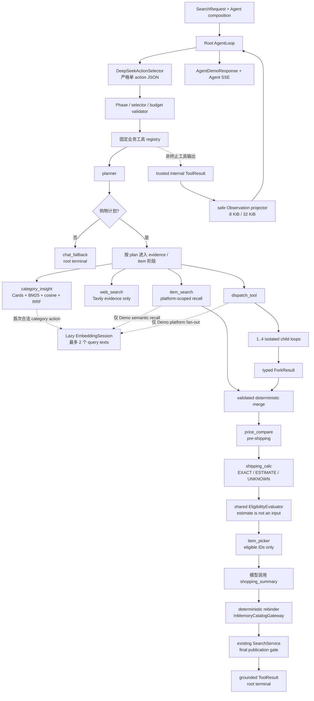

# Glodex M1d 全工具 AgentLoop 技术实施计划

| 字段 | 值 |
|---|---|
| Plan ID | `GLO-PLAN-004` |
| 版本 | `0.1.0` |
| 状态 | Approved |
| 对应规格 | [`GLO-SPEC-004 v0.3.0`](./spec.md)（Approved） |
| 父基线 | [`GLO-SPEC-000`](../000-glodex-mvp/spec.md)、[`GLO-SPEC-001`](../001-glodex-m1-api/spec.md)、[`GLO-SPEC-002`](../002-glodex-m1b-provider/spec.md)、[`GLO-SPEC-003`](../003-glodex-m1c-llm-intent/spec.md) |
| 里程碑 | M1d：九个业务工具 + `dispatch_tool` 的可运行 AgentLoop |
| 创建日期 | 2026-07-29 |
| 最后更新 | 2026-07-29 |
| 批准日期 | 2026-07-29 |

## 1. 计划目标与实现预算

本 Plan 一次交付完整 M1d，不再把九个业务工具拆成后续微型里程碑。最终主链为：

```text
DeepSeek action
  → strict selector validation
  → fixed tool execution
  → trusted ToolResult / safe Observation split
  → bounded next action
  → deterministic picker
  → SearchService final publication gate
```

实施预算固定为：

- Tasks 阶段只能形成 **3 个大任务**，分别对应第 13 节的三个交付块；
- 新增 runtime dependency 为 **0**，继续只使用标准库、现有 `httpx`、FastAPI 和
  Pydantic；
- 只新增一个 M1d application package、四个职责明确的 adapter 模块和独立 Agent
  API，不为九个工具各建一套类层级；
- 工具 registry 是常量映射，精确包含九个业务工具和 `dispatch_tool`，不实现动态
  注册、插件发现或通用 `BaseTool`；
- DeepSeek 继续复用已有固定 HTTP transport；Tavily 与 DashScope 只增加一个
  M1d 专用、固定 endpoint 的 bounded HTTP 模块；
- 既有 `SearchService`、领域金额、Eligibility、Evidence、Ranking 和
  `SearchResponse` 继续是唯一 Canonical 业务真相；
- 默认 CLI、Search API、Search SSE、M1b Capture 和 M1c live Intent 不改变；
- 每个交付块只跑方向性测试；完整父门禁和性能工作负载只在最终执行一次。

超过这个边界，或引入通用 Agent/Provider 基础设施，必须先回到 Spec/Plan 重新审批。

## 2. 当前扩展缝与复用决定

| 现有能力 | M1d 复用方式 |
|---|---|
| `RuleIntentInterpreter` + `validate_interpreted_request()` | `planner` 形成不可被模型改写的 Required baseline 和固定平台计划。 |
| `DeepSeekTransport = Callable[[bytes], Awaitable[bytes]]` | Agent action adapter 复用 `build_deepseek_transport()` 的单次 bounded POST；只新增 action payload/parser 和错误映射。 |
| `LocalSnapshotCatalog` | 加载单一 `m1d-demo-v1` 标准 Snapshot；四个平台在一个 batch 内，不建立四套 loader。 |
| `CatalogBatch` / `aggregate_catalog_batch()` | 每个平台召回的内部结果仍携带完整、已校验 batch；合流后再次使用现有构造校验。 |
| `calculate_landed_cost()`、product/offer gates、`assemble_eligibility()` | 抽取为共享 `EligibilityEvaluator`，由普通 Search 与 Agent 共用。 |
| `SearchService` | `shopping_summary` 通过 run-scoped `InMemoryCatalogGateway` 调用完整 final gate。 |
| `capture` 的 eBay HTTP、mapping、publisher | live eBay item adapter 在受控 worker thread 中执行现有 Capture，再反向加载已发布 Snapshot；不复制 Buy API 协议。 |
| `ApiSettings`、请求体中间件和 M1a SSE 规则 | 复用资源配置与 cursor/retention 语义；新增 Agent 专用 registry/coordinator，不把现有 Search runtime 泛型化。 |
| CLI `_emit()` / 退出码 | 新增独立 `agent-demo` 分支，继续保持 stdout 单行 JSON 和稳定退出码。 |

`SearchService.execute_run()` 目前内联的 pricing + hard-gate 段是唯一需要先抽取的共享
业务缝。聚合阶段仍直接调用现有 `aggregate_catalog_batch()`，以保留
`AGGREGATION_STAGE` 与 `ELIGIBILITY_STAGE` 两个既有错误和计时边界。

## 3. 分层与调用图



依赖方向固定为：

```text
domain
  ↑
application / application.agent
  ↑
adapters + api + agent_bootstrap + cli
```

`domain` 不导入 Agent、HTTP、SSE 或 Provider。`application.agent` 只依赖自身 Port、
现有 application/domain contracts，不导入具体 adapter。

## 4. 先冻结的合同、状态与额度

实现开始时先同时冻结以下两组前置，避免九工具和 fork 反复返工。

### 4.1 模型 selector 与内部输入严格分层

边界 DTO 使用 Pydantic strict/frozen/extra-forbid；内部事实使用 exact frozen
dataclass 或已有领域类型。

模型每轮只能返回：

```text
CallToolAction{tool_name, selector_args}
```

其中 `selector_args` 只包含 Spec 第 6 节允许的少量选择字段。原 query、Required、
Provider、Snapshot、Candidate pool、Evidence、金额、record ref 和 selected IDs
全部由 runtime 从可信状态注入。未知 key、缺 key、coercion、多个 action、自然语言
final 或 Provider-native tool call 都拒绝。

常量 inventory 固定为：

```text
BUSINESS_TOOL_SET = (
  planner, chat_fallback, web_search, category_insight, item_search,
  item_picker, price_compare, shipping_calc, shopping_summary
)
FULL_TOOL_SET = BUSINESS_TOOL_SET + (dispatch_tool,)
TERMINAL_TOOLS = (shopping_summary, chat_fallback)
```

registry 只能由上述常量构造，不从环境、请求或配置文件加载名字。

### 4.2 Agent 状态

`AgentToolState` 使用显式字段而非自由 dict，至少保存：

- 原始 `SearchRequest`、validated Rule Intent、plan、capabilities 和 phase；
- 已执行动作 signature、root/tree 调用账本和剩余额度；
- category/web/item/price/shipping 各 typed result slot；
- ordered `ForkResult`、publication-eligible IDs、picker result 和 terminal；
- safe Observation 累计字节数。

每轮以不可变 replacement 产生下一状态。唯一可变资源拥有者是 root
`RuntimeResources`：

- run-scoped `CandidateStore`；
- 最多两个只读、已 L2-normalize 的 query vectors；
- final `InMemoryCatalogGateway`。

child 只接收不可变 plan/ForkScope、只读 vectors 和自己的状态，不能直接修改父
Candidate Store。父 runtime 在所有 child 完成后按 task 顺序一次性合流。

application 合同同时冻结：

- `AgentExecution`：原子配对 `AgentDemoResponse` 与 immutable safe run record，
  两者 run ID/terminal status 必须一致；
- `AgentRunEvent`：只含阶段、round/tool/scope/child/status/safe code 的内部 typed
  event，不含动态正文；
- `AgentEventObserver`：由 API coordinator 注入的窄同步 observer seam。

Agent service 精确提供：

```text
execute(request) -> AgentExecution
execute_run(request, *, run_id, observer=None) -> AgentExecution
```

CLI 使用 `execute()`；API 使用预分配 ID 的 `execute_run()`。observer/projector
异常只降级 Agent API projection，不能改变业务 runtime、最终 response 或 cleanup。

### 4.3 统一预算与计量

预算对象同时记录 root、child 和全树上限，精确采用 Spec 第 8.2 节：

- root 模型动作/工具执行 `10 / 10`；
- child 总数/并发 `4 / 4`，每 child `1` 次模型动作、`1` 次业务工具、`1` 次 runtime
  return；
- fork depth `2`，全树 DeepSeek `14`、业务工具 `11`、dispatch `2`；
- 除 `item_search` 外每个业务工具全树最多成功一次；单平台 `item_search` 最多一次，
  同一 batch dispatch 的跨平台路径最多四次；
- DeepSeek 单次 `15s / 65,536 decoded bytes / 1024 output tokens`；
- Tavily 全树 `1` 次 Search、最多 `8` results；DashScope request-time 全树 `1` 个
  batch、最多 `2` texts；
- eBay live 全树 `1` 次 auth + `1` 次 Browse、最多 `10` items；
- 所有 Provider 都无 retry、fallback、分页或隐藏 follow-up；
- 单 ToolResult `512 KiB`、Candidate Store `2 MiB`；
- 单 Observation `8 KiB`、全树累计 Observation `32 KiB`；
- child/Agent deadline `45s / 240s`。

大小统一使用 canonical JSON UTF-8 bytes 计量：key 排序、紧凑分隔符、Decimal exact
string、UTC RFC3339。内部结果超限整次失败；不得截断后继续。安全投影与内部结果是
两个不同对象。

无论 `COMPLETED/NO_MATCH/FAILED/ABORTED`、timeout、cancel 或 shutdown，runner 都
在 `finally` 清空 Store、vectors 和 gateway。清理失败只形成安全计数，不改写已提交
终态。

## 5. 共享 Eligibility 与候选事实链

### 5.1 `EligibilityEvaluator`

新增无 I/O、无 Agent 依赖的 module-level 纯函数与 frozen result：

```text
evaluate_eligibility(
  aggregation,
  catalog_batch,
  interpreted_request,
  display_currency
) -> EligibilityEvaluation
```

它只组合现有：

1. 从 validated `InterpretedRequest` 唯一派生 budget 与
   `EligibilityContext`，并完成 exchange-rate 支持校验；
2. `calculate_landed_cost()`；
3. `run_product_gates()`；
4. `run_offer_gates()`；
5. `assemble_eligibility()`。

不新增 evaluator 构造器、依赖注入点或 singleton；`SearchService` 与 Agent 都直接
调用该纯函数。返回值携带 pricing、`EligibilityOutput` 和现有 domain filter
summary。调用方不能
另传一份 budget 或 eligibility context；Candidate merge 后必须先调用现有
`aggregate_catalog_batch()`，再把该 aggregation 交给 evaluator。
`SearchService` 在当前 `ELIGIBILITY_STAGE` 的同一个 `try` 内改为调用它，不改
constructor 或 `bootstrap.py`；journal、公开 Issue、stage before/after、reason count
和终态顺序保持原样。Agent 在 shipping advisory 产生后也调用同一函数；
estimate/unknown advisory 不作为 evaluator 输入。

characterization/parity 测试必须先证明相同 batch/intent 下：

- eligible product/offer identity 完全相同；
- stage before/after 完全相同；
- rejection reason/count 完全相同；
- `COMPLETED/NO_MATCH/FAILED` 和 Golden 不变。

### 5.2 Candidate Store 与稳定合流

Agent manifest 先冻结可信 `platform → provider IDs / record keys` 映射。现有
`CatalogBatch` 本身没有 platform 字段，因此 runtime 只根据这张版本化映射判定记录
归属，不信任模型、Candidate 文本或 embedding sidecar 自报的平台。

每次 `item_search` 返回两个不同层次：

- 给模型的 `Candidate` 安全投影；
- 只给 runtime 的
  `ItemSearchRuntimeResult{candidates, evidence-closed platform_sub_batch}`。

`platform_sub_batch` 只含本平台实际命中的 Product/Offer、它们引用的 Evidence 和所需
FX Evidence，并再次通过 `CatalogBatch` 构造校验。四个 child 不各自返回整个四平台
source batch，避免重复事实、ID 碰撞和无意义占用 `512 KiB / 2 MiB` 额度。

Store 验证 `record_ref → exact product/offer/evidence` 一一对应。合流规则固定为：

1. 验证 platform 与 Planner/ForkScope 一致；
2. 重新执行 Candidate/record ref、batch、金额、schema 和 byte caps；
3. 按 task 顺序，以 `(platform,item_id)` 稳定去重；
4. 最多保留 100 条，形成只读 `ValidatedCandidatePool`；
5. child 不写 Store；父在 `TaskGroup` 完成后原子 merge。

每个 Agent Run 的商品数据模式必须二选一：

- `DEMO_SNAPSHOT`：所有平台子 batch 都来自同一个 `m1d-demo-v1`；
- `LIVE_MARKETPLACE`：只允许本次新建的一个 eBay `capture-*` batch。

CLI `--live-data` 与 Demo `--snapshot` 互斥；Agent API 的模式由进程 factory 固定。
Demo factory 只接受空值或精确 `m1d-demo-v1`，live marketplace factory 不接受用户
指定 Snapshot。runtime 拒绝 Demo/live 混合或多个 source snapshot version，绝不把
不同 Snapshot 直接传给现有 aggregation。

Candidate Store 只从实际保留的 record refs 物化一个 evidence-closed
`evaluation_batch`：按稳定 identity 去重相同 Product/Offer/Evidence/FX，任何同 ID
事实冲突都失败，并要求所有记录保持同一 source snapshot version。Demo 子 batch 在
这里合成一个 `m1d-demo-v1` evaluation batch；live eBay 本身只有一个 source batch。

eBay Capture 反向加载时使用其 source currency `USD`，不把原请求的 `CNY` 或 budget
currency 传给 `LocalSnapshotCatalog`。随后应用层从同一版本化 M1d CNY FX 资产构造
`FxEvaluationView`：只把 FX table/rate/对应 FX Evidence 的 snapshot 与 ID
确定性重绑定到 `capture-*`，不改 Product/Offer、source Evidence 或任何业务事实。
该 view 重新通过 `CatalogBatch` 构造校验后，才执行
`aggregate_catalog_batch() → evaluate_eligibility(..., display_currency=原请求币种)`。
因此缺精确运费/税费的 eBay item 得到真实 gate rejection/`NO_MATCH`，不会因 Capture
原表只有 USD 而误报 `eligibility.pipeline-failed`。

### 5.3 final rebinding 与 SearchService

`shopping_summary` 内，rebinder 严格执行 Spec 第 5.5 节的
Snapshot/Product/Offer/Evidence/FX ID 重建。它同时返回不可变
`RebindingMap{candidate_id → rebound_product_id / rebound_offer_ids}`，保留原始 source
URI、captured_at、事实和 field path，统一使用 M1d CNY FX table；碰撞、事实冲突、
缺 Evidence 或 closure 失败即 fail closed。

重绑定 batch 先通过现有 `CatalogBatch` 构造验证，再由只读
`InMemoryCatalogGateway` 提供给一个使用 `RuleIntentInterpreter` 的现有
`SearchService`。最终请求只把原请求的 `snapshot_version` 写为 run-scoped version；
query、locale、display currency、top_k 和 Required baseline 不改。

终止工具必须调用：

```text
SearchService.execute_run(
  derived_request,
  run_id=agent_run_id,
  observer=None
)
```

不能调用会另分配 Run ID 的 `search()/execute()`，也不能把内部 Search journal
投影到 Agent SSE。`InMemoryCatalogGateway.load()` 必须精确校验请求的 run-scoped
snapshot version、display currency 和 budget currency，再返回唯一 frozen batch。

final guard 再通过 `RebindingMap` 断言：

- `SearchResponse.results` 的 canonical product IDs 是映射后 picker IDs 的非空子集；
- picker IDs 来自当前 publication-eligible IDs；
- 用户可见金额、理由和 Evidence 都来自 Canonical response；
- Web evidence 与 shipping estimate 只进入独立 advisory 字段。

picker 非空而 final Search 返回 `NO_MATCH`、空 results 或映射外 ID 时必须失败，不能
把 final gate 漂移伪装成可信 `NO_MATCH`。`AgentDemoResponse.selected_product_ids`
只从最终 Canonical `SearchResponse` 生成，不回显 rebinding 前的 candidate ID。

## 6. 九个业务工具与 dispatch 的实现落点

| 工具 | 实现与事实来源 | 关键失败边界 |
|---|---|---|
| `planner` | `SearchRequest` + validated Rule Intent + composition capabilities；固定 alias 和 stage/ForkScope reducer。 | Required 变化、未配置 live 平台或 unsupported intent 使用稳定 reason；不请求网络。 |
| `chat_fallback` | 本地 reason-code 模板，1–2 句购物引导。 | 只能处理 Planner 的 unsupported reason；模型/工具故障不能转 fallback。 |
| `web_search` | 窄 Tavily adapter，固定 evidence query、general/basic、最多 8 条；只保留 source ID/domain/type/date/短 snippet。 | 未启用、redirect、状态/body/schema/条数超限整体失败；页面价格永不进入商品事实。 |
| `category_insight` | 版本化 Cards；NFKC/lower/CJK bigram、BM25、exact cosine、RRF 和固定 reducer。 | DashScope 不可用不降级为 lexical-only；空召回为 typed `NO_INSIGHT`。 |
| `item_search` | Demo：单一 Snapshot + platform-scoped exact cosine；live eBay：复用 M1b Capture/mapper/publisher/load。 | 四平台 enum、同平台不重复、record ref/batch 不一致或 Provider 未配置时失败。 |
| `price_compare` | `Decimal`、M1d CNY FX Evidence、pack size；稳定 pre-shipping 排序。 | 缺/非法 FX 为 `UNKNOWN_FX`，不猜汇率、不声称无 Evidence 的同 SKU。 |
| `shipping_calc` | source exact components + 固定 CN shipping/duty ruleset，输出 ETA/tier/status。 | Unknown 不补零；estimate 明示 version/date，不能放宽 publication gate。 |
| `item_picker` | Required gate 后的 eligible IDs + Preferred + 有 Card/source 约束的软信号。 | selector 只能给 `max_items`，不能提交 ID；伪造/未观察 ID 接受率为 0。 |
| `shopping_summary` | 工具内部执行 rebinder + in-memory gateway + 现有 `SearchService` + 本地模板。 | 只有 picker 后可调用；每条理由 `<=50` code points；`NO_MATCH` 必须来自 typed empty eligibility；成功返回即 root terminal。 |
| `dispatch_tool` | `asyncio.TaskGroup` + explicit ForkScope + shared tree ledger + typed `ForkResult`。 | 不是业务工具；child 无发布权，越 depth/count/tool/timeout/loop 立即拒绝。 |

deterministic merge、EmbeddingSession、EligibilityEvaluator、Candidate Store 和 rebinder
都是 application runtime 基础设施，不注册成额外工具。

## 7. Demo 数据、Hybrid RAG 与 Provider adapters

### 7.1 单一版本化 Demo 数据

新增：

```text
data/snapshots/m1d-demo-v1/
  manifest.json
  products.jsonl
  offers.jsonl
  evidence.jsonl
  exchange_rates.json

data/agent/m1d-demo-v1/
  manifest.json
  category_cards.jsonl
  category_embeddings.jsonl
  item_embeddings.jsonl
  shipping_rules.json
```

一个标准 `CatalogBatch` 同时包含 `amazon/shopee/aliexpress/ebay` 四个平台。item
sidecar 只保存稳定 record key、1024 维 vector 和 checksum，不复制完整商品事实。
manifest 固定记录：

- `DEMO_SNAPSHOT` 标记、数据/index/ruleset version；
- 每个源文件 hash、记录数和四平台非空计数；
- platform 到 provider IDs/record keys 的唯一归属映射；
- embedding model `text-embedding-v4`、dimensions `1024`；
- Card source URL/domain、采集日期和 source confidence；
- Category Cards 对 M0 fixture 与 M1b live profile 已支持品类的完整覆盖；
- 数据为版本化 Demo、非实时 API 的声明。

Operator-only build script 生成/验证这两个目录。Card/item embedding 的版本构建可
显式调用 DashScope，但不进入 pytest、默认 runner 或 request-time 网络预算；运行时
只读取已提交、hash 闭合的 index。任何内容/schema/model/reducer 改变都升级 version。

### 7.2 Run-scoped EmbeddingSession

EmbeddingSession 是 lazy single-flight。只有模型已经提交并通过校验的
`category_insight`，或使用 Demo Snapshot 的 `item_search/dispatch_tool`，才允许首次
请求 DashScope。纯 eBay provider-native item search 且没有 category action 时，
DashScope 调用必须为 `0`。

首次需要 vector 时，runtime 根据已经确定的剩余合法路径一次构造至多两个去重文本：

1. category retrieval text；
2. item query text。

随后以至多一次 DashScope batch 请求取得 vectors，并保存为当前 Run 的只读
`EmbeddingSession`。root 与 child 共享这些 vectors；工具不得自行再发 embedding
请求，也不跨 Run 缓存。

若首次 action 是 category 且后续必需走 Demo item search，同一 batch 可预取两个
vectors；若模型已经跳过 optional category 而直接进入 Demo item search，只发送 item
query；纯 eBay 路径不预取无用 vector。Provider-call matrix 对每种路径断言精确
`0/1` 次请求。

Category 检索固定：

- NFKC、ASCII lowercase、CJK bigram；
- BM25 `k1=1.2,b=0.75`；
- lexical/vector 各 Top-30；
- RRF `k=60`；
- quick/deep 上限与 reducer/confidence 完全按 Spec。

Item 检索先按 platform 过滤，再 exact cosine Top-K，稳定 ID 打破同分。Demo 规模不
实现 ANN/HNSW 或向量数据库。

### 7.3 外部 adapter

DeepSeek：

- `deepseek_agent.py` 只拥有固定 action payload、严格 envelope/action parser、
  Observation allowlist 和安全错误映射；
- 复用现有 `build_deepseek_transport()`，不新增第二 HTTP client 或 ModelGateway；
- model 固定 `deepseek-v4-flash`，每轮一个 JSON action，无原生 tool calling。

Tavily 与 DashScope：

- 同一个 `agent_live_http.py` 内有两个公开 builder 和一个私有 bounded stream
  helper；
- endpoint/auth/body/deadline/redirect/retry/content-encoding/collection 上限全部
  固定，不能从请求覆盖；
- 只该文件允许为这两个 Provider 导入 HTTPX、读取对应 credential 和设置
  Authorization。

eBay：

- `agent_item_search.py` 组合现有 `CaptureService`、外部安全 output root 和
  `LocalSnapshotCatalog`；
- 因 Capture 是同步边界，Agent 持有一个明确归属本 Run 的 worker future，并以
  `asyncio.to_thread()` 调用，避免阻塞 event loop；
- cancel/shutdown 时立即把 worker result 标为不可合流，但在提交
  `ABORTED`、清理父资源前，必须在现有 Capture `30s` deadline 和 child `45s` 上限内
  drain 该 worker；不能留下会在终态后继续发布并回写父状态的未跟踪线程；
- 保留 M1b 的 1 auth + 1 Browse、最多 10 items、坏记录隔离和原子发布；
- Amazon/Shopee/AliExpress live 明确返回 `PROVIDER_NOT_CONFIGURED`，不回落 Web。

## 8. AgentLoop、动作图与 fork

### 8.1 Root loop

实现为一个显式 `while` 状态机，不引入 Agent 框架。每轮顺序固定：

1. 构造当前允许动作、剩余额度和 safe Observation；
2. 调用 DeepSeek action selector；
3. 严格解析一个 action；
4. 校验 phase、plan、selector、重复 signature 和预算；
5. 从可信 state 组装完整 ToolInput；
6. 执行工具并验证完整 ToolResult/byte cap；
7. 更新不可变 state，构造下一轮 safe Observation；
8. 唯有 `shopping_summary/chat_fallback` 提交 root 终态。

购物阶段图精确采用 Spec 第 6 节。`category_insight/web_search` 可选但不能替代商品
搜索；单平台直接 `item_search`，二至四平台只允许一次 batch dispatch；成功路径必须
显式经过 price、shipping、eligibility、picker 和 summary。

Loop signature 为 `(tool_name, normalized_selector, state_fingerprint)`。重复、越序、
终止后 action、模型自由文本、未知工具或预算耗尽统一形成安全 `FAILED`，不执行后续
工具。

### 8.2 Child loop 与稳定合流

`dispatch_tool` 接收模型的 `task_id/demands`，runtime 按 Planner 的可信
`ForkScope` 绑定 platform/query/allowed tool。

- root depth `0`；child `1`；grandchild `2`；depth `2` 再 fork 拒绝；
- 一次平台 batch 创建 `1..4` 个不同平台 child；
- child 能看到与 root 相同的 `FULL_TOOL_SET` schema，但 effective policy 只开放
  scope 中的工作工具；
- child 最多一次模型 action、一次业务工具；完成后 runtime 自动
  `return_fork_result()`；
- planner、fallback、picker、summary 对 child 永远不可用；
- `return_fork_result` 不是模型 action、业务工具或 registry entry；
- `TaskGroup` 只收集 child return value；父按 Planner/task 顺序稳定 merge；
- 并发错误、timeout 或 cancellation 不允许留下部分父状态。

只有 Planner/runtime 产生的可信 `SINGLE_WORK` ForkScope，才能在 depth `<2` 时给
child 开放一次 nested `dispatch_tool`；它继续消耗全树第二次 dispatch 和剩余
non-root Run 额度，模型 demands 不能创建或扩大该 scope。四平台成功路径已经占满四个
non-root Run，因此其 child 一律不能再 fork。

公开 Observation 只显示 child ID/depth/status/platform/count/safe outcome，不包含
demands、args、typed payload、prompt 或 CoT。

## 9. Agent 结果、CLI、API 与 SSE

### 9.1 `AgentDemoResponse`

独立公开合同固定为 `glodex.agent-result.v1`，包含：

- `run_id`；
- Agent status `COMPLETED/NO_MATCH/FAILED`；
- server-rendered `SHOPPING_SUMMARY/CHAT_FALLBACK` answer；
- 可空、未经模型修改的 Canonical `SearchResponse`；
- selected product/evidence IDs；
- 独立 Web evidence 与 landed-cost advisories；
- 仅含工具名、调用数和 safe outcome 的 tool summary。

`FAILED` answer 为 `null`，selected/evidence IDs、Web evidence 和 landed-cost
advisories 都为空；若 final Search 已成功而后续 summary 组装失败，保留原
`SearchResponse`，其余半成品字段清空。`chat_fallback` 不伪造 SearchResponse。
整份合同建立 strict schema 与 Golden。

### 9.2 CLI

在现有 CLI 增加独立命令：

```text
glodex agent-demo --live --query ... [--locale zh-CN]
  [--snapshot m1d-demo-v1] [--currency CNY] [--top-k 3]
glodex agent-demo --live --live-data --query ... --output-root /absolute/path
```

- `--live` 固定启用 DeepSeek + DashScope；
- `--live-data` 进一步允许 Tavily + eBay，但实际调用仍由 plan/action/budget 决定；
- `--live-data` 选择 `LIVE_MARKETPLACE` 并拒绝 `--snapshot`；不带该 flag 时只接受
  空 snapshot 或固定 `m1d-demo-v1`；
- preflight 在建立 Run 前一次性验证所需 credential、Snapshot/index/hash 和外部
  output root；
- stdout 只输出一行 response JSON；
- pre-run rejection / Agent failed / success 的 exit code 固定为 `2 / 1 / 0`；
- 默认 `demo/search/capture` 不惰性导入 Agent adapter、不读取 Agent credential。

### 9.3 独立 Agent API

新增 `glodex.api.agent_app:create_agent_app` factory，只暴露：

```text
POST /api/v1/agent-runs
GET  /api/v1/agent-runs/{run_id}
GET  /api/v1/agent-runs/{run_id}/events
```

POST body 精确复用 strict M1a wrapper：
`{"thread_id"?: Identifier, "request": SearchRequest}`，未知字段和 coercion 拒绝；
`202 RunAccepted` 的 thread/run ID、冲突和 URL 规则沿用 M1a，仅路径前缀改为
`/api/v1/agent-runs`。

`CreateRunRequest`、`RunAccepted`、`RunState`、`ProjectionStatus` 和 `ApiError` 直接
复用；新增 strict `AgentRunStatusResponse`，因为现有 `RunStatusResponse` 硬绑定
`SearchResponse`，不能承载 `AgentDemoResponse`。

复用 `ApiSettings` 的容量、TTL、body 和 heartbeat 配置；Agent factory 未显式传入
settings 时使用本地 `run_timeout_seconds=300`，显式传入时也强制
`run_timeout_seconds > 240`，内部 Agent deadline 仍固定 `240s`。默认 Search app 的
`30s` 设置不变。请求不能通过 body、query 或 header 切换 Provider/live capability。
Demo factory 只接受空 snapshot 或 `m1d-demo-v1`；live marketplace factory 拒绝用户
指定 snapshot，并由 Capture 产生本次版本。

现有 M1a registry/coordinator 硬绑定 `SearchExecution/SearchResponse`，因此 M1d
新增薄 Agent-specific registry/coordinator，而不把稳定代码重构为通用框架。它复用
M1a 的行为合同：

- `202` 后后台执行；
- 同 Thread 单活动 Run；
- retained terminal、晚连接重放和 cursor；
- 断线不取消；
- timeout/shutdown 为 transport-only `ABORTED`；
- business result 与 terminal event 单终态提交。

Agent Run resource 精确使用
`ACCEPTED/RUNNING/COMPLETED/NO_MATCH/FAILED/ABORTED` 六态。三个业务终态携带
一致的 `AgentDemoResponse`；`ABORTED` 只有安全 transport error，不能伪造业务
response。事件投影失败只把 Agent API status 的
`projection_status` 改为 `DEGRADED`，不改写 Agent 或 Search 结果。

默认 `create_app()` 不导入 Agent app，也不出现 Agent 路由。

### 9.4 Agent SSE

独立 schema `glodex.agent.event.v1` 精确支持：

```text
AGENT_STARTED
MODEL_STARTED / MODEL_FINISHED
TOOL_STARTED / TOOL_FINISHED
FORK_STARTED / FORK_FINISHED
AGENT_RESULT / AGENT_ERROR
```

全局 event ID 连续；每个 child 内部顺序稳定，并发 child 可交错，但某个 child 的
`MODEL_*/TOOL_*` 必须位于该 child 对应的 `FORK_STARTED` 与 `FORK_FINISHED` 之间。
事件只含 round、tool name、scope、child ID/depth、status 和 safe code，不含 query、
prompt、原始 action/args/result、商品正文、Provider body、CoT 或 secret。该合同建立
独立 Golden，并明确不宣称完整 AG-UI 兼容。

## 10. 文件变更

### 10.1 新增 production files

| 文件 | 职责 |
|---|---|
| `src/glodex/application/eligibility_evaluator.py` | 共享 pricing + product/offer gates + eligibility assembly。 |
| `src/glodex/application/agent/contracts.py` | action/selectors、工具 DTO、ForkResult、Agent result/execution/run event 与 inventory。 |
| `src/glodex/application/agent/ports.py` | ActionSelector、WebSearch、Embedding、ItemSource 和 AgentEventObserver 的窄 Port。 |
| `src/glodex/application/agent/state.py` | typed state、phase、budgets、ledger、safe Observation 与 canonical byte 计量。 |
| `src/glodex/application/agent/catalog.py` | Candidate Store、validated merge、rebinder 和 in-memory gateway。 |
| `src/glodex/application/agent/tools.py` | 九个固定业务工具与静态 registry；按职责聚合，不是一工具一文件。 |
| `src/glodex/application/agent/runtime.py` | root/child loop、dispatch、guards、events、cleanup 与 Agent service。 |
| `src/glodex/adapters/deepseek_agent.py` | 固定 Agent action payload、strict parser 和 transport error mapping。 |
| `src/glodex/adapters/agent_live_http.py` | Tavily 与 DashScope 两个固定 bounded HTTP adapter。 |
| `src/glodex/adapters/agent_indexes.py` | Card/item index loader、BM25/cosine/RRF 和 reducer。 |
| `src/glodex/adapters/agent_item_search.py` | 四平台 Demo adapter 与复用 Capture 的 eBay live adapter。 |
| `src/glodex/agent_bootstrap.py` | Operator-only composition、capability/credential/data preflight。 |
| `src/glodex/api/agent_contracts.py` | 复用 M1a 通用 DTO 的 AgentRunStatusResponse 与六态 payload invariant。 |
| `src/glodex/api/agent_events.py` | Agent SSE DTO、projector 和安全 event payload。 |
| `src/glodex/api/agent_runtime.py` | Agent-specific in-memory registry/coordinator/subscription。 |
| `src/glodex/api/agent_app.py` | 三个路由、body/cursor 处理与独立 factory。 |

另增加必要的 `application/agent/__init__.py`。这张表是推荐职责布局；实施时可以在
不增加 runtime dependency、通用框架、公开合同或网络入口的前提下合并文件，或拆出
小型私有 helper。新增业务职责、Provider、工具或公共抽象仍须先修改 Plan。

### 10.2 修改 production/build files

| 文件 | 最小改动 |
|---|---|
| `src/glodex/application/search_service.py` | 委托共享 evaluator，保持现有阶段、Issue 和 public contract。 |
| `src/glodex/cli.py` | 增加 `agent-demo`、preflight、单行输出和退出码；旧命令不变。 |
| `tests/architecture/test_dependency_allowlist.py` | 断言没有新增 runtime dependency。 |
| `tests/architecture/test_import_boundaries.py` | 精确允许 `agent_live_http.py` 导入 HTTPX，并保持 domain/application 边界。 |
| `tests/m1a/architecture/test_m1a_boundaries.py` | HTTPX allowlist 精确增加 `agent_live_http.py`，其他路径继续拒绝。 |
| `tests/m1b/architecture/test_m1b_boundaries.py` | Capture import 只放行 `agent_item_search.py`；默认 Search bootstrap/application 继续零 Capture 依赖。 |
| `tests/m1c/architecture/test_m1c_boundaries.py` | Bearer header allowlist 精确增加 `agent_live_http.py`，DeepSeek/eBay 原边界不放宽。 |
| `tests/conftest.py`、`scripts/verify_m0.py` | sanitizer 增加 `TAVILY_`、`DASHSCOPE_`，继续覆盖 DeepSeek/eBay/proxy。 |
| `scripts/check_traceability.py` | 增加 M1d exact `6/6/6` profile，不重构旧 profile。 |
| `README.md` | activation、外发 allowlist、Demo/live 区别、estimate 与 AG-UI 限制。 |

`pyproject.toml`、`uv.lock`、默认 Search DTO/routes/events、M1b Capture contract 和
domain public types 预期不修改。若实际需要修改这些文件，必须先证明是父兼容修复并
更新 Plan。

### 10.3 数据、脚本和测试

新增：

```text
data/snapshots/m1d-demo-v1/*
data/agent/m1d-demo-v1/*
scripts/generate_m1d_demo_assets.py
scripts/verify_m1d.py
tests/m1d/{unit,contract,acceptance,architecture,nfr}/
```

测试按能力聚合成表驱动模块，不为每个工具机械创建四个测试文件。

`项目架构/` 下 26 张 PNG 继续由 `.gitignore` 排除；M1d Git inventory test 明确断言
它们不在 tracked/staged 文件中。

## 11. 测试与 Traceability

### 11.1 最早且频繁的 contract gate

- inventory 恰好 `9 business + 1 dispatch`，terminal 恰好 2；
- selector 与 runtime-injected input 分离，DTO strict/frozen/extra-forbid；
- 模型伪造 query、Provider、Snapshot、record ref、candidate/selected ID 必拒；
- ToolResult/Store/Observation exact 和 one-more byte caps；
- architecture import、固定 endpoint/credential literal、零新增 dependency；
- `EligibilityEvaluator` 与原 SearchService characterization/parity。

### 11.2 九工具和 Provider 测试

以 table-driven test 覆盖每个工具至少：

1. 一个真实成功；
2. 一个前置条件/selector 拒绝；
3. 一个依赖故障；
4. 一个 exact-boundary/one-more case。

重点矩阵：

- planner alias/default/live capability/Required 不变；
- fallback reason 分轨；
- Tavily request、8-result cap、snippet injection 与商品价格隔离；
- Category BM25/cosine/RRF、quick/deep、confidence、NO_INSIGHT、index hash；
- item 四平台非空、semantic top-k、record ref、truncation、eBay坏记录/反向加载；
- platform/provider manifest 归属、命中记录的 Evidence-closed 子 batch，以及
  category/Demo item/eBay 三条路径的 DashScope `0/1` call matrix；
- Demo/live mode 互斥、跨 Snapshot 拒绝、Capture USD 反向加载与 M1d FX evaluation
  view，使缺费用 eBay item 得到 gate rejection 而非 pipeline failure；
- FX/pack/`UNKNOWN_FX`/稳定排序；
- shipping `EXACT/ESTIMATE/UNKNOWN`、null total、ruleset；
- picker 伪造 ID 接受率 0；
- summary rebinding 冲突、Evidence closure 和真实 SearchService final gate。

HTTP contract 使用 `httpx.MockTransport`，application test 使用窄 Fake Port。两者都不
允许直接返回已经信任的最终用户结果。

### 11.3 Runtime、fork、API 与安全

- root 正常阶段图、越序、重复、终止后 action、模型/工具/树预算和单终态；
- 1/2/4 平台 dispatch；以 barrier Fake 证明真并发，不使用 `sleep` 测时；
- depth-1 child 以可信单任务 scope 调用第二次 dispatch，depth-2 grandchild 完成工作
  工具并逐层 typed return；随后 depth-2 再 fork 拒绝；
- 对 child 可用的五种工作工具（`web_search`、`category_insight`、`item_search`、
  `price_compare`、`shipping_calc`）做表驱动正向验证；
- 第五 child、四平台后再 fork、child 调终止工具、部分失败、timeout/cancel；
- child 状态隔离、父按 task 顺序 merge、DashScope vector 全树只请求一次；
- finally 在所有业务/transport 终态释放 Store/vector/gateway；
- safe Observation 实际进入下一模型轮，但日志/SSE 无正文或 CoT；
- CLI preflight、旧命令零读取、一行 JSON 和退出码；
- Agent POST/status/SSE、重放、cursor、断线、shutdown 和 timeout；
- 默认 Search OpenAPI、七事件 Golden、M1b Capture 和 M1c live activation 定向回归。

### 11.4 Spec 追踪

| P0 | 主要自动证据 | AC |
|---|---|---|
| `GLO-M1D-P0-001` | default fresh process、activation、父合同 Golden | `001` |
| `GLO-M1D-P0-002` | exact inventory、九工具 table、Provider contracts | `002` |
| `GLO-M1D-P0-003` | root phase/ledger/terminal、full Fake path | `003,006` |
| `GLO-M1D-P0-004` | RAG/item/price/shipping/evaluator/picker/summary | `002,003,004` |
| `GLO-M1D-P0-005` | fork depth/count/call/deadline/loop matrix | `005` |
| `GLO-M1D-P0-006` | CLI/API/SSE/result/security/cleanup | `001,003,006` |

| NFR | 主要自动证据 |
|---|---|
| `GLO-M1D-NFR-001` | M1c-first final runner、default socket/credential spy |
| `GLO-M1D-NFR-002` | exact tool inventory、真实 success/failure/boundary |
| `GLO-M1D-NFR-003` | evaluator parity、mutation、fake ID/Web price/estimate acceptance=0 |
| `GLO-M1D-NFR-004` | budget/body/Observation/deadline one-more 和 barrier concurrency |
| `GLO-M1D-NFR-005` | outbound capture、injection、log/event/Git secret scan |
| `GLO-M1D-NFR-006` | import/AST boundaries、Agent SSE Golden、ruff/mypy |

每个 AC marker 只放在真实 black-box test 上；无 file-level 虚报、skip、xfail 或
xpass。M1d profile 精确收集 `6 P0 / 6 AC / 6 NFR`。

## 12. 验证命令与节奏

开发中只运行当前交付块的方向性命令，例如：

```bash
uv run --locked pytest -q -p scripts.verify_m0 \
  tests/m1d/unit tests/m1d/contract

uv run --locked ruff check <本块变更文件>
uv run --locked mypy <本块变更模块>
```

第二块结束只补定向父回归：

```bash
uv run --locked pytest -q -p scripts.verify_m0 \
  tests/acceptance/test_cli_walking_skeleton.py \
  tests/m1a/contract/test_http_api_contract.py \
  tests/m1c/contract/test_live_activation.py
```

Task 1/2 的全部方向性 Fake/contract suites 已经通过后，才依次执行：

1. 快速 Provider contract + security + tool/Git inventory；
2. 一次 DeepSeek/Tavily/DashScope/eBay 组合 live smoke；
3. 最后且仅最后一次完整门禁：

```bash
uv run --locked python scripts/verify_m1d.py
```

`verify_m1d.py` 固定五步：

1. 完整 `scripts/verify_m1c.py`；
2. M1d architecture + NFR；
3. M1d unit + contract；
4. `M1D-AC-001`～`M1D-AC-006`；
5. M1d exact traceability coverage。

第一步已经包含 M0–M1c 和既有性能工作负载，因此不再单独重复调用旧 runner 或性能
测试。资源限制按 exact/one-more 验证，不为不同机器配置设脆弱的耗时数值门槛。

live smoke 不进入 pytest/runner/Git artifact；只记录 Provider/model、请求计数、
实际工具名、安全终态和离线门禁引用，不保存 query、响应正文、prompt、商品正文、
output root 或 secret。

## 13. 三个大交付块

### Task 1：可信数据与九个业务工具

一次完成：

- 冻结 contracts/ports/state/inventory/budget/Observation；
- 抽取 `EligibilityEvaluator`，先通过 SearchService parity；
- 实现 Candidate Store、单 Snapshot mode guard、eBay FX evaluation view、merge、
  rebinder、in-memory gateway；
- 生成并校验四平台 `m1d-demo-v1` Snapshot 与 Category/item index，Card 覆盖 M0/M1b
  已支持品类；
- 实现 BM25/cosine/RRF、FX、pack、shipping rules；
- 实现 Tavily/DashScope/eBay adapters；
- 实现九个业务工具并通过直接 registry 调用测试；
- 用 Fake 数据按固定顺序走通
  `planner → item → price → shipping → eligibility → picker → summary(real SearchService)`。

完成条件：九个业务工具均为真实实现，Fake transports 下可确定性执行；工具、
Provider、数据、parity 的 success/rejection/failure/exact/one-more 已在本 Task 闭合；
共享 gate 和 final SearchService 已闭合，但尚不要求模型 loop、fork 或公开入口。

### Task 2：AgentLoop、dispatch 与 CLI/API/SSE

一次完成：

- DeepSeek action payload/parser；
- root state machine、phase/loop/budget/deadline/cleanup；
- child runner、`dispatch_tool`、四平台并发和 typed merge；
- `AgentDemoResponse`、CLI `agent-demo`；
- 独立 Agent registry/coordinator/routes/SSE；
- 单平台、四平台、NO_MATCH、fallback、FAILED 的 full Fake 闭环；
- root/nested fork、budget、timeout/cancel、worker drain、finally cleanup 和
  API/SSE exact/one-more 在本 Task 闭合；
- 旧 CLI、Search API/SSE、M1c live activation 定向回归。

完成条件：Fake DeepSeek 能从第一轮 planner 到唯一终止工具完成完整 Agent Run；
CLI/API 使用同一个 Agent runtime，fork/事件/资源隔离通过。

### Task 3：验收、安全与最终交付

一次完成：

- 聚合六个 AC、六个 NFR 的跨层 black-box 与安全扫描证据；
- exact traceability、architecture/import/dependency/Git inventory；
- README、Demo/live/estimate/外发数据限制；
- `scripts/verify_m1d.py` 与 runner contract；
- 快速 pre-smoke、一次组合 live smoke；
- 最后一次完整 M0–M1d 门禁。

完成条件：Spec Definition of Done 全部有证据，且没有 placeholder、skip/xfail、
凭据/动态正文/26 张 PNG 进入 Git。

Task 3 不补做遗漏的生产能力；若工具或 runtime 边界未在 Task 1/2 闭合，先退回对应
Task，而不是把实现风险推迟到最终验收。

Tasks 文档只能按这三项创建，不再拆分成“先两个工具、再一个工具”之类的串行任务。
每个 Task 内部允许并行开发，但必须以该块完成条件整体关闭。

## 14. 主要风险与闭合

| 风险 | 闭合方式 |
|---|---|
| 抽 evaluator 改变父结果 | 先写 characterization/parity，再替换 SearchService 内联段；最终 M1c-first runner。 |
| 九工具产生第二套业务真相 | 金额/Eligibility/Evidence/Ranking 全部调用现有 domain 与 SearchService；architecture test 禁止复制 gate。 |
| 四平台 child 并发污染父状态 | child 只返回值；父 `TaskGroup` 完成后按 task 顺序原子 merge。 |
| 四个 child 重复请求 DashScope | 首个合法 vector 工具触发 lazy single-flight EmbeddingSession，root/child 只读共享；纯 eBay 路径为零。 |
| Demo 数据被误称 live | manifest、Candidate、response 和 README 都显示 `DEMO_SNAPSHOT`/version/non-live。 |
| embedding/index 漂移 | model/dimension/source hashes/reducer version 进入 manifest；runtime 全量校验。 |
| eBay 同步 Capture 阻塞或取消后继续运行 | Run-owned worker future + `asyncio.to_thread()`；取消时先禁止合流并在 Capture/child deadline 内 drain，再提交终态和清理。 |
| 模型循环、越权或伪造事实 | strict selector、phase machine、tree ledger、loop fingerprint、trusted input injection。 |
| ID/Snapshot/Evidence 合流冲突 | 确定性 namespace/hash rebinding + 现有 `CatalogBatch`/Evidence closure fail closed。 |
| Agent API 破坏稳定 Search runtime | 独立 factory 与 Agent-specific registry；默认 app 不导入/挂载。 |
| live Provider 波动拖慢开发 | 全部自动化使用 Fake/MockTransport；真实组合只在最终执行一次。 |
| 配置差异导致脆弱性能结论 | 只验证资源上限和既有一次性能工作负载，不新增机器相关耗时承诺。 |

## 15. 明确不实现

- LangChain、LangGraph、通用 ReAct/Agent SDK 或 Provider-native tool execution；
- 动态 Tool/Provider registry、插件系统、通用 LLM/ModelGateway、BaseTool 层级；
- 数据库、Redis、队列、checkpoint、Repository/UoW 或通用事件总线；
- retry、fallback model、cache、熔断、Token 计费或 prompt registry；
- NumPy、scikit-learn、rank-bm25、向量数据库、ANN/HNSW/OpenSearch；
- Amazon/Shopee/AliExpress live API、网页正文抓取或任意 URL fetch；
- 第二套金额、Eligibility、Evidence、Ranking、Search DTO 或 grounded renderer；
- 对 M1a registry/coordinator 的泛型重构；
- 完整 AG-UI SDK、WebSocket、React、认证、多 Worker 或生产部署；
- 每个小改动后的全回归、性能调参或多次 live smoke。

这些候选没有被删除，只是继续留给后续独立 Spec。

## 16. Plan 审批门禁

- [x] Plan 状态改为 `Approved` 并记录批准日期；
- [x] 用户接受 Tasks 精确为三个大交付块；
- [x] 用户接受零新增 runtime dependency 和静态十 entry registry；
- [x] 用户接受单一四平台 Catalog Snapshot + Agent sidecar，而不是四套 loader；
- [x] 用户接受先抽共享 EligibilityEvaluator 并以 parity 保护父结果；
- [x] 用户接受 DashScope query vectors 每 Run 一次 batch、由 child 只读共享；
- [x] 用户接受 Agent-specific API runtime，不泛型化既有 M1a runtime；
- [x] 用户接受方向性测试优先、一次 live smoke、最后一次完整门禁；
- [x] `6 P0 / 6 AC / 6 NFR` 的测试与门禁映射完整。
