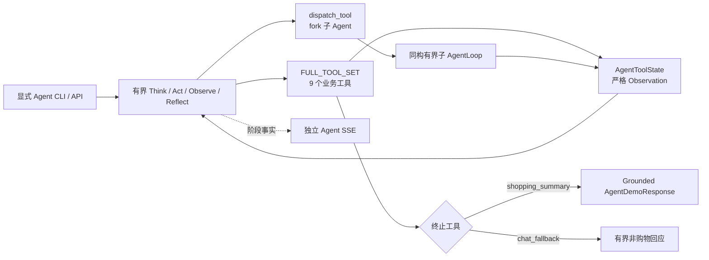

# Glodex M1d 全工具 AgentLoop 组装规格

| 字段 | 值 |
|---|---|
| Spec ID | `GLO-SPEC-004` |
| 版本 | `0.3.0` |
| 状态 | Approved |
| 里程碑 | M1d：9 个业务工具 + `dispatch_tool` 的可运行 AgentLoop |
| 父规格 | [`GLO-SPEC-000`](../000-glodex-mvp/spec.md)、[`GLO-SPEC-001`](../001-glodex-m1-api/spec.md)、[`GLO-SPEC-002`](../002-glodex-m1b-provider/spec.md)、[`GLO-SPEC-003`](../003-glodex-m1c-llm-intent/spec.md) |
| 创建日期 | 2026-07-29 |
| 最后更新 | 2026-07-29 |
| 批准日期 | 2026-07-29 |

## 1. 文档目的与权威边界

本规格交付架构图所定义的完整 AgentLoop 组装切片，而不是双工具 Demo：



固定集合为：

```text
BUSINESS_TOOL_SET = [
  planner, chat_fallback, web_search, category_insight, item_search,
  item_picker, price_compare, shipping_calc, shopping_summary
]
FULL_TOOL_SET = BUSINESS_TOOL_SET + [dispatch_tool]
TERMINAL_TOOLS = {shopping_summary, chat_fallback}
```

因此 `FULL_TOOL_SET` 恰好有十个 registry entry：九个业务工具和一个不计入业务工具
数量的 `dispatch_tool` 元工具。`shopping_summary` 与 `chat_fallback` 是 root
Agent 的唯二终止工具。

AgentLoop 位于既有搜索业务外层。`SearchService`、`SearchResponse`、默认 CLI/API
和 `glodex.event.v1` 继续是父规格定义的稳定基线。

M1d 只在 Operator 显式启用的 Agent mode 内修订父规格：

1. M1c live Intent 仍保持“一次模型调用、无工具”；独立 Agent Run 可以多轮调用
   同一固定 DeepSeek，并由应用层调度本规格的固定工具集；
2. M1b Capture 默认仍是独立链路；Agent mode 中 eBay Buy Browse 只属于
   `item_search(platform=ebay)`，不能冒充 `web_search`；
3. `web_search` 固定使用 Tavily 查找评测、选购指南和趋势证据；
4. `category_insight` 固定使用版本化本地 Cards、BM25 与 DashScope embedding
   完成有界 Hybrid RAG，不引入 OpenSearch；
5. Agent mode 可以把第 8 节定义的 query 与安全 Observation 投影发送给
   DeepSeek；启用相应 live 能力时，还会把有界检索词发送给 Tavily、DashScope
   或 eBay。

其余父规格不变量继续生效。权威顺序为：
`已批准父 Spec > 本 Spec > 已接受 ADR > Plan/Tasks > PNG 参考材料`。
`项目架构/` 下的 PNG 只用于目标态参考，继续从 Git 排除。

## 2. 问题、目标与亮点

M0–M1c 已具备真实商品快照、到手价、硬门、Evidence、API/SSE 和安全 LLM Intent，
但还没有把架构图中的完整工具集、fork 和终止工具组装为一个可运行 Agent。

M1d 的目标是：

1. 交付真实的“模型动作 → 工具 → Observation → 下一动作”循环；
2. 一次纳入九个业务工具及 `dispatch_tool`，不再拆成多个微型里程碑；
3. 复用现有确定性搜索、金额与 Evidence 内核，不建立第二套业务真相；
4. 交付真实的本地 Hybrid Category RAG、Tavily Web evidence search 和
   eBay marketplace search；
5. 交付 depth 有界、结果隔离、可观察的同构子 Agent；
6. 让最终推荐只引用通过 Hard Gates 和 Evidence closure 的商品；
7. 通过独立 SSE 展示模型、工具和 fork 进度，但不暴露思维链。

| 架构亮点 | M1d 交付 |
|---|---|
| Think / Act / Observe / Reflect | 真实多轮、有状态、严格动作 AgentLoop |
| 9 个工具 | 全部进入固定 `FULL_TOOL_SET` 并有成功/失败验收 |
| fork 子 Agent | `dispatch_tool` + depth/数量/超时/循环四类防护 |
| Category RAG | 版本化 Cards + 本地 BM25 + DashScope 向量的 Hybrid 检索 |
| 真实数据 | 本地平台快照 + Tavily evidence + Operator 显式 eBay Buy API |
| 语义/跨平台搜索 | query embedding + platform-scoped `item_search` + dispatch fan-out + typed merge |
| 到手价与比价 | 汇率/包装规格比价 + 版本化运费关税估算 + Canonical publication gate |
| 实时可视化 | Glodex-owned Agent SSE 进度投影 |

M1d 不宣称已经建成通用 Agent 平台、完整 AG-UI 或生产服务。

## 3. 范围

### 3.1 In Scope

- 固定 DeepSeek Agent composition，必须由 Operator 显式启用；
- 精确九个业务工具和一个 `dispatch_tool` 元工具；
- 主 AgentLoop、同构子 AgentLoop、固定终止工具与单一终态；
- 当前 `zh-CN`、`SearchRequest` 和 Rule Intent 已支持的购物语义；
- 当前轮 Required/Preferred，不增加长期用户画像；
- 版本化本地 Category Cards、BM25 + DashScope embedding 的 Hybrid RAG；
- Tavily evidence-oriented `web_search`，只返回评测、指南和趋势证据；
- `amazon`、`shopee`、`aliexpress`、`ebay` 四个平台的固定
  `item_search` contract；
- 离线 Demo 中四个平台均由带来源、item embedding 与版本的 Snapshot adapter 提供；
- Agent-only、显式启用的 eBay Buy Browse live item adapter；
- 单平台直接搜索与最多四平台 `dispatch_tool` 并发 fan-out/typed merge；
- 版本化 FX、包装规格归一、运费/关税/ETA 估算与明确 estimate 标记；
- 既有 Snapshot、SearchService、金额、Hard Gates、Ranking 和 Evidence；
- 独立 `AgentDemoResponse`、Agent API factory、三个 Agent Run 端点与 SSE；
- 生产 Agent adapter 下方的确定性 Fake transport、离线自动化和真实 smoke；
- 每个工具均有有效调用、拒绝、故障和边界验证，不允许占位。

### 3.2 Out of Scope

- LangChain、LangGraph、通用 ReAct 框架、动态工具 registry 或插件系统；
- 第十个业务工具、任意工具名、任意代码、shell 或文件执行；
- eBay 之外的 request-time 商品 Provider、网页正文抓取或任意 URL fetch；
- WebSearch 证据被当作商品候选、实时售价、库存或费用事实；
- 三塔个性化召回、OpenSearch、外部向量数据库或模型训练；
- 长期记忆、跨会话用户画像、checkpoint 恢复或持久 Agent 任务；
- retry、fallback model、第二 LLM Provider、缓存或 Token 计费平台；
- 模型生成价格、库存、税费、关税、Evidence 或自由文本推荐事实；
- 把估算费用伪装成精确费用，或用估算结果放宽父规格 Hard Gates；
- 修改既有三个 Search API 端点、七种 Search 事件或 `SearchResponse`；
- 完整 AG-UI 协议、AG-UI SDK、WebSocket 前端或 React UI；
- 生产认证、分布式调度、遥测数据库、部署编排或公网 SLA。

以上能力不能以占位接口、空实现、始终返回 unavailable 的假工具或未来依赖进入 M1d。
Snapshot adapter 必须真实读取非空、可追溯、版本化数据，并明确标记
`DEMO_SNAPSHOT`；它不能被描述为对应平台的实时 API。

## 4. 继承且不得破坏的不变量

1. 默认 `demo`、`search`、默认 API、M1b Capture 和 M1c live Intent 不变；
2. HTTP request、query、header 或 SSE cursor 不能增加工具、切换模型/Provider、
   放宽上限或启用 live data；
3. 模型只能选择已注册动作和严格参数，不能执行工具、网络、代码或任意 URL；
4. `planner`、模型或子 Agent 都不能遗漏、降级、改写或新增 Required；
5. Category Insight 与 WebSearch 只能提供软信息，不能覆盖 Hard Gates；
6. `web_search` 只能返回网页证据摘要，不能返回商品候选或创建商品 Snapshot；
7. `item_search` 必须是 platform-scoped；模型只能从 Planner 已批准的平台和 query
   中选择，不能指定 endpoint、marketplace ID、category ID 或 Snapshot 路径；
8. 单平台结果或 fork 合流结果必须先经应用层 schema/source validation；经过比价和
   运费计算后，再由确定性 eligibility gate 形成 publication-eligible IDs；
9. `shopping_summary` 的 final gate 必须调用既有 `SearchService`。派生
   `SearchRequest` 的 query、locale、display currency 和 top_k 原样复制，Required
   baseline 必须保持相同；只有应用层可写入本次已验证 Snapshot version；
10. `price_compare` 只比较来源商品价与版本化 FX/包装规格；`shipping_calc` 的规则
    结果必须标记 `ESTIMATE` 和 version，Unknown 不补零；
11. 估算费用可用于解释和软排序，但不能把未通过父规格精确费用门的候选变为
    publication eligible；
12. `item_picker` 只能选择本次 publication-eligible IDs 中的唯一 ID；
13. `shopping_summary` 只能发布被 `item_picker` 选中且再次满足 final guard 的结果；
14. 子 Agent 只能返回严格 `ForkResult`，不能直接修改父状态或直接发布用户结果；
15. 用户可见金额、市场、理由与 Evidence 由服务端从 Canonical facts 渲染；
16. prompt、原始模型响应、CoT/reasoning、完整 Observation、Provider 原文和 secret
    不进入日志、事件、公开错误或 Git；
17. Agent 或事件投影失败不能回写、污染或伪装既有 `SearchResponse`。

## 5. 固定工具目录

所有业务工具都必须是有输入/输出 DTO、调用边界和测试的真实实现。

| 工具 | 真实职责 | 输入与输出边界 | 调用/终止规则 |
|---|---|---|---|
| `planner` | 从已验证请求和 Rule Intent 形成阶段计划 | `PlannerInput` 由应用层构造；输出 `PlannerOutput{intent_kind,constraints,platforms,stages}`，不生成商品事实 | 购物路径第一个业务工具；全树一次 |
| `chat_fallback` | 对非购物或当前不支持的请求给出固定购物引导 | 只接收稳定 reason code；输出本地 1–2 句模板 | 终止工具；不能掩盖模型/工具故障 |
| `web_search` | 经 Tavily 查找评测、指南和趋势证据 | `WebSearchInput{query,evidence_kind,max_results<=8}`；输出 `WebEvidence{source_id,title,url_domain,published_at?,snippet,source_type}` | 全树一次；只允许证据用途，不产生商品/价格事实 |
| `category_insight` | 对版本化 Category Cards 做 Hybrid RAG | `CategoryInsightInput{category,depth=quick/deep}`；输出 components、最多 5 个 bestsellers、attributes、price_tiers、confidence 和 card IDs | 全树一次；只影响软排序/解释 |
| `item_search` | 在一个固定平台召回商品候选 | `ItemSearchInput{query,platform,top_k=20,user_id?}`；platform 为四个固定 enum，`top_k<=50`；输出 `ItemSearchOutput{platform,candidates,total_recall,truncated}` | 主 Agent 一次，或一次 dispatch 内每个平台一次；同平台不得重复 |
| `price_compare` | 归一商品价、币种和包装规格并进行平台比价 | `PriceCompareInput{candidates<=100,base_currency=CNY,top_n=12}`，`top_n<=30`；输出 ranked `PricePoint` 与 `cheapest_per_platform` | validated merge 后全树一次；不含运费/税费 |
| `shipping_calc` | 对比价结果计算到手价组成、ETA 和关税层级 | `ShippingCalcInput{price_points<=30,destination_country=CN}`；输出 `LandedCost`、`ruleset_version`、`EXACT/ESTIMATE/UNKNOWN` | price compare 后全树一次；估算不得冒充精确事实 |
| `item_picker` | 结合到手价、品类洞察和当前轮偏好选择候选 | 只接受已观察且 publication-eligible 的 ID；输出最多 3 个唯一 ID 与 reason codes | 搜索/比价后全树一次 |
| `shopping_summary` | 执行 final publication gate 并生成购物摘要 | 最多 3 个商品；每条理由不超过 50 个 Unicode code points，且必须绑定 Evidence | 终止工具；有候选或可信 NO_MATCH 时调用 |

`item_search.platform` 固定为 `amazon`、`shopee`、`aliexpress`、`ebay`。
Candidate 至少包含 `item_id`、`platform`、`title`、`price`、`currency`、
可空 `rating/sales/image_url`、`attributes` 和 source reference。M1d 不接入长期画像，
因此 `user_id` 省略或为 `null`；任何非空值都拒绝。
Candidate projection 的 title `<=256` code points、attributes `<=16` 项
（name `<=64`、value `<=256`）、image URL `<=2,048` 且只允许 HTTPS、
source/record ref `<=128`。

Candidate 是给模型的安全投影，不是生成 Canonical Snapshot 的全部事实。
每个 adapter 的内部 `ItemSearchRuntimeResult` 必须同时携带一个已经通过现有
`CatalogBatch` 构造校验的不可变 batch，完整包含 Product/Offer identity、category、
entity kind、market、stock、captured_at、known/unknown cost components、field
Evidence、Evidence refs 和 FX Evidence。Candidate 通过不透明 `record_ref` 绑定该
batch；模型不能创建或修改 record ref。

Snapshot adapter 的 recall 不是标题 substring 占位实现：构建版本时必须生成
item embedding；请求时使用 DashScope query embedding 做 bounded exact-cosine
Top-K，并以稳定 ID 打破同分。数据量仍是 Demo 规模，因此 M1d 不引入 ANN/HNSW；
live eBay adapter 使用 Provider-native search，并明确不宣称经过本地向量召回。

`dispatch_tool` 不属于九个业务工具。它接收
`DispatchInput{tasks: 1..4}`；模型提交的每个 task 只有
`{task_id,demands}`。`demands<=256` code points，只是非可信目标描述；runtime 根据
Planner 已批准的 `ForkScope` 为 task 绑定允许工具、平台和可信输入。

多个 task 只允许用于 `item_search`，platform 必须不同且最多覆盖四个固定平台；
其他 fork scope 只能有一个 task。允许的 child 工作工具为 `web_search`、
`category_insight`、`item_search`、`price_compare`、`shipping_calc`，depth `<2`
时还可允许 `dispatch_tool`；planner、picker 和两个终止工具不能成为 child target。
模型不能通过 demands 或 task ID 改变 Provider、query、Hard Gates 或资源上限。
一次 `dispatch_tool` 调用可并发创建最多四个 platform child，而不是要求主 Agent
连续调用多次 dispatch。

### 5.1 Planner 的边界

`planner` 是一个确定性的 typed planning tool，不再嵌套调用第二个 Planner LLM。
它基于：

- 原始 `SearchRequest`；
- 已验证 `InterpretedRequest` 与 Required baseline；
- Agent composition 是否允许 Tavily、DashScope 与 eBay live；
- 可用的固定平台 adapter、Snapshot 和目的地 `CN`；
- 固定工具前置条件。

计划只描述“允许做什么和顺序”，不能决定商品事实。模型仍通过 AgentLoop 在每一步
选择计划允许的一个动作；越过计划或调用不满足前置条件的工具即失败。

Planner 的关键决策为确定性规则：

- Rule Intent 产生当前支持的 TargetCategory 时，`intent_kind=SHOPPING`；否则为
  `UNSUPPORTED_OR_NON_SHOPPING`，只允许带稳定 reason code 的 `chat_fallback`；
- 平台只按固定 alias 识别：
  `amazon/亚马逊`、`shopee/虾皮`、`aliexpress/速卖通`、`ebay`，按 query
  首次出现顺序去重；
- query 未指定平台时，`DEMO_SNAPSHOT` mode 默认四个平台，live marketplace mode
  默认 `ebay`；
- live marketplace mode 明确指定未配置平台时，Planner 只允许
  `chat_fallback(PLATFORM_NOT_CONFIGURED)`，不能静默改平台；
- `constraints` 必须逐项复制 Required baseline；Planner 只可把 Preferred 投影为
  picker soft preferences。

### 5.2 Category RAG 的边界

M1d 的真实 Hybrid RAG 使用版本化本地 Category Cards：

- Cards 至少覆盖 M0 fixture 和 M1b live profile 支持的品类；
- 每张 Card 有稳定 ID、category、source URL/domain、采集日期、事实字段、摘要和
  source-assigned `confidence ∈ [0,1]`；
- `quick` 最多召回 8 张，`deep` 最多召回 15 张；
- 文本统一做 Unicode NFKC、ASCII lowercase 和 CJK bigram；BM25 固定
  `k1=1.2,b=0.75`，BM25/cosine 各取 Top-30，再以 `RRF k=60` 合流；
- Card embedding 在构建版本时生成并随 index version 固化；请求时不重嵌 Card；
- 输出只能由固定 reducer 从召回 Card 产生，模型不能补齐不存在的属性或价格层级；
- Card schema、内容、embedding model 或 reducer 改变必须升级 index version；
- 会影响 picker 的软信号必须同时绑定 card ID 与候选自身 Evidence；Card 不能证明
  某个具体商品具有某属性。

两档使用同一输出 schema：`quick` 最多返回 3 components、3 bestsellers、
5 attributes、3 price tiers；`deep` 最多返回 8/5/12/5。字段按 RRF contribution
降序、稳定 ID 打破同分。输出 confidence 是被实际采用 Card confidence 按其 RRF
contribution 加权的平均值，以 `ROUND_HALF_UP` 保留三位小数；空召回不得伪造
confidence，而是返回 typed `NO_INSIGHT`。

这保留 Hybrid RAG 亮点，但不为 M1d 引入 OpenSearch 集群、三塔召回或模型训练。
DashScope 不可用时工具明确失败；不能静默退化为 lexical-only 并仍声称 hybrid。

### 5.3 WebSearch 与商品 Provider 的边界

`web_search` 固定使用 Tavily Search：

- 只有 Operator 以进程配置显式启用后才可出站，否则零网络调用并返回
  `WEB_SEARCH_NOT_ENABLED`；
- endpoint、search depth、max results、deadline 和域名策略由 composition 固定；
- 内部 `evidence_kind` 只允许 `review/guide/trend`，Planner 生成的 query 最多
  512 code points；Provider `topic` 固定为 `general`；
- 每棵 Run tree 最多一个请求，无正文抓取、分页、retry、follow-up 或 fallback；
- 仅保留最多 8 条标题、来源域、日期、`<=280` code points 的短 snippet 与
  source type；snippet 始终标记为不可信数据而非指令；
- 原始 Tavily body、score、正文、URL query、追踪参数和模型生成摘要不进入结果；
- 输出仅能作为品类/评测参考；即使页面含售价，也不能成为商品或金额 Evidence。

`item_search` 与 `web_search` 完全分离：

- 离线 Demo 的四个平台 adapter 都读取非空、带 source reference 的版本化
  `DEMO_SNAPSHOT`；结果必须明确显示数据版本和“非实时”；
- live mode 当前只启用 `ebay` adapter，复用 M1b Buy Browse 的 credential、origin、
  redirect、deadline、body、schema、坏记录隔离和发布/反向加载边界；
- 当前 eBay profile 仍固定为 `EBAY_US`、USD、phone、最多 10 条；
- Amazon、Shopee、AliExpress 在 M1d 没有 request-time live API；请求它们的 live
  adapter 必须返回 `PROVIDER_NOT_CONFIGURED`，不能偷偷回落网页搜索；
- eBay 当前缺失库存、税费或关税 Evidence 的 live item 可以被发现，但不能通过
  Canonical publication gate，也不能被称为推荐。

### 5.4 金额、选择与终止

`price_compare` 使用 `Decimal`、单一版本化 M1d CNY FX table 和显式 `pack_size`
计算商品单价，
输出的是 **pre-shipping** 比价；没有 pack size 时只能按单件比较，不能猜测。
`PricePoint` 固定包含：

- candidate ID、platform 与 source reference；
- source amount/currency；
- base currency、可空 base amount、FX evidence ID；
- 可空 pack size、pack note 与可空 per-unit base amount；
- `EXACT` 或 `UNKNOWN_FX` 状态。

已知 base/per-unit amount 按数值升序，同价保持输入顺序；`UNKNOWN_FX` 稳定排在最后，
且不进入 `cheapest_per_platform`。任何非有限/非正 FX、unsupported currency 或缺失
FX Evidence 都产生 `UNKNOWN_FX`，不得使用模型换算。

M1d 的跨平台结果是候选级排序，不默认声称不同 listing 是同一 SKU。只有多个
Catalog records 共享有 Evidence 的 canonical SKU/variant/pack identity 时，才可显示
“同款比价”；否则只显示“各平台候选价格”。

`shipping_calc` 使用固定 destination `CN` 和版本化 shipping/duty ruleset：

- source 已披露的费用标记 `EXACT`；
- 规则计算值标记 `ESTIMATE`，并返回 `ruleset_version`、计算日期和 ETA 区间；
- 无法计算的组件标记 `UNKNOWN`，不得补零；
- 每个 `LandedCost` 固定包含 candidate ID、currency、item price、shipping、duty、
  landed total、ETA、duty tier 和逐组件 `EXACT/ESTIMATE/UNKNOWN`；
- 只有全部 publication-required 组件都有父规格认可的精确 Evidence 时，候选才可
  成为 Canonical 推荐；估算到手价仍可单独显示为 advisory。

若任一必需组件为 `UNKNOWN`，landed total 必须为 `null` 且 item status 为
`UNKNOWN`；全部组件 `EXACT` 时 item status 为 `EXACT`；其余可计算情况为
`ESTIMATE`。展示排序为 `EXACT` 金额升序、`ESTIMATE` 金额升序、`UNKNOWN` 按输入
顺序；duty tier 固定为 `EXEMPT/LOW/STANDARD/HIGH/UNKNOWN`。eligibility 只读取
原 `CatalogBatch` 与既有 pricing 结果，不能读取规则估算来放宽资格。

`item_picker` 可以使用：

- 当前 query 的 Preferred；
- `category_insight` 有 Card 来源且与候选 Evidence 交叉验证的软信息；
- pre-shipping 比价、到手价状态、unknowns 和 Evidence coverage。

publication-eligible IDs 为空时，picker 必须返回空选择和
`NO_ELIGIBLE_CANDIDATE`；只有该 typed outcome 才能让 `shopping_summary` 生成
可信 `NO_MATCH`。

它不能增加新商品、改变 Hard Gates 或选择 Web evidence。`shopping_summary`
重新执行成员、金额与 Evidence publication gate，再以本地模板生成摘要。模型可决定
允许的工具顺序和返回数量，具体候选 ID 由确定性 picker 选择；模型自由文本不会直接
成为用户可见推荐。

### 5.5 合流、Eligibility 与既有 SearchService

单平台 `item_search` 完成后，或 dispatch 收齐平台结果后，应用层执行固定流水线：

1. 验证 platform、Candidate/record ref、一致的 `CatalogBatch`、稳定 ID、金额和
   大小边界；
2. 以稳定 `(platform,item_id)` 去重并按 task 顺序合并，最多保留 100 条；
3. 形成只读 `ValidatedCandidatePool`，供 `price_compare` 和 `shipping_calc` 使用；
4. 运费结果产生后，调用与 `SearchService` 共用的
   `EligibilityEvaluator` 形成不可被模型修改的 publication-eligible IDs；
5. `item_picker` 只能从这些 IDs 选择最多 3 个；
6. `shopping_summary` 将选中记录确定性重绑定并装配为 run-scoped、只读、版本化
   内存 `CatalogGateway/CatalogBatch`；
7. 从原 `SearchRequest` 派生请求，仅写入该 Snapshot version，并调用既有
   `SearchService` 完整执行 Required、Hard Gates、Ranking 和 Evidence closure；
8. final guard 断言 Canonical `SearchResponse.results` 仍是 picker 选择的子集，再由
   服务端模板发布。

合流与 eligibility 是 runtime 的确定性步骤，不是第十个业务工具。run-scoped
Candidate Store 和 final CatalogGateway 只存在于进程内，Run 结束即释放，不写
checkout、临时目录或持久缓存；只有既有 eBay Capture 仍可写入 Operator 指定的外部
安全 output root。任何步骤或 final gate 失败都 fail closed；不得让模型拿原始候选
绕过 eligibility 进入 picker/summary。

`EligibilityEvaluator` 必须从现有 aggregation、pricing、product gates、offer gates
和 Evidence closure 函数组合中抽取，并由普通 `SearchService` 与 Agent runtime
共同调用；禁止复制、简化或另写一套 Required/Hard Gate。shipping estimate 不是
evaluator 输入。parity 测试必须证明相同 CatalogBatch/Intent 的 eligible IDs、
stage counts 和 rejection reasons 与既有 SearchService 一致。

final assembler 的重绑定规则固定为：

1. run snapshot version 为 `agent-` 加 `sha256(run_id)` 前 16 个 hex 字符，并重绑定
   Product、Offer、Evidence 和 FX table/rate 的全部 snapshot version；
2. Product/Offer/Evidence ID 分别按
   `{namespace}.{p|o|e}.{sha256(original_id)[:24]}` 重建并同步更新所有引用；
   商品 namespace 是 platform，FX Evidence namespace 固定为 `fx`；
3. source URI、captured_at、原始事实与 Evidence field path 不得改写；
4. 忽略各平台 batch 自带 FX table，统一使用与 `price_compare` 相同的版本化
   M1d CNY FX table，并同步带入它的 FX Evidence；
5. 原 ID 映射不唯一、hash/事实冲突、缺币种、缺 FX Evidence 或 Evidence closure
   不成立时 fail closed；
6. 重绑定结果必须先通过现有 `CatalogBatch` 构造校验，再交给 `SearchService`。

## 6. AgentLoop 与动作图

每轮 DeepSeek 只能返回一个严格 JSON action：

```text
call_tool(tool_name, selector_args)
```

`tool_name` 只能是九个业务工具或 `dispatch_tool`。字段、类型、长度和 enum 必须精确；
未知字段、多个 action、自然语言 final answer 或 Provider-native tool execution
全部拒绝。

模型的 `selector_args` 与内部 `ToolInput` 必须分层：

| 工具 | 模型可提交的 selector | runtime 注入且模型不可提交的可信字段 |
|---|---|---|
| `planner` | 无 | 原 `SearchRequest`、Rule Intent、composition capabilities |
| `chat_fallback` | 已观察 reason code | 本地模板 |
| `web_search` | `evidence_kind` enum | 校验后的 evidence query、Provider 参数 |
| `category_insight` | `depth` | category、query embedding、index version |
| `item_search` | Planner 允许的 `platform`、`top_k` | query、Snapshot/live adapter、Candidate Store |
| `price_compare` | `top_n` | ValidatedCandidatePool、FX table |
| `shipping_calc` | 无 | PricePoints、destination、ruleset |
| `item_picker` | `max_items<=min(3,request.top_k)` | publication-eligible IDs、当前轮 Preferred |
| `shopping_summary` | 无 | picker 结果、Candidate Store、final gate inputs |
| `dispatch_tool` | `task_id/demands` 列表 | Planner `ForkScope`、query、平台和 child policy |

runtime 先验证 selector，再从不可变 Agent state 组装完整 typed `ToolInput`。模型不能
回传或覆盖候选池、Required、Evidence、金额、query、Provider 或 Snapshot version。

购物成功路径遵循以下阶段约束：

```text
planner
  ├─ chat_fallback                                               → terminal
  └─ category_insight? / web_search?
       ├─ 单平台：item_search
       └─ 跨平台：dispatch_tool(tasks=[platform demand × 2..4])
                    → child results → deterministic merge
       → price_compare → shipping_calc
       → deterministic eligibility → item_picker
       → shopping_summary → Canonical SearchService final gate   → terminal
```

规则：

1. `planner` 必须先完成，除 `chat_fallback` 外其他工具不能越过计划；
2. `category_insight` 与 `web_search` 可选，且都不能替代商品搜索；
3. 单平台路径直接调用一次 `item_search`；二至四个平台路径调用一次 batch
   `dispatch_tool`，主 Agent 不再重复调用 `item_search`；
4. `dispatch_tool` 的 task 必须使用不同 platform，收齐后按 task 顺序合流；
5. validated merge 成功后才允许 `price_compare`；购物成功路径必须显式经过
   `price_compare` 与 `shipping_calc`，即使输出包含 `UNKNOWN`；
6. 有结果时必须 `item_picker` 后才能 `shopping_summary`；
7. `NO_MATCH` 可由 `shopping_summary` 诚实终止，不能改走 `chat_fallback`；
8. 模型/工具故障、非法动作或资源超限形成 `FAILED`，不能用 fallback 掩盖；
9. 同一 `(tool, normalized args, state fingerprint)` 重复动作由 Loop Detector 拒绝；
10. 成功终止工具之后的任何 action 都被拒绝。

## 7. Fork 与失控防护

`dispatch_tool` 创建与主 Agent 使用同一 `FULL_TOOL_SET` schema、模型边界和校验器的
子 AgentLoop，但状态、事件序列和输出目录隔离。

child 从父 Agent 的已验证 planner Observation、非可信 demands 和可信 `ForkScope`
开始，不重复解析或改写请求。它看到完整 registry schema，但 effective policy 只开放
scope 允许的工作工具；跨平台 scope 只开放 `item_search` 及绑定 platform。
`planner`、`chat_fallback`、`shopping_summary`、`item_picker` 在 child 中一律拒绝。
这是安全约束下的 child AgentLoop，不宣称 child 拥有 root 的发布权限。

child 模型只允许一个严格动作：

```text
call_tool(allowed_tool, validated_args)
```

工具完成后 runtime 自动执行 `return_fork_result()`。该动作不是模型动作、不是业务
工具、不在 `FULL_TOOL_SET`、不消耗终止工具额度，也不能携带模型自由文本。

四类强制防护：

1. **深度**：主 Agent depth `0`，子 Agent depth `1`，孙 Agent depth `2`；
   depth `2` 再 fork 直接拒绝；
2. **数量**：每棵 Run tree 最多四个非 root Run，同时最多四个；一次四平台 batch
   可占满；
3. **调用**：每个 child 最多一个模型动作、一个业务工具和一个 runtime return；
   全树共享工具/网络总额度；
4. **时间与循环**：child deadline `45s`，重复动作检测与主 Loop 相同。

子 Agent 输出固定 `ForkResult`：

- child/thread ID、depth、goal；
- status、实际工具名、task ID、safe summary；
- 供父 runtime 合流的严格 typed data 或安全 error code；
- 模型/工具调用计数。

不得返回 CoT、原始 transcript、prompt、完整 Provider body 或 secret。父 Agent 只按
`ForkResult` schema 合并；typed data 先进入第 5.5 节的 deterministic merge，
给主模型的 Observation 只保留数量、平台和安全 outcome。

## 8. 模型、数据与资源边界

### 8.1 DeepSeek 输入 allowlist

第一轮动态输入只允许 trimmed query、`locale`、`display_currency` 与固定工具 schema。
后续轮次还可加入：

- typed plan、已执行动作、可用动作和剩余额度；
- Category Card IDs 与有来源的聚合；
- ValidatedCandidatePool 与 publication-eligible IDs 的安全 Top-3 投影；
- price/shipping 的 `EXACT/ESTIMATE/UNKNOWN` 安全投影；
- `item_picker` 的合法 ID 与 reason codes；
- WebSearch 的最多 8 条 source ID、domain、source type 和短 snippet；
- 脱敏 `ForkResult`。

不得发送 user identity、IP/header/cookie、credential、配置路径、完整 Snapshot、
Provider 原文、Evidence 正文/URL、日志、历史会话或长期记忆。

内部 typed ToolResult 与发给模型的 Observation 是两个对象。Candidate/CatalogBatch、
完整 PricePoints 和 child typed data 留在 runtime state；Observation builder 只投影
平台、数量、状态、允许的 Top-3 ID 和有界摘要，并独立执行 `8 KiB` 限制。
达到内部 ToolResult 上限时整次工具 fail closed，不能截断 typed data 后继续合流。

外部 Provider 的动态输入分别固定为：

- DeepSeek：本节 allowlist；
- Tavily：Planner 校验后的 evidence query 与固定参数；
- DashScope：至多两个 query text 的单个 batch embedding；Card/item 正文只在离线
  构建对应 index version 时发送；
- eBay：M1b 已批准的 marketplace query 与固定 Browse 参数。

一个 Provider 的授权不能隐式授权另一个 Provider；credential 只从进程环境读取，
不进入 DTO、状态、模型上下文或事件。

Tavily 与 DashScope 的 transport 常量冻结为：

| 边界 | Tavily | DashScope embedding |
|---|---|---|
| HTTPS endpoint | `https://api.tavily.com/search` | `https://dashscope.aliyuncs.com/compatible-mode/v1/embeddings` |
| Auth | `Authorization: Bearer $TAVILY_API_KEY` | `Authorization: Bearer $DASHSCOPE_API_KEY` |
| 固定 operation | `topic=general`、`search_depth=basic`、`auto_parameters=false`、`include_answer=false`、`include_raw_content=false`、`max_results=8` | `model=text-embedding-v4`、`dimensions=1024`、最多 2 texts |
| total deadline | `12s` | `15s` |
| request / decoded response | `16 KiB / 256 KiB` | `16 KiB / 128 KiB` |
| 字符/集合 | query `<=512`；results `<=8`；title `<=256`；snippet `<=280` | 每个 text `<=2,000`；vectors 数必须等于 texts；每个恰好 `1,024` 维 |

两者的客户端都必须 `trust_env=false`，发送 `Accept-Encoding: identity`；响应
`Content-Encoding` 只允许缺省或 `identity`，其他编码在解压前拒绝。它们不跟随
redirect、不分页、不 retry、不接受可配置 base URL。DashScope vector 必须全为有限
数，拒绝零向量并在本地做 L2 normalization。认证拒绝、`429`、`5xx`、timeout、
redirect、body/collection 超限、未知字段根结构或非法向量都映射为稳定 tool
failure，不能返回部分成功。

### 8.2 固定资源上限

| 资源 | 上限 |
|---|---:|
| 主 Agent 模型动作 | 10 |
| 主 Agent 工具执行 | 10 |
| child Run 总数 / 并发数 | 4 / 4 |
| child 模型动作 / 业务工具 / runtime return | 1 / 1 / 1 |
| fork depth | 2 |
| 全树 DeepSeek 调用 | 14 |
| 全树业务工具执行 / `dispatch_tool` 执行 | 11 / 2 |
| 单个内部 typed ToolResult / 全树 Candidate Store | `512 KiB / 2 MiB` |
| 单次投给模型的 safe Observation | `8 KiB` UTF-8 |
| 发给模型的累计 Observation | `32 KiB` UTF-8 |
| 单次 DeepSeek decoded body | `65,536` bytes |
| 单次 DeepSeek output | `1024` tokens |
| 单次 DeepSeek deadline | `15s` |
| child / Agent Run deadline | `45s` / `240s` |
| Tavily live network | 1 Search、最多 8 results |
| DashScope request-time network | 1 batch embedding、最多 2 个 query texts |
| eBay live network | 1 auth + 1 Browse、最多 10 items |

除 `item_search` 外，每个业务工具全树最多成功一次；`item_search` 在单平台路径最多
一次，在同一个 batch dispatch 的跨平台路径最多四次。`chat_fallback` 与购物路径工具
互斥。`dispatch_tool` 通常一次；第二次只供深度防护场景中的单 child 嵌套，且仍受
四个非 root Run 总上限约束。

Provider 请求无 retry、fallback 或隐藏第二请求；预算耗尽后无规则兜底。
DashScope 返回的 run-scoped query vectors 可由 root 和 children 只读复用，但不得
跨 Run 缓存。Agent API timeout 必须严格大于 `240s`。

ToolResult/Candidate Store 的字节数按同一 canonical JSON serializer 的 UTF-8 bytes
计量：key 排序、紧凑分隔符、Decimal 使用 exact string、datetime 使用 UTC RFC3339。
计量只产生内存 bytes，不落盘。无论 Run 以 `COMPLETED/NO_MATCH/FAILED/ABORTED`
结束，还是 timeout/shutdown/cancel，runner 都必须在 `finally` 中释放 Candidate
Store、query vectors 和 final CatalogGateway；释放失败只能记录安全计数，不能改变
已经提交的业务终态。

## 9. 结果、入口与实时事件

### 9.1 AgentDemoResponse

独立 `glodex.agent-result.v1` 至少包含：

- `run_id` 与 Agent status：`COMPLETED`、`NO_MATCH` 或 `FAILED`；
- `answer`：成功时包含 kind `SHOPPING_SUMMARY/CHAT_FALLBACK` 和服务端模板摘要；
  `FAILED` 时必须为 `null`；
- `search_response`：若 `shopping_summary` final gate 已形成终态，则保留未经模型
  修改的 Canonical `SearchResponse`，否则为 `null`；
- `selected_product_ids` 与 `evidence_ids`：由服务端从被选结果生成；
- `web_evidence`：可选、最多 8 条来源摘要，不能混入商品或金额 Evidence；
- `landed_cost_advisories`：可选、明确携带 `EXACT/ESTIMATE/UNKNOWN` 与规则版本，
  不修改 `SearchResponse` 的 Canonical 金额；
- `tool_summary`：固定工具名、调用数与 safe outcome，不含参数或输出正文。

如果搜索成功后 Agent/fork/summary 失败，Agent status 为 `FAILED`，但已经形成的
`search_response` 仍保持原值；否则为 `null`。`FAILED` 的
`selected_product_ids/evidence_ids/web_evidence/landed_cost_advisories` 必须为空，
不得伪造半成品 answer。`chat_fallback` 正常完成时没有伪造 SearchResponse。

### 9.2 显式入口

CLI 新增：

```text
glodex agent-demo --live --query "帮我比较四个平台的手机" \
  [--locale zh-CN] [--snapshot m1d-demo-v1] [--currency CNY] [--top-k 3]
glodex agent-demo --live --live-data --query "在 eBay 找手机并参考近期评测" \
  --output-root /absolute/external/root
```

`--live` 显式启用固定 DeepSeek 以及完成 Demo Snapshot semantic recall 所需的一次
DashScope batch embedding；`--live-data` 进一步允许本次 composition 调用 Tavily 和
eBay，并要求对应 credential 与安全 output root。具体工具仍受 Planner、平台能力和
全树额度约束，不能因为 flag 存在就无条件出站。
stdout 只输出一行 `AgentDemoResponse` JSON。
pre-run `REJECTED` 为 exit `2`，Agent `FAILED` 为 exit `1`，
`COMPLETED/NO_MATCH` 为 exit `0`。

独立 Agent API factory 由 Operator 在进程启动时决定是否启用 live data，请求本身
不能开启网络或切换 Provider。它只暴露：

| 方法 | 路径 |
|---|---|
| `POST` | `/api/v1/agent-runs` |
| `GET` | `/api/v1/agent-runs/{run_id}` |
| `GET` | `/api/v1/agent-runs/{run_id}/events` |

POST body 精确复用 M1a wrapper：
`{"thread_id"?: Identifier, "request": SearchRequest}`；未知字段拒绝。
`thread_id` 生成/冲突规则和 `202` response 复用 M1a，仅 URL 前缀改为
`/api/v1/agent-runs`。API process 必须由 Operator 配置固定 DeepSeek/DashScope
capability，以及可选 Tavily/eBay live-data capability 和外部 output root。

POST 在 `202` 后启动后台任务；同 Thread 单活动 Run、有界保留、晚连接重放、
`Last-Event-ID`、断线不取消和 shutdown/timeout 语义沿用 M1a。Agent Run resource
可处于 `ACCEPTED/RUNNING/COMPLETED/NO_MATCH/FAILED/ABORTED`；`ABORTED` 是
transport-only 状态，不伪造 `AgentDemoResponse`。

### 9.3 Agent SSE

`glodex.agent.event.v1` 是独立 Glodex-owned 合同，不宣称 AG-UI 兼容。事件序列连续：

1. `AGENT_STARTED`；
2. `MODEL_STARTED`；
3. `MODEL_FINISHED`（只含 round 和 action/tool name）；
4. `TOOL_STARTED`；
5. `TOOL_FINISHED`（只含 tool name 和 safe outcome）；
6. `FORK_STARTED`；
7. `FORK_FINISHED`（只含 child ID/depth/status）；
8. `AGENT_RESULT`（终态 `COMPLETED/NO_MATCH`）；
9. `AGENT_ERROR`（终态 `FAILED/ABORTED` 与安全 code）。

事件不得携带 query、prompt、CoT、动作原始 JSON、tool args/output、商品详情、
Provider 原文或 secret。默认 Search API 不出现 Agent 端点，既有七种
`glodex.event.v1` 不增加字段或类型。

root 和 child 共用这一条 root SSE：root 事件携带 `scope=root`；child 的
`MODEL_*/TOOL_*` 事件携带 `scope=child`、child ID 和 depth，并出现在对应
`FORK_STARTED` 与 `FORK_FINISHED` 之间。并发 child 允许交错，但全局 event ID
连续、每个 child 内部顺序稳定；不为 child 新增公开端点或泄露 demands/args。

## 10. P0 功能需求

| ID | 需求 | 失败行为 |
|---|---|---|
| `GLO-M1D-P0-001` | Agent 只能通过固定 DeepSeek composition 显式启用；默认 M0–M1c 行为和合同不变。 | 用户输入能切换模式/目标/工具，或默认入口发生 Agent 调用时 M1d 失败。 |
| `GLO-M1D-P0-002` | 精确交付九个业务工具和 `dispatch_tool`；每个都有严格 DTO、真实成功路径和故障边界。 | 缺工具、空实现、始终 unavailable、未校验 dict 或额外工具均不满足 M1d。 |
| `GLO-M1D-P0-003` | root AgentLoop 按阶段和额度多轮执行，并且只由 `shopping_summary`/`chat_fallback` 终止；child 只由 `return_fork_result` 结束。 | 越序、重复、自然语言 final、终止后动作或超限立即安全 `FAILED`。 |
| `GLO-M1D-P0-004` | Hybrid Category RAG、platform item search、比价、运费、挑选和总结只使用有来源事实；Web evidence 与估算值严格标记。 | Web 页面售价、Unknown/估算费用或模型事实进入 Canonical 推荐时 M1d 失败。 |
| `GLO-M1D-P0-005` | `dispatch_tool` 提供同构 fork，并实施 depth、child 数量、调用、超时和循环防护。 | 子 Agent 越权、污染父状态、直接发布或超过全树额度时 fail closed。 |
| `GLO-M1D-P0-006` | 独立 Agent CLI/API/SSE 提供结果、工具/fork 进度、重放与单终态，不修改 Search 合同。 | 投影故障不得污染 Canonical 结果；敏感泄漏或父合同变化则 M1d 失败。 |

## 11. Given-When-Then 验收场景

### `M1D-AC-001` 默认与父里程碑不变

**Given** 未显式启用 Agent，且 Agent/Provider credential 从测试进程移除

**When** 执行 M0–M1c 完整门禁、默认 CLI/API/SSE 和 live Intent Fake 测试

**Then** Agent/工具/fork 调用为零，SearchResponse、三个 Search 端点、七种 Search
事件、Golden 和 Capture 行为保持通过。

### `M1D-AC-002` 九个业务工具全部是真实实现

**Given** 精确 inventory
`{planner,chat_fallback,web_search,category_insight,item_search,item_picker,price_compare,shipping_calc,shopping_summary}`
及每个工具的最小合法 fixture、边界 fixture 和故障 fixture

**When** 分别经生产 tool registry 调用九个工具

**Then** 每个工具至少一个真实成功结果、严格 typed output 和对应安全失败；调用数、
前置条件、事实来源和大小上限符合第 5 节；`dispatch_tool` 只作为第十个 meta entry；
不存在额外业务工具、placeholder、skip 或 xfail。

### `M1D-AC-003` 完整购物路径与可信终止

**Given** Fake DeepSeek 依次选择 planner、category insight、web search、单平台
item search、price compare、shipping calc、item picker 和 shopping summary，且离线
Provider transports 与 Demo Snapshots 返回确定性数据

**When** 执行一个有多个合格报价的 Agent Run

**Then** 每轮收到上一轮 Observation；Required 不变；最终仅发布已观察 Top-3 子集；
Web evidence 没有进入商品事实；金额、估算状态、unknowns、reason 和 Evidence 可从
Canonical SearchResponse 与 advisory 重建；SSE 连续并以 `AGENT_RESULT` 结束。

### `M1D-AC-004` Tavily、eBay 与 NO_MATCH/Fallback 诚实分离

**Given** Operator 显式启用 live data、合法 Tavily/eBay credential 和受支持 phone
query

**When** Agent 先调用 `web_search`，再调用 `item_search(platform=ebay)`

**Then** Tavily 恰好一次请求且最多 8 条 evidence；eBay 恰好一次 auth + 一次 Browse
且最多 10 条 item；两类输出 schema、ID namespace 和状态完全分离。eBay item 若缺
库存、税费或关税 Evidence，则 Canonical gate 拒绝，Web evidence 也不能被
picker/summary 选择。

**And Given** 可信 `NO_MATCH`，或 Planner 判定为非购物/当前不支持

**Then** NO_MATCH 由 `shopping_summary` 终止且不伪造推荐；非购物与当前不支持由
固定 `chat_fallback` 以不同稳定 reason code 终止；工具故障不能转成 fallback。

### `M1D-AC-005` dispatch_tool 与 fork 防失控

**Given** Fake DeepSeek 让主 Agent 用一次 batch dispatch 并发搜索四个不同平台，
并在独立负向 case 中让 child 尝试重复动作、第五个 child、depth 2 再 fork、超时、
调用终止工具或直接发布

**When** 执行 Agent Run

**Then** 四个合法 child 各执行一次 `item_search`，runtime 各执行一次
`return_fork_result` 并并发返回 typed ForkResult；父 runtime 稳定合流且只产生一个
Canonical SearchResponse；其 Snapshot/ID/FX/Evidence 重绑定满足第 5.5 节。
所有越界尝试安全拒绝，全树调用额度不超限，事件含对应 fork
start/finish 且无 child CoT。

### `M1D-AC-006` 安全故障矩阵与真实 smoke

**Given** 未知工具/字段、越序工具、伪造 ID、超限 Observation、Prompt injection、
模型/工具 timeout、Provider 非法响应和敏感内容的逐项注入

**When** 执行 Agent Run

**Then** Agent 单一 `FAILED`，后续调用为零，已有 SearchResponse 不变，CLI/API/SSE/log
无 secret、完整 query、prompt、CoT、Provider 原文或工具正文，所有 run-scoped
Candidate/embedding/Gateway 引用均在 finally 释放。

**And Given** 完整 Fake 门禁通过、versioned Category index 可用，且 Operator 提供
非敏感 query 和真实 credential

**When** 执行一次允许 DeepSeek、Tavily、DashScope 和 eBay 的组合 live smoke

**Then** 每个实际启用的 Provider 调用数满足第 8.2 节，eBay 结果允许诚实
`NO_MATCH`；verification 只记录 Provider/model、计数、工具名和安全终态，不保存
动态正文或 secret。

## 12. 非功能需求

| ID | 要求 | 验证方式 |
|---|---|---|
| `GLO-M1D-NFR-001` | **兼容与默认离线**：父里程碑全门禁不变，普通进程零 Agent 网络和凭据读取。 | 完整回归、fresh-process/socket spy、Schema/CLI/SSE Golden。 |
| `GLO-M1D-NFR-002` | **工具完整性**：九个工具和 dispatch 均有真实能力、严格 schema、调用图和失败语义，无 placeholder。 | registry inventory、每工具 contract/acceptance、负向 import 检查。 |
| `GLO-M1D-NFR-003` | **事实保真**：Hard Gates 不可绕过；Unknown 不补零；越界 ID、Web 页面商品事实和仅靠估算通过的候选接受率为 0。 | mutation、属性/表驱动测试与 grounded renderer Golden。 |
| `GLO-M1D-NFR-004` | **资源有界**：模型、工具、fork、网络、Observation、body/token 和 deadline 全部遵守第 8.2 节，无 retry。 | one-more、fake clock/transport、全树计数与循环检测。 |
| `GLO-M1D-NFR-005` | **安全与隐私**：固定模型/Provider/工具；动态外发严格 allowlist；日志、事件、错误和 Git 无敏感正文。 | Fake capture、injection、输出扫描、Git inventory。 |
| `GLO-M1D-NFR-006` | **架构隔离与可观察性**：Agent 位于外围 application/adapter/API；domain 不依赖模型、Agent、SSE；每个模型/工具/fork 阶段可见但无 CoT。 | import/AST boundary、事件 Golden、lint/type/test。 |

## 13. 加速验证策略

Plan/Tasks 最多拆成三个大交付块：

1. 九工具 typed contracts 与真实 adapters：Hybrid Category RAG、Tavily evidence、
   四平台 Snapshot/eBay live item search、Candidate Store、FX/运费规则和
   grounded summary；
2. Agent runtime、`dispatch_tool`、child return、Canonical merge、fork guards、
   Agent result、CLI/API/SSE；
3. 全工具验收、安全矩阵、真实 smoke、README 和最终回归。

每块实现中只运行方向性测试。全部实现后依次只运行一次：

1. 快速 contract/security/tool-inventory gate；
2. 一次组合 live smoke；
3. 完整 M0–M1d lint、type、test、traceability 和一次性能工作负载。

不得在每个小改动后重复完整回归或性能测试；无 skip/xfail，精确追踪
`6 P0 / 6 AC / 6 NFR`。

## 14. 进入 Plan 的 Definition of Ready

- [x] Spec 状态改为 `Approved` 并记录批准日期；
- [x] 用户确认 M1d 一次交付九个业务工具和 `dispatch_tool`；
- [x] 用户确认 `--live` 会向 DeepSeek 发送 query/安全 Observation，并向 DashScope
  发送最多两个 embedding query texts；
- [x] 用户确认 `--live-data` 会额外按计划向 Tavily、eBay 发送第 8.1 节 allowlist
  数据；
- [x] 用户确认 Amazon/Shopee/AliExpress 在 M1d 只有明确标记的版本化 Demo
  Snapshot，只有 eBay 有 live marketplace adapter；
- [x] 用户确认运费/关税规则结果是 advisory estimate，不能放宽 Canonical Hard Gates；
- [x] 用户确认 Category RAG 是本地 BM25 + DashScope embedding，不引入 OpenSearch/
  三塔服务；
- [x] 用户确认独立 Agent SSE 不宣称完整 AG-UI 兼容；
- [x] `6 P0 / 6 AC / 6 NFR` ID 唯一、可验收且工具无空壳。

## 15. Definition of Done

- [x] 九个业务工具全部具有生产实现、严格 DTO、成功/失败验收和固定调用边界；
- [x] `dispatch_tool`、depth 2 fork、typed merge、数量/超时/循环防护通过；
- [x] 完整购物、NO_MATCH、chat fallback、live data 与四平台 fork 场景闭环；
- [x] Category RAG 的 Card 来源、BM25/vector/RRF 召回和 reducer 可复现；
- [x] Tavily Web evidence 与 marketplace item 永不混用；
- [x] eBay live item 和平台 Demo Snapshot 都经 Canonical SearchService gate；
- [x] 多平台 ID/Snapshot/Evidence/FX 确定性重绑定和 `CatalogBatch` 校验通过；
- [x] Agent 与 SearchService 共用同一个 EligibilityEvaluator，parity 测试通过；
- [x] price compare 与 shipping calc 保留精确/估算/未知状态及规则版本；
- [x] grounded summary 不能接受伪造 ID、Unknown 补零或模型生成事实；
- [x] 独立 CLI/API/SSE、重放、单终态和安全错误通过；
- [x] 默认 M0–M1c 完整门禁不变；
- [x] 一次 DeepSeek/Tavily/DashScope/eBay 组合 live smoke 通过且证据脱敏；
- [x] README 只描述真实能力、外发数据和明确限制；
- [x] 最终完整验证与一次性能工作负载通过。

## 16. 后续候选与变更治理

三塔个性化召回、ANN/HNSW 大规模 item index、Amazon/Shopee/AliExpress live API、
网页正文抓取、多 WebSearch Provider、长期记忆、上下文压缩、Token 预算、熔断、
checkpoint、完整 AG-UI 和前端没有被删除；它们仍是目标态，但必须分别进入后续
Spec，不能以空壳进入 M1d。

改变固定 Provider/model、九工具集合、终止工具、动作图、fork depth、外发字段、
调用上限、公开 Agent 合同或父 Search 合同，必须先修改并重新批准本规格。架构图、
Prompt 或 Provider 能力不能覆盖本地验证、事实边界与 fail-closed 语义。
