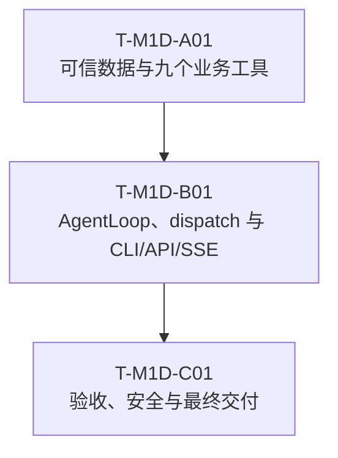

# Glodex M1d 全工具 AgentLoop 实施任务

| 字段 | 值 |
|---|---|
| Task Set ID | `GLO-TASKS-004` |
| 版本 | `0.1.0` |
| 状态 | Approved |
| 对应规格 | [`GLO-SPEC-004 v0.3.0`](./spec.md)（Approved） |
| 对应计划 | [`GLO-PLAN-004 v0.1.0`](./plan.md)（Approved） |
| 父基线 | `GLO-SPEC-000`、`GLO-SPEC-001`、`GLO-SPEC-002`、`GLO-SPEC-003` |
| 创建日期 | 2026-07-29 |
| 最后更新 | 2026-07-29 |
| 批准日期 | 2026-07-29 |

## 1. 执行约定

1. 任务精确为 `T-M1D-A01 → T-M1D-B01 → T-M1D-C01` 三个串行交付块。块内可以
   并行开发，但不得按单个工具、Provider、文件、错误码或 AC 再创建 Task ID。
2. 每块整体执行 RED→GREEN：先取得因本块能力缺失而失败的方向性证据，再完成该块
   全部最小生产实现；不要求为了留痕拆成大量微型 commit。
3. Task 1 必须一次闭合九个业务工具、数据和事实链；Task 2 必须一次闭合
   AgentLoop、真实 `dispatch_tool` 和全部入口；Task 3 只聚合跨层验收与交付证据。
4. Task 1 只冻结 `dispatch_tool` DTO、名字和预算合同，不注册 placeholder；
   完整可运行的十项静态 registry 由 Task 2 关闭。
5. 自动化只在 production 边界下方使用 Fake/MockTransport：
   - DeepSeek Fake 返回 Provider-shaped action bytes；
   - Tavily/DashScope 使用生产 HTTP adapter + `httpx.MockTransport`；
   - eBay 复用生产 Capture/mapper/publisher 边界下方的 Fake page source；
   - 最终推荐必须经过真实 `SearchService`，不能 Fake 最终结果。
6. 所有 pytest 子进程显式加载 `-p scripts.verify_m0`，使 skip/xfail/xpass 失败。
   禁止 `-k`、单节点选择、`--lf`、`--ff`、宽松断言或自动更新 Golden 缩小门禁。
7. Task 1/2 只运行本块方向性测试、lint/type 和指定父回归；不得执行完整旧 runner、
   性能工作负载或组合 live smoke。最终完整父门禁只在 Task 3 运行一次。
8. 版本化 Card/item embedding 的 Operator-only 构建是 Task 1 唯一允许的真实数据
   构建外呼；它不属于 request-time smoke，不进入 pytest/runner，不保存 credential
   或 Provider 正文。
9. 用户可见需求变化先回 Spec；工具集合、公开合同、Provider、技术路线或依赖变化先
   回 Plan。等价拆分私有 helper 不构成新 Task。
10. 不提交 credential、`.env`、真实 query/Provider response、terminal 输出、live
    artifact、外部 output root 或 `项目架构/` 下 26 张 PNG。

统一 pytest 形式：

```bash
uv run --locked python -m pytest -q -p scripts.verify_m0 <固定测试路径>
```

## 2. 保留亮点与不过度实现边界

必须保留：

- 精确九个真实业务工具：
  `planner`、`chat_fallback`、`web_search`、`category_insight`、`item_search`、
  `item_picker`、`price_compare`、`shipping_calc`、`shopping_summary`；
- 一个非业务元工具 `dispatch_tool`，完整 registry 恰好 `9 + 1`，root terminal
  恰好 `shopping_summary/chat_fallback`；
- 有界 root/child AgentLoop、depth 2、最多四个 child、typed return 和稳定合流；
- 本地 Cards + BM25 + DashScope vector + RRF 的 Hybrid RAG；
- 四平台版本化 Demo semantic recall、Tavily Web evidence 和显式 live eBay；
- 精确/估算/未知金额语义、共享 Eligibility、确定性 picker/rebinding，以及现有
  `SearchService` 最终发布门禁；
- 独立 `AgentDemoResponse`、CLI、Agent API/SSE，默认 Search 合同不变；
- exact `6 P0 / 6 AC / 6 NFR`、一次组合 live smoke、最后一次完整门禁。

明确不实现：

- LangChain、LangGraph、通用 Agent/Provider/LLM Gateway、动态 registry、插件或
  `BaseTool` 层级；
- 第二套金额、Eligibility、Evidence、Ranking、Search DTO 或 grounded renderer；
- 数据库、Redis、队列、checkpoint、cache、retry/fallback、Token 计费或持久记忆；
- NumPy、向量数据库、ANN/HNSW、OpenSearch 或新增 runtime dependency；
- Amazon/Shopee/AliExpress live API、任意 URL fetch、网页正文抓取；
- M1a runtime 泛型化、完整 AG-UI SDK、WebSocket、前端、认证或生产部署。

`EligibilityEvaluator`、Candidate Store、EmbeddingSession、merge 和 rebinder 都是
runtime 基础设施，不得伪装成额外业务工具。

## 3. 依赖主链



## 4. Phase A：可信数据与九个业务工具

### `T-M1D-A01` `[RED→GREEN] [GATE]` 可信事实链、真实 adapters 与九工具

- [x] 状态：完成（2026-07-30；补齐 Category→picker 事实链，并修复 Tavily 投影与 eBay 固定 marketplace query 兼容性）
- 依赖：无
- Primary：
  - `GLO-M1D-P0-004`
  - `GLO-M1D-NFR-003`、`GLO-M1D-NFR-006`
- Supporting：
  - `GLO-M1D-P0-001`、`GLO-M1D-P0-002`、`GLO-M1D-P0-003`、
    `GLO-M1D-P0-005`、`GLO-M1D-P0-006`
  - `M1D-AC-002`、`M1D-AC-003`、`M1D-AC-004`、`M1D-AC-005`、
    `M1D-AC-006`
  - `GLO-M1D-NFR-001`、`GLO-M1D-NFR-002`、`GLO-M1D-NFR-004`、
    `GLO-M1D-NFR-005`
- 主要路径：
  - `src/glodex/application/eligibility_evaluator.py`
  - `src/glodex/application/agent/{__init__,contracts,ports,state,catalog,tools}.py`
  - `src/glodex/adapters/{agent_live_http,agent_indexes,agent_item_search}.py`
  - `src/glodex/application/search_service.py`
  - `data/snapshots/m1d-demo-v1/`、`data/agent/m1d-demo-v1/`
  - `scripts/generate_m1d_demo_assets.py`
  - `scripts/check_traceability.py`、`scripts/verify_m0.py`、`tests/conftest.py`
  - 既有 dependency/import/M1a/M1b/M1c architecture tests
  - `tests/m1d/{conftest.py,unit,contract,architecture}/`

内部实现顺序固定为：

```text
contracts / ports / state / budget
  → SearchService characterization
  → evaluate_eligibility() extraction + parity
  → Candidate Store / mode guard / FX view / merge / rebinder / gateway
  → versioned Snapshot / Cards / indexes / rules
  → bounded Tavily / DashScope / eBay adapters
  → 九个业务工具
  → production business-tool executor 的 Fake 全链
```

#### RED

- exact name inventory 不是九个 business + 一个 dispatch contract，或 terminal 不是
  两个；selector/runtime input 未 strict/frozen/extra-forbid，模型可伪造 query、
  Provider、Snapshot、record ref、candidate/selected ID；
- 尚未抽取共享 evaluator，或相同 batch/intent 的 eligible identity、stage counts、
  rejection reasons、终态和既有 Golden 无法证明完全 parity；
- evaluator 接受第二份 budget/context，shipping estimate 能进入 gate，或 Agent
  复制一套 Required/Hard Gate；
- Candidate 与 `platform_sub_batch` 不一致，platform/provider 归属来自模型，跨
  Snapshot 被直接聚合，FX/evidence 冲突未 fail closed；
- eBay Capture 只有 USD 时产生 `eligibility.pipeline-failed`，而不是通过 M1d FX
  evaluation view 得到真实 gate rejection；
- final rebinding 没有 candidate→canonical ID map，picker 非空却允许 final Search
  空结果，或 summary 没有调用
  `SearchService.execute_run(..., run_id=agent_run_id, observer=None)`；
- Demo manifest/hash/count、四平台非空、Card 品类覆盖、1024 维 finite vector、
  ruleset/FX Evidence 或 index version 任一不闭合；
- Category RAG 不是固定 BM25/cosine/RRF，Demo item search 退化为标题 substring，
  或纯 eBay 路径仍无条件请求 DashScope；
- Tavily/DashScope endpoint/auth/deadline/body/schema/次数可被输入覆盖，存在
  redirect/retry/fallback；eBay 绕过既有 Capture 边界；
- 任一业务工具缺 success、selector/precondition rejection、dependency failure、
  exact/one-more，或存在 placeholder/始终 unavailable；
- Web 价格进入商品事实、Unknown 被补零、estimate 放宽 gate、picker 接受伪造 ID，
  或 Fake 购物链绕过真实 SearchService；
- 新增 runtime dependency，HTTPX/Capture/Bearer import carve-out 过宽，默认父入口
  读取 M1d credential；
- M1d marker 拼写/ID 无法通过 references 校验，或历史 M0 phase broad tests 误收集
  `tests/m1d`。

#### GREEN

- 冻结 action/tool DTO、typed state、完整资源额度、safe Observation 与 canonical
  byte measurer；只定义 dispatch 合同，不注册空实现；
- 把现有 pricing + product/offer gates + eligibility assembly 抽成无状态
  `evaluate_eligibility()`，`SearchService` 在原 stage/try 内委托且父结果 parity；
- 完成 Candidate Store、单 Snapshot data-mode guard、eBay FX evaluation view、
  evidence-closed stable merge、rebinder map 和 strict in-memory gateway；
- 生成一个含四平台的 `m1d-demo-v1` 标准 Snapshot，以及 versioned Cards、item/card
  vectors、shipping rules 和完整 manifest/hash；
- 实现本地 BM25/exact cosine/RRF/reducer、价格/包装/FX、运费/关税 advisory；
- 实现两个固定 HTTP Provider adapter 和复用 M1b Capture 的 eBay item adapter；
- 一次交付九个业务工具，以 table-driven tests 闭合每工具四类边界；
- production business-tool executor 用 Fake transports 走通
  `planner → item → price → shipping → eligibility → picker →
  shopping_summary(real SearchService)`；
- M1d references profile、sanitizer、历史 M0 `--ignore=tests/m1d` 和精确 architecture
  carve-out 到位；依赖清单不变。

#### 完成

- 九个业务工具、Provider、数据、Eligibility parity、Evidence closure、final
  rebinding/publication gate 的方向性证据全部通过；
- Web facts、伪造 ID、Unknown 补零、仅靠 estimate 通过的接受率均为零；
- Demo/output 明确标记版本化非实时数据；
- 本块不要求 DeepSeek loop、fork、CLI、API 或 SSE；这不是 placeholder；
- 任一工具、数据、Provider 或事实链未闭合，不得进入 `T-M1D-B01`。

#### 验证

```bash
uv lock --check

uv run --locked python -m pytest -q -p scripts.verify_m0 \
  tests/m1d/unit \
  tests/m1d/contract \
  tests/m1d/architecture

uv run --locked python -m pytest -q -p scripts.verify_m0 \
  tests/contract/test_search_service_phase_d.py \
  tests/acceptance/test_golden_outputs.py \
  tests/architecture/test_dependency_allowlist.py \
  tests/architecture/test_import_boundaries.py \
  tests/m1a/architecture/test_m1a_boundaries.py \
  tests/m1b/architecture/test_m1b_boundaries.py \
  tests/m1c/architecture/test_m1c_boundaries.py

uv run --locked python scripts/check_traceability.py \
  --profile m1d --mode references

uv run --locked ruff check \
  src/glodex/application/eligibility_evaluator.py \
  src/glodex/application/agent \
  src/glodex/adapters/agent_live_http.py \
  src/glodex/adapters/agent_indexes.py \
  src/glodex/adapters/agent_item_search.py \
  src/glodex/application/search_service.py \
  tests/m1d \
  scripts/generate_m1d_demo_assets.py \
  scripts/check_traceability.py \
  scripts/verify_m0.py
uv run --locked mypy \
  src/glodex/application/eligibility_evaluator.py \
  src/glodex/application/agent \
  src/glodex/adapters/agent_live_http.py \
  src/glodex/adapters/agent_indexes.py \
  src/glodex/adapters/agent_item_search.py \
  src/glodex/application/search_service.py \
  scripts/generate_m1d_demo_assets.py \
  scripts/check_traceability.py \
  scripts/verify_m0.py
```

版本化 embedding 资产只在上述离线 contract 通过后，由 Operator 在不回显
credential/文本的进程中显式运行一次 approved asset builder；生成结果随后再次通过
manifest/hash/vector contract。该步骤不是 Agent live smoke。

## 5. Phase B：AgentLoop、dispatch 与全部入口

### `T-M1D-B01` `[RED→GREEN] [GATE]` Agent runtime、fork、CLI/API/SSE

- [x] 状态：完成（2026-07-30；补齐 production child/depth-2 可达路径与公开 API 证据）
- 依赖：`T-M1D-A01`
- Primary：
  - `GLO-M1D-P0-001`、`GLO-M1D-P0-002`、`GLO-M1D-P0-003`、
    `GLO-M1D-P0-005`、`GLO-M1D-P0-006`
  - `M1D-AC-001`、`M1D-AC-002`、`M1D-AC-003`、`M1D-AC-004`、
    `M1D-AC-005`、`M1D-AC-006`
  - `GLO-M1D-NFR-001`、`GLO-M1D-NFR-002`、`GLO-M1D-NFR-004`、
    `GLO-M1D-NFR-005`
- Supporting：
  - `GLO-M1D-P0-004`
  - `GLO-M1D-NFR-003`、`GLO-M1D-NFR-006`
- 主要路径：
  - `src/glodex/application/agent/runtime.py`
  - `src/glodex/application/agent/{contracts,ports,state,tools}.py`
  - `src/glodex/adapters/deepseek_agent.py`
  - `src/glodex/adapters/agent_item_search.py`
  - `src/glodex/agent_bootstrap.py`
  - `src/glodex/cli.py`
  - `src/glodex/api/{agent_contracts,agent_events,agent_runtime,agent_app}.py`
  - `tests/m1d/{unit,contract,acceptance,architecture}/`
  - 既有 CLI、M1a API/SSE、M1b Capture、M1c live activation tests

内部实现顺序固定为：

```text
DeepSeek action payload / strict parser
  → root state machine / phase / ledger / terminal
  → child runner / dispatch / typed merge
  → AgentExecution / result / observer / cleanup
  → agent_bootstrap + CLI
  → Agent API registry / coordinator / routes / SSE
  → full Fake acceptance + 定向父回归
```

#### RED

- DeepSeek 接受多个 action、未知字段、自然语言 final、原生 tool call、错误
  finish/reasoning/tool envelope，或 Observation 未真实进入下一模型轮；
- root 能越序、重复、终止后继续、绕过 planner/price/shipping/picker，或除
  `shopping_summary/chat_fallback` 外存在第三个 terminal；
- tree ledger 未统一执行模型、工具、dispatch、Provider、byte 和 deadline exact/
  one-more，资源耗尽后仍有后续调用；
- 完整 registry 少于或多于九个业务工具 + 一个真实 `dispatch_tool`，或把
  `return_fork_result`/Eligibility/merge 注册成工具；
- 1/2/4 平台没有 barrier 证明真并发，child 直接修改父 Store，合流不按 task 顺序，
  或部分失败后留下部分父状态；
- depth-1→depth-2 的合法 nested fork 不通，depth 2 再 fork、第五 child、child
  terminal、越 scope 工具或四平台后再 fork 未拒绝；
- child 未限制为一次模型 action/一次工作工具/runtime return，或事件泄漏 demands、
  args、typed result、prompt/CoT；
- eBay worker cancel/shutdown 后成为孤儿线程，终态后仍能合流或修改父状态；
- `AgentDemoResponse`、canonical selected IDs、FAILED 空字段、NO_MATCH/fallback
  分轨或 SearchResponse 保留语义不精确；
- CLI 允许请求切换 Provider/Snapshot mode，stdout 非一行 JSON，退出码错误，或旧
  command 因环境 key 自动启用 Agent；
- Agent API 未复用 strict POST wrapper/六态，timeout 不大于 240s，同 Thread 冲突、
  retention/replay/cursor/disconnect/shutdown 语义不闭合；
- Agent SSE event ID 不连续、child 事件跑出对应 fork bracket，或公开 query、
  action args、商品正文、Provider body、secret；
- 默认 Search app 出现 Agent route/import/credential 读取，或既有三路由、七事件、
  SearchResponse/M1c activation 发生变化。

#### GREEN

- DeepSeek adapter 复用已有 bounded transport，只实现固定 action payload、严格
  parser 和安全 error mapping；
- 显式 while state machine 完成 phase/precondition/loop/tree ledger 和唯二 root
  terminal，内部 ToolResult 与 safe Observation 分离；
- `asyncio.TaskGroup` 完成 1/2/4 平台 child、可信 nested scope、typed return 和
  父级原子稳定 merge；
- 完整静态 registry 恰好十项；child 使用相同 schema、effective policy 和共享只读
  vectors，但状态与结果隔离；
- AgentExecution、AgentDemoResponse、event observer、Candidate/vector/gateway
  finally cleanup 和 eBay worker drain 全部闭合；
- CLI 与独立 Agent API 使用同一个 Agent service/runtime；API 使用
  AgentRunStatusResponse、六态 registry/coordinator 和三个固定端点；
- 独立 `glodex.agent.event.v1` 实现连续序列、重放和安全 root/child projection；
- Fake DeepSeek 完成单平台、四平台、NO_MATCH、fallback、FAILED 五类全链；
- 默认 CLI/Search API/SSE/M1c live Intent 保持零隐式 Agent 行为。

#### 完成

- Fake DeepSeek 能从首轮 `planner` 到唯一终止工具完成完整 Run；
- dispatch 的并发、depth/count/tool/deadline/loop、typed merge、event ordering 和
  cleanup 均有确定性证据；
- CLI/API 共用同一 runtime，公开合同与默认父基线通过定向回归；
- Task 1/2 的全部 production 能力已经完成并冻结；
- 本块不执行真实 Provider smoke 或完整 `verify_m1d.py`；
- 任一 runtime/fork/入口边界未闭合，不得进入 `T-M1D-C01`。

#### 验证

```bash
uv run --locked python -m pytest -q -p scripts.verify_m0 \
  tests/m1d/unit \
  tests/m1d/contract \
  tests/m1d/acceptance \
  tests/m1d/architecture

uv run --locked python -m pytest -q -p scripts.verify_m0 \
  tests/acceptance/test_cli_walking_skeleton.py \
  tests/m1a/contract/test_http_api_contract.py \
  tests/m1a/contract/test_sse_contract.py \
  tests/m1b/contract/test_m1b_snapshot_roundtrip.py \
  tests/m1c/contract/test_live_activation.py

uv run --locked python scripts/check_traceability.py \
  --profile m1d --mode references

uv run --locked ruff check \
  src/glodex/application/agent \
  src/glodex/adapters/deepseek_agent.py \
  src/glodex/adapters/agent_item_search.py \
  src/glodex/agent_bootstrap.py \
  src/glodex/cli.py \
  src/glodex/api/agent_contracts.py \
  src/glodex/api/agent_events.py \
  src/glodex/api/agent_runtime.py \
  src/glodex/api/agent_app.py \
  tests/m1d
uv run --locked mypy \
  src/glodex/application/agent \
  src/glodex/adapters/deepseek_agent.py \
  src/glodex/adapters/agent_item_search.py \
  src/glodex/agent_bootstrap.py \
  src/glodex/cli.py \
  src/glodex/api/agent_contracts.py \
  src/glodex/api/agent_events.py \
  src/glodex/api/agent_runtime.py \
  src/glodex/api/agent_app.py
```

## 6. Phase C：验收、安全与最终交付

### `T-M1D-C01` `[RED→GREEN] [DOC] [GATE]` 跨层证据、live smoke 与最终门禁

- [x] 状态：完成（2026-07-30；组合 live smoke 以可信 `NO_MATCH` 收束，最终完整门禁通过）
- 依赖：`T-M1D-B01`
- Primary：无；全部生产需求已由 `T-M1D-A01/B01` 关闭
- Supporting：
  - `GLO-M1D-P0-001`～`GLO-M1D-P0-006`
  - `M1D-AC-001`～`M1D-AC-006`
  - `GLO-M1D-NFR-001`～`GLO-M1D-NFR-006`
- 主要路径：
  - `scripts/verify_m1d.py`
  - `tests/m1d/acceptance/`
  - `tests/m1d/architecture/`、`tests/m1d/nfr/`
  - `tests/m1d/unit/test_verify_m1d_runner.py`
  - `README.md`
  - `specs/004-glodex-m1d-agent-demo/{spec,tasks,verification}.md`

本任务不得修改：

- `src/glodex/**`；
- `data/snapshots/m1d-demo-v1/**`、`data/agent/m1d-demo-v1/**`；
- `scripts/generate_m1d_demo_assets.py`；
- `pyproject.toml`、`uv.lock`；
- 既有 Golden 或业务期望值。

若最终验收发现工具、数据、Provider、evaluator、Candidate Store 或 rebinder 缺陷，
立即停止并重开 `T-M1D-A01`；若发现 loop、fork、cleanup、CLI/API/SSE 缺陷，立即
停止并重开 `T-M1D-B01`。修复并通过所属方向性 Gate 后才能重新进入本任务。

#### RED

- M1d checker inventory 不是 exact `6/6/6`，marker 拼写/引用错误，AC marker 不在
  真实 black-box test，或 coverage 依赖 skip/xfail/xpass；
- 六个 AC/六个 NFR 的跨层代表场景不能从公开 CLI/API/SSE/result 重建；
- architecture/import/dependency、default fresh-process、outbound allowlist、secret/
  log/event/Git/PNG inventory 任一缺失；
- `verify_m1d.py` 不是固定五步、未先完整执行 `verify_m1c.py`、pytest 未加载 strict
  plugin，或 runner 含过滤/节点选择/live/Golden 更新；
- README 未披露外发字段、Demo/live 区别、estimate/Unknown、无完整 AG-UI/生产 SLA；
- smoke checklist 允许 retry、保存动态正文或在完整方向性 Fake gate 前出站；
- verification 在取得真实证据前预填成功，或保存 query、prompt、response、
  credential、output root、terminal 输出。

#### GREEN

- 聚合 AC-001～006 的真实 black-box tests，以及 architecture/NFR/security/Git
  evidence；不复制 Task 1/2 已有完整矩阵；
- `check_traceability.py --profile m1d` references/coverage 精确闭合；
- 新增 fail-fast `verify_m1d.py`，固定：
  1. 完整 `verify_m1c.py`；
  2. M1d architecture + NFR；
  3. M1d unit + contract；
  4. M1D-AC-001～006；
  5. M1d exact coverage；
- README 只描述实际 activation、数据披露、资源上限、失败语义与明确限制；
- 所有方向性 Fake/contract 和快速安全清单绿色后，只执行一次组合 live smoke；
- live 成功后，最后且仅最后执行一次完整 `verify_m1d.py`；
- 取得真实证据后才创建 `verification.md`，只记录 Provider/model、请求计数、工具名、
  安全终态和自动证据引用。

#### 完成

- exact `6 P0 / 6 AC / 6 NFR` 双向闭合，无 placeholder、skip、xfail 或 xpass；
- 一次 DeepSeek/Tavily/DashScope/eBay 组合 smoke 达到批准的调用预算，并形成
  `COMPLETED` 或可信 `NO_MATCH`；
- `verify_m1d.py`、Git/secret/PNG inventory 和 `git diff --check` 通过；
- `.env`、dynamic body、live snapshot/receipt、外部 output root 和 26 张 PNG 均未
  被 tracked/staged；
- Spec Definition of Done、Tasks 状态和 verification 只记录已经取得的事实；
- M1d 达到可交付状态。

#### 验证

先运行本任务新增的跨层和安全证据：

```bash
uv run --locked python -m pytest -q -p scripts.verify_m0 \
  tests/m1d/acceptance \
  tests/m1d/architecture \
  tests/m1d/nfr

uv run --locked python scripts/check_traceability.py \
  --profile m1d --mode references
uv run --locked python scripts/check_traceability.py \
  --profile m1d --mode coverage
```

组合 smoke 前只复核固定快速清单，不执行完整父门禁：

```bash
uv run --locked python -m pytest -q -p scripts.verify_m0 \
  tests/m1d/contract/test_agent_live_http.py \
  tests/m1d/contract/test_agent_item_sources.py \
  tests/m1d/unit/test_agent_contracts_state.py \
  tests/m1d/nfr/test_m1d_offline_security.py
```

Operator 在不回显 ignored `.env` 内容的 shell 中加载 credential，并使用仓库外安全
output root 执行一次：

```bash
uv run --locked glodex agent-demo --live --live-data \
  --query "在 eBay 找手机，先分析品类并参考近期评测" \
  --locale zh-CN --currency CNY --top-k 3 \
  --output-root /absolute/external/glodex-m1d-live
```

不自动 retry；若 Provider 或生产路径失败，记录安全 code，回到所属 Task 修复后重新
取得用户对 live 重试的确认。

live smoke 通过后，最后且仅最后执行：

```bash
uv run --locked python scripts/verify_m1d.py
```

创建/更新 `verification.md` 和状态文档后，只复核新文档本身，不重复完整 runner：

```bash
uv run --locked python -m pytest -q -p scripts.verify_m0 \
  tests/m1d/nfr/test_m1d_offline_security.py \
  tests/m1d/unit/test_verify_m1d_runner.py
git diff --check
```

## 7. 文件所有权与 Gate

| 文件组 | Primary owner |
|---|---|
| `application/eligibility_evaluator.py`、`application/agent/{contracts,ports,state,catalog}.py` | `A01` |
| `application/agent/tools.py` 的九业务工具、Candidate/summary 事实链 | `A01` |
| `adapters/{agent_live_http,agent_indexes,agent_item_search}.py`、M1d data/assets/generator | `A01` |
| `search_service.py` evaluator 委托、traceability references、sanitizer、legacy architecture carve-out | `A01` |
| `application/agent/runtime.py`、`deepseek_agent.py`、完整十项 registry/dispatch wiring | `B01` |
| `agent_bootstrap.py`、`cli.py` 的 Agent 分支、`api/agent_*.py` | `B01` |
| Agent runtime/fork/CLI/API/SSE tests 与定向父回归 | `B01` |
| `verify_m1d.py`、最终 AC/NFR/security、README、verification/status docs | `C01` |
| runtime dependency、默认 Search DTO/routes/events、M1b Capture contract | 不改变 |

等价的小型私有 helper 可以由当前 Owner 拆分；新增职责、工具、Provider、公共合同或
依赖必须停止并回 Plan。

发现前序缺口时回到原 Owner 并重跑其 Gate，不在后序任务“顺手修改”。

## 8. 需求追踪

Primary 归属唯一；Supporting 可以重复引用，但不能替代 Primary 的完成条件。

### 8.1 P0

| ID | Primary | Supporting/final evidence |
|---|---|---|
| `GLO-M1D-P0-001` | `B01` | `A01` default boundaries；`C01` parent-first runner |
| `GLO-M1D-P0-002` | `B01` | `A01` nine business tools；`C01` inventory |
| `GLO-M1D-P0-003` | `B01` | `A01` action/tool contracts；`C01` AC matrix |
| `GLO-M1D-P0-004` | `A01` | `B01` full path；`C01` live separation |
| `GLO-M1D-P0-005` | `B01` | `A01` typed merge contracts；`C01` AC-005 |
| `GLO-M1D-P0-006` | `B01` | `A01` safe contracts；`C01` final security |

### 8.2 AC

| ID | Primary | Supporting/final evidence |
|---|---|---|
| `M1D-AC-001` | `B01` | `C01` complete M0–M1c-first gate |
| `M1D-AC-002` | `B01` | `A01` nine business tools；`C01` coverage |
| `M1D-AC-003` | `B01` | `A01` deterministic business chain；`C01` black-box |
| `M1D-AC-004` | `B01` | `A01` Provider contracts；`C01` live smoke |
| `M1D-AC-005` | `B01` | `A01` merge/rebinder；`C01` black-box |
| `M1D-AC-006` | `B01` | `A01` bounded adapters；`C01` security/live record |

### 8.3 NFR

| ID | Primary | Supporting/final evidence |
|---|---|---|
| `GLO-M1D-NFR-001` | `B01` | `A01` zero dependency/default imports；`C01` full parent gate |
| `GLO-M1D-NFR-002` | `B01` | `A01` nine tool contracts；`C01` inventory |
| `GLO-M1D-NFR-003` | `A01` | `B01` full mutation path；`C01` AC/NFR aggregate |
| `GLO-M1D-NFR-004` | `B01` | `A01` Provider/tool caps；`C01` runner |
| `GLO-M1D-NFR-005` | `B01` | `A01` outbound capture；`C01` Git/live scan |
| `GLO-M1D-NFR-006` | `A01` | `B01` Agent SSE Golden；`C01` final lint/type |

每个 AC marker 只能放在具体 `@pytest.mark.acceptance` black-box test 上；不得使用
module/file-level marker 虚报覆盖。Primary task 完成不等于删除 Supporting/final
证据。

## 9. Tasks 审批门禁

- [x] Tasks 状态改为 `Approved` 并记录批准日期；
- [x] 用户确认任务精确为 `A01 → B01 → C01` 三项，不再拆微任务；
- [x] 用户确认 Task 1 一次交付九个真实业务工具、数据、Provider 和事实链；
- [x] 用户确认 Task 1 不注册 placeholder dispatch，Task 2 关闭完整十项 registry；
- [x] 用户确认 Task 2 结束时全部 production 能力冻结；
- [x] 用户确认 Task 3 不修改 production/data/dependency，缺陷退回原 Owner；
- [x] 用户确认 Task 1 的 embedding asset build 是独立 Operator-only 数据构建；
- [x] 用户确认 Task 1/2 只跑方向性门禁，Task 3 只执行一次组合 live smoke 和一次
      完整 `verify_m1d.py`；
- [x] `6 P0 / 6 AC / 6 NFR` 的 Primary/Supporting 归属完整且 Primary 唯一。
