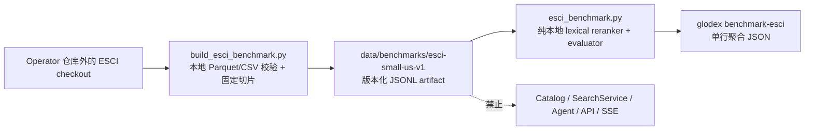

# Glodex M1e ESCI 公开检索基准技术实施计划

| 字段 | 值 |
|---|---|
| Plan ID | `GLO-PLAN-005` |
| 版本 | `0.1.0` |
| 状态 | Approved |
| 对应规格 | [`GLO-SPEC-005 v0.1.0`](./spec.md)（Approved） |
| 父基线 | [`GLO-SPEC-000`](../000-glodex-mvp/spec.md)、[`GLO-SPEC-004`](../004-glodex-m1d-agent-demo/spec.md) |
| 里程碑 | M1e：公开 ESCI 离线检索/重排基准 |
| 创建日期 | 2026-07-30 |
| 最后更新 | 2026-07-30 |
| 批准日期 | 2026-07-30 |

## 1. 计划目标与实现预算

M1e 只交付一个可复现的、历史离线的检索 benchmark。它用 ESCI 给定的 query 候选池
验证一个确定性文本排序器；它不发布商品、不调用 marketplace，也不改变任何购物结果。

实施预算固定为：

- Tasks 阶段精确形成 `A → B → C` 三个串行交付块；不按数据字段、指标或 CLI 错误码
  再拆任务；
- 仅增加 **一个 build-only 开发依赖** `pyarrow`，只供显式
  `scripts/build_esci_benchmark.py` 读取本地 Parquet。普通安装、运行时、API、Agent 和
  evaluator 继续只用现有依赖与标准库；锁文件固定实际版本；
- 新增一个 ESCI 专用模块，而不是通用 benchmark framework、DataMode、Provider 或 plugin
  系统；不复用 M1d 的 Agent index、registry 或购物发布链；
- 只增加一个显式 `glodex benchmark-esci` 子命令。它不读 `glodex.toml`、环境凭据或网络；
- 原始 ESCI checkout 必须在仓库外。M1e 只允许提交小于 20 MiB 的派生 JSONL artifact、
  attribution、`LICENSE`、`NOTICE` 和 manifest；
- 不实现向量、embedding、LLM、训练、缓存、数据库、ANN、网页抓取、live adapter，亦不
  触碰 `LocalSnapshotCatalog`、`SearchService`、Agent、API、SSE 或默认命令；
- 真实源数据到位前，可用临时微型 Parquet fixture 验证构建器。真实派生 artifact 只能由
  Operator 对已下载的官方 release 显式构建，不能由 pytest 或普通 CLI 下载。

选择 `pyarrow` 是为了解析上游真实的两份 Parquet，而不是引入数据平台：没有它就需要手工
转换输入，反而不可复现。`shopping_queries_dataset_sources.csv` 用标准库 CSV 只做严格
校验和 provenance 哈希，不进入 benchmark 内容。

任何扩大语种、样本、数据源、指标、算法，或把这个 benchmark 接入购物发布链的变更，都
必须先回到 Spec/Plan。

## 2. 冻结的架构边界



依赖方向固定为：

```text
scripts/build_esci_benchmark.py ──build time──> data/benchmarks/esci-small-us-v1/
src/glodex/esci_benchmark.py ──read only──> data/benchmarks/esci-small-us-v1/
src/glodex/cli.py ──explicit command──> src/glodex/esci_benchmark.py
```

`src/glodex/esci_benchmark.py` 是单一、专用的读取/排序/计量模块。它不导入
`glodex.application`、`glodex.adapters`、`glodex.api`、`glodex.agent_bootstrap` 或
`glodex.capture`。反向依赖也禁止：现有生产路径不得导入这个模块或扫描
`data/benchmarks/`。

## 3. 受控输入与确定性 artifact

### 3.1 Operator-only 输入合同

构建命令的唯一形式为：

```bash
uv run --group dev --locked python scripts/build_esci_benchmark.py \
  --source-root /absolute/path/to/esci-data-checkout \
  --source-revision <40-hex-upstream-commit> \
  --output-root data/benchmarks/esci-small-us-v1
```

`--source-root` 是官方 `amazon-science/esci-data` checkout 根目录，必须同时拥有
`LICENSE`、`NOTICE` 和下列文件：

```text
shopping_queries_dataset/shopping_queries_dataset_examples.parquet
shopping_queries_dataset/shopping_queries_dataset_products.parquet
shopping_queries_dataset/shopping_queries_dataset_sources.csv
```

构建器不 clone、download、HTTP 请求或读取环境变量。它拒绝非绝对、仓库内或缺少上列文件
的 source root；`--source-revision` 必须是完整 40 位十六进制提交 ID，构建器只记录它而
不自行调用 git。输出目标如已存在则拒绝覆盖；成功时先写 sibling 临时目录、完整验证和
hash 后原子 rename。这样不会用损坏的部分输出替换已审查 artifact。

输入 schema 固定为上游 README 所列的**完整且有序**列：

| 文件 | 必须列 |
|---|---|
| `examples.parquet` | `example_id`, `query`, `query_id`, `product_id`, `product_locale`, `esci_label`, `small_version`, `large_version`, `split` |
| `products.parquet` | `product_id`, `product_title`, `product_description`, `product_bullet_point`, `product_brand`, `product_color`, `product_locale` |
| `sources.csv` | `query_id`, `source` |

未知、缺失或重排序列，重复 identity、空 query/title、无效 `us` locale、未知 E/S/C/I
label，或无法关联的已选 query/product 都 fail closed。描述、bullet、brand、color 是
上游可空的补充文本；只有这些字段可被规范化为 `""`，不会虚构内容。

### 3.2 固定切片

构建器只保留：

```text
small_version == 1
AND split == "test"
AND product_locale == "us"
```

为保证选择不依赖 Parquet 行顺序：

1. 使用常量 seed `glodex-esci-small-us-v1` 计算
   `SHA-256(seed + "\\0" + query_id)`；按该 digest、再按 `query_id` 选择前 500 个 query；
2. 每个入选 query 的候选行按 `example_id`、再按 `product_id` 排序，保留前 20 条；
3. 不按 ESCI label、文本分数或产品内容筛选；每个入选 query 必须保留 `1..20` 个候选；
4. product identity 固定为 `(product_locale, product_id)`，本版本 locale 只能是 `us`；
   JSONL 中使用稳定 `product_id`，不存在任何重新编号。

这不是统计抽样或训练集；它只是一个固定、有界、可审计的 test-pool slice。改变 seed、
筛选、上游 revision、输入 SHA 或列集会产生不同的 benchmark，必须改版本号并重新批准。

### 3.3 Artifact 文件与 manifest

成功输出目录严格只允许以下文件，所有文本均为 UTF-8、LF 结尾、canonical JSON
(`sort_keys=True`、紧凑分隔符) 且稳定 ID 排序：

```text
ATTRIBUTION.md
LICENSE
NOTICE
manifest.json
products.jsonl
queries.jsonl
judgements.jsonl
```

| 文件 | 允许内容 |
|---|---|
| `queries.jsonl` | `query_id`, `query` |
| `products.jsonl` | `product_id`, `product_locale`, `product_title`, `product_description`, `product_bullet_point`, `product_brand`, `product_color` |
| `judgements.jsonl` | `query_id`, `product_id`, `label`；label 固定为 `Exact`、`Substitute`、`Complement`、`Irrelevant` |
| `ATTRIBUTION.md` | 官方仓库、commit、数据集名、论文引用、Apache-2.0 与“历史离线 benchmark，非 Amazon live 数据”声明 |
| `LICENSE`、`NOTICE` | 上游文件的逐字节副本 |

`manifest.json` 不能含时间戳、本机路径、原始行或 query/商品正文。它精确记录：

- `schema_version`、`benchmark_id=esci-small-us-v1`、静态 builder version 和 scorer version；
- 上游仓库 URL、`source_revision`、三个输入文件相对路径、字节数及 SHA-256；
- 固定 locale/split/small-version、seed、query/candidate 选择规则和上限；
- 每个 artifact 文件的 SHA-256/字节数、query/product/judgement 总数、label 分布；
- Apache-2.0、`LICENSE`、`NOTICE` 与 attribution 的存在性声明。

Builder 自己重新加载 staging artifact 检查 manifest 和三个 JSONL 的闭合关系、hash、大小和
20 MiB 总上限后才发布。普通 reader 以同样的规则 fail closed；不允许附加文件、软链接、
未记录文件或静默 schema 迁移。

## 4. 纯本地排序与指标

### 4.1 Label 隔离和 scorer

读取路径必须物理分成两步：`load_candidate_pool()` 只产生 query、products 和每 query 的
候选 product IDs；`load_judgements()` 只能由 evaluator 在排序完成后调用。scorer 的参数
和返回值都没有 label 字段，测试会故意改变 label 而要求排序字节不变。

首发 scorer 是一份固定的 lexical BM25 baseline，而不是伪装的智能推荐：

- 只对同一 query 的上游候选池重新排序；不得从其它 query、全库或网络召回候选；
- query 和产品文本做 `NFKC`、`casefold`、ASCII 英数字 token 化；固定 field weights 为
  `title=3`、`description=1`、`bullet_point=1`、`brand=1`、`color=1`；
- 在该 query 的候选池上计算 BM25，固定 `k1=1.2`、`b=0.75`；无匹配分数为零；
- 数值降序，完全相同分数以 `product_id` 升序打破平局；不使用随机数、clock、模型、环境或
  label。

Artifact reader 的完整性校验、scorer、metric 都是内存纯函数，普通 benchmark evaluation
不需要 `pyarrow`。构建器与 runtime 不共享可变 global state。

### 4.2 固定指标

对每个 query 的排序前 10 项计算：

- `Exact@10`：前十至少有一个 `Exact` 的 query 比例；
- `MRR@10`：第一个 `Exact` 的 reciprocal rank，只以候选池中原本有 `Exact` 的 query 为
  分母；没有 `Exact` 的 query 另行报告为 excluded；
- `nDCG@10`：gain 固定 `Exact=3`、`Substitute=2`、`Complement=1`、`Irrelevant=0`，
  `DCG = Σ(2^gain - 1) / log2(rank + 1)`，以同一候选池的理想顺序归一化。IDCG 为零的
  query 不进入 nDCG 分母，并在摘要中报告 excluded 数。

结果的数值统一 round 到 12 位小数后进入 canonical 单行 JSON。摘要明确包含每个指标的
分母、排除数、label 分布、样本计数、artifact ID/hash 与 scorer version，因此不会把
“没有 Exact”误报成零质量或把历史测试池误报成实时搜索效果。

## 5. CLI 合同与默认兼容性

新增子命令：

```bash
glodex benchmark-esci \
  --artifact-root data/benchmarks/esci-small-us-v1
```

它的默认 artifact root 即上列版本化目录；参数只接受路径，不能带 query、provider、
URL、model、credential、locale、seed 或配置覆盖。CLI 在当前 `load_config()` 之前分派这个
命令，故它不要求 `glodex.toml`，也不会读取 M0–M1d 的配置/凭据。成功 stdout 恰是一行
聚合 JSON，包含状态、benchmark/source/scorer 标识、计数、label 分布、指标、分母和排除
计数；不含 query、商品文本、label 行、source path 或原始数据。

无效路径、损坏 artifact、manifest/hash/schema/size 不符一律输出安全 code 的单行 JSON
并以退出码 `1` 失败；argparse 使用错误仍为退出码 `2`。不新建 SearchResponse、API DTO 或
泛化 CLI 框架。既有 `demo`、`search`、`validate-snapshot`、`capture-provider`、`agent-demo`
的解析、stdout、exit code、默认数据加载和 Golden bytes 必须完全不变。

## 6. 测试、可追溯性与最终门禁

实现时只创建 `tests/m1e/{unit,contract,acceptance,architecture,nfr}/`。M1e 测试不读取
真实 source checkout、不发 socket、不读环境凭据；build 契约使用临时极小 Parquet/CSV
fixture，artifact/evaluator/CLI 契约使用受控小 JSONL fixture。

| 验证层 | 最小证据 | 关联需求 |
|---|---|---|
| build/unit | 精确 input schema、过滤、stable selection、空值规范化、atomic/duplicate/size/hash 拒绝和逐字节重建 | `GLO-M1E-P0-001`、`GLO-M1E-P0-002`、`M1E-AC-001`、`M1E-AC-002` |
| evaluator/unit | scorer 不接收 label、tie-break、BM25 固定参数、每项指标/分母/zero-IDCG 算例 | `GLO-M1E-P0-003`、`M1E-AC-003`、`GLO-M1E-NFR-004` |
| CLI/contract | 不读 config/环境、单行聚合 JSON、无正文/路径泄漏、损坏输入安全失败 | `M1E-AC-004`、`GLO-M1E-NFR-001`、`GLO-M1E-NFR-003` |
| architecture/nfr | import graph、无 socket、无 M1d 触点、raw/source 文件未跟踪、默认命令和既有 Golden 不变 | `GLO-M1E-P0-004`、`GLO-M1E-NFR-001`、`GLO-M1E-NFR-002`、`GLO-M1E-NFR-003`、`GLO-M1E-NFR-004` |
| acceptance | 从 fixture artifact 的公开 CLI 完整评测；构建后 manifest/许可证闭合；先执行 M1d 完整 parent gate | 全部 `M1E-AC-*` |

`scripts/check_traceability.py` 只增加一个显式 `m1e` profile：其 spec 路径为本目录
`spec.md`，受管测试根为 `tests/m1e`，库存精确为 `4 P0 / 4 NFR / 4 AC`。正则仅扩展到
`GLO-M1E-*`/`M1E-AC-*`；M1e 的 P0/NFR 保持既有的 Markdown table 定义形状，AC 保持既有
heading 形状，不改变既有 profile 的归属规则或放宽 coverage。

新增 `scripts/verify_m1e.py`，按固定顺序执行且 fail-fast：

1. `uv run --locked python scripts/verify_m1d.py`（完整 M0–M1d parent gate，只执行一次）；
2. M1e `architecture` 和 `nfr`；
3. M1e `unit` 和 `contract`；
4. M1e `acceptance`；
5. `scripts/check_traceability.py --profile m1e --mode coverage`。

M0 gate 已涵盖 `uv lock --check`、format、ruff 与 mypy；依赖更新后它必须仍通过。阶段 A/B
只跑本块的方向性测试和相关 lint/type；真实 artifact build 是一次显式 Operator 步骤，
不塞进 pytest 或最终 runner。

## 7. 拟定的三个交付块（供 Tasks 阶段展开）

### A. 受控构建器与版本化 artifact

新增 build-only `pyarrow`、严格 builder、manifest/attribution 模板、精确 raw-data
ignore 保护及小型临时 source fixture。先做 schema/identity/hash/size/重建 RED tests，随后
完成一次真实 Operator build（若官方 source checkout 已提供）。这个块不改 CLI，不做
排序，也不让 artifact 被任何既有 runtime 加载。

### B. 隔离 evaluator 与显式 CLI

新增专用 artifact reader、candidate-only BM25、label-after-ranking evaluator 与
`benchmark-esci` 分派。先证明 label 改变不影响 ranking、metrics 精确、CLI 只输出聚合值，
再接入 parser。这个块不导入 M1d Agent，也不新建 API/SSE。

### C. 边界收口与交付证据

补齐 architecture/NFR/acceptance、M1e traceability profile、`verify_m1e.py`、根 README
的简短数据来源说明和 artifact attribution。最后只执行一次完整 M1d→M1e 门禁；检查
`git diff --check`、锁文件和 Git 暂存内容，确认没有 Parquet、CSV、source checkout、
凭据、原始文本日志或 `项目架构/` PNG 被纳入提交。

## 8. Plan Definition of Ready（进入 Tasks 前）

- [x] 本 Plan 状态改为 `Approved` 并记录批准日期；
- [x] 用户确认唯一新增依赖是 build-only `pyarrow`，普通 runtime 不扩依赖；
- [x] 用户确认真实 ESCI checkout 由 Operator 放在仓库外，并在 Implementation 时提供
      source root 与完整 upstream revision；
- [x] 用户确认 `esci-small-us-v1` 是历史、英文 US、test-pool 的离线 baseline，不等同于
      Amazon live 搜索或商品推荐；
- [x] 用户确认精确三个交付块、`4 P0 / 4 AC / 4 NFR`、`m1e` traceability profile 和
      M1d-first final gate；
- [x] 用户确认不新增 DataMode、Provider、Agent tool、API/SSE、数据库、向量/LLM 或第二个
      公开数据集。
