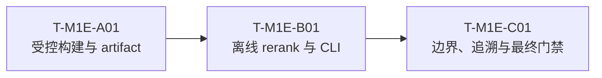

# Glodex M1e ESCI 公开检索基准实施任务

| 字段 | 值 |
|---|---|
| Task Set ID | `GLO-TASKS-005` |
| 版本 | `0.1.0` |
| 状态 | Approved |
| 实施状态 | Completed; official-source artifact built and verified |
| 对应规格 | [`GLO-SPEC-005 v0.1.0`](./spec.md)（Approved） |
| 对应计划 | [`GLO-PLAN-005 v0.1.0`](./plan.md)（Approved） |
| 父基线 | `GLO-SPEC-000`、`GLO-SPEC-004` |
| 创建日期 | 2026-07-30 |
| 最后更新 | 2026-07-30 |
| 批准日期 | 2026-07-30 |

## 1. 执行约定

1. 任务精确为 `T-M1E-A01 → T-M1E-B01 → T-M1E-C01` 三个串行交付块。块内可并行处理
   紧密相关的文件，但不得按字段、测试、指标或错误码再创建 Task ID。
2. 每块先取得因能力缺失而失败的方向性 RED 证据，再完成该块的全部最小 GREEN 实现；不为
   留痕拆成大量微型 commit 或临时框架。
3. `pyarrow` 是唯一新增依赖，且只在 build script 与它的测试环境中导入。Runtime、CLI
   evaluation、API、Agent 不得导入它或新增网络/凭据读取。
4. build 测试只使用临时微型 Parquet/CSV fixture；pytest、默认命令、最终 runner 不下载、
   clone 或读取真实 ESCI checkout。真实构建只能由显式 Operator 命令发起。
5. 真实 source root、Parquet、CSV、缓存、下载日志、token、Cookie、`.env`、完整 query/商品
   正文日志和 `项目架构/` 下 PNG 一律不进入 Git。只有被审查的 `esci-small-us-v1` 小型
   artifact、manifest、attribution、LICENSE/NOTICE 可以被提交。
6. M1e 只增 `src/glodex/esci_benchmark.py` 和 `benchmark-esci`。不新增 DataMode、Provider、
   Agent tool、API/SSE、数据库、向量/embedding/LLM 或泛化 benchmark 基础设施。
7. 每个 pytest 子进程显式加载 `-p scripts.verify_m0`；禁止 `-k`、单节点选择、`--lf`、
   `--ff`、宽松断言或把真实源数据塞进 fixture。
8. 改变 source revision、切片、seed、schema、指标、scorer、公共 CLI 或依赖边界，先回
   Spec/Plan；内部等价重构不产生新任务。

统一 pytest 形式：

```bash
uv run --locked python -m pytest -q -p scripts.verify_m0 <固定测试路径>
```

## 2. 依赖主链与不做的事



三个块共同明确不做：把 ESCI 放进 `CatalogBatch`、`LocalSnapshotCatalog`、
`SearchService`、Agent、API 或 SSE；也不构建 Amazon/Shopee/AliExpress live adapter、
训练数据管道、实时价格/库存/配送事实或用户购物推荐。

## 3. Phase A：受控构建与 artifact

### `T-M1E-A01` `[RED→GREEN] [GATE]` 严格 ESCI builder、许可与确定性小样本

- [x] 状态：Completed（2026-07-30；官方 ESCI checkout revision `7916cdf6ab75a462e77f20ab40428a10923998d5` 已生成并审查真实 artifact）
- 依赖：无
- Primary：
  - `GLO-M1E-P0-001`、`GLO-M1E-P0-002`
  - `M1E-AC-001`、`M1E-AC-002`
  - `GLO-M1E-NFR-002`
- Supporting：`GLO-M1E-NFR-001`、`GLO-M1E-NFR-003`、`GLO-M1E-NFR-004`
- 主要路径：
  - `pyproject.toml`、`uv.lock`
  - `scripts/build_esci_benchmark.py`
  - `.gitignore`（只增加针对 ESCI raw source 的窄规则）
  - `data/benchmarks/esci-small-us-v1/`（仅在真实 Operator build 成功后）
  - `tests/m1e/{conftest.py,unit/test_esci_builder.py,contract/test_esci_artifact.py}`

#### RED

- schema 能接受未知、缺失或重排序列，或者 source root 位于仓库内、隐式联网、可覆写既有
  输出；
- 过滤不精确为 `small_version=1 / test / us`，selection 依赖输入行顺序，或按 label/text
  选择样本；
- 重复 identity、空 query/title、未知 E/S/C/I、断开的 product relation、超 500 query、
  超 20 candidate/query、超 20 MiB、未记录 hash/revision/许可仍可生成；
- manifest 包含时间、本机路径或原始正文；生成目录有多余文件、软链接，或者 `LICENSE`/
  `NOTICE` 不是逐字节副本；
- 同一 fixture 的两次 build 不能得到逐字节相同的 artifact。

#### GREEN

- 在 dev group 添加并锁定唯一的 `pyarrow`，仅在 builder 与 builder 测试导入；
- 严格读取官方指定的 examples/products Parquet 和 sources CSV，验证完整有序列、三个
  输入 SHA-256、40 位 source revision、Apache-2.0 文件和所有 identity；
- 实现固定 hash seed、最多 500 个 query、按 `example_id/product_id` 选择最多 20 候选、
  可空补充文本规范化、E/S/C/I→四个 canonical label 的纯本地构建；
- 原子生成并自检严格的 JSONL/manifest/attribution/LICENSE/NOTICE 目录；避免 timestamp、
  source path、原始行和意外文件；
- 用临时真实格式 fixture 验证 build/拒绝矩阵和 byte-for-byte rebuild；只有在 Operator 提供
  外部 checkout + revision 后才执行一次真实 build，并审查产物不超过 20 MiB。

#### 完成条件

- builder 只能从显式的仓库外 source root 读本地文件，所有 fixture 的输入/输出闭合且无网络；
- `esci-small-us-v1` 的 artifact 合同可由独立 reader 校验，hash、选择、尺寸、许可、归属和
  label 分布齐全；
- 没有任何现有 Glodex runtime import、加载或扫描 artifact；本块不新增 scorer 或 CLI。

#### 方向性验证

```bash
uv lock --check

uv run --locked python -m pytest -q -p scripts.verify_m0 \
  tests/m1e/unit/test_esci_builder.py \
  tests/m1e/contract/test_esci_artifact.py

uv run --locked ruff check scripts/build_esci_benchmark.py tests/m1e
uv run --locked mypy scripts/build_esci_benchmark.py
```

## 4. Phase B：离线 rerank 与显式 CLI

### `T-M1E-B01` `[RED→GREEN] [GATE]` label 隔离的 BM25 evaluator 与 `benchmark-esci`

- [x] 状态：Completed（2026-07-30）
- 依赖：`T-M1E-A01`
- Primary：
  - `GLO-M1E-P0-003`
  - `M1E-AC-003`、`M1E-AC-004`
  - `GLO-M1E-NFR-001`、`GLO-M1E-NFR-003`、`GLO-M1E-NFR-004`
- Supporting：`GLO-M1E-P0-002`、`GLO-M1E-P0-004`
- 主要路径：
  - `src/glodex/esci_benchmark.py`
  - `src/glodex/cli.py`
  - `tests/m1e/{unit/test_esci_reranker.py,unit/test_esci_metrics.py,contract/test_esci_cli.py}`
  - 既有 CLI Golden/default-command tests

#### RED

- scorer 能读 judgement/label，或从其它 query/全库召回、随机排序、调用模型/网络、平局不按
  `product_id`；
- field normalization、权重、`k1=1.2`、`b=0.75`、top-10 或 gain 不固定，或者 metrics
  把无 `Exact` / zero-IDCG query 悄悄算进错误分母；
- reader 接受 manifest/schema/hash/尺寸/文件列表不符，或 CLI 回显 query、商品正文、label
  行、本机 source path；
- `benchmark-esci` 需要 config、读取环境或改变任一既有 command 的 JSON/exit contract。

#### GREEN

- 实现一份专用、只读 artifact reader；候选池和 judgement 加载物理分离，排序函数签名没有
  label；
- 实现固定 NFKC/casefold/ASCII token 化、field-weighted BM25、稳定 product-ID tie-break 和
  `Exact@10`/`MRR@10`/`nDCG@10` 精确分母；
- 在 `load_config()` 前插入唯一的 `benchmark-esci --artifact-root` 分派，成功 stdout 精确为
  一行安全摘要，损坏 artifact 仅给安全 code 并以退出码 1 失败，argparse 仍为 2；
- 用小 artifact fixture 证明：改 label 不改变排序、指标手算一致、跨进程输出一致、无 socket/
  config/credential，且原有 CLI Golden bytes 不变。

#### 完成条件

- 普通 `glodex benchmark-esci` 只用 local JSONL + 标准库完成评测，完全不依赖 `pyarrow`、
  source checkout、Agent 或网络；
- 用户只能获得版本/来源标识、聚合计数、label 分布和指标，不能经 CLI 读取原始文本；
- Search、Capture、Agent、API、SSE 的 imports、合同与默认行为没有变化。

#### 方向性验证

```bash
uv run --locked python -m pytest -q -p scripts.verify_m0 \
  tests/m1e/unit/test_esci_reranker.py \
  tests/m1e/unit/test_esci_metrics.py \
  tests/m1e/contract/test_esci_cli.py

uv run --locked python -m pytest -q -p scripts.verify_m0 \
  tests/contract/test_cli.py tests/acceptance/test_golden_outputs.py

uv run --locked ruff check src/glodex/esci_benchmark.py src/glodex/cli.py tests/m1e
uv run --locked mypy src/glodex/esci_benchmark.py src/glodex/cli.py
```

## 5. Phase C：边界、追溯与最终交付

### `T-M1E-C01` `[RED→GREEN] [GATE]` 隔离证据、traceability 与 M1d-first DoD

- [x] 状态：Completed（2026-07-30；完整 M1d→M1e gate、真实 artifact 审查与 M1e 增量门禁均通过）
- 依赖：`T-M1E-B01`
- Primary：
  - `GLO-M1E-P0-004`
  - `GLO-M1E-NFR-001`、`GLO-M1E-NFR-002`、`GLO-M1E-NFR-003`、`GLO-M1E-NFR-004`
  - 全部 `M1E-AC-001` 至 `M1E-AC-004`
- Supporting：全部 `GLO-M1E-P0-*`
- 主要路径：
  - `scripts/check_traceability.py`、`scripts/verify_m1e.py`
  - `tests/m1e/{architecture,nfr,acceptance}/`
  - `README.md`、`data/benchmarks/esci-small-us-v1/ATTRIBUTION.md`
  - 既有 M0–M1d architecture/offline/default-command suites

#### RED

- M1e ID 无法由 exact `m1e` profile 解析/收集/coverage，或者该 profile 误收集父里程碑测试；
- 任何非-M1e production path 导入 `esci_benchmark`、读取 `data/benchmarks`，或 M1e code
  导入 Catalog/Search/Agent/API/Capture；
- default process 访问 socket、环境凭据、source checkout，或 Git inventory 包含 raw source、
  Parquet/CSV、缓存、source path、秘密、完整文本日志、架构 PNG；
- M1d final gate 未先运行、运行多次、被缩小，或 M1e acceptance 只测试私有 helper 而没有
  使用公开 builder/CLI boundary。

#### GREEN

- 仅扩展 traceability checker 的 M1e ID pattern、approved inventory 与 `tests/m1e` profile；
  所有 12 个需求 ID 都有精准 `pytest.mark.spec` 证据；
- 增加 AST/import/data-access/credential/socket 架构测试，证明 M1e 与既有购物发布链双向隔离；
- 增加公开 builder/CLI acceptance，检查真实 artifact（若提供）或许可等价的受控 artifact，
  严格扫描安全 JSON、Git inventory 与默认命令回归；
- 写 `verify_m1e.py`，它恰好先跑一次 `verify_m1d.py`，再依次跑 M1e boundary、unit/contract、
  acceptance 和 coverage；根 README 只增加一段来源/许可/离线限制说明。

#### 完成条件

- `scripts/verify_m1e.py` 是唯一 M1e DoD runner，完整 M0–M1d parent gate 与 M1e gate 均绿；
- `m1e` coverage 对精确 `4 P0 / 4 NFR / 4 AC` 为 green，所有 acceptance 都从公开边界观察；
- 暂存内容只包含批准的代码、测试、文档、锁文件以及（若真实 build 已审查）≤20 MiB artifact，
  不包含任何禁止文件；不改用户已有的无关工作区改动。

#### 最终验证（只在此块执行一次）

```bash
uv run --locked python scripts/verify_m1e.py
git diff --check
git status --short
```

## 6. Tasks Definition of Ready（进入 Implementation 前）

- [x] 本 Task Set 状态改为 `Approved` 并记录批准日期；
- [x] 用户确认精确执行三个任务块，不再拆分为更多里程碑或引入额外数据源；
- [x] 用户确认 Task A 可以在真实 source checkout 缺席时先完成 synthetic contract，但
      `M1E-AC-001/002` 的真实 artifact 证据必须在最终交付前补齐；
- [x] 用户确认唯一外部输入是仓库外官方 ESCI checkout 与明确 revision，且不提交原始数据；
- [x] 用户确认最终 runner 先跑一次完整 M1d gate，随后只跑 M1e 的固定测试路径；
- [x] 用户确认不提交凭据、真实输入日志、raw source 或 `项目架构/` PNG，也不把 benchmark
      伪装为 live marketplace/recommendation 功能。
