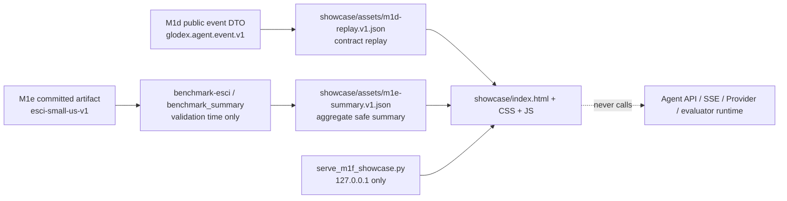

# Glodex M1f 本地离线 Showcase 技术实施计划

| 字段 | 值 |
|---|---|
| Plan ID | `GLO-PLAN-006` |
| 版本 | `0.1.0` |
| 状态 | Approved |
| 对应规格 | [`GLO-SPEC-006 v0.1.0`](./spec.md)（Approved） |
| 父基线 | [`GLO-SPEC-004`](../004-glodex-m1d-agent-demo/spec.md)、[`GLO-SPEC-005`](../005-glodex-m1e-esci-retrieval-benchmark/spec.md) |
| 里程碑 | M1f：M1d/M1e 本地离线展示台 |
| 创建日期 | 2026-07-30 |
| 最后更新 | 2026-07-30 |
| 批准日期 | 2026-07-30 |

## 1. 计划目标与实现预算

M1f 只交付可本机打开的、静态的工程展示页。它把 M1d 的安全事件**受控回放**和 M1e 的
既有离线 benchmark 聚合结果并排呈现；它不运行 Agent，也不将历史 benchmark 表述为
实时市场检索。

实施预算固定为：

- Tasks 阶段只形成 **A → B → C 三个串行交付块**，不为每张卡片、每个工具或每种样式
  继续拆分小里程碑；
- 新增 runtime dependency 为 **0**，不增加 Node、React、AG-UI、浏览器测试包、CDN 或
  Python 第三方包；
- 新增的运行文件仅为 `showcase/` 下的静态资产，以及一个标准库 loopback 静态服务脚本；
  不修改 `src/glodex/`、FastAPI、CLI、Agent、Provider、配置或 M1e evaluator；
- 不建立 asset pipeline、打包器或第二套前端数据模型。展示 JSON 直接版本化；一个显式
  验证脚本负责检查它们是否仍与父规格合同及 M1e artifact 一致；
- M1d 回放是**静态 contract replay**：使用 `glodex.agent.event.v1` 的公开、安全字段，
  由验证器按 DTO 校验。它不是为了演示而实时调用的 DeepSeek/Provider run，也不声称来自
  在线购物事实；
- M1e 展示卡的初始数据固定为当前已提交 `esci-small-us-v1` artifact 的安全 CLI 结果：
  `Exact@10=0.978`、`MRR@10=0.748248878710`、`nDCG@10=0.783998773773`。提交前验证器
  必须重新从同一 artifact 得到完全相同的聚合值和 provenance；
- 每个块只运行本块方向性 tests；完整 M1e-first gate 仅在 C 的最终收口执行一次。

任何将页面改为 live Agent、接入现有 Agent API/SSE、加入凭据/Provider/远程资源、暴露
ESCI 原始文本或更换框架的变更，都必须回到 Spec/Plan 重新批准。

## 2. 冻结架构与数据合同



依赖方向固定为：

```text
src/glodex/api/agent_events.py ──contract validation only──> scripts/validate_m1f_showcase.py
src/glodex/esci_benchmark.py ──validation time only────────> scripts/validate_m1f_showcase.py
data/benchmarks/esci-small-us-v1/ ──read only──────────────> scripts/validate_m1f_showcase.py
showcase/assets/*.json ──relative static fetch─────────────> showcase/app.js
showcase/ ──static directory only──────────────────────────> scripts/serve_m1f_showcase.py
```

`showcase/app.js` 和 `scripts/serve_m1f_showcase.py` 不得 import `glodex`，不得读取环境变量，
不得访问 benchmark artifact，更不得发起 Agent/API/Provider 请求。`validate_m1f_showcase.py`
是唯一可在**显式验证时**读取 M1d DTO 与 M1e evaluator/artifact 的新脚本；它不读取配置或
凭据，也不联网。

### 2.1 M1d replay 的冻结形状

提交的 `m1d-replay.v1.json` 采用一个严格、有限的 wrapper，内含只读 `events` 数组。每个
元素必须能由现有 `AgentPublicEvent`（camelCase alias）验证，且 wrapper 只含：

- 展示 schema/version、静态 `threadId` 与 `runId`；
- `schemaVersion="glodex.agent.event.v1"` 的安全公开事件；
- 不含任何额外叙述、query、prompt、模型文本、工具参数/结果、Observation、商品、价格、
  URL、真实时间、路径或凭据。

回放必须从 `AGENT_STARTED` 开始，以 `AGENT_RESULT` 或 `AGENT_ERROR` 结束，sequence 从 1
连续递增；root/child、depth、round、toolName、safeCode 和 fork 状态都由父 DTO 验证。
页面的中文说明由静态 JS 固定映射生成，而不进入回放数据。

本回放只记录少数已发生步骤。展示页以常量目录列出恰好九个业务工具，并将
`dispatch_tool` 作为单独元工具；由事件 `toolName` 推导“已执行”，其余目录项必须显示为
“本次未执行”，绝不暗示一次 trace 跑完十个 registry entry。

### 2.2 M1e summary 的冻结形状

`m1e-summary.v1.json` 是 `benchmark-esci` 成功单行 JSON 的严格白名单投影：

```text
status, benchmark_id, scorer_version, artifact_manifest_sha256,
source.repository, source.revision,
counts.{queries,products,judgements},
label_distribution.{Exact,Substitute,Complement,Irrelevant},
metrics.{exact_at_10,mrr_at_10,ndcg_at_10}.{value,denominator,excluded}
```

未知字段、数字格式漂移、hash/revision/指标不一致，或 query/product/judgement/路径等原始
字段均 fail closed。页面可以显示 repository 域名和 revision 作为 provenance 文本，但不
创建可点击的外站链接、不会加载远程资源。

## 3. 文件级实现范围

| 路径 | 职责 | 明确禁止 |
|---|---|---|
| `showcase/index.html` | 语义化单页骨架：离线回放声明、播放控制、时间线、工具能力目录、M1e 指标卡和 provenance 文本。只引用本地 CSS/JS。 | 外部 `<script>`、font、图片、iframe、link、Agent/API URL。 |
| `showcase/styles.css` | 无外部资源的响应式样式；在 ≥1024px 可读，并给焦点、暂停/完成状态与“已执行/未执行”明确视觉差异。 | CSS `@import`、远程 URL、图片或架构 PNG。 |
| `showcase/app.js` | 读取两个相对 JSON；维护小型 `idle/running/paused/completed` replay state；以单调 sequence 渲染，支持开始、暂停、继续、重新播放与键盘激活；用固定中文映射渲染安全事件和工具目录。 | `eval`、动态代码、远程 `fetch`、任意输入、Agent/API/benchmark 调用。 |
| `showcase/assets/m1d-replay.v1.json` | 小型、静态、DTO-valid 的受控 replay。 | 任何未在 §2.1 白名单中的字段或敏感/市场内容。 |
| `showcase/assets/m1e-summary.v1.json` | 小型、静态、白名单聚合 benchmark summary。 | ESCI 原始行、产品/query 文本、路径、可导航外链或未审计字段。 |
| `scripts/serve_m1f_showcase.py` | 标准库 HTTP 静态服务；固定目录为 `showcase/`，默认端口固定，host 强制为 `127.0.0.1`，打印本地 URL。 | `glodex` import、config/env、host 参数覆盖、外网绑定、写入资产、自动打开浏览器。 |
| `scripts/validate_m1f_showcase.py` | 显式离线校验 replay、summary、资产大小/清单和 summary 对当前 `benchmark_summary()` 的白名单投影一致。 | 网络、配置/凭据读取、修改展示文件、M1d Agent bootstrap/runtime 调用。 |
| `tests/m1f/` | M1f 专属 unit、contract、acceptance、architecture、NFR 证据。 | 改写 M0–M1e tests、真实 socket/Provider/浏览器下载。 |
| `scripts/check_traceability.py` | 增加精确的 `m1f` profile、`GLO-M1F-*`/`M1F-AC-*` 解析与 `4 P0 / 4 AC / 4 NFR` inventory。 | 放宽既有 profile 或将 M1f tests 混入其他 milestone。 |
| `scripts/verify_m1f.py` | 只在最终阶段执行一次 `verify_m1e.py`，随后运行 M1f 分层 tests 与 `m1f` traceability。 | live 开关、忽略/筛选测试、shell、未净化环境。 |
| `README.md` | 增加 M1f 的一句范围说明及本地启动/验证命令。 | 把回放说成实时 Agent，或把 benchmark 说成实时 Amazon 数据。 |

`.gitignore` 及 `项目架构/` 的 PNG 排除规则保持原样；本计划不加入任何截图、外部下载数据或
26 张 PNG。

## 4. 拟定的三个交付块（供 Tasks 阶段展开）

### A. 静态证据资产与离线校验

先新增 `showcase/assets/` 的两个最小 JSON 和 `scripts/validate_m1f_showcase.py`。回放使用
现有 `AgentPublicEvent` DTO 做严格解析，验证连续 sequence、合法 root/child/fork 生命周期、
terminal 和安全字段白名单；summary 则调用现有本地 `benchmark_summary()`，比较其 canonical
白名单投影。资产总量受 256 KiB 上限和确定性 JSON 编码约束。

本块只建立展示证据与 validator，不写页面/服务，不改父 runtime。方向性 tests 证明：损坏
event、未知字段、顺序/terminal 错误、泄露字段、summary 值漂移、原始文本与超限资产均被拒绝。

### B. 极薄本地 UI 与 loopback 服务

新增静态页面、样式、轻量 JS 与标准库服务。页面由本地相对 JSON 渲染，并在开始/暂停/继续/
重放时保持单调 sequence；九个业务工具与 `dispatch_tool` 均有准确、可辨识的状态。服务的
host 不可配置为非 loopback，目录不可逸出 `showcase/`。

本块不接 Agent API/SSE，不引入构建工具。方向性 tests 通过可注入 server factory 验证固定
loopback 配置，不在 pytest 中创建真实监听 socket；静态合同检查只允许本地资源、无外部 URL，
并检查键盘可达控件、中文免责声明和桌面布局锚点。实际 loopback 打开在最终手工 smoke 中用
本机浏览器或 `curl` 验证，不产生提交物。

### C. 可追溯性、最终门禁与交付说明

新增 M1f architecture/NFR/acceptance 测试、`m1f` traceability profile 与
`verify_m1f.py`。最终 runner 固定为：一个完整 M1e parent gate → M1f architecture/NFR →
M1f unit/contract → M1f acceptance → traceability coverage。README 只补最小启动、停止和
“离线录制回放”说明。

最后执行一次 `uv run --locked python scripts/verify_m1f.py`、`git diff --check`、展示资产
清单/大小检查和本地 loopback smoke；确认 staged 内容不含凭据、ESCI 原始内容、下载缓存、
截图或 `项目架构/` PNG。

## 5. 测试、可追溯性与最终门禁

| 验证层 | 最小证据 | 关联需求 |
|---|---|---|
| unit | replay DTO/sequence/terminal/白名单校验，summary whitelist 与现有 artifact 聚合结果一致，256 KiB 上限与 deterministic serialization | `GLO-M1F-P0-002`、`GLO-M1F-P0-003`、`GLO-M1F-NFR-002`、`GLO-M1F-NFR-004` |
| contract | 静态 HTML/CSS/JS 只引用相对本地资产；服务参数固定 `127.0.0.1`；replay UI 状态及可用/已执行工具目录的 source contract | `GLO-M1F-P0-001`、`GLO-M1F-P0-002`、`GLO-M1F-NFR-001`、`GLO-M1F-NFR-003` |
| architecture / NFR | 新服务仅标准库；静态运行文件不 import `glodex`/config/env；validator 的父模块 import 精确受限；没有远程 URL、secret、raw ESCI、PNG 或父 runtime 反向依赖 | `GLO-M1F-P0-004`、全部 `GLO-M1F-NFR-*` |
| acceptance | 显式 `validate_m1f_showcase.py` 成功；固定 server factory 收到 loopback-only config；静态入口包含免责声明、回放、工具和 M1e 三个区域，CLI output 不回显原始资料 | `M1F-AC-001`、`M1F-AC-002`、`M1F-AC-003`、`M1F-AC-004` |
| manual smoke | `python scripts/serve_m1f_showcase.py` 后仅从 `127.0.0.1` 打开；检查播放/暂停/继续/重放及 1024px 布局，无外部网络请求。 | `M1F-AC-001`、`M1F-AC-002`、`GLO-M1F-NFR-003` |

为保持 M1e parent gate 不被稀释，`scripts/verify_m1f.py` 的精确次序为：

```text
1. uv run --locked python scripts/verify_m1e.py
2. uv run --locked python -m pytest -q -p scripts.verify_m0 tests/m1f/architecture tests/m1f/nfr
3. uv run --locked python -m pytest -q -p scripts.verify_m0 tests/m1f/unit tests/m1f/contract
4. uv run --locked python -m pytest -q -p scripts.verify_m0 tests/m1f/acceptance
5. uv run --locked python scripts/check_traceability.py --profile m1f --mode coverage
```

命令使用固定项目根、`sanitized_environment()`、参数数组和 `shell=False`；不得带
`--live`、`--live-data`、`--live-intent`、`--ignore`、`--deselect`、`-k`、`--lf`、`--ff`
或 `--write`。最终 gate 之外，各阶段只运行自己的方向性 tests，避免反复消耗完整父链时间。

## 6. Plan Definition of Ready（进入 Tasks 前）

- [x] 本 Plan 状态改为 `Approved` 并记录批准日期；
- [x] 用户确认交付固定为 A（证据资产）→ B（静态 UI）→ C（门禁/README）三个块；
- [x] 用户确认回放是 schema-validated 的受控静态 replay，不能被称作实时或隐含线上购物；
- [x] 用户确认 M1e 展示值必须与已提交 artifact 的离线 CLI 摘要一致，且不向浏览器提供原始
      ESCI 内容；
- [x] 用户确认不增依赖、页面框架、浏览器测试包、Node、AG-UI、Agent/API/SSE/live 数据；
- [x] 用户确认仅在最终 C 阶段跑一次完整 M1e-first gate，阶段中只跑定向测试；
- [x] `4 P0 / 4 AC / 4 NFR`、`m1f` traceability profile、最终 runner 和手工 loopback smoke
      均有明确证据路径。
