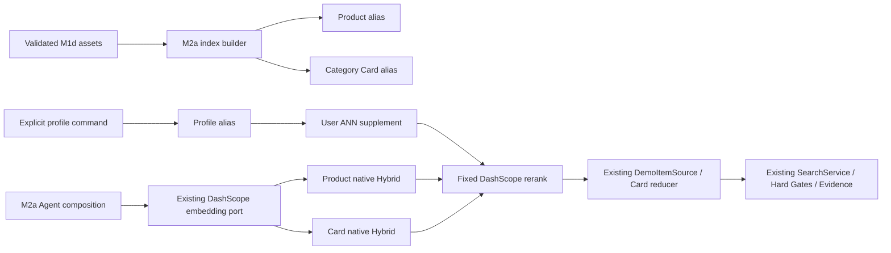

# Glodex M2a 检索智能亮点闭环技术实施计划

| 字段 | 值 |
|---|---|
| Plan ID | `GLO-PLAN-007` |
| 版本 | `0.1.2` |
| 状态 | Approved |
| 对应规格 | [`GLO-SPEC-007 v0.2.2`](./spec.md)（Approved） |
| 父基线 | `GLO-SPEC-000`、`GLO-SPEC-004`、`GLO-SPEC-005` |
| 里程碑 | M2a：OpenSearch、三视图召回、Rerank 与偏好记忆闭环 |
| 创建日期 | 2026-07-30 |
| 最后更新 | 2026-07-30 |
| 批准日期 | 2026-07-30 |

## 1. 计划目标与实施预算

M2a 要把架构图中的检索亮点做成一条真实、可演示的 M2a backend，而不是重写 M1d。M1d
的 AgentLoop、九工具、fork、本地 RAG、Capture、Canonical/Evidence gates、Agent SSE 与
所有原命令保持原样；M2a 只能由新 operator-only 命令与独立 composition 开启。

实施固定为 **A → B → C → D 四个大交付块**，Tasks 阶段不得拆成“一个索引/一个字段/一个
错误码”式微任务：

- 新增唯一 runtime dependency：`opensearch-py[async]>=2.8,<3`；`2.17.0` 是固定 OpenSearch server
  image 版本，而非 Python package version；DashScope rerank 继续用已存在的
  `httpx` bounded transport，不引入 SDK、LangChain、向量数据库抽象或第二模型 Provider；
- Docker 基线固定 `opensearchproject/opensearch:2.17.0`、single-node、`127.0.0.1:9200`
  绑定、512 MiB heap、关闭 demo security；不启动 Postgres、Redis、Dashboards 或远程服务；
- OpenSearch 2.17 已支持 native hybrid search 的 normalization search pipeline；Lucene HNSW
  cosine 在 2.13 起支持，因此能以无训练、单节点方式实现本规格的 1,024 维向量召回。
- 商品和 Card 数据仅来自 M1d 已 hash-closed assets；profile 是一份独立、schema-versioned
  local index，且只接受明确写入的 typed soft preferences；
- `qwen3-rerank` 固定为唯一 rerank model。它只在 `--live` M2a path 接收有界 query、profile
  text 或候选文本；默认 pytest、CLI、API、SSE 和所有 M0–M1f command 继续禁网；
- M2a 不能改变 `SearchResponse`、`AgentDemoResponse`、现有 Agent event wire contract 或 M1d
  的数据加载。M2a 的 trace 采用新 M2a command 的安全摘要，SSE 只复用既有 tool
  started/finished event 与 `safe_code`。

任何将 OpenSearch 变成默认 backend、开放 host/URL、增加模型训练、远程 cluster、任意用户
查询、认证/同步或将 profile 作为业务事实的决定，必须回到 Spec/Plan。

## 2. 增量架构与复用缝



| 现有缝 | M2a 复用/扩展方式 |
|---|---|
| `AgentIndexes` / `load_agent_indexes()` | 继续作为 snapshot、Card、item vector、shipping rules 和 manifest ownership 的唯一可信 loader；只增加受控 public projections 给 index builder，绝不重新解析未校验 JSONL。 |
| `DemoItemSource` | 保留原实现；新增 `OpenSearchItemSource` 在返回候选前只取得 `record_key`，再复用同一 ownership projection 与 `_sub_batch()`。 |
| `CategoryInsightPort` | M1d 的 `AgentIndexes` 继续实现本地 RAG；新增 `OpenSearchCategoryInsight` 作为 M2a-only port，最后仍调用已有 Card reducer。 |
| `EmbeddingPort` | 继续复用固定 DashScope `text-embedding-v4` adapter；不改变 M1d 一次 batch、最大两段 query text 的约束。M2a profile write 与 user recall 使用独立、明确计量的 M2a batch。 |
| `ItemSearchInput.query` / Agent runtime | 原字段已携带 lexical query。新增窄的、run-scoped `M2aItemContext`，由已验证的 planner Required 与显式 `profile_id` 形成；普通 M1d 该值恒为 `None`。 |
| `SearchService` / Catalog Gates | 不修改，仍是唯一发布 gate。M2a 在检索前只用安全的结构化可过滤约束缩小候选；价格、运费、未知费用、Evidence 和 canonical 去重仍由原完整 final gate 决定。 |
| `agent_live_http.py` | 复用已验证的 credential、byte/deadline、identity encoding 和 JSON parsing 模式；新增仅指向 DashScope rerank URL 的私有 bounded adapter，而非 generic HTTP client。 |
| Agent SSE | 不增加 event kind、字段或 HTTP 开关；M2a composition 把 `M2A_*` 安全 code 附着到既有 tool event，独立 M2a CLI 输出聚合 trace。 |

### 2.1 三份 index 的固定形状

| Index | 文档 identity / 可检索字段 | 不可信或禁止字段 |
|---|---|---|
| Product | `record_key`、platform、可信派生 `search_text`、1,024 维 item vector、asset fingerprint | 完整 offer、金额、库存、Evidence、原 query、profile。 |
| Category Card | `card_id`、category、可信派生 card text、1,024 维 card vector、asset fingerprint | reducer 输出、模型生成事实、无来源文本。 |
| Profile | `(profile_id, entry_id)`、scope/kind/value、user vector、schema version | 聊天历史、推断用户画像、商品/价格/Evidence、其它 profile 的内容。 |

`M2aIndexManifest` 将商品/Card asset hash、record count、embedding model/dimension、mapping
schema、builder version 和 fixed search-pipeline identity canonicalize 并写入 mapping `_meta`。
物理 index 名仅由 kind 和 manifest fingerprint 构成，构建后才原子切换固定 alias；同 fingerprint
的重复 build 校验既有物理 index 后复用，不按 clock 创建无界 index。Profile alias 只包含 schema
version 与 profile count，不与 M1d asset manifest 混淆。

## 3. 固定运行入口与故障语义

```bash
# Operator 启停：Docker 之外，不由应用偷偷拉镜像
docker compose -f infra/m2a-opensearch.compose.yml up -d
docker compose -f infra/m2a-opensearch.compose.yml down

# 仅本机 snapshot → 商品/Card index；没有 Provider 网络
uv run --locked glodex m2a-index --action build --snapshot m1d-demo-v1
uv run --locked glodex m2a-index --action verify --snapshot m1d-demo-v1

# 显式 profile 写入/查看/删除；set 需要 --live 与 DASHSCOPE_API_KEY
uv run --locked glodex m2a-profile set --live --profile local-demo \
  --scope soft --kind preference --value "轻薄、长续航"
uv run --locked glodex m2a-profile list --profile local-demo

# 独立 M2a composition，不改变 agent-demo
uv run --locked glodex m2a-agent-demo --live --profile local-demo \
  --query "在四个平台找手机，比较到手价" --locale zh-CN --currency CNY --top-k 3
```

所有命令使用固定 loopback endpoint，不能提供 `--host`、`--port`、`--url`、`--index`、
`--model` 或任意 query DSL。`m2a-index`/`m2a-profile`/`m2a-agent-demo` 有各自单行安全 JSON
成功与失败 envelope；普通 `agent-demo`、Search API/SSE 无参数和输出变化。

| 情形 | 行为 |
|---|---|
| Docker/loopback health、alias、mapping、asset fingerprint 或原始 Query Hybrid 不可用 | `M2A_RETRIEVAL_FAILED`，M2a run 失败；不调用 M1d in-memory retrieval。 |
| profile 缺失、冲突、坏向量、User ANN 超时/坏响应 | `M2A_PROFILE_DEGRADED`，跳过 User supplement，Query pool 不变。 |
| rerank timeout/坏 response/模型不可用 | `M2A_RERANK_DEGRADED`，丢弃 User-only candidates，保留 Query Hybrid 顺序。 |
| Category RAG 的 Query Hybrid 不可用 | `M2A_CATEGORY_RETRIEVAL_FAILED`，该 M2a tool 失败；不把 lexical-only 冒充升级 RAG。 |
| profile command 无 `--live` 或无 DashScope credential | 不创建/修改任何 profile document，返回稳定 preflight error。 |

## 4. 交付块与文件边界

### A. Local OpenSearch、manifest 与受控索引

新增 `infra/m2a-opensearch.compose.yml`、`src/glodex/adapters/m2a_opensearch.py`、
`src/glodex/application/m2a_indexes.py` 与 `scripts/verify_m2a_opensearch.py`。在 adapter 中
封装唯一的 `AsyncOpenSearch` owner：构造时拒绝非 loopback 地址，固定连接/读取 deadline、
响应 body/item 上限、TLS/redirect/proxy，且 `close()` 总是从 per-run drainer 调用。

`m2a_indexes.py` 不包含业务事实或 Agent 逻辑，只负责：严格 asset projection、mapping/pipeline
build、bulk index、refresh、mapping `_meta` manifest、count/alias/self-check 和物理 index publication。
mapping 固定为 `knn_vector` / `dimension=1024` / `hnsw` / `engine=lucene` /
`space_type=cosinesimil`，一个 shard、零 replica。Product 和 Card search pipeline 固定
`min_max + arithmetic_mean(0.7 vector, 0.3 BM25)`。

先添加 `opensearch-py`、重新锁定 `uv.lock`，然后写 mock transport tests；Docker-only
smoke 由独立命令 build → verify → query → down 执行，不能进默认 pytest。这个块完成时仍
没有变更 Agent composition、profile 或 DashScope rerank。

### B. Query Hybrid、可信回读与 Card backend

新增 `src/glodex/adapters/m2a_retrieval.py`，其中只有三项具体 adapter：
`OpenSearchItemSource`、`OpenSearchCategoryInsight`、只输出 IDs/rank 的 strict response parser。
它们调用 A 的 client，并以固定 native `hybrid` request 同时施加 lexical 与 k-NN filter；
Card path 最后将 selected IDs 映射回 `AgentIndexes.cards` 后调用现有 reducer。

为 Item 路引入只读 `M2aItemContext` 和 `M2aRetrievalTrace`；runtime 在 Planner 验证后的
Required baseline 形成 context，不向模型、HTTP、SSE 传递原始 profile 或候选文本。`OpenSearchItemSource`
只能把 manifest-allowed key 交给 `DemoItemSource` 的现有 projection，任何 unknown/duplicate/
cross-platform key 都整体拒绝。M1d `DemoItemSource`、`AgentIndexes.retrieve()` 和原 contract
测试不改语义。

本块只启动 Query → Item 与 M2a Category backend；Rerank 与 User ANN 在 C 才接入。测试覆盖
两个 subquery、共同 filter、Top-30、alias/manifest mismatch、key injection、Card evidence/reducer
closure，以及证明 M1d non-M2a 路径仍零 socket。

### C. Profile 三视图、实际 rerank 与 M2a composition

新增 `src/glodex/application/m2a_profile.py`（严格 typed profile command/value/conflict judge）、
`src/glodex/adapters/m2a_profile_store.py`（profile alias 的 scoped read/write/ANN）及
`src/glodex/adapters/dashscope_rerank.py`（固定 endpoint/model/limit parser）。它们不导入
domain、`SearchService`、API 或任意旧储存层。

冲突 Judge 只接收 planner 已验证 Required 的结构化投影和 profile 的 `scope/kind/value`；当前
budget、platform、category、库存、排除项冲突一律拒绝 profile entry。User ANN 仅查询同一
platform 和预过滤候选 pool，最多 10 项，合流时先保存 Query Top-30，再追加 User-only keys。

DashScope rerank 输入由可信 `CatalogBatch` / Card asset 重建，不能从 OpenSearch `_source` 取正文。
一次 product batch 至多 40 个候选，Card batch 至多 30；adapter 对每个 response index/identity
做一一验证。它返回稳定重排列表和安全 code；故障执行第 3 节的 Query-protected 降级。

最后新增 `build_m2a_agent_service()` 与 `m2a-agent-demo` composition：它复用固定 DeepSeek
selector、M1d runtime、tools、CandidateManifest、SearchService factory、shipping rules 和
Agent event observer，只替换 `category_insight`/`item_source` dependency 并安装 M2a trace
recorder/profile context。`agent-demo`、Agent API/SSE 原 factory 保持调用既有 `build_agent_service()`。

### D. CLI、评测、回归与交付证据

`src/glodex/cli.py` 新增三个精确 command families：`m2a-index`、`m2a-profile`、
`m2a-agent-demo`；每个 parser 拒绝未批准参数，且显式 `--live` 是所有 DashScope 调用的
必要条件。新的 M2a JSON result 可携带压缩 trace（index versions、candidate counts、opaque IDs、
degraded codes），绝不复用或改变普通 Agent result JSON。

M1e 只增加显式 `benchmark-esci --rerank-m2a --live` 的隔离 evaluation mode：它读取 benchmark
candidate text、调用固定 rerank port、仅在排序完成后加载 label 并输出聚合 coarse/reranked
metrics；不得将 ESCI data 加入 OpenSearch、Catalog 或 Agent。若这会改变 M1e artifact/runtime
边界，则宁可新增 `glodex m2a-eval-esci` 专用命令，不能改普通 benchmark 默认行为。

新增 `tests/m2a/{unit,contract,acceptance,architecture,nfr}/`、`scripts/verify_m2a.py` 和
traceability profile `m2a`。默认 runner 先完整执行 `verify_m1f.py`，再执行 M2a architecture/
nfr、unit/contract、acceptance、format/lint/type 与 `check_traceability --profile m2a --mode coverage`。
真实 Docker/DashScope smoke 保持分开的 operator command，且在 README 写入本机资源、网络、
数据与成本披露。

## 5. 验证矩阵与最终门禁

| 验证层 | 最小证据 | 覆盖 |
|---|---|---|
| unit | manifest canonicalization、loopback rejection、mapping/pipeline body、profile schema/conflict、fusion protected merge、rerank index mapping | `P0-001`–`005`、`NFR-001/003/004` |
| contract | OpenSearch/DashScope mock transport 的 deadline/body/schema/key rejection；M2a CLI parser/envelope；M1d factories 不导入 M2a | `P0-001`–`007`、`NFR-001/002/005` |
| acceptance | M2a explicit command 的 build/verify/profile/run；Query/User conflict、rerank degradation、Card reducer、final Hard Gate/Evidence closure | `M2A-AC-001`–`007` |
| architecture/nfr | no non-loopback endpoint、no raw/profile leak、default socket spy、dependency direction、M1e label isolation、no data volume/PNG/secrets | `NFR-001`–`006` |
| real smoke | local OpenSearch native hybrid + DashScope product/Card rerank；输出只有安全摘要 | `AC-001/002/004/005/007` |

最终自动化门禁固定为：

```bash
uv run --locked python scripts/verify_m2a.py
```

Operator smoke（不进默认测试）固定为：

```bash
uv run --locked python scripts/verify_m2a_opensearch.py
uv run --locked python scripts/verify_m2a_dashscope.py
```

每个 runner 都 fail-fast；默认 runner 清除 Provider/代理环境并禁 socket。没有 Docker、
OpenSearch 或 DashScope 不得标记 M2a 完成，而是报告对应的明确 smoke 前置条件。

## 6. M2 项目后续实施承诺

这份 Plan 只实施 M2a，不能将它的完成误报为项目架构完成。后续组件固定按下列顺序进入
各自独立的 SDD 规格，而不是被留在模糊的“以后再做”：

1. **M2b Durable Agent Runtime**：以本机 Docker 的 PostgreSQL 实现 Run/event/checkpoint、
   取消/恢复和 durable typed memory；以 Redis 实现 250 ms、versioned、fail-open 的 retrieval/
   context cache。它必须提供重启恢复和 Redis/Postgres 真实 smoke，不能只有 ORM、repository
   或 compose 配置。
2. **M2c Retrieval Model Service**：把 M2a 的 `EmbeddingPort`/rerank port 接到 BGE
   Query/User/Item shared-backbone service 和 cross-encoder service；固定模型/维度 manifest、
   offline-vs-live evaluation、health 与 fallback 语义。端到端验收以实际 GPU/A100 或用户提供的
   受控服务为前置条件；没有该资源时只可完成客户端 contract，不能宣称模型服务完成。
3. **M2d Interaction & Operations**：消费 M2b 持久事件，增加 AG-UI adapter、React 实时界面、
   熔断、可观测和安全 trace 展示；不暴露 CoT、profile body、凭据或第三方原文。

用户召回与 local typed long-term preference 已属于本 Plan 的 M2a；Redis/Postgres/A100 不是
删除项，也不能被用轻量 placeholder 冒充已经实现。

## 7. Plan Definition of Ready（进入 Tasks 前）

- [x] 本 Plan 状态改为 `Approved` 并记录批准日期；
- [x] 用户确认固定一个 runtime 依赖 `opensearch-py` 和 OpenSearch `2.17.0` local Docker
      baseline，不引入 Redis/Postgres/Dashboards；
- [x] 用户确认新增 M2a 专用 CLI/composition，而非改变 `agent-demo`、Search API/SSE 或
      默认 backend；
- [x] 用户确认 `qwen3-rerank` 是唯一实际 rerank Provider，DashScope live smoke 可发送
      有界 query/profile/candidate text，测试全部用 fake transport；
- [x] 用户确认 profile 是 local typed soft-preference memory；无登录、同步、隐式画像，且
      当前 Required/Hard Gates 永远优先；
- [x] 用户确认 M1e rerank 比较只走一个独立、显式命令，labels 不进入任何 M2a runtime；
- [x] 四个交付块、三条 operator command families、默认/real smoke 分离和最终 gate 均可接受。
