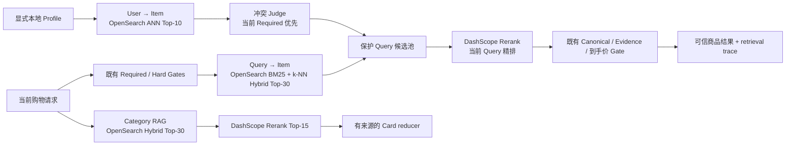

# Glodex M2a 检索智能亮点闭环规格

| 字段 | 值 |
|---|---|
| Spec ID | `GLO-SPEC-007` |
| 版本 | `0.2.2` |
| 状态 | Approved |
| 里程碑 | M2a：OpenSearch、三视图召回、Rerank 与偏好记忆闭环 |
| 父规格 | [`GLO-SPEC-000`](../000-glodex-mvp/spec.md)、[`GLO-SPEC-004`](../004-glodex-m1d-agent-demo/spec.md)、[`GLO-SPEC-005`](../005-glodex-m1e-esci-retrieval-benchmark/spec.md) |
| 创建日期 | 2026-07-30 |
| 最后更新 | 2026-07-30 |
| 批准日期 | 2026-07-30 |

## 1. 目的与架构亮点

M0–M1f 已完成课程 MVP：九工具 AgentLoop、fork、独立 SSE、价格比较、Evidence、
本地 Hybrid Category RAG 与公开 ESCI 离线评测均已存在，且它们各自已经实现了架构图中的
对应亮点。M2a 是增量能力，不替换、不降级或重新包装这些已完成路径；项目架构图中尚未实现的
检索亮点——OpenSearch 向量基础设施、Query/User/Item 三视图召回、当前 Query 精排、
长期偏好与 RAG 召回精排——必须成为可运行能力，而不能以“避免过度设计”为由删除或只留
PPT 描述。

M2a 交付这一条完整的、学生可在本机启动的检索智能链路：

这里的“三塔”是旧项目同样采用的 **Query / User / Item 三视图 shared-backbone prototype**：
同一已批准的 embedding 模型按三个受控输入视图编码，真实执行两条独立召回路径；它不是
需要 A100 的独立三塔训练，也不伪称已完成模型训练。`qwen3-rerank` 通过 DashScope 的正式
Reranking API 调用，是实际 query-document reranking，不是关键词规则或假接口。

| 架构图亮点 | 当前状态 | M2a 动作 |
|---|---|---|
| AgentLoop、9 工具、fork（0/1/2/15） | M1d 已交付 | 直接复用，不重写 Agent。 |
| 独立 SSE 进度（7） | M1a/M1d 已交付 | 新增安全 retrieval stage trace，不更换事件协议。 |
| 向量基础设施（4.1） | 未交付 | 单节点 local OpenSearch、versioned index 与 manifest closure。 |
| Query/User/Item 语义召回（4.0/11） | 未交付 | Query Hybrid + User ANN 两路独立、受控合流。 |
| Cross-rerank 与 RAG 精排（4.2/14） | 未交付 | 一个固定 DashScope reranker，商品和 Category Card 共用受限 port。 |
| 长期偏好（6） | 未交付 | local profile 的 typed soft-preference memory；当前 Required 永远优先。 |
| Category Insight（13） | M1d 本地版已交付 | 在显式 M2a backend 中新增 OpenSearch Hybrid + rerank；原本地 RAG 保持可用且结果合同不变。 |

完整 AG-UI、持久 Run/checkpoint、Redis 缓存、生产部署与训练流水线仍需独立规格；它们没有
被删除，只是不冒充为本机检索亮点的前置条件。

## 2. 固定数据、模型与检索语义

| 项目 | M2a 固定规则 |
|---|---|
| 商品索引输入 | 仅已验证的 `m1d-demo-v1` snapshot、其 manifest 与 `item_embeddings.jsonl`；hash、snapshot/index version、embedding model/dimension 必须闭合。 |
| Card 索引输入 | 仅同版本的 `category_cards.jsonl` 与 `category_embeddings.jsonl`；Cards 保留来源、采集时间与置信度。 |
| Profile memory | 仅 Operator 显式写入的、带 `profile_id`、`scope`、`kind`、`value` 的 local soft-preference entries；不写入聊天全文、推测画像、价格、商品事实或隐式行为。 |
| 三视图 embedding | `Query` 编码原始当前 query；`User` 编码已验证 soft profile；`Item` 使用离线已闭合 item vector。三者维度、模型和 asset version 必须匹配。 |
| Query Hybrid | 一次 OpenSearch native `hybrid` query 固定包含 BM25 与 cosine k-NN 两个 subquery；各最多 30 项，命名 pipeline 以 min-max normalization 后按 vector `0.7` / BM25 `0.3` arithmetic mean 合并。 |
| User ANN | 单独的 platform-及 hard-eligible-scoped cosine k-NN，至多 10 个 User-only candidates；绝不将 User score 与 Query score 加权相加。 |
| Rerank | 只对 Query Top-30 与获准的 User-only Top-10 的去重候选运行一次固定 [`qwen3-rerank`](https://help.aliyun.com/en/model-studio/rerank) batch；商品保留至多 15，Card 保留至多 15。 |
| 事实来源 | OpenSearch 只返回受版本约束的 opaque `record_key` / `card_id`、rank 和 trace；产品、报价、费用、Evidence 与 Card facts 必须从已验证资产回读。 |
| 失败语义 | Query Hybrid、embedding 或 OpenSearch 原始路径失败为 typed failure；User ANN 或 rerank 失败显式标为 degraded，保留受保护的 Query Hybrid 顺序并丢弃 User-only candidates。 |

M2a 复用 `DASHSCOPE_API_KEY`，不新增第二个云 Provider、不自动读取 `.env`。只有显式
Operator M2a 命令才会将有界 query、profile text 或最多 40 个受控候选文本发送至 DashScope；
默认测试使用固定 vectors/rerank transport，不联网。OpenSearch 仅允许绑定/连接
`127.0.0.1` 或 `::1`。

## 3. 范围

### 3.1 In Scope

- 单节点、本机 loopback OpenSearch baseline，包含商品、Category Card、local profile 三个
  versioned index 的启动、health、build、manifest validation 和安全停止入口；
- `knn_vector` + HNSW/cosine mapping、稳定 document ID、index manifest、物理版本 index
  和 validated alias publication；
- Query → Item 的 platform/hard-eligible-scoped BM25 + k-NN native hybrid recall，保护
  当前 query candidate pool；
- Operator 管理 local profile 的 create/list/update/delete 与基于 typed soft preferences 的
  User → Item ANN recall；当前 Query 的 Required、预算、排除项、库存和商品本体要求优先；
- 一个确定性 conflict judge：只比较已结构化的当前 Required 与 profile entry，不调用 LLM，
  不让 profile 改写 Required 或制造新的 hard constraint；
- 一个固定 DashScope rerank adapter、严格的 request/response/size/deadline validation，及
  商品和 Category Card 的 query-first rerank；
- 显式 M2a backend 的 Category Insight 使用 OpenSearch Hybrid Top-30 → rerank Top-15
  → 既有有来源 reducer，并保留 `quick/deep` 输出边界；现有进程内 BM25/cosine/RRF
  路径保持为 M1d 的原有 backend；
- `coarse → user_supplement → reranked → selected → used` 的安全 retrieval trace、Agent
  SSE 阶段投影与 M1e 中显式、隔离的 offline comparison/evaluation 入口；
- mock contract、真实 local OpenSearch smoke、显式 live DashScope smoke、离线 regression 与
  README 的配置/数据/成本/隐私披露。

### 3.2 Out of Scope

- Amazon、Shopee、AliExpress 或 eBay 的新 live marketplace adapter、网页抓取、登录、
  自动刷新、真实库存/价格承诺、支付或下单；
- 独立三塔训练、embedding/reranker 微调、A100/vLLM 服务、模型注册、负样本挖掘、在线 A/B；
- 更多 embedding/rerank Provider、动态模型/endpoint、任意用户选择模型，或自动加载凭据；
- OpenSearch Dashboards、多节点、远程 endpoint、生产认证/TLS、分片副本调优、Docker
  volume 进仓库、Postgres、Redis、Kafka、持久 checkpoint 或分布式 Worker；
- 用户认证、跨设备同步、隐式行为追踪、聊天记录全量存储、根据 profile 自动修改当前
  Required，或允许记忆成为最终推荐的事实来源；
- 完整 AG-UI SDK/WebSocket/React 实时界面、上下文压缩/缓存治理、熔断/遥测平台；
- 改变默认 `demo`、`search`、Search API/SSE、M1b Capture、M1c live Intent、M1d
  non-M2a Agent mode 或 M1f 静态回放；
- 将 M1e ESCI label、原始 source 或 benchmark artifact 装入 `CatalogBatch`、Agent
  runtime 或商品发布链；
- 提交 OpenSearch data volume、raw query、profile value、embedding/rerank body、凭据、
  `.env`、日志、Docker socket 或 `项目架构/` PNG。

## 4. 设计与安全不变量

1. **亮点是真实链路。** M2a 的 Hybrid、ANN、rerank 和 profile memory 都必须连接真实
   adapter 或明确 typed failure；不允许同名 stub、关键词假 reranker 或“永远 unavailable”。
2. **显式和局部。** 默认 M0–M1f 命令、pytest、API、SSE 与 M1f showcase 仍为零 socket。
   M2a 只能由新 Operator command/flag 开启；endpoint 不能由 HTTP request、Agent action、
   query 或环境传入任意 URL。
3. **既有亮点不回退。** M0–M1f 的 AgentLoop、九工具、fork、现有本地 Hybrid RAG、
   Capture、价格/Evidence、SSE、ESCI benchmark 与 Showcase 保持原入口、原合同和原
   验收；M2a 只增加一个显式可选 backend，不能把旧实现变成 stub、hidden fallback 或
   依赖 OpenSearch/DashScope 才能运行。
4. **索引不是业务真相。** 每个命中的 `record_key` / `card_id` 都必须属于本次 validated
   manifest；未知、重复、跨 platform、跨 profile、陈旧或越界 identity 拒绝整个对应路径。
   Index `_source` 不能生成或覆盖产品、报价、费用、Evidence、Card 来源或 profile 事实。
5. **当前请求优先。** Query Hybrid Top-30 结构性保留；User ANN 只能补充 Query 没有的
   最多 10 个 candidate，不能置换或给 Query 候选额外加分。当前 Required 与 profile 冲突时，
   冲突 profile entry 和相关 User-only candidate 被拒绝。
6. **Hard Gates 不下放。** 预算、市场、库存、目标商品本体、未知费用、同款去重与 Evidence
   closure 仍由既有可信业务层裁定。reranker 只重排已通过候选输入，不能放宽 gate。
7. **可解释降级。** 原始 Query retrieval 失败必须 fail closed；可选 User/Rerank 失败不能
   伪装成功，trace/SSE 必须标明 degraded，User-only candidates 必须丢弃，最终退回 Query
   Hybrid 的稳定顺序。
8. **最小服务面。** 没有通用 DSL、任意 index/mapping/script、任意 bulk 路径、任意
   profile 查询或 plugin registry。M2a 只服务两份固定数据 index 与一份 schema-versioned
   local profile index。

## 5. 需求

| ID | 要求 |
|---|---|
| `GLO-M2A-P0-001` | **三份闭合 OpenSearch index。** 对商品、Cards 和 profiles 提供固定 mapping、稳定 ID、HNSW cosine vector、manifest fingerprint、版本物理 index 与验证后 alias。商品/Card build 必须验证全部 M1d hash、ownership、embedding model/dimension；profile build/写入必须验证 typed schema、scope 和 profile ownership。健康检查必须核对 mapping、fingerprint、document count 与 alias 一致性。 |
| `GLO-M2A-P0-002` | **Query → Item Native Hybrid。** 对 hard-eligible、platform-scoped 的当前 query 执行含 BM25+k-NN 的 OpenSearch native `hybrid` Top-30；两个分支共享相同 filter，命名 pipeline 固定 min-max + vector `0.7` / BM25 `0.3`。结果仅为 manifest-allowed `record_key`，并按 `(-hybrid_score, record_key)` 稳定排序。 |
| `GLO-M2A-P0-003` | **真实 User → Item 三视图补充。** Operator 能维护一个 local typed soft-preference profile；系统以该 profile 的 user embedding 对同一 hard-eligible/platform pool 作独立 ANN Top-10。deterministic conflict judge 必须令当前 Required 胜出；User candidates 只能作为不替换 Query pool 的补充，且 trace 记录其来源、拒绝与额度。 |
| `GLO-M2A-P0-004` | **实际 Query-first Rerank。** 实现一个固定 DashScope rerank port，严格限制一次 batch 的 query、候选数、文本/response bytes、deadline 与返回 identity。它对 Query pool 与获准 User supplement 作真实 reranking；失败、非法或超时必须丢弃 User-only candidates 并保留 Query Hybrid 顺序，不能退回伪 cross-encoder。 |
| `GLO-M2A-P0-005` | **M2a RAG 召回精排。** 显式 M2a `category_insight` backend 必须走 Category Card OpenSearch Hybrid Top-30、固定 rerank Top-15 和既有 Card reducer；输出仍只含有来源的 component/bestseller/attribute/price-tier facts，`quick/deep`、置信度和 card IDs 可复核。既有 M1d 本地 RAG backend 不变。 |
| `GLO-M2A-P0-006` | **可信购物发布链。** Product retrieval 的每一层均回读既有 `CatalogBatch`、`DemoItemSource` ownership、Agent item schema、`SearchService`、Hard Gates 与 Evidence closure。OpenSearch/DashScope/profile 中的错误或陈旧 identity 不得进入 price compare、shipping 或 final `SearchResponse` / `AgentDemoResponse`。 |
| `GLO-M2A-P0-007` | **可观察、可评测的演示。** 新 retrieval trace 和 Agent SSE 只投影阶段、版本、计数、opaque IDs 与安全 error/degraded code。README 给出本机启动—索引—profile—Agent query—验证—停止流程；M1e 只能通过显式 benchmark/evaluation 比较 coarse/reranked metrics，不让 label 影响运行时排序。 |

## 6. 验收场景

### `M2A-AC-001` 三 index 构建、manifest 与 alias

在空的 local OpenSearch 上启动服务并建立商品、Card、profile index。验证商品为 8 documents、
四个平台各 2；Card 为 8；profile 初始为 0。篡改 M1d manifest hash、dimension、mapping、
alias target、document count、profile schema 或 ownership 时，系统不得将 index 标为可用。

### `M2A-AC-002` Query Hybrid 真正执行

用真实 local OpenSearch 和固定 query vector 验证 native `hybrid` request 有 BM25/k-NN 两个
subquery、共同 hard-eligible/platform filter、Top-30 与命名 min-max `0.7/0.3` pipeline。覆盖
lexical-only、vector-only、重叠、不重叠和并列；返回仅为当前 manifest 允许的 stable keys。

### `M2A-AC-003` User ANN 不覆盖当前请求

显式创建 soft profile 后，验证 User ANN 从 Query 之外至多补充 10 项；无 profile 时它不执行。
令 profile 偏好与当前预算、排除项、目标品类、库存或市场要求冲突，断言 conflict judge 拒绝
相应 entry/candidate，Query Top-30 的成员及顺序不变，trace 可说明结果。

### `M2A-AC-004` Rerank 与安全降级

fake transport 必须证明 rerank request 只含受限 query/candidate text，response identity 一一
映射到输入，无重复/未知/缺失 score；真实 Operator smoke 使用 DashScope 一次 product rerank
和一次 Card rerank。超时、坏 schema、错误模型或 service failure 时标为 `RERANK_DEGRADED`，
Query Hybrid 顺序保留，全部 User-only candidate 丢弃。

### `M2A-AC-005` Category RAG 召回精排

对有已知 category 和跨 category 的请求，验证 Cards 的 Hybrid Top-30 → Rerank Top-15 →
Reducer trace；最终输出事实均可追溯至 selected Card，且不因 rerank 失败制造 lexical-only
“成功”或无来源的洞察。

### `M2A-AC-006` 可信发布链与故障隔离

将 unknown/duplicate/cross-platform/stale product key、unknown Card、cross-profile document、
坏 vector、OpenSearch unavailable 与 DashScope unavailable 注入。断言它们不能成为 Agent
candidate、价格比较输入或 final result；Query 原始路径失败为 typed failure，User/Rerank 可选
路径只按第 4 节降级。默认 M0–M1f 不连接 OpenSearch/DashScope、不加载 M1e artifact，
Golden bytes 不变。

### `M2A-AC-007` 公开演示与离线评测

按 README 在干净本机完成 start → index → profile set → M2a Agent query → retrieval trace →
stop；输出不含 query/profile/document body、embedding、凭据或绝对路径。显式 M1e evaluation
可比较 coarse/reranked 聚合指标，但测试证明 ESCI labels 未进入任何 embedding、retrieval、
rerank 请求或购物结果。

## 7. 非功能需求

| ID | 要求 |
|---|---|
| `GLO-M2A-NFR-001` | 默认测试和运行零网络、零凭据读取；显式 M2a 才允许 loopback OpenSearch，显式 live rerank/embedding 才允许 DashScope，所有连接、body、token、候选与 deadline 均有上限。 |
| `GLO-M2A-NFR-002` | 产品/Card/profile index、两条 ANN、hybrid、rerank、trace 与 profile CLI 都有真实 positive/negative contract；默认 CI 不依赖 Docker 或 DashScope，local OpenSearch/live DashScope 是独立明确 profile。 |
| `GLO-M2A-NFR-003` | Profile 仅支持 local, explicit, typed soft preferences；日志、SSE、CLI、HTTP、trace 与错误不得泄漏完整 query、profile value、产品正文、embedding、凭据、Docker/host 路径或 provider response。 |
| `GLO-M2A-NFR-004` | 相同 versioned assets、profile entries、fake transport 与固定参数在离线测试中给出完全相同的 identity/order/trace；live rerank 记录模型与版本但不承诺 provider 分数跨时间稳定。 |
| `GLO-M2A-NFR-005` | M0–M1f ruff、format、mypy、架构、离线、contract、acceptance、golden 与 M1e isolation gate 继续通过；M2a 新依赖只能在 adapter/composition 层，domain 不依赖 OpenSearch 或 DashScope SDK。 |
| `GLO-M2A-NFR-006` | 这是学生可运行的功能闭环，不承诺召回率、商业质量、生产吞吐、高可用、远程安全、个性化效果或已训练三塔；README 必须显式说明固定 8 商品/8 Card demo corpus 的局限。 |

## 8. Definition of Ready（进入 Plan 前）

- [x] 本规格状态改为 `Approved` 并记录批准日期；
- [x] 用户确认 M2a 是图中检索亮点的**完整本机闭环**：OpenSearch、Query/User/Item 三视图、
      Rerank、Profile memory 与 Category RAG 召回精排，不再只做小型 index demo；
- [x] 用户确认“三塔”首发为 shared-backbone 三视图原型，不虚构独立训练模型或 A100；
- [x] 用户确认以当前 `DASHSCOPE_API_KEY` 显式调用 `qwen3-rerank`，并接受其接收有界
      query/profile/candidate text；默认和离线测试不调用它；
- [x] 用户确认 profile 仅保存显式 typed soft preferences，当前 Required 与 Hard Gates 始终
      优先，且不实现认证/跨设备同步；
- [x] 用户确认完整 AG-UI、持久 Run/checkpoint、Redis/缓存治理、生产部署及模型训练仍保留
      为后续独立实现，不被删除；
- [x] `7 P0 / 7 AC / 6 NFR` 都有自动化或明确 Operator smoke 证据路径。

## 9. 已承诺的后续架构切片与变更治理

M2a 完成后只能宣称“本机检索智能闭环完成”，不能宣称目标架构完成。下表的每项都是保留的
实现承诺，不是取消项：

| 后续里程碑 | 必须交付的图中亮点 | 与 M2a 的关系 / 完成前置条件 |
|---|---|---|
| M2b：Durable Agent Runtime | PostgreSQL 的 Run、事件、checkpoint、恢复/取消；Redis 的 retrieval/context cache（严格 TTL/版本/250 ms timeout、fail-open）；持久 typed memory、上下文压缩、恢复后的 SSE/AG-UI adapter。 | 必须在 M2a 的 Canonical/Evidence/Query-first 不变量之上实现；缓存永远不是事实源，Redis 故障不能改变正确性。Postgres/Redis 使用明确的本机 Docker smoke，不能只留 repository 或配置空壳。 |
| M2c：Retrieval Model Service | BGE shared-backbone 的 Query/User/Item embedding service、cross-encoder reranker service、版本/维度/模型 manifest、离线/在线一致性和真实的服务 health/evaluation。 | M2a 的 DashScope ports 是功能基线；M2c 必须以同一受限 port 替换/选择自托管服务，不能改变 Hard Gates。端到端验收需要一台实际可用的 GPU/A100 或用户提供的受控服务 endpoint；在此之前不得声称 A100 已部署或模型已训练。 |
| M2d：交互与运营闭环 | 完整 AG-UI adapter、React 实时界面、可观测/熔断、运营 trace 和受控故障展示。 | 消费 M2b 的持久事件和 M2a 的安全 trace；不能把思维链、profile 正文、凭据或 Provider body 发送到浏览器。 |

因此：**用户召回和 local 长期偏好属于 M2a；Redis/Postgres/checkpoint 属于 M2b；A100
embedding/reranker 服务属于 M2c。** 每个里程碑都须先有独立 Spec/Plan/Tasks，不能凭
这份 M2a 文档偷渡实现。

新 marketplace、远程 OpenSearch、用户认证/同步、隐式画像、任意模型/endpoint、模型训练、
ESCI 进入发布链、默认 backend 变化、Hard Gate/Evidence 合同变化，或新 AG-UI/WebSocket
协议，均必须修订对应规格并重新批准。
