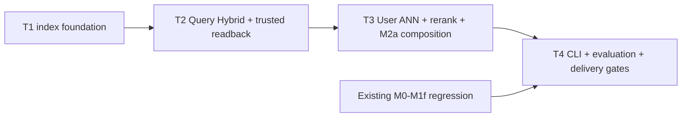

# Glodex M2a 检索智能亮点闭环实施任务

| 字段 | 值 |
|---|---|
| Tasks ID | `GLO-TASKS-007` |
| 版本 | `0.1.1` |
| 状态 | Approved |
| 对应规格 | [`GLO-SPEC-007 v0.2.2`](./spec.md)（Approved） |
| 对应计划 | [`GLO-PLAN-007 v0.1.2`](./plan.md)（Approved） |
| 里程碑 | M2a：OpenSearch、三视图召回、Rerank 与偏好记忆闭环 |
| 创建日期 | 2026-07-30 |
| 最后更新 | 2026-07-30 |
| 批准日期 | 2026-07-30 |

## 1. 实施边界与完成定义

本任务单只实现 M2a 的本机检索智能闭环。M0–M1f 已交付的 AgentLoop、九工具、fork、SSE、
价格/Evidence gates、本地 Hybrid Category RAG、ESCI benchmark 和静态 Showcase 必须原样保留；
M2a 仅通过新的 operator-only 命令和独立 composition 启动。M2b（Postgres/Redis/durable
memory）、M2c（A100/BGE/cross-encoder service）和 M2d（AG-UI/React/运营）是已承诺的后续
里程碑，不在本任务单中以 placeholder 实现。

实施按 **T1 → T2 → T3 → T4 四个大交付任务** 进行。每个任务先完成其离线
unit/contract/architecture tests，再写对应实现；真实 Docker 与 DashScope 验证只作为明确的
operator smoke，不进入默认 pytest/CI。任何任务都不得提交 OpenSearch volume、ESCI 数据、
raw query/profile、embedding/rerank body、凭据、`.env` 或 `项目架构/` PNG。

完成 M2a 的最低结论是：在一台有 Docker、已显式配置 DashScope 凭据的本机上，可从已验证的
M1d assets 建立 OpenSearch indexes、写入一个 typed local preference profile、运行一条 M2a
Agent query，并得到可安全展示的 retrieval trace；默认 M0–M1f 路径仍完全离线可运行。

## 2. 交付任务

### T1 — Local OpenSearch、manifest 与受控索引基础

**目标。** 交付一个固定 loopback 的 OpenSearch 2.17 单节点，以及基于已验证 M1d asset
projection 建立 Product/Card/Profile 三份 versioned index 的能力。它是 M2a 唯一的基础设施
任务，不接入 Agent、不读写 profile 业务语义，也不调用 DashScope。

**实现内容。**

- 在 `pyproject.toml` / `uv.lock` 仅加入 `opensearch-py[async]>=2.8,<3`；固定的 `2.17.0` 是
  OpenSearch server image 版本；新增
  `infra/m2a-opensearch.compose.yml`，固定 `opensearchproject/opensearch:2.17.0`、single-node、
  `127.0.0.1:9200`、512 MiB heap，且不带 Postgres、Redis、Dashboards、volume 或远程 host；
- 新增 `src/glodex/adapters/m2a_opensearch.py`，作为唯一 AsyncOpenSearch owner：只接受 IPv4/
  IPv6 loopback，固定 timeout、response/body/bulk 上限，禁止 proxy/redirect，并确保 per-run
  close；
- 新增 `src/glodex/application/m2a_indexes.py`，从 `AgentIndexes` 的 validated projection 构建
  Product、Card、Profile 的固定 mapping、named hybrid pipeline、`M2aIndexManifest`、physical
  index 与 atomic alias publication；Product/Card 必须为 1,024 维 Lucene HNSW cosine，manifest
  写入 mapping `_meta`；
- 新增 `scripts/verify_m2a_opensearch.py`：operator 触发的 build → verify → native query →
  down smoke。默认测试仅 fake/mocked transport。

**先行验证。** mock transport 覆盖 loopback rejection、request byte/deadline、固定 mapping/
pipeline body、manifest canonicalization、重复 build 复用、alias/mapping/count/hash/dimension/
ownership mismatch。architecture test 证明 domain、M1d default composition 和普通 CLI 不导入
OpenSearch adapter，且默认 socket spy 为零。

**验收证据。** `M2A-AC-001`、`GLO-M2A-P0-001`、`NFR-001/002/005`；真实 smoke 上 Product 为
8 docs、Card 为 8 docs、空 Profile 为 0 docs，任一闭合检查失败都不得发布 alias。

**完成条件。** T1 可独立由 `m2a-index --action build|verify --snapshot m1d-demo-v1` 驱动；尚无
M2a Agent、User ANN 或 rerank 路径。

- [ ] T1 完成

### T2 — Query Hybrid、可信回读与 M2a Card backend

**目标。** 在 T1 的 alias/manifest 基础上交付真实 native Query Hybrid，以及只以 opaque key
为媒介、回读已有可信资产的商品和 Category Card 检索。它建立 M2a retrieval 的主路径，但尚不
接入 user recall 或 reranker。

**实现内容。**

- 新增 `src/glodex/adapters/m2a_retrieval.py`：`OpenSearchItemSource`、
  `OpenSearchCategoryInsight` 与 strict IDs/ranks parser。二者必须生成固定 native `hybrid`
  query，含共享 platform/hard-eligible filter、BM25 与 cosine k-NN 两个 subquery、Top-30 和
  named min-max `0.7 vector / 0.3 BM25` pipeline；
- 引入只读、run-scoped `M2aItemContext` 与 `M2aRetrievalTrace`。context 只由已验证 planner
  Required 和显式 `profile_id` 产生，普通 M1d path 恒为 `None`；
- Item adapter 只接受当前 manifest 的 `record_key`，以既有 `DemoItemSource` / `CatalogBatch`
  projection 回读事实和 `_sub_batch()`；Card adapter 只接受 `card_id`，回读 `AgentIndexes.cards`
  后调用既有 reducer。不得从 OpenSearch `_source` 返回 offer、金额、Evidence、Card facts 或
  profile body；
- 新建 M2a-only composition seam，保留 `build_agent_service()`、`agent-demo`、Search API/SSE、
  M1d `AgentIndexes.retrieve()` 和本地 RAG 的原行为。

**先行验证。** fake client contract 覆盖 lexical-only/vector-only/overlap/tie、两 subquery 的
共同 filter、Top-30、stable `(-score, key)` order、alias/manifest mismatch、unknown/duplicate/
cross-platform/stale key、bad vector；Card tests 覆盖 selected ID 到 source/reducer 的事实闭合。
default M1d run 的 socket spy、golden bytes 和 tool contracts 必须不变。

**验收证据。** `M2A-AC-002`、`M2A-AC-005`（召回段）、`M2A-AC-006`（可信回读/主路径故障）、
`GLO-M2A-P0-002/005/006`、`NFR-001/003/004/005`。OpenSearch 不可用时 M2a 主路径返回
`M2A_RETRIEVAL_FAILED` 或 `M2A_CATEGORY_RETRIEVAL_FAILED`，绝不悄悄回退到 M1d in-memory
retrieval。

**完成条件。** T2 在 fake transport 下有完整 deterministic tests；T1 operator smoke 可额外证明
native hybrid request 真实执行。M2a Card 仍不把未 reranked 结果描述为精排完成。

- [ ] T2 完成

### T3 — Profile 三视图、实际 Rerank 与 M2a Agent composition

**目标。** 交付显式、typed local preference memory 的 User → Item ANN 补充、DashScope
`qwen3-rerank` 的真实 query-first 精排，以及同时复用既有 AgentLoop/Hard Gates/Evidence 的
M2a-only Agent 运行入口。

**实现内容。**

- 新增 `src/glodex/application/m2a_profile.py`（schema、operator command、deterministic conflict
  judge）与 `src/glodex/adapters/m2a_profile_store.py`（profile alias 的 scoped CRUD 与 User ANN）。
  profile 只接受 explicit `profile_id/scope/kind/value` soft preference；当前 Required 的预算、
  platform、category、库存和排除项冲突时拒绝该 entry/candidate；
- 新增 `src/glodex/adapters/dashscope_rerank.py`，复用既有 bounded HTTP 模式但固定 DashScope
  rerank endpoint/model `qwen3-rerank`。它限制 query/candidate/byte/deadline，逐一验证 response
  index/identity，不提供 generic URL/model 或 provider fallback；
- Query Top-30 不可置换；User ANN 仅从同 platform、hard-eligible pool 找至多 10 个 Query 以外
  candidate。合流后 product rerank 一次最多 40 项，Card rerank 一次最多 30 项，各保留 15；
- 新增 `build_m2a_agent_service()` 与 M2a trace recorder，只替换 item/category dependency，继续
  使用固定 DeepSeek selector、M1d runtime/tools、CandidateManifest、SearchService、shipping rules、
  Canonical/Evidence gates 和既有 event observer。M2a 的 safe code 只附着既有 SSE tool event，
  不新建 wire event；
- 实现严格降级：profile/User ANN failure → `M2A_PROFILE_DEGRADED` 跳过补充；rerank failure →
  `M2A_RERANK_DEGRADED` 丢弃全部 User-only candidate、保留 Query Hybrid 顺序；主 Query failure
  仍 fail closed。

**先行验证。** fake embedding/rerank/client 覆盖 profile CRUD/scope/ownership、无 profile 不执行
ANN、冲突 judge、protected merge、candidate 上限、response identity 注入、timeout/bad schema/model
failure、无 query/profile/document body 泄露到 trace/SSE。使用真实 DashScope 的 product 和 Card
rerank 仅放在独立 operator smoke，且需显式 `--live` 与预先存在的 `DASHSCOPE_API_KEY`。

**验收证据。** `M2A-AC-003`、`M2A-AC-004`、`M2A-AC-005`（精排段）、`M2A-AC-006`、
`GLO-M2A-P0-003/004/005/006`、`NFR-001/002/003/004/005`。真实 smoke 不可达时记录明确前置
条件，不能把 fake transport 成功误报为 live rerank。

**完成条件。** 显式 `m2a-profile` 能安全管理单机 profile；T1 index 就绪后，`m2a-agent-demo
--live --profile local-demo ...` 可执行完整 M2a chain。普通 `agent-demo`、API/SSE 默认入口仍不
加载 profile/OpenSearch/DashScope。

- [ ] T3 完成

### T4 — CLI、评测、回归、README 与交付门禁

**目标。** 让 M2a 能被学生可重复地启动、验证和展示，并把所有新能力纳入离线 regression/
traceability，同时证明旧亮点没有被 M2a 回退。

**实现内容。**

- 在 `src/glodex/cli.py` 新增且只新增 `m2a-index`、`m2a-profile`、`m2a-agent-demo` command
  families；parser 拒绝 host/port/url/index/model/DSL 等未批准参数，所有 DashScope 调用必须
  同时具有 M2a command 与 `--live`；每条命令输出独立的单行安全 JSON envelope；
- M1e 增加独立、显式的 rerank comparison mode（若普通 `benchmark-esci` 会改变原边界，则改为
  `m2a-eval-esci`）。它在排序后才读取 labels，输出聚合 coarse/reranked metrics；ESCI label/
  raw corpus 永不进入 index、Catalog、Agent 或 provider request；
- 新增 `tests/m2a/{unit,contract,acceptance,architecture,nfr}/`、`scripts/verify_m2a.py` 与
  traceability profile `m2a`。默认 runner 依次执行 `verify_m1f.py`、M2a offline checks、
  ruff/format/mypy/traceability，清除 provider/proxy 环境并 socket-deny；
- 更新 README：Docker start/index/verify/profile set/M2a Agent query/trace/stop 的完整顺序，
  明示本机资源、DashScope 网络/成本、8 商品/8 Card corpus 局限、数据/隐私边界，以及 M2b/c/d
  尚未实现。保留所有 M1f static showcase 说明和启动方式。

**先行验证。** CLI parser/envelope snapshots、bad preflight/no credential/no `--live`、安全 trace
redaction、M1e label isolation、M1f full regression、dependency direction、zero socket default、
no data/credential/PNG tracking。`scripts/verify_m2a.py` 必须 fail-fast，并明确区分离线成功与
Docker/DashScope smoke 的未满足前置条件。

**验收证据。** `M2A-AC-007` 和全部 `GLO-M2A-P0-001`–`007`、`NFR-001`–`006` 的 traceability
coverage；最终离线门禁为：

```bash
uv run --locked python scripts/verify_m2a.py
```

真实 operator smoke（不进入默认 CI）为：

```bash
uv run --locked python scripts/verify_m2a_opensearch.py
uv run --locked python scripts/verify_m2a_dashscope.py
```

**完成条件。** 干净本机可按 README 完成 start → index → profile → M2a Agent → safe trace →
stop；最终报告分别列出离线 gate、Docker smoke 与 DashScope smoke 的真实结果，绝不把不可用的
外部前置条件掩盖为已完成。

- [ ] T4 完成

## 3. 依赖、测试顺序与不可变约束



| 阶段 | 允许的外部依赖 | 禁止事项 |
|---|---|---|
| 默认 unit/contract/acceptance/architecture/nfr | 无；只用 fake transport 和固定测试 vectors | Docker、OpenSearch socket、DashScope、凭据、代理、M1e label/runtime 混用。 |
| T1/T2 Docker smoke | 本机 loopback OpenSearch 2.17，由 operator 手动启动 | 远程 host、Docker 自动拉起、隐式 fallback 到 M1d。 |
| T3/T4 live smoke | 显式 `--live`、已存在 DashScope credential、受限 Product/Card text | 自动读取 `.env`、任意 endpoint/model、泄露 query/profile/body、把 live 分数当 deterministic。 |

不变约束：M2a index 从来不是事实源；Query Top-30 结构性优先；User 只补充而不改分；
SearchService 的 Hard Gates/Canonical/Evidence 是最终发布唯一入口；M1d 的 local Hybrid RAG
继续是普通 Agent path；任何 M2a 原始 Query retrieval failure 都不允许 hidden fallback。

## 4. Tasks Definition of Ready（进入 Implementation 前）

- [x] 本任务单状态改为 `Approved` 并记录批准日期；
- [x] 用户确认四个大任务的顺序为 T1 → T2 → T3 → T4，不以微任务方式拆分或逐项等待；
- [x] 用户确认实现前先写离线 fake/contract/architecture tests，Docker 与 DashScope 只在对应
      operator smoke 阶段运行；
- [x] 用户确认 T3 的真实 DashScope 调用仍仅在显式 `--live`、有界文本和既有凭据的条件下发生；
- [x] 用户确认不把 M2b 的 Redis/Postgres/durable memory、M2c 的 A100 模型服务或 M2d 的
      AG-UI/React 偷渡进 M2a；
- [x] 用户确认 T4 最终验收必须同时报告离线 gate 和两类真实 smoke，而不是以配置/placeholder
      代替运行证据。
