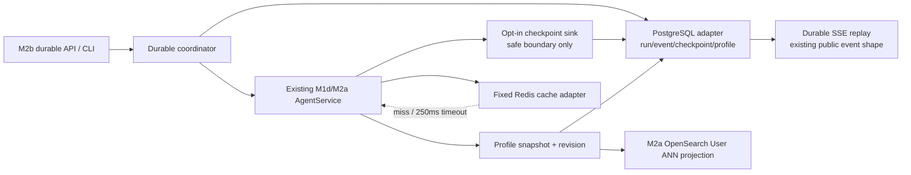

# Glodex M2b 持久 Agent Runtime 技术实施计划

| 字段 | 值 |
|---|---|
| Plan ID | `GLO-PLAN-008` |
| 版本 | `0.1.0` |
| 状态 | Approved |
| 对应规格 | [`GLO-SPEC-008 v0.1.0`](./spec.md)（Approved） |
| 父基线 | `GLO-SPEC-004`、`GLO-SPEC-007` |
| 里程碑 | M2b：PostgreSQL durable runtime、Redis cache 与 persistent Profile |
| 创建日期 | 2026-07-30 |
| 最后更新 | 2026-07-30 |
| 批准日期 | 2026-07-30 |

## 1. 实施目标与约束

M2b 把 M1d/M2a 的单进程 Agent demo 增量扩展为**单机 durable runtime**。它不替换
`AgentService` 的九工具、fork、Canonical/Evidence/Hard Gates 或 M2a Query-first retrieval；
而是在一个新的 opt-in composition 中为它们增加可靠的本机持久边界。

实施固定为 **A → B → C → D 四个大交付块**。Tasks 不得把某个字段、SQL 表、错误码或测试
拆成独立“进度任务”，也不得把 M2c/M2d 偷渡进来。

- 新增两个窄 runtime dependencies：一个 async PostgreSQL driver 和一个支持 asyncio 的 Redis
  driver；两者只在 M2b adapter/composition/migration 层导入，由 `uv.lock` 固定实际版本。
  不引入 SQLAlchemy、ORM、Celery、Redis queue、通用 Repository/UoW 或 workflow framework；
- 固定 local Docker baseline：PostgreSQL 16.x + Redis 7.x，均仅映射 `127.0.0.1`；Postgres
  使用一个 named volume，Redis 禁用 durable persistence。M2a OpenSearch 仍由其独立 compose
  显式启动，不合并为“全家桶”服务；
- 既有 `create_agent_app()`、`AgentRunRegistry`、`agent-demo`、普通 Agent API/SSE 和 M1f
  静态展示不改行为、不加载新 driver。M2b 新建 durable factory/CLI/URL prefix；
- PostgreSQL 是 Run/Event/Checkpoint/Profile 的唯一 durable truth source。Redis/OpenSearch/
  内存都可清空；Redis 只能是固定 15 min retrieval / 5 min context 的 cache，250 ms/32 KiB，
  fail-open；
- checkpoint 恢复只允许完整、hash/version/sequence/profile/asset/config 全匹配的**已确认**安全
  boundary。进程在 DeepSeek、DashScope、Tavily/eBay 或任何 Provider call 中断时，必须一次性
  `ABORTED(DURABLE_REMOTE_STEP_UNCERTAIN)`，绝不重试或假称 exactly-once；
- 持久 Profile 仍只是 explicit typed `soft/preference`。它不会保存聊天/CoT/隐式画像，不会
  改写 Required，也不会成为商品、价格或 Evidence 的真相源；
- M2b 不实现 AG-UI/WebSocket/React、模型服务/A100、worker queue、多进程调度、认证、跨设备
  同步、备份/HA 或新 marketplace adapter。

## 2. 增量架构与复用缝



| 现有缝 | M2b 的精确使用方式 |
|---|---|
| `AgentService.execute_run()` / `AgentRunEvent` | 保留普通 `execute_run()` 与同步 `AgentEventObserver`。新增 M2b-only `DurableCheckpointSink`，只在本地 state 已验证、下一次外部调用前/后及 terminal 前触发；其 event 是既有安全 event，不扩大 public schema。 |
| `AgentToolState`、ledger、Candidate manifest、fork state | 增加一个 versioned、JSON-only private checkpoint codec；只编码恢复必需的已验证 state，不 pickle、不接受任意 dict。codec 恢复后必须重新验证 invariant、asset/config/index/profile revision。 |
| `AgentRunRegistry` / `AgentRunCoordinator` | 保留为 M1d process-local 实现。新增 durable coordinator/store，不在原 Registry 中插入数据库分支。Postgres transaction 和 active-thread unique lease 负责 durable 资源竞争。 |
| `AgentEventProjector` / `AgentRunStatusResponse` | 复用现有 public event/status DTO 与 SSE serialization。M2b adapter 存储已验证 DTO canonical JSON，replay 时重新验证；私有 request/checkpoint 不经 projector。 |
| `M2aProfileStore` / `OpenSearchItemSource` | 新 Postgres Profile store 是 source of truth；M2a-only composition 从一个 immutable revision snapshot 建立 OpenSearch User ANN projection。原 M2a command/composition 保持原 profile adapter，直到 M2b entry 明确启用。 |
| `OpenSearchItemSource` / Card backend | 可在正确验证后使用 Redis 缓存的 opaque ID/rank trace，但命中后仍通过 existing trusted item/Card projection、manifest、Query-first 与 Hard Gates；不能 cache 完整业务结果。 |
| `ApiSettings` / FastAPI factories | 增加严格的 `DurableApiSettings` 与新 `create_durable_agent_app()`；endpoint/DSN 仅接受固定 loopback Docker service，request、query 或 Agent action 无法传入任何数据库/Redis URL。 |

### 2.1 Durable state 与 remote-call fence

`DurableCheckpoint` 固定有四种 state：`CONFIRMED`、`REMOTE_PENDING`、`TERMINAL`、`CANCELLED`。
它携带 run/thread/attempt、checkpoint sequence、state codec version/hash、public event cursor、
asset/config/index/profile revision、已确认 root/child state、budget 和 candidate binding。

执行顺序固定：

1. 在 transaction 内 reserve durable run 与 active-thread lease；
2. 写 `AGENT_STARTED + CONFIRMED checkpoint`；
3. 外部调用前写 `REMOTE_PENDING`，成功且其 action/output 已完成全部 local validation 后在同一
   transaction 写对应 event + `CONFIRMED checkpoint`；
4. 已确认 tool/fork merge 后同样提交 event + checkpoint；
5. terminal event、terminal status/response/error、final checkpoint 和释放 lease 在一个 transaction
   完成。

restart recovery 只读最新 checkpoint：`CONFIRMED` 可变为 `RECOVERABLE` 等待显式 resume；
`REMOTE_PENDING`、hash/sequence 错误、旧版本或 profile/asset drift 原子提交一个 public
`AGENT_ERROR(ABORTED)`，使用稳定 code，释放 lease。没有“从失败点自动再试一次”的路径。

### 2.2 数据库、Redis 与 migration 边界

新增 `infra/m2b-durable.compose.yml` 与一套以 SQL 文件 version/hash 管理的 forward-only migration。
启动后由 explicit `glodex m2b-migrate --live` 执行，应用 factory 不自动 migration。表结构实现
Spec 的 `durable_runs`、`durable_events`、`durable_checkpoints`、`profile_revisions`、
`profile_entries`，并额外用 migration ledger 防止未知/修改过的 SQL 再次执行。

Postgres adapter 只有固定的 parameterized statements：reserve/load run、append event/checkpoint、
terminal/cancel/lease transition、replay sequence、profile CRUD/snapshot。不得开放 SQL、table、
sort/filter、json path 或 arbitrary transaction。

Redis adapter 只有 `get/set` 两类固定 namespace 与固定 TTL。key 由 canonical request/context
input和版本形成 SHA-256 digest；value 是严格 DTO/size checked bytes。adapter 使用一个 250 ms
总 timeout，坏值/超时/连接失败一律 typed miss。所有 read/write 都是 optional；Postgres 和正常
M2a path 从不等待 cache repair。

## 3. 交付块与文件边界

### A. Local durable services、schema 与窄 adapters

新增 compose/migration 与 `src/glodex/adapters/m2b_postgres.py`、`m2b_redis.py`、
`m2b_migrations.py`。新增 `src/glodex/application/durable/contracts.py` 和 `ports.py`，存放 exact
durable DTO、state transition validators、cache key/value DTO 与 typed adapter failures；domain 不导入
这些模块。

先完成 strict loopback validation、connection/body/deadline bounds、migration checksum、schema
transactional constraints，以及 Postgres/Redis mock transport contract。只在独立 Docker smoke 中
访问 socket；默认 pytest 继续 `--disable-socket`。A 完成时没有变更 Agent runtime、HTTP 路由、
M2a retrieval 或 Profile CLI。

### B. Durable coordinator、checkpoint codec、recovery/cancel 与 SSE replay

新增 `src/glodex/application/durable/runtime.py` 和 `src/glodex/api/durable_agent_app.py`。在 M1d
runtime 添加最小 opt-in checkpoint extension，而非重写 AgentLoop：所有现有 `execute`/
`execute_run`、fork 上限、event order、deadline、tool contracts 保持不变；只有 durable executor
提供 checkpoint codec/sink 和 resume entry。

codec 将已验证的 agent phase、safe observations、tool summary、budget ledger、child state、candidate
manifest binding、profile/asset/index/config revision 编码为 canonical JSON + hash。恢复器先进行严格
decode/rehydrate/revalidate，然后才恢复后续 local state。任何 remote pending 或无法完全重建的
private state 只安全 abort；绝不把 M1d in-memory response 当 checkpoint。

durable FastAPI 复用既有 JSON body limit、error envelope、`SearchRequest` validation、event cursor
和 SSE serialization，新增且仅新增 Spec 的 five endpoint。cancel/resume idempotency、lease race、
terminal atomicity 由 Postgres state transition test 和 fake clock/worker test 覆盖。普通
`agent_app.py` 不导入 durable modules。

### C. Durable Profile、M2a projection、Redis cache 与 context digest

新增 `src/glodex/application/durable/profile.py` 和对应 Postgres adapter；添加独立
`m2b-profile` operator command family。它迁移/写入 typed Profile 与 revision，不自动读取旧
OpenSearch Profile index。M2b composition 在 run reservation 时取 snapshot，checkpoint 绑定其
revision；M2a retrieval 通过一个明确 `DurableProfileProjection` 将 vector/entry 投影到本机
OpenSearch，再走现有 conflict judge/User ANN。普通 M2a path 不变。

为 `OpenSearchItemSource` 与 `OpenSearchCategoryInsight` 增加可选、M2b-only cache port：缓存
仅存 strict opaque ID/rank/context DTO，cache hit 必须再次走 trusted materialization、version/
manifest/profile validation 和最终 SearchService gates。context compressor 是纯 deterministic
函数，基于 safe events/observation 形成固定 size digest；不引入新的 LLM 调用、prompt 内容或
浏览器字段。

Redis 故障、profile projection fail、revision drift 和 cache injection 都要各自走 Spec 的 safe
failure/degraded branch，且不可回退到未持久 profile、Redis data 或 default M1d backend。

### D. Operator CLI、验证、文档与回归闭环

`src/glodex/cli.py` 新增精确 operator commands：`m2b-migrate --live`、`m2b-profile`、
`m2b-durable-agent-demo --live`、`m2b-verify --live`。它们只输出 status、opaque ID、revision、
version、计数与安全 code；没有 DSN/host/model/cache-key/raw query/profile body 参数。新 server
entry必须显示为 M2b durable factory，不替换现有 agent server。

新增 `scripts/verify_m2b.py`（离线：M0–M2a + M2b architecture/unit/contract/acceptance/type/lint/
traceability）和 `scripts/verify_m2b_local.py`（Operator：Postgres/Redis/OpenSearch start →
migration → profile → complete replay → controlled checkpoint resume → cancel → Redis outage → stop）。
真实 DeepSeek/DashScope 仅在用户明确使用 live credentials 后可选运行，核心 durable smoke 使用
fake deterministic transport，不把云可用性当数据库恢复证据。

README 明确说明 M2b compose 的 named volume、Redis 可丢失、private local data、`down` 与
`down -v` 的差别、remote-step abort 限制、固定 resource/credential requirements 和 M2c/M2d
尚未实现项。新增 M2b traceability profile；所有测试/README 禁止 `项目架构/` 的 26 PNG 和
任何 raw durable data。

## 4. 故障与兼容性矩阵

| 情形 | 固定行为 |
|---|---|
| Postgres unavailable / migration hash 不匹配 / loopback 校验失败 | durable submission 拒绝，不创建内存 fallback run；普通 M0–M2a 不受影响。 |
| Redis unavailable / timeout / bad value / eviction | typed cache miss/degraded，正常 retrieval/context path 执行；不影响 durable event/checkpoint/profile 真相。 |
| OpenSearch Profile projection unavailable | M2a User ANN 标记 `M2A_PROFILE_DEGRADED`；Query Hybrid 和最终 gates 保持原语义。 |
| active lease、双 worker、重复 cancel/resume | DB transition 拒绝竞争方；只产生一个 terminal public event。 |
| restart + confirmed checkpoint | 进入 `RECOVERABLE`，显式 resume 从同 run ID、同 checkpoint 继续；已确认 event/tool 不重复。 |
| restart + remote pending / hash / sequence / revision mismatch | 一次 `ABORTED` 安全 event，code 稳定；不重试外部请求、不伪造 response。 |
| cancel 在任何 safe boundary 或与 restart 竞争 | terminal `ABORTED/RUN_CANCELLED`，无业务 response，无法 resume。 |
| 默认 CLI/API/SSE/M1f | 不连接/导入 Postgres/Redis，不读取 durable config，wire contract 与 golden 不变。 |

## 5. 验证矩阵与最终门禁

| 验证层 | 最小证据 | 覆盖 |
|---|---|---|
| unit | durable state graph、checkpoint canonical hash/codec、profile revision、cache key/TTL/size、context digest、cancel race | `P0-002`–`007`、`NFR-002/003/005` |
| contract | Postgres/Redis fake adapter limits、migration checksum、loopback/parameterized query restrictions、durable CLI/API/SSE schema | `P0-001`–`008`、`NFR-001/004/006` |
| acceptance | completed replay、confirmed checkpoint resume、pending remote abort、single cancel terminal、profile revision/query-first, cache miss/corruption | `M2B-AC-001`–`007` |
| architecture/nfr | no default driver import/socket, no SQL/Redis DSL, no raw private value in public path, M0–M2a boundaries unchanged | `NFR-001`–`007` |
| real local smoke | actual Postgres named-volume restart, Redis outage, M2a projection and durable SSE replay | `AC-001/002/005/006` |

最终离线门禁：

```bash
uv run --locked python scripts/verify_m2b.py
```

Operator local smoke（不进默认 pytest）：

```bash
docker compose -f infra/m2a-opensearch.compose.yml up -d
docker compose -f infra/m2b-durable.compose.yml up -d
uv run --locked python scripts/verify_m2b_local.py
docker compose -f infra/m2a-opensearch.compose.yml down
docker compose -f infra/m2b-durable.compose.yml down
```

`down -v` 只能作为 README 中明确的、手动数据清除步骤，绝不由 smoke/应用自动执行。

## 6. Plan Definition of Ready（进入 Tasks 前）

- [x] 用户确认 M2b 按 A–D 四个交付块实施，不把它拆成数据库字段或 cache key 微迭代；
- [x] 用户确认增加两个窄 async driver、PostgreSQL named volume、Redis non-durable cache，但不
      引入 ORM/queue/framework 或默认数据库连接；
- [x] 用户确认 durable recovery 的 remote-call fence：confirmed 才 resume，pending 必须
      abort；
- [x] 用户确认 Postgres Profile 取代 M2a OpenSearch Profile 的 durability source，OpenSearch
      仍只是 M2b run-scoped ANN projection；
- [x] 用户确认 Redis 15/5 min TTL、250 ms/32 KiB fail-open 合同，以及 cache hit 仍走所有
      manifest/Query-first/Hard Gate 验证；
- [x] 用户确认 durable API 是独立 factory/URL，不改变普通 Agent API/SSE，也不在本阶段交付
      AG-UI/React/A100/多 worker；
- [x] 用户确认 final offline gate 与真实 local Docker smoke 的分离及 `down -v` 清除规则。
