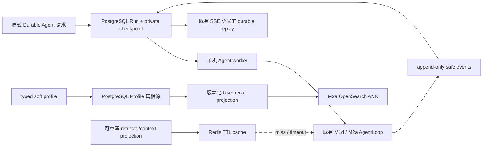

# Glodex M2b 持久 Agent Runtime 与长期记忆规格

| 字段 | 值 |
|---|---|
| Spec ID | `GLO-SPEC-008` |
| 版本 | `0.1.0` |
| 状态 | Approved |
| 里程碑 | M2b：PostgreSQL durable Run/Event/Checkpoint/Profile 与 Redis fail-open cache |
| 父规格 | [`GLO-SPEC-004`](../004-glodex-m1d-agent-demo/spec.md)、[`GLO-SPEC-007`](../007-glodex-m2a-opensearch-hybrid-retrieval/spec.md)、[`GLO-SPEC-011`](../011-glodex-m2e-durable-bge-composition/spec.md) |
| 创建日期 | 2026-07-30 |
| 最后更新 | 2026-07-30 |
| 批准日期 | 2026-07-30 |

## 1. 目的与架构亮点

M2a 已实现本机 OpenSearch 的 Query/User/Item 召回、真实 rerank 和显式 typed profile，
但运行、SSE 事件、Profile 仍随进程或无 volume 的 OpenSearch 容器停止而消失。M2b 把图中
尚未实现的**持久运行时与长期记忆**做成真实本机闭环：PostgreSQL 保存不可伪造的运行状态、
安全事件、恢复 checkpoint 和 typed Profile；Redis 只加速可重建的 retrieval/context 投影。

这不是把所有状态都塞进 Redis，也不是宣称已经有生产级任务平台。M2b 的边界是一个
**单机、operator-only、可重启验证**的 durable Agent 入口：只有已经完整写入 PostgreSQL 的
checkpoint 才可恢复；进程在模型、Provider 或工具外部调用的中间崩溃时，系统必须标为
`ABORTED`，绝不猜测调用是否完成、更不重复执行不确定的外部副作用。

| 架构图亮点 | M2a 前状态 | M2b 交付 |
|---|---|---|
| PostgreSQL Run / event / checkpoint | 仅进程内 `AgentRunRegistry` | versioned schema、append-only 安全事件、恢复与取消。 |
| Redis retrieval/context cache | 未实现 | 有 TTL、版本、250 ms 上限的 fail-open cache。 |
| 长期记忆 | M2a 的 local OpenSearch Profile，容器停止即丢失 | PostgreSQL typed soft preference 及 revision；OpenSearch 只作受控召回投影。 |
| SSE 恢复 | 仅当前进程保留期 | 同一公开事件合同的 Postgres replay、`Last-Event-ID` 续接。 |
| 上下文压缩 | 未实现 | 确定性、安全 observation digest；不调用额外 LLM。 |

## 2. 范围与非目标

### 2.1 In Scope

- 一个明确 opt-in 的单机 durable Agent API/CLI composition；既有 M0–M2a 默认 CLI、
  Search API、普通 Agent API 与 M1f showcase 保持零数据库、零 Redis；
- loopback-only Docker PostgreSQL 和 Redis，带 named volumes；migrations、health、
  初始化、真实 smoke 与明确清除命令；不提交 volume 数据；
- PostgreSQL 中 durable Run、private request/checkpoint、append-only public event、
  terminal response/error、取消标记和严格的 per-thread active lease；
- 对 M1d Agent runtime 在**安全 step 边界**的 checkpoint 与恢复：根/child 的阶段、
  已确认 action、已完成工具的受限结果投影、预算/计数、Candidate manifest binding、
  profile revision、asset/index/config version 必须闭合；
- 进程重启后的 durable status/event replay；仅当 checkpoint 完整且没有不确定的 remote step
  时继续同一 `run_id`；否则持久地 `ABORTED`；
- 显式取消 endpoint/CLI。取消请求持久化、在下一个 runtime boundary 停止，并以既有安全
  `AGENT_ERROR(status=ABORTED, safe_code=RUN_CANCELLED)` 终止；
- Postgres truth-source 的 typed soft Profile create/list/update/delete/revision；保存受限
  embedding vector、model/dimension 与值，但不保存聊天全文、推测画像、点击、商品或价格事实；
- M2a 的 User→Item ANN 从已验证的 Postgres profile snapshot 建立受控 OpenSearch retrieval
  projection；OpenSearch profile index 不再是 durability source；
- Redis 对可重建的 Query retrieval key、User-supplement projection 和安全 context digest
  做有限 TTL cache；cache key 不含 raw query/profile text，所有 cached identity 在使用前仍经
  M2a manifest、当前 Required 与既有 Hard Gates 验证；
- 在恢复前以确定性、版本化规则将安全 observation 压缩为有上限 digest，避免把完整历史、
  prompt、模型原文或工具正文带回模型；
- fake/contract、Postgres/Redis real local smoke、重启/取消/故障注入、M0–M2a regression 与
  README 的数据、隐私、成本和停止说明。

### 2.2 Out of Scope

- 多 worker、分布式队列、Redis Streams/PubSub、Celery/Kafka、调度器、后台轮询、自动 retry、
  exactly-once 外部调用、远程数据库、备份、HA、RLS、认证、跨设备同步或公网部署；
- 任意聊天全文、CoT、prompt、模型/Provider 原文、网页正文、商品事实、价格/库存、支付信息或
  隐式行为作为记忆；
- 完整 AG-UI SDK/协议、WebSocket、React 前端、浏览器 Agent 面板或运营 dashboard；M2d 才
  消费 M2b 的 durable public event store 构建它们；
- 新 marketplace adapter、抓取、真实购买、默认命令的联网、改写 M1d 九工具/fork 语义，或
  改变 M2a 的 Query-first、Canonical、Evidence 与 Hard Gate 规则；
- A100、vLLM、BGE/自托管 embedding/cross-encoder、训练或模型注册；M2c 负责模型服务。
- 泛化 ORM/Repository/UoW 框架、任意 SQL/Redis console、任意 key namespace 或通用
  cache DSL；
- 提交 Docker volume、database dump、Redis RDB/AOF、运行日志、raw query、profile 正文、
  checkpoint body、embedding、secret、`.env` 或 `项目架构/` PNG。

## 3. 固定拓扑、数据归属与生命周期

### 3.1 本机服务

`infra/m2b-durable.compose.yml` 只允许以下固定服务，并都绑定 `127.0.0.1`：

| 服务 | 固定用途 | 持久化 | 禁止用途 |
|---|---|---|---|
| PostgreSQL 16.x | Run/Event/Checkpoint/Profile 的唯一 durable truth source | named volume `m2b-postgres-data` | 向浏览器、Provider 或网络暴露；商品/报价/Evidence 真相。 |
| Redis 7.x | retrieval/context 的可丢失 cache | 不启用 AOF/RDB，容器停止即允许丢失 | queue、event store、lease 真相、profile/run/checkpoint 真相。 |
| OpenSearch 2.17 | M2a Product/Card 和临时 Profile retrieval projection | 仍由 M2a 显式启动 | durable memory 或 durable run store。 |

`docker compose down` 不删除 PostgreSQL named volume；只有 Operator 明确执行
`docker compose down -v` 才清除 M2b 数据。README 必须将此差异写清。应用不能自动拉镜像、
启动/停止 Docker 或为连接远程 host 放开配置。

### 3.2 PostgreSQL 最小 schema

所有 schema 名和 migration identity 固定为 `glodex_m2b_v1`。每一行均含 schema/version 或
fingerprint 以拒绝旧代码/数据的静默混用。

| 表 | 最小内容 | 不得包含 |
|---|---|---|
| `durable_runs` | run/thread ID、state、attempt、lease、asset/config/profile revision、private request envelope、terminal safe response/error、timestamps | Provider response、prompt/CoT、工具原文。 |
| `durable_events` | `(run_id, sequence)` 主键、完整已验证的 `glodex.agent.event.v1` public payload、payload hash、timestamp | raw request、profile value、工具参数/正文。 |
| `durable_checkpoints` | immutable checkpoint number、run ID、phase/budget/cursor、safe runtime state、checkpoint hash、remote-step certainty | 未验证 dict、任意 pickle、secret 或原始 Provider body。 |
| `profile_revisions` | profile ID、单调 revision、schema/model/dimension、更新时间 | 其他 profile 的 data。 |
| `profile_entries` | profile ID、entry ID、`scope=soft`、`kind=preference`、bounded value、normalized vector、model/dimension、revision 与 tombstone | hard constraints、聊天、隐式行为。 |

`durable_events` 只能追加，不能更新/删除；terminal record 与最后一条 event 必须在同一
transaction 形成可验证的一对。checkpoint 先完整写入并校验 hash，再允许下一次外部调用。
所有 public read paths 只使用 event/terminal 的安全投影，绝不序列化 private request 或
checkpoint。

### 3.3 状态、恢复与取消

M2b 新增的 durable resource state 不改写 M1a/M1d 的 `RunState` 合同：

`ACCEPTED → RUNNING → {COMPLETED | NO_MATCH | FAILED | ABORTED}`，其中内部可短暂处于
`RECOVERABLE` 或 `CANCEL_REQUESTED`，但它们只由 durable endpoint 明确表示，不能伪装成
已完成业务结果。

1. 每个 root/child **已完成** model decision、工具执行、fork merge 和 terminal 转换后，先在
   一个 DB transaction 追加 public event 并写入可验证 checkpoint，再继续下一步。
2. 每次外部 model/Provider 调用前记录 `remote_step_pending` checkpoint；调用成功后才写
   `remote_step_confirmed` checkpoint。进程在两者之间终止时，恢复器必须追加
   `AGENT_ERROR/ABORTED/DURABLE_REMOTE_STEP_UNCERTAIN`，释放 lease，且不重复调用远端。
3. 进程重启时恢复器扫描已过期 lease：`remote_step_confirmed` 的 run 可经显式
   `POST .../resume` 或 CLI 从同一 run/checkpoint 继续；pending/损坏/版本不匹配 run 必须
   `ABORTED`，不能重新解释 query 或降级成全新 run。
4. 取消请求在 transaction 中设为 `CANCEL_REQUESTED` 并唤醒本机 worker；worker 在下一安全
   boundary 检查。若没有在飞 external step，立即提交 `RUN_CANCELLED` terminal；若在飞，
   取消/关闭 task 后也只能提交该安全 terminal。取消后的 run 不可 resume。
5. 同一 thread 的 active lease 由 PostgreSQL unique/transactional constraint 保证；worker
   重启或 lease expiry 不会使两个 active run 并行。

### 3.4 Profile 与 User recall

PostgreSQL `profile_entries` 是长期记忆的唯一来源。写入前必须经现有 M2a typed validation：
只支持 explicit `soft/preference`，最大长度、profile ownership、embedding dimension/model、
L2 normalization 与 revision 均闭合。`list` 仍只公开 opaque entry IDs/revision；value/vector
只允许进入显式 local embedding/retrieval adapter，不能出现在 SSE、terminal、cache value、
HTTP error、CLI stdout 或日志。

M2a Agent 开始时获取一个 immutable `(profile_id, revision, entries)` snapshot。它据此建立/验证
OpenSearch Profile retrieval projection，执行既有 conflict judge 与 User ANN。运行中 profile 改动
产生新 revision，但不影响正在进行的 run；恢复只能使用 checkpoint 锁定的 revision。Postgres 或
projection 不可用时 M2a 的 User 路径按既有 `M2A_PROFILE_DEGRADED` 降级，Query Hybrid 与
Hard Gates 仍按原规则执行。

### 3.5 Redis cache 与 context digest

Redis cache 固定两个 namespace，key 是 SHA-256/HMAC 形式的版本化 digest，不包含可读
query、profile value 或 request JSON：

| namespace | value | 固定 TTL | 命中条件 |
|---|---|---|
| `m2b:retrieval:v1` | 已验证的 opaque Product/Card IDs、rank/trace 摘要、asset/index/profile revision | 15 min | query digest、platform、hard-gate version、asset/index/profile revision 全匹配。 |
| `m2b:context:v1` | deterministic safe observation digest | 5 min | run/checkpoint hash、runtime/context-compressor version 全匹配。 |

单个 Redis operation 的 connect/read/write 总 budget 为 250 ms、body 至多 32 KiB，禁止扫描、
pattern delete、Lua、pipeline 或任意 key 输入。timeout、不可达、坏数据、超限或 cache identity
验证失败都等同 cache miss，写入 best-effort；Redis 故障不得改变候选正确性、Hard Gate、终态或
恢复可用性。cache hit 也必须回读 M2a trusted manifest 并重新执行当前 request 的 hard gate。

context digest 只编码已公开的工具名、阶段、safe outcome、候选计数、opaque IDs、版本和预算，
有固定 size/token 上限及 stable serialization。它不调用 LLM、不包含用户 query、模型文本、
tool arg/output 或 profile 正文，也不能改变已确认 action/结果；miss 时从 checkpoint 重建。

## 4. 公开入口与兼容性

M2b 提供独立 `create_durable_agent_app`/operator CLI。既有 `/api/v1/agent-runs`、默认
`agent-demo`、M2a command 和 Search API 的路由、schema、SSE 类型及零 socket 行为不变。

| 方法 | 独立 M2b 路径 | 语义 |
|---|---|---|
| `POST` | `/api/v1/durable-agent-runs` | 显式创建并持久化一个 run；请求形状仍由已验证 `SearchRequest` wrapper 限制。 |
| `GET` | `/api/v1/durable-agent-runs/{run_id}` | 读取 safe durable status/terminal response，不读 private checkpoint。 |
| `GET` | `/api/v1/durable-agent-runs/{run_id}/events` | 以既有 `glodex.agent.event.v1` SSE 做全量/`Last-Event-ID` replay。 |
| `POST` | `/api/v1/durable-agent-runs/{run_id}/cancel` | 请求一次持久取消；幂等，不接受任意 reason/body。 |
| `POST` | `/api/v1/durable-agent-runs/{run_id}/resume` | 仅恢复完整、同 version、无 pending remote step 的 `RECOVERABLE` run。 |

不新增 AG-UI event name、WebSocket 或浏览器 schema。持久 event store 的作用是为 M2d 留出
可审计 adapter 输入，而不是现在宣称 AG-UI 全兼容。

## 5. 不变量

1. **PostgreSQL 是唯一 durable truth。** Redis/OpenSearch/进程内缓存都能丢；run、event、
   checkpoint、lease、cancel 和 Profile 的恢复不得依赖它们。
2. **只恢复确定状态。** 未确认 external step、坏 hash、旧 schema、asset/config/model/profile
   revision 漂移或 sequence gap 全部 fail closed 为安全 `ABORTED`，绝不重复远程请求。
3. **公共事件合同不回退。** durable replay 的 sequence 严格单调、无重复、无跳号，事件形状仍
   是 `glodex.agent.event.v1`，没有私有状态泄漏。
4. **Profile 永远是 soft。** 持久化不会使记忆成为 Required、事实来源或最终分数；当前 query、
   M2a Query Hybrid、Canonical/Evidence/Hard Gates 的优先级不变。
5. **缓存永远不是判断。** cache hit/miss/Redis down 只能影响 latency；不产生新 candidate、
   不跳过 version/ownership/hard-gate 校验，也不改变最终业务语义。
6. **取消不伪造结果。** 取消或不确定恢复只能 `ABORTED`，不能生成 `AgentDemoResponse`、
   `COMPLETED` 或 `NO_MATCH`。
7. **默认路径隔离。** 未显式使用 durable factory/CLI 时，不加载 database/Redis clients，不读
   durable env，不开 socket；M0–M2a tests/CLI/API/SSE 的结果与 golden 保持不变。
8. **最小化私有数据。** raw request/checkpoint/profile value 只保存在本机 Postgres 的 private
   columns；不被 event、Redis、OpenSearch Product/Card、terminal stdout、日志或 error 投影。

## 6. 功能需求

| ID | 要求 |
|---|---|
| `GLO-M2B-P0-001` | **真实本机 durable services。** 提供固定 loopback PostgreSQL/Redis compose、migration/health/start/stop/clear 明确入口。PostgreSQL named volume 跨 container restart 保留数据；Redis 可被清空而不影响正确性。 |
| `GLO-M2B-P0-002` | **Durable Run/Event store。** 新入口持久化 run、thread active lease、严格 sequence public events、terminal response/error 与时间；重启后的 GET/SSE 必须从 PostgreSQL replay，并保持 M1d public event contract。 |
| `GLO-M2B-P0-003` | **Checkpoint 与确定恢复。** Agent 在第 3.3 节安全 boundary 生成 hash-verified checkpoint；完整 checkpoint 可在同 run ID 下显式 resume；任何 pending remote step 或 version/hash/sequence mismatch 必须只提交安全 ABORTED。 |
| `GLO-M2B-P0-004` | **持久取消。** operator 可取消 ACCEPTED/RUNNING/RECOVERABLE run；race、重复请求、worker restart 均只产生一个 `RUN_CANCELLED` terminal，不可再 resume，不影响其他 thread。 |
| `GLO-M2B-P0-005` | **Durable typed Profile。** Postgres 替代 M2a OpenSearch Profile 作为 source of truth，支持 scoped typed CRUD/revision；每个正式 M2e run 固定 profile snapshot/revision，并真实驱动 User ANN retrieval projection。 |
| `GLO-M2B-P0-006` | **Redis fail-open cache。** 实现第 3.5 节两个固定 namespace、TTL、250 ms/32 KiB 上限、版本 key 和 hit validation。Redis unavailable、bad value 或 eviction 必须 cache miss，不得影响安全结果。 |
| `GLO-M2B-P0-007` | **确定性 context digest。** 在 checkpoint/recovery 使用受限安全 digest，输出确定、bounded、可从 durable state 重建，且不向 LLM/Redis/event 写入 raw request、prompt、profile 或 tool body。 |
| `GLO-M2B-P0-008` | **可操作、可验证。** README 交付 start → migrate → profile → durable run → SSE reconnect → controlled restart/resume → cancel → Redis outage → stop/clear 流程；包含 local real smoke 与不依赖 Docker/credential 的离线 regression。 |

## 7. 验收场景

### `M2B-AC-001` 新机器 durable smoke

**Given** 空 PostgreSQL volume、空 Redis、已启动的 M2a OpenSearch 和固定 demo assets

**When** Operator 启动 M2b compose、执行 migration、创建 profile，提交一个 durable M2e
Agent run 并读取 status/SSE

**Then** PostgreSQL 有完整 schema/version、Profile revision、单一 run/terminal、连续 public
events 与 checkpoint；Redis 有或无 cache key 都不影响可验证的 Canonical 结果。

### `M2B-AC-002` 重启后的 status 与 SSE replay

**Given** 一个已有 terminal durable run

**When** durable app 与 PostgreSQL container 先后重启，客户端以 `Last-Event-ID=N` 重新订阅

**Then** GET 返回同一安全 terminal，SSE 仅发送 `N+1...last` 的严格连续事件；不重新调用
模型、Provider、OpenSearch 或工具，也不泄漏 private state。

### `M2B-AC-003` checkpoint resume 与 uncertain-step abort

**Given** fake deterministic Agent 在已确认 tool boundary 停止，及另一 run 在明确标为
`remote_step_pending` 的模拟外部调用中终止

**When** 新 worker 取得过期 lease 并 Operator 依次请求 resume

**Then** 前者从同一 run/checkpoint 完成且不重复已确认 event/tool；后者只能追加一个
`AGENT_ERROR/ABORTED/DURABLE_REMOTE_STEP_UNCERTAIN`，不能 resume 或再次网络调用。

### `M2B-AC-004` 取消与竞争

**Given** 一个运行到可控安全 boundary 的 durable run，以及多个并发 cancel/resume 请求

**When** 先 cancel，随后 worker/recovery/resume 竞争

**Then** database 只有一个 terminal event，状态为 `ABORTED`、safe code 为 `RUN_CANCELLED`；
run 不暴露业务 response，不能再 resume，同 thread lease 被释放。

### `M2B-AC-005` Profile 跨重启与 Query-first

**Given** 写入一条 typed soft Profile 后停止/重启 OpenSearch 与 durable app

**When** 同 profile 的新的 M2a durable run 启动，及一个与 profile 冲突的当前 Required 请求启动

**Then** profile 从 PostgreSQL 恢复并形成同 revision 的 User ANN projection；冲突条目被
judge 排除，Query Hybrid、Hard Gates 和最终 Candidate/price/Evidence 发布链不被 profile 覆盖。

### `M2B-AC-006` Redis outage 与坏 cache

**Given** 先得到有效 cache，再分别停止 Redis、注入超时、旧 version、cross-profile key、
unknown identity 和超大 value

**When** 提交等价 durable request

**Then** 每种情况作为 bounded miss；run 仍按非缓存路径完成或按照既有真实依赖失败，绝不把
cache 内容当事实、绝不越过 manifest/hard gate，trace 仅有安全 cache degradation code。

### `M2B-AC-007` 默认隔离与隐私

**Given** 未提供 M2b opt-in/Docker/credential 的 test process

**When** 运行 M0–M2a default CLI/API/SSE/Showcase 及 architecture/offline gates

**Then** 数据库/Redis socket 和 client import 为零；对于 durable path，events/status/CLI/
Redis value/trace/error 均不含 raw query、profile value、vector、checkpoint、prompt、tool body、
secret、volume path 或 Provider response。

## 8. 非功能需求

| ID | 要求 |
|---|---|
| `GLO-M2B-NFR-001` | 默认自动化离线、零 Docker、零 database/Redis socket、零 credential；Postgres/Redis/OpenSearch/DashScope smoke 都是独立、显式 profile。 |
| `GLO-M2B-NFR-002` | PostgreSQL transaction、unique constraints、event sequence/hash 与 checkpoint version 形成 crash-safe 单机语义；不声称 distributed exactly-once 或外部调用幂等。 |
| `GLO-M2B-NFR-003` | Redis connect/read/write 总计最多 250 ms，单 value 至多 32 KiB，TTL 固定；失败 fail-open，缓存永远不可作为 durable truth。 |
| `GLO-M2B-NFR-004` | public API/SSE、terminal、trace、CLI 和日志仅允许安全投影；private DB 列和 volume 不纳入仓库或输出，Profile list 不回显 value/vector。 |
| `GLO-M2B-NFR-005` | 相同 fake transport、assets、profile revision 和 checkpoint 给出相同 event/order/context digest；live model/provider 结果不承诺跨时间相同，但 asset/profile/config drift 必须拒绝恢复。 |
| `GLO-M2B-NFR-006` | 新数据库/Redis driver 只出现在 adapter/composition/migration 层；domain、既有 M0/M1 public contract 与 M1f static server 不依赖它们。 |
| `GLO-M2B-NFR-007` | 这是学生可本机运行的 durable demo，不承诺多用户安全、备份、吞吐、HA、远程部署、完整 AG-UI、任务队列、数据治理或任何实时 marketplace 准确性。 |

## 9. Definition of Ready（进入 Plan 前）

- [x] 用户确认 M2b 的 delivery 是 PostgreSQL truth source + Redis fail-open cache 的**真实本机
      闭环**，不接受只加 ORM/config/repository 空壳；
- [x] 用户确认 durable recovery 只恢复已确认 checkpoint；external call 中断一律安全 ABORTED，
      不虚构 exactly-once 或自动重试；
- [x] 用户确认 Profile 继续只允许 explicit typed soft preference，Postgres 仅在本机 volume 保存，
      不做登录、跨设备同步、聊天/隐式画像或浏览器展示；
- [x] 用户确认 Redis 只是 15 min retrieval / 5 min context 的可丢失 cache，并接受 Redis 清空或
      不可用时性能下降但业务正确性不变；
- [x] 用户确认 M2b 不实现 AG-UI/React/WebSocket、模型服务/A100、队列/多 worker、生产部署或
      新 marketplace；这些亮点仍分别归 M2c/M2d；
- [x] 用户确认 PostgreSQL volume 的持久性及 `down -v` 明确清除行为；
- [x] `8 P0 / 7 AC / 7 NFR` 均具有 fake 自动化和/或明确 local Docker smoke 证据路径。

## 10. 后续治理

M2c 以 M2a 的受限 embedding/rerank port 为替换边界，交付真实 GPU/A100 或用户提供的受控
model service 后才可宣称 BGE/cross-encoder 自托管。M2d 消费 M2b 的 durable public events，
才可实现 AG-UI adapter、React 实时界面与运营可观测性。二者都不得读取 M2b 的 private request、
checkpoint、profile value/vector 或任何 Provider body。

将 Redis 变成事实源、让 Profile 改写 Required、把 aborted run 当成功恢复、扩展默认入口、
在 SSE/Redis/浏览器泄漏 private state，或把 A100/AG-UI 提前偷渡进 M2b，均必须先更新并重新
批准本规格。
