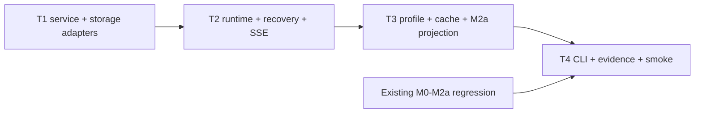

# Glodex M2b 持久 Agent Runtime 实施任务

| 字段 | 值 |
|---|---|
| Tasks ID | `GLO-TASKS-008` |
| 版本 | `0.1.0` |
| 状态 | Approved |
| 对应规格 | [`GLO-SPEC-008 v0.1.0`](./spec.md)（Approved） |
| 对应计划 | [`GLO-PLAN-008 v0.1.0`](./plan.md)（Approved） |
| 里程碑 | M2b：PostgreSQL durable runtime、Redis cache 与 persistent Profile |
| 创建日期 | 2026-07-30 |
| 最后更新 | 2026-07-30 |
| 批准日期 | 2026-07-30 |

## 1. 实施边界与完成定义

本任务单只实现 M2b 的本机 durable runtime。M0–M2a 的确定性领域核心、普通 Search/Agent
CLI/API/SSE、九工具/fork、OpenSearch Query-first/Rerank、Canonical/Evidence/Hard Gates 和
M1f 静态 Showcase 必须保持现有入口、合同和默认零 socket 行为。M2b 只能通过新的 operator-only
factory/CLI/Docker compose 启动。

实施固定为 **T1 → T2 → T3 → T4 四个大交付任务**。每一任务先建立离线 unit/contract/
architecture evidence，再实现 production adapter/composition；Postgres/Redis/OpenSearch/DashScope
真实调用仅在独立 Operator smoke 执行。任何任务都不得提交 named volume、DB dump、Redis persistence
文件、raw request/profile/checkpoint/vector、凭据、`.env`、运行日志或 `项目架构/` PNG。

M2b 完成的最低结论是：在 Docker 本机，Operator 能建立 Postgres/Redis 服务与 schema，写入一条
typed Profile，运行 durable M2a Agent，停止并重启 durable app 后重放其 SSE；能够从 confirmed
checkpoint 显式恢复，能取消运行；Redis 清空/不可用只导致受控 cache miss，不改变业务正确性。
进程在外部调用中断时，系统必须如实 `ABORTED`，不能冒充成功或自动再次发出请求。

## 2. 交付任务

### T1 — Local durable services、migration 与受限存储 adapters

**目标。** 交付固定 loopback PostgreSQL/Redis、forward-only schema migration，以及只服务 M2b
的严格 Postgres/Redis adapter。此任务建立 durability 基础，不接入 Agent runtime、HTTP、M2a
User ANN 或 Profile 业务语义。

**实现内容。**

- 在 `pyproject.toml` / `uv.lock` 增加一个 async PostgreSQL driver 和一个 asyncio Redis driver；
  不添加 ORM、SQLAlchemy、Celery、queue、generic repository/UoW 或 workflow framework；
- 新增 `infra/m2b-durable.compose.yml`：固定 Postgres 16.x、Redis 7.x、`127.0.0.1` binding；仅
  Postgres 挂 named volume，Redis 禁用 AOF/RDB。服务不自动连接/启动 M2a OpenSearch；
- 新增 `src/glodex/application/durable/{contracts,ports}.py`、`src/glodex/adapters/{m2b_postgres,
  m2b_redis,m2b_migrations}.py` 与 versioned SQL migrations。实现 exact durable state/DTO、
  canonical hash、loopback DSN validation、migration ledger/checksum 和 parameterized query
  allowlist；
- Postgres schema 建立 `durable_runs`、`durable_events`、`durable_checkpoints`、`profile_revisions`
  和 `profile_entries`；通过 transaction/unique constraint 预留同 thread active lease。Redis adapter
  只有 versioned `get/set`、固定 TTL、250 ms/32 KiB bounds、typed miss。

**先行验证。** fake connection/clock tests 覆盖 state DTO、loopback rejection、SQL/migration checksum、
event/checkpoint hash、active lease、transaction rollback、profile row boundary、Redis timeout/bad
value/size/TTL/key version。architecture tests 证明 domain、普通 Agent/Search factory、M1f 与
default CLI 不导入 driver/adapter；socket spy 证明默认测试为零。

**验收证据。** `GLO-M2B-P0-001/002/006`、`M2B-AC-001`（服务/schema 部分）、`NFR-001/002/003/
004/006`。local smoke 必须证明 Postgres 数据在 container restart 后仍在、Redis 被清空后无
durable data 丢失；T1 尚无 durable Agent/API、checkpoint resume 或 OpenSearch projection。

**完成条件。** explicit migration/health command 能在空服务上建立并核验 schema，既不接触
DeepSeek/DashScope/OpenSearch，也不改变 M0–M2a 默认行为。

- [ ] T1 完成

### T2 — Durable coordinator、checkpoint codec、恢复/取消与 SSE replay

**目标。** 在 T1 的 Postgres transaction/lease 上增加新 durable Agent composition：安全 public
event 可持久重放，checkpoint 可以恢复 confirmed state，取消和 remote-pending 崩溃具有唯一、
诚实的 terminal 语义。它保留 M1d AgentLoop，绝不重写普通 Registry/Agent API。

**实现内容。**

- 新增 `src/glodex/application/durable/runtime.py`、checkpoint codec 与 durable coordinator；在
  M1d runtime 增加窄的 opt-in `DurableCheckpointSink` / resume seam。普通 `execute()`、
  `execute_run()`、`AgentEventObserver`、九工具/fork 限额和 event contract 不改变；
- checkpoint 以 canonical JSON/hash 只保存重建必需的已验证 agent phase、ledger/budget、safe
  observations、child state、candidate manifest binding、public event cursor 与 asset/config/index/
  profile revision。decode 后先 revalidate，禁止 pickle、任意 dict 或内存 response shortcut；
- 实现 `CONFIRMED → REMOTE_PENDING → CONFIRMED` fence：每次外部调用前保存 pending，只有调用
  返回且已通过 local validation 才提交 event/checkpoint。terminal event/status/error/final checkpoint/
  lease release 必须同一 transaction；
- 新增 `src/glodex/api/durable_agent_app.py`，只提供 durable run create/status/events/cancel/resume
  五个端点，复用既有 request validation、body limit、error envelope、`Last-Event-ID` 和
  `glodex.agent.event.v1` serialization。普通 `agent_app.py` 无 durable import；
- 过期 lease recovery 仅将 complete confirmed checkpoint 标记 `RECOVERABLE`，等待显式 resume；
  pending/hash/sequence/version/revision failure 必须提交唯一
  `ABORTED/DURABLE_REMOTE_STEP_UNCERTAIN`。cancel 产生唯一 `ABORTED/RUN_CANCELLED`，不带业务
  response，不可 resume。

**先行验证。** deterministic fake Agent/clock/store 测试覆盖 atomic append/replay、full and suffix
SSE replay、restart retain、confirmed boundary resume、pending remote abort、malformed codec/version/
profile/asset drift、double worker lease、cancel/resume race、one terminal event、ordinary Agent API
golden/zero import。测试不能真实调用 Provider，且必须证明已经 confirmed 的 action/tool/event 不重复。

**验收证据。** `GLO-M2B-P0-002/003/004/007`、`M2B-AC-002/003/004/007`、`NFR-001/002/004/005/
006`。T2 完成时可用 fake M1d execution 实证 durable replays/resume/cancel，但尚不把 Postgres
Profile 接入 M2a ANN 或 Redis 接入 retrieval。

**完成条件。** 一个 terminal run 跨 durable app restart 仍可 status/SSE replay；一个 confirmed
checkpoint 可同 run ID 显式继续；任何未确认 remote call 和取消都只产生指定 ABORTED 终态。

- [ ] T2 完成

### T3 — Durable Profile、M2a User recall projection、Redis cache 与 context digest

**目标。** 让 Postgres Profile 成为真正长期记忆，并把它安全投影到 M2a User ANN；同时引入
不改变业务语义的 Redis retrieval/context cache 和 checkpoint-aware deterministic context digest。

**实现内容。**

- 新增 `src/glodex/application/durable/profile.py` 与 Postgres profile adapter/CLI seam。实现 exact
  `soft/preference` CRUD、entry/profile ownership、normalized 1,024-d vector、model/dimension、
  tombstone 和 monotonic profile revision。operator list 只返回 opaque entry IDs/revision；
- 新建 M2b-only Agent composition：reserve 时从 Postgres 取得 immutable profile snapshot/revision，
  checkpoint 将其绑定；`DurableProfileProjection` 把已验证 entries 投影到 M2a OpenSearch User ANN
  path。普通 M2a OpenSearch profile command/composition 保持不变，直到 M2b entry 显式调用；
- 在 Product/Card retrieval 添加仅 M2b 注入的 `RetrievalCachePort`。cache value 只含 bounded
  opaque identity/rank/trace DTO，固定 15 min TTL；命中后仍由 `DemoItemSource`/Card reducer、asset/
  index/profile version、Required、Query-first 和最终 SearchService gates 再验证；
- 实现纯 deterministic context digest，固定 5 min Redis TTL：只压缩 safe event/observation 的
  stage/tool/safe code/count/opaque ID/version/budget，缓存失败从 checkpoint 重建。不得向 LLM、
  event、terminal、Redis value 写 raw query/profile/prompt/tool body。

**先行验证。** fake Postgres/OpenSearch/Redis tests 覆盖 profile across restart/revision snapshot、
cross-profile/invalid vector、current Required conflict、projection unavailable downgrade、cache hit/miss/
bad/cross-profile/old-version identity、Redis outage、context digest stability/redaction/size。端到端 fake
M2a run 证明 User ANN 的候选只补充且最终仍受 Canonical/Evidence/Hard Gates；普通 M2a/M1d path
不加载 durable Profile/cache。

**验收证据。** `GLO-M2B-P0-005/006/007`、`M2B-AC-001/005/006/007`、`NFR-003/004/005/006`。
Postgres 或 projection 不可用必须是明确 typed failure/degraded，不能把旧 ephemeral OpenSearch
Profile 或 Redis cache 伪装成 durable truth。

**完成条件。** Profile 在 Postgres container restart 后保持，M2b run 使用其冻结 revision 作 User
ANN；Redis down/cache corruption 仅导致 cache miss，而结果仍通过当前 query 和 final gates。

- [ ] T3 完成

### T4 — Operator CLI、M2b 验证器、文档、traceability 与真实本机 smoke

**目标。** 让学生能重复启动、验证和清理 M2b，并证明全部 M0–M2a 亮点仍未回退；明确区分
离线 automated evidence 与 Docker/credential external smoke。

**实现内容。**

- 在 `src/glodex/cli.py` 新增精确 `m2b-migrate --live`、`m2b-profile`、
  `m2b-durable-agent-demo --live`、`m2b-verify --live` command families。所有 parser 拒绝 DSN/
  host/port/SQL/cache-key/model/DSL 等参数；stdout 只输出安全 JSON envelope、opaque IDs/revision/
  version/count/safe code；
- 新增 `tests/m2b/{unit,contract,acceptance,architecture,nfr}/`，`scripts/verify_m2b.py`、
  `scripts/verify_m2b_local.py`，并扩展 `scripts/check_traceability.py` 的 `m2b` inventory/profile。
  离线 runner 必须包含全部 M0–M2a regression、M2b test/lint/format/mypy/traceability，清除 provider/
  proxy environment 并 socket-deny；
- operator local smoke 固定走：M2a OpenSearch + M2b compose → migration → profile → durable run →
  SSE suffix replay → controlled confirmed resume → cancel → Redis outage → ordinary `down`。它不得
  `down -v` 或调用真实 Provider；可选 live M2a smoke 仍需要用户显式凭据；
- 更新 README：依赖、启动/停止/clear、named volume 与 Redis 可丢失语义、private local data、
  remote pending abort、可复现命令、资源限制和 M2c/M2d 未实现范围。任何示例不得回显 secret/
  query/profile/vector/checkpoint，且继续排除 26 张 PNG。

**先行验证。** CLI/API envelope snapshots、bad preflight/loopback/migration/no live、README command
contracts、M1f/ordinary M2a full regression、no raw private field/static asset check、traceability
coverage。Docker smoke 报告只能陈述实际通过/失败前置条件，不能将 compose/config 存在当作运行
成功。

**验收证据。** `GLO-M2B-P0-001`–`008`、`M2B-AC-001`–`007`、`NFR-001`–`007`；最终离线门禁：

```bash
uv run --locked python scripts/verify_m2b.py
```

真实 Operator smoke：

```bash
docker compose -f infra/m2a-opensearch.compose.yml up -d
docker compose -f infra/m2b-durable.compose.yml up -d
uv run --locked python scripts/verify_m2b_local.py
docker compose -f infra/m2a-opensearch.compose.yml down
docker compose -f infra/m2b-durable.compose.yml down
```

**完成条件。** README 可使干净本机完成 durable start → migrate → profile → run → replay →
resume/cancel → Redis outage → stop；最终报告分别列明离线 gate 与真实 Docker/optional live smoke，
且 M0–M2a default paths 仍完全隔离。

- [ ] T4 完成

## 3. 依赖、测试顺序与不可变约束



| 阶段 | 允许的外部依赖 | 禁止事项 |
|---|---|---|
| 默认 unit/contract/acceptance/architecture/nfr | 无；fake store/clock/transport、fixed assets | Docker、Postgres/Redis/OpenSearch socket、provider credential、代理、raw persistence data。 |
| T1/T2 local smoke | Operator 启动的 loopback Postgres/Redis；T2 fake deterministic Agent | 自动启动 Docker、远程 DSN/Redis、真实 Provider retry、默认 factory 改造。 |
| T3/T4 local smoke | loopback M2a OpenSearch + Postgres/Redis；可选显式 live M2a credential | Redis 当 truth、读取旧 ephemeral Profile、AG-UI/React/A100、volume 自动删除。 |

不变约束：Postgres 是唯一 durable truth；cache 绝不改变结果；profile 永远 soft；confirmed
checkpoint 才可 resume；pending remote step 一律 abort；cancel 不产生业务 response；默认入口零新
socket/import；公开 event/SSE 不泄漏 private request/checkpoint/profile/vector/Provider body。

## 4. Tasks Definition of Ready（进入 Implementation 前）

- [x] 用户确认按 T1 → T2 → T3 → T4 四个大任务完成 M2b，不以 database/cache 微任务分批等待；
- [x] 用户确认 T1 只建立 local services/schema/adapters，T2 才改 opt-in Agent runtime/API，避免
      非 durable 路径提前依赖新基础设施；
- [x] 用户确认 confirmed-only resume / remote-pending abort / unique cancel terminal 的完整语义；
- [x] 用户确认 T3 的 Postgres Profile source、M2a ANN projection、Redis fail-open 和 deterministic
      context digest 均为真实链路，而不是占位 interface；
- [x] 用户确认 T4 的测试顺序、离线/real smoke 分离、Postgres named-volume 停止但不自动清除规则；
- [x] 用户确认不将 M2c 的 GPU/A100 模型服务、M2d 的 AG-UI/React/运营或生产 queue/多 worker
      偷渡进 M2b；
- [x] 用户确认最终报告只依据实际验证结果，不把 Docker/credential 未就绪伪装为完成。
