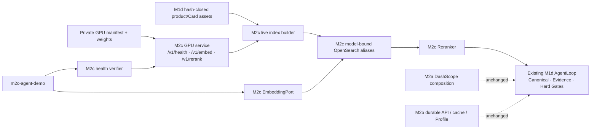

# Glodex M2c 自托管 Retrieval Model Service 技术实施计划

| 字段 | 值 |
|---|---|
| Plan ID | `GLO-PLAN-009` |
| 版本 | `0.1.0` |
| 状态 | Approved |
| 对应规格 | [`GLO-SPEC-009 v0.1.0`](./spec.md)（Approved） |
| 父基线 | `GLO-SPEC-004`、`GLO-SPEC-007`、`GLO-SPEC-008` |
| 里程碑 | M2c：GPU BGE embedding 与 cross-encoder reranker service |
| 创建日期 | 2026-07-30 |
| 最后更新 | 2026-07-30 |
| 批准日期 | 2026-07-30 |

## 1. 目标、前提与实施预算

M2c 将现有 M2a 的 live DashScope embedding/rerank 基线扩展为一条**独立、显式、私有
GPU BGE 路径**。它不修改 `build_m2a_agent_service()`、`m2a-agent-demo`、M2b durable
API、默认 Agent/API/SSE 或 M1f Showcase；新入口和新 model-bound OpenSearch aliases 是唯一
可连接 GPU tunnel 的路径。

实施固定为 **A → B → C → D 四个大交付块**。Tasks 阶段不得拆成一个 HTTP 字段、一个
error code、一个 mapping property 或一个测试文件的微任务，也不得把训练、AG-UI、队列、
多 worker 或生产部署混入 M2c。

- 已确认 legacy tunnel `127.0.0.1:18000` 的只读 health 回报 `cuda`。M2c 仍必须部署新
  service/manifest health，才可证明固定权重、1024 dimension 和 GPU model class；
- 运行应用的唯一新 runtime 网络依赖仍是已有 `httpx`。GPU server 另有明确 optional
  deployment dependency（PyTorch、sentence-transformers 与 CUDA runtime），不进入默认
  `uv run`、pytest、M0–M2b imports 或锁定的应用 runtime；
- M2c 使用已训练 `glodex-bge-m3-v1` / `glodex-bge-reranker-v1` 权重，不准备、下载、训练、
  微调或上传数据/权重。权重 path 和 full SHA-256 只存在 GPU 私有 manifest；
- 现有 M2a DashScope vectors 与 BGE vectors 不能互换。M2c 从 validated `m1d-demo-v1`
  assets 重新取得可信 product/Card text，调用 GPU embedding 并建立独立 physical indexes/
  aliases；M2a index 绝不被覆盖；
- GPU service 永远只绑定远端 loopback，开发机经已有 loopback SSH tunnel 调用固定
  `127.0.0.1:18000`。application CLI 不读取 arbitrary URL、API key、模型名、weight path 或
  tunnel command，且 `trust_env=False`；
- 真正 Agent 仍用现有 DeepSeek selector，M2c 不承担 LLM。只有 BGE vectors/cross-encoder
  scores 从 GPU 来；Canonical/Evidence/Hard Gates、CandidateManifest、nine tools 与 SSE
  event wire contract 完全复用。

## 2. 增量架构与复用缝



| 现有缝 | M2c 的精确处理 |
|---|---|
| `EmbeddingPort` / `EmbeddingBatch` | 新 `M2cEmbedding` 精确实现现有 port，复用现有 vector finite/1024-d/L2 validation；不更改 M1d/DashScope adapter。 |
| `RerankRequest` / `RerankResult` | 新 `M2cReranker` 使用相同 request/result identity boundary；只替换 transport/parser，保持 M2a 40/30 candidate 和 identity-stable order。 |
| `M2aOpenSearch` | 复用唯一 loopback OpenSearch HTTP owner；M2c 的 mapping/alias/manifest 是独立、model-bound names，不能向 M2a alias 写入。 |
| `AgentIndexes` / M1d assets | 仍是 Product/Card source/ownership 的唯一可信 loader。M2c 仅通过已有可信 projection 重建 BGE text/vector，不能解析 unvalidated JSONL 或信任 OpenSearch `_source`。 |
| `OpenSearchItemSource` / `OpenSearchCategoryInsight` | 抽取最小、显式的 model-index binding，形成 M2c-only counterparts；保留 same candidate manifest、trusted back-read、conflict judge 和 error projection。 |
| `build_m2a_agent_service()` | 保持原样。新增并列 `build_m2c_agent_service()`，只在 `m2c-agent-demo --live` 调用。 |
| M2a Profile 与 M2b durable Profile | 保持现状。新增独立 M2c profile alias/revision；不读取/改写 M2b PostgreSQL profile，避免跨模型 vector 混用。 |
| Redis/PG、M2b server | 不导入、不改变。M2c first slice 不向 `m2b-serve` 注入 BGE backend；该集成需要以后独立 SDD 变更。 |

### 2.1 私有 service 与 manifest 的最小形状

GPU-only deployment code 位于新仓库的独立模块/entrypoint，应用层不导入 PyTorch 或
sentence-transformers。Operator 在 GPU 机器的私有目录放置 `.gitignore` 外的
`m2c-model-manifest.json`，启动命令只读取该文件；它明确给出模型 ID、1024 dimension、最大
长度、weight hashes 和 service build digest。服务启动后计算/验证 manifest digest，串行化
inference，并只提供：

```text
GET  /v1/health  -> schema, manifestDigest, deviceClass, gpuModelClass, dimension, limits
POST /v1/embed   -> bounded text array, vectors, manifestDigest
POST /v1/rerank  -> bounded query/documents, scores, manifestDigest
```

public response 不回显输入、model paths、full hashes、environment、CUDA memory 或 exception。
GPU service 不安装 generic model loading/registry/admin/debug routes。health 在 manifest/readiness
已验证前失败，但不会执行 inference；application health verifier 在任何 embed/rerank 之前进行
exact schema/digest/dimension/limits/GPU class check。

### 2.2 独立 BGE index/profile identity

`M2cIndexManifest` canonicalize：validated M1d asset fingerprint、record/card count、BGE
embedding model ID、dimension、service manifest digest、mapping schema、fixed hybrid pipeline
identity 和 builder version。physical indexes/aliases 有 M2c namespace，重建过程为：

1. 加载已有 `AgentIndexes`，重建仅可信 Product/Card text；
2. 预先验证 M2c GPU health；以固定小 batch 调用 `/v1/embed`；
3. 每 vector 验证 1024-d/finite/L2/digest exact；写入新的 physical product/Card indexes；
4. refresh、count、mapping metadata、document identity 与 manifest 再校验后，才原子 publish
   M2c aliases。

M2c profile documents 也记录 BGE manifest digest。M2a/M2b profile 不迁移或复制；Operator 用
`m2c-profile set --live` 显式重写同一 typed soft preference。读取到旧/未知 digest 时，User
ANN 完全跳过并投影 `M2C_PROFILE_MODEL_MISMATCH`，不能使 Query path degraded。

### 2.3 固定 operator surfaces

```bash
# GPU host：Operator 部署，PyTorch/CUDA 只在此处存在
uv run --group m2c-gpu glodex m2c-gpu-service --manifest /private/m2c-model-manifest.json

# Developer machine：已建立的 loopback tunnel + existing local OpenSearch
uv run --locked glodex m2c-model-verify --live
uv run --locked glodex m2c-index --action build --snapshot m1d-demo-v1 --live
uv run --locked glodex m2c-index --action verify --snapshot m1d-demo-v1 --live
uv run --locked glodex m2c-profile --action set --live --profile m2c-demo --value "轻薄、长续航"
uv run --locked glodex m2c-agent-demo --live --profile m2c-demo \
  --query "在四个平台找手机，比较到手价" --locale zh-CN --currency CNY --top-k 3
```

这些 parser 不接受 `--host`、`--port`、`--url`、`--model`、`--manifest`（应用端）、
`--index`、GPU path 或凭据。GPU deployment entry 的 private manifest path 是唯一例外，且
不会进入 application response/log/Git。M2c application endpoint 固定为 loopback 18000；
缺失 tunnel、GPU/manifest 失败、model mismatch 和未 build index 都有独立 safe JSON envelope。

## 3. 四个交付块

### A. GPU service、私有 manifest 与 bounded loopback client

新增 GPU-only entrypoint、manifest validator 和 `src/glodex/adapters/m2c_model_service.py`。service
以 lazy imports 加载 exact embedding/cross-encoder weights，开机 self-check dimension/normalization，
使用 single `asyncio.Lock` 串行化 GPU execution；HTTP parser 只接受第 2.1 节对象，限制
body/header/content encoding，关闭 redirects/access log。服务单测在 CPU-free fake model 上验证
manifest/route/schema/size，不需要 CUDA；真实 GPU smoke 单独执行。

应用 client 不使用 API key/SDK/环境 proxy：它锁定 `http://127.0.0.1:18000`、2/15 s deadline、
bounded identity response，复用 M1d `EmbeddingResult` 与 M2a `RerankResult` validators。health
结果被 run/index build 绑定在一份 immutable `M2cModelIdentity`，而不是全局 mutable config。
non-loopback/mismatch/bad body/redirect/timeout 都变成 `M2C_MODEL_UNAVAILABLE` 或适用的
typed degradation；没有 retry、fallback provider 或 hidden request body logging。

该块完成时不连接 OpenSearch，不修改 `agent_bootstrap.py`，不生成 index。

### B. BGE artifact projection、model-bound OpenSearch 与 M2c Profile

新增 M2c-specific index/profile builders，重用 M2a 的 loopback OpenSearch owner、可信 asset loader
及 mapping/hybrid conventions，但不泛化为任意 model/index framework。B 的 builder 先调用 A 的
verified GPU embedding，再写 M2c namespace physical index、mapping `_meta` 与 atomic aliases；
重复 build 只在完整 manifest 等价时复用。

M2c profile store 只接受既有 `soft/preference` typed shape，写入时由 A 的 BGE embedding 生成
新 vector，包含 model digest；list 只输出 opaque IDs/revision，不能输出 value/vector。任何
M2a/M2b/unknown profile document 被视为 mismatch，不能尝试转换、重新利用或跨 alias 查询。

本块新增 `m2c-model-verify`、`m2c-index`、`m2c-profile` CLI families 和一份 explicit
`scripts/verify_m2c_local.py`，其 GPU-free fake service 证明 index/model identity closure。真实
reindex 保持 Operator smoke，不进入 default pytest。

### C. M2c Retrieval、cross-encoder 与独立 Agent composition

新增 `build_m2c_agent_service()` 及窄 M2c retrieval adapters。它只安装 A 的 `M2cEmbedding`、
`M2cReranker`、B 的 verified M2c indexes/profile；其余仍通过现有 DeepSeek selector、Agent
runtime、`DemoItemSource` trusted back-read、CandidateManifest、Card reducer、SearchService、
shipping rules、Canonical/Evidence/Hard Gates 和 Agent event observer。

Product path 必须保留 Query Hybrid Top-30、User ANN Top-10、conflict judge 和受保护合流；
M2c cross-encoder 只接受去重后的至多 40 candidate。Card path 维持 Hybrid Top-30 → rerank Top-15
→ reducer。rerank score 以 `(-score, identity)` 固定顺序；异常保留 Query Hybrid 顺序、丢弃
User-only candidates，不以 DashScope/lexical 替代。

新增 `m2c-agent-demo --live` 和 M2c-only safe retrieval trace（model digest prefix、counts、
opaque IDs、safe codes）。它永不改变 `AgentDemoResponse`/SSE schema，不把 query/profile/documents/
vectors/scores 送入 stdout 或 event。当前 `m2b-serve` 保持 M2a backend；如果未来需要 durable
M2c，该组合必须单开规格。

### D. 验证、评测、文档与交付门禁

新增 `tests/m2c/{unit,contract,acceptance,architecture,nfr}`，覆盖 fake GPU service/client、
manifest mismatch、loopback restriction、response/body/deadline rejection、BGE reindex closure、
profile model mismatch、Query-protected degradation、trusted result publication、M2a/M2b import/
socket isolation、manifest/output privacy 和 CLI parser contracts。

扩展（不是改变既有）traceability profile `m2c`，新增 `scripts/verify_m2c.py`，先执行 M2b
baseline verification，再执行 M2c format/lint/mypy/architecture/unit/contract/acceptance/coverage。
真实 GPU evidence 为独立、手动显式顺序：private service boot → tunnel health →
`m2c-model-verify` → BGE index build/verify → M2c profile set → M2c Agent → product/Card rerank
→ aggregate M1e comparison。README 只记录 non-sensitive prerequisites、command shape、限制与
停止方法，不记录 tunnel host、paths、manifest hash、请求正文或凭据。

## 4. 验证矩阵与最终门禁

| 验证层 | 最小证据 | 覆盖 |
|---|---|---|
| unit | manifest canonicalization、fixed request bounds、vector/score validation、BGE mapping/alias identity、profile mismatch、protected merge | `P0-001`–`005`、`NFR-001/003/006` |
| contract | fake HTTP service 的 loopback/redirect/proxy/schema/digest/deadline/body rejection，GPU CLI parser、M2a/M2b import isolation | `P0-001`–`007`、`NFR-001/002/004/005` |
| acceptance | explicit model/index/profile/Agent commands；BGE reindex、product/Card rerank、Hard Gate/Evidence closure、no DashScope fallback | `M2C-AC-001`–`006` |
| architecture/nfr | no CUDA imports outside GPU entry, no arbitrary endpoint, no vector/text/path/secret leak, default zero socket, no volume/PNG commit | `NFR-001`–`006` |
| real GPU smoke | new-service manifest health、fixed probe embed、product/Card rerank、BGE index build/verify、M2c Agent、aggregate evaluation | `AC-001`–`005` |

最终默认门禁固定为：

```bash
uv run --locked python scripts/verify_m2c.py
```

它清除 Provider/proxy/tunnel environment、禁 socket、不会导入 GPU packages。真实 GPU smoke 不
进入 pytest 或该 runner；没有新 service/manifest/tunnel/GPU 只能报告前置条件不足，不能将
M2c 标为完成。

## 5. Plan Definition of Ready（进入 Tasks 前）

- [x] 用户批准本 Plan，并将状态改为 `Approved`；
- [x] 用户确认 M2c 是独立 BGE model-bound composition，不会改写 M2a DashScope baseline、
      M2b durable API、默认 Agent/API/SSE 或 Showcase；
- [x] 用户确认 GPU service 只可从 private loopback tunnel 使用，application 没有 arbitrary
      endpoint/model/path/credential surface；
- [x] 用户确认 BGE reindex 与 profile re-write 是跨模型隔离所必需的工作，不能通过复用
      DashScope vector 省略；
- [x] 用户确认 GPU-only dependencies/service 路径与应用默认 runtime 隔离，M2c 不负责训练、
      AG-UI、队列、多 worker 或生产部署；
- [x] 四个交付块、独立 CLI families、默认 gate 与真实 GPU smoke 分离、以及不把 M2c 接入
      现有 M2b durable API 的边界均可接受。
