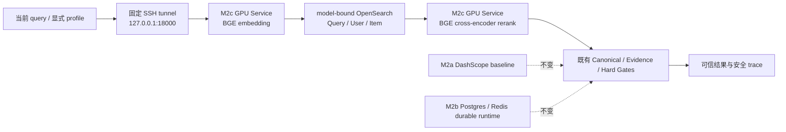

# Glodex M2c 自托管 Retrieval Model Service 规格

| 字段 | 值 |
|---|---|
| Spec ID | `GLO-SPEC-009` |
| 版本 | `0.1.0` |
| 状态 | Approved |
| 里程碑 | M2c：GPU BGE embedding 与 cross-encoder reranker 服务 |
| 父规格 | [`GLO-SPEC-007`](../007-glodex-m2a-opensearch-hybrid-retrieval/spec.md)、[`GLO-SPEC-008`](../008-glodex-m2b-durable-agent-runtime/spec.md) |
| 创建日期 | 2026-07-30 |
| 最后更新 | 2026-07-30 |
| 批准日期 | 2026-07-30 |

## 1. 目的与已验证前提

M2a 已交付真实 OpenSearch Query/User/Item 召回和 DashScope `text-embedding-v4` /
`qwen3-rerank` 功能闭环；M2b 已交付 Postgres durable run、Redis 可丢缓存、持久 profile
和本机 durable API。它们保持为可运行、可回退的功能基线。

本切片实现架构图中尚未交付的**受控 GPU Retrieval Model Service**：在可用的 A100/GPU
上服务一组已训练的 BGE 模型，以固定的本机 SSH tunnel 让 Glodex 实际执行 embedding 和
cross-encoder rerank。它不是“模型名称配置”、SDK mock、离线实验描述或把旧仓库代码复制进来；
它必须用真实服务、真实 BGE vectors 和真实 cross-encoder scores 构建新的版本化索引并完成
端到端验收。

已确认的外部前提仅为：旧项目配置的私有 loopback tunnel `127.0.0.1:18000` 的只读
`/health` 返回 HTTP `200`、`status=ok`、`device=cuda`。该旧端点只证明 CUDA 服务在线，
**不**证明具体 GPU 型号、权重、dimension 或模型版本；M2c 不得据此声称 A100 或模型
fingerprint 已验证。

| 架构亮点 | 当前状态 | M2c 动作 |
|---|---|---|
| Query/User/Item 三视图、OpenSearch Hybrid | M2a 已交付 | 为 BGE 模型建立独立 model-bound vectors/index，复用召回和可信发布边界。 |
| 当前 Query / Card 精排 | M2a 已交付（DashScope） | 由固定 GPU cross-encoder 实际取代，仅在显式 M2c path 使用。 |
| GPU/A100 模型服务 | 未交付 | 新仓库拥有最小私有服务、manifest、health、client 与真实 smoke。 |
| 长期偏好、run/checkpoint、Redis | M2b 已交付 | 保持 truth/cache 语义；旧 DashScope profile vector 不能静默混用。 |
| AgentLoop、九工具、SSE、Hard Gates、Evidence | M1a–M1d 已交付 | 直接复用，任何 GPU score 都不能绕过。 |

## 2. 固定模型与服务合同

### 2.1 模型身份

M2c 的首个固定模型对为已训练的：

| 角色 | 基座 / family | 公共 model ID | 输出 |
|---|---|---|---|
| embedding | `BAAI/bge-m3` | `glodex-bge-m3-v1` | 1024 维、有限 `float32`、L2-normalized vector |
| reranker | `BAAI/bge-reranker-v2-m3` | `glodex-bge-reranker-v1` | 每个 `(query, document)` 一个有限分数 |

部署时由新仓库提供 schema/validator、由 Operator 在 GPU 私有路径保存的
`m2c-model-manifest.json` 固定 schema version、上述 model ID、dimension、embedding/reranker
weights SHA-256、service build digest 和最大 sequence length。该私有 manifest 不进入 Git、
应用容器、OpenSearch 或公开响应，且不包含 GPU host、checkpoint 绝对路径、query/profile/
document、token 或凭据。GPU 服务在启动时读取它，并在 health 响应中仅返回其派生 digest；
client 必须精确匹配才允许推理。

旧 `/health` 没有上述字段，所以只可作为连通性调查依据。真实 M2c 验收前，Operator 必须在
GPU 上运行新仓库的最小 M2c service（或同等、可验证实现），不能把 legacy health 当作版本
attestation。

### 2.2 固定私有 HTTP 面

服务只绑定 GPU 机器的 `127.0.0.1:18000`，开发机只通过 Operator 建立同一 loopback SSH
tunnel 访问 `http://127.0.0.1:18000`。应用不接受来自 HTTP request、Agent action、query、
profile 或环境的 host、port、model、path 或 header 覆盖；没有公网监听、通用 OpenAI
兼容路由、认证系统、用户可选模型或 endpoint registry。

| 方法 | 路径 | 请求 / 响应 | 用途 |
|---|---|---|---|
| `GET` | `/v1/health` | 无 body；仅 schema、manifest digest、device class、GPU model class、dimension、limits | 不做 GPU inference 的 readiness/identity check。 |
| `POST` | `/v1/embed` | `{texts: string[]}` → `{embeddings: number[][], manifestDigest: string}` | 有界的 Query/User/Item/Profile encoding。 |
| `POST` | `/v1/rerank` | `{query: string, documents: string[]}` → `{scores: number[], manifestDigest: string}` | 有界 product/Card cross-encoder scoring。 |

协议使用 JSON、`Content-Encoding: identity`、无 redirect、`trust_env=False`。响应中没有
本地路径、tokenizer/model config 全文、CUDA memory、process environment、exception text 或
用户输入回显。服务关闭 access log；应用只记录 `M2C_*` safe code、manifest digest、计数和
opaque identity。

### 2.3 有界输入与失败语义

| 操作 | M2c 固定上限 | deadline | 成功验证 |
|---|---:|---:|---|
| health | 64 KiB response | 2 s | exact schema/digest/dimension/device class |
| embed | 8 texts、每段 2,000 chars、16 KiB request、128 KiB response | 15 s | 数量相等、1024 维、finite、L2-normalized、digest exact |
| product rerank | 40 docs、query ≤512 chars、doc ≤2,000 chars、32 KiB request、128 KiB response | 15 s | 每个 input 恰好一个 finite score、digest exact |
| Card rerank | 30 docs；其余同上 | 15 s | 每个 input 恰好一个 finite score、digest exact |

超时、network error、非 `200`、redirect、compressed/oversize body、bad JSON、manifest
mismatch、坏 vector、坏分数、GPU 非 ready 或 schema 漂移均不泄漏下游文本。它们转换为稳定
typed failure：Query embedding 是 `M2C_QUERY_EMBEDDING_FAILED`（fail closed）；User
embedding 或 rerank 是 `M2C_USER_EMBEDDING_DEGRADED` / `M2C_RERANK_DEGRADED`
（保留受保护的 Query Hybrid 顺序、丢弃 User-only candidates）；health/model mismatch 是
`M2C_MODEL_UNAVAILABLE`（不发 inference）。不得回退为关键词“假 rerank”、DashScope
隐式调用，或将旧 vector 和新 query vector 混合。

## 3. 范围

### 3.1 In Scope

- 新仓库拥有的、可部署到用户 GPU 的最小 Python GPU service：加载固定 BGE embedding 与
  cross-encoder 权重、序列化 GPU access、提供第 2.2 节三条路由和不含私密内容的 manifest
  health；其运行依赖置于明确 optional dependency/部署说明，默认本机 test 不安装 CUDA、
  PyTorch 或 sentence-transformers；
- 固定 `127.0.0.1:18000` 的 M2c client adapters，严格 byte/deadline/identity/dimension/
  score parsing、`trust_env=False` 和 zero redirect；现有 `EmbeddingPort` 与 M2a rerank
  request/result 边界保持窄而明确；
- 使用 GPU embedding 从既有、可信的 `m1d-demo-v1` 商品/Card source 重建**独立** M2c
  vector artifacts、model-bound OpenSearch physical index/alias 和 manifest；不得覆盖 M2a
  DashScope assets/index，也不得从 OpenSearch `_source` 反推商品事实；
- 显式 `m2c-index build|verify --live`、`m2c-model-verify --live`、`m2c-profile set|list|
  delete --live` 与 `m2c-agent-demo --live`。只有这些入口连接 tunnel；默认 M0–M2b、M1f
  和 pytest 仍是零 socket/零 credential/GPU import；
- model-bound explicit soft profile。旧 `text-embedding-v4` profile vector 不能进入 BGE ANN；
  Operator 必须以同一 typed preference 重新写入 M2c profile revision，或得到安全的
  `M2C_PROFILE_MODEL_MISMATCH`。M2b 的 private PG profile value 不出现在 M2c public
  endpoint、SSE、Redis、terminal stdout 或 index；
- 将 M2c Query/User/Item retrieval、product/Card rerank 接入一条独立 M2c Agent composition，
  复用 M1d AgentLoop、M2a conflict judge、Canonical/Evidence/Hard Gates 和安全 retrieval
  trace；M2a DashScope Agent 入口与 M2b durable API 的当前 M2a backend 不变；
- fake transport contract、GPU-service local contract、mock M2c client、model manifest/
  reindex isolation tests、真实 `cuda` health + fixed non-sensitive embed/rerank smoke、以及
  仅输出聚合指标的 M1e M2c comparison。

### 3.2 Out of Scope

- 新训练、微调、数据清洗、负样本挖掘、模型注册平台、权重上传/download、实验追踪、A/B、
  任何“训练完成”主张；旧训练包和旧仓库不是本切片依赖；
- vLLM、LLM inference、DeepSeek/Tavily/eBay/marketplace 改造、网页抓取、登录、下单；
- Redis/Postgres schema redesign、任意 checkpoint resume 语义改变、queue、多 worker、
  GPU autoscaling、batch scheduler、Kubernetes、TLS/public deployment、认证/多租户；
- AG-UI、React/WebSocket、8765 Showcase 改造或将 GPU endpoint 暴露给浏览器；
- 让用户切换模型、任意 endpoint、embedding dimension、candidate limits、rerank algorithm、
  OpenSearch mapping 或 profile schema；
- 将 raw query/profile/document、embedding、scores、weights、GPU hostname/path、SSH command、
  `.env`、tunnel process、data volume 或 `项目架构/` 26 张 PNG 写入 Git 或公开响应。

## 4. 不变量

1. **服务与模型都必须真实。** M2c positive smoke 必须依次验证 manifest health、真实
   1024-d embedding、真实 cross-encoder score、BGE reindex 和 Agent result；仅 health、
   mock、固定 vector、关键词排序或 legacy endpoint 连通均不算完成。
2. **没有跨模型向量。** Query/User/Item/Profile 的 model manifest digest、dimension、asset
   version 和 OpenSearch index alias 必须完整匹配；任一漂移 fail closed，绝不以相同 1024
   维度为由混用 DashScope/BGE vectors。
3. **GPU 不是业务真相。** BGE score 只能决定受限候选排序。当前 query、M2a Query Hybrid
   保护、conflict judge、Catalog ownership、Canonical、费用、库存、Evidence 和 Hard Gates
   仍在可信应用层裁定。
4. **显式隔离。** M2c 仅由其 operator CLI/composition 触发；M2a/M2b 默认路径不会 import
   M2c client、读取 tunnel、触发 health 或读取 model manifest。
5. **Profile 仍为 soft。** GPU embedding 不将偏好升级成 Required/事实/最终推荐依据；当前
   Required 与排除项永远优先。Profile vector/正文不出私有持久层和有限 GPU request。
6. **可解释降级。** Query BGE path 不可用即 fail closed；可选 User/rerank 故障显式
   degraded，不能悄悄转到 DashScope 或 lexical reranker。
7. **最小私有服务面。** 一组固定权重、一个固定 manifest、一条 loopback tunnel、三个路由。
   不提供任意文件/model 加载、shell、admin、metrics、debug、batch job 或 vector store endpoint。

## 5. 功能需求

| ID | 要求 |
|---|---|
| `GLO-M2C-P0-001` | **可验证 GPU model service。** 新仓库提供最小服务与 immutable manifest；health 在不推理时精确返回 schema/digest、1024 dimension、受限 limits、CUDA-ready 和 GPU model class。client 必须先验证它，legacy `/health` 不可作为 M2c identity evidence。 |
| `GLO-M2C-P0-002` | **固定 bounded adapters。** embedding 与 rerank adapters 只连接 `127.0.0.1:18000`，拒绝非 loopback、redirect、proxy、非 identity content encoding、超时、oversize/坏/未闭合 response。M2c 不读 API key，也不允许 request 改变目标或模型。 |
| `GLO-M2C-P0-003` | **BGE model-bound artifacts/index。** 从可信 M1d source 用真实 BGE embedding 生成独立 item/Card artifact，manifest 绑定权重 digest、dimension、source hashes、record count 和 index alias；任何旧 DashScope artifact/vector/profile 或错误 mapping 都不能 publish/verify。 |
| `GLO-M2C-P0-004` | **真实三视图与 profile migration。** Query/User/Item 使用同一 BGE manifest；Operator 可显式重写 typed soft profile 到 M2c revision。未迁移或 model mismatch profile 不执行 User ANN，不影响 Query pool，投影安全 code。 |
| `GLO-M2C-P0-005` | **真实 cross-encoder rerank。** M2c product/Card path 对既有 M2a 受限 candidate pool 调 GPU `/v1/rerank`；每个 document 的 score 一一对应输入，排序以 `(-score, identity)` 稳定化。服务异常仅按第 2.3 节降级。 |
| `GLO-M2C-P0-006` | **可信发布链不变。** 所有 M2c identities 都回读 existing Catalog/Card assets 并重新通过 conflict/Canonical/Evidence/Hard Gates；GPU vector/score、OpenSearch `_source` 或 profile 不能生成商品、价格、费用、证据或 final facts。 |
| `GLO-M2C-P0-007` | **显式真实验收与可观测性。** Operator CLI 输出仅版本 digest 前缀、count、safe code、状态和聚合 metric；GPU smoke 实际走 health/embed/rerank/reindex/Agent。默认 suite 不调用 tunnel/GPU，README 写明接收哪些有限文本、如何启动/停止、以及无 GPU 时只能运行 M2a baseline。 |

## 6. 验收场景

### `M2C-AC-001` manifest health 与隔离

在未建立 tunnel 或 service health 的场景，所有 M2c command fail closed 为安全
`M2C_MODEL_UNAVAILABLE`，没有 inference。建立 tunnel 并启动正确模型服务后，
`m2c-model-verify --live` 验证 exact schema、manifest digest、1024 dimension、limits 和
CUDA/GPU model class；错误 digest、CPU、A100 之外的 device class、坏 JSON 或 endpoint
漂移一律拒绝。未执行 M2c command 时，M0–M2b 测试/CLI/API/SSE 不开该 socket。

### `M2C-AC-002` 真实 embedding 与 model-bound reindex

对固定非敏感 probe 执行一次 GPU `/v1/embed`，验证两条不同输入的 1024-d finite normalized
vectors 不是 fixture，再从 `m1d-demo-v1` 可信 item/Card text 完成 GPU reindex。验证 M2c
physical index/alias 的 document count/source hash/model digest 闭合；将 DashScope vector、
错误 dimension、错误 digest、旧 alias 或错误 record identity 注入时，publish/verify 必须失败。

### `M2C-AC-003` 三视图和 profile 不混模型

以 M2c profile 写入一条 explicit soft preference，验证 Query BGE Hybrid 和 User BGE ANN
各实际调用 bounded adapter，User 只补充候选、不改变 Query Top-30，冲突 judge/Hard Gates
仍获胜。用一个旧 DashScope profile 或篡改 digest 尝试 User ANN，断言没有 User-only
candidate，输出 `M2C_PROFILE_MODEL_MISMATCH`，Query protected pool 不变。

### `M2C-AC-004` 真实 cross-encoder 与降级

对固定受控 product 与 Card pool 各调用一次 `/v1/rerank`，验证 score count/identity closure、
stable tie break 和 M2c model digest；M1e 仅比较 aggregate coarse/BGE-reranked metrics。
timeout、坏 score、manifest mismatch 或 GPU error 时，product/Card trace 都显式 degraded；
product 保留 Query Hybrid 顺序并移除 User-only candidates，Card 不产生无来源 insight。

### `M2C-AC-005` Agent 可信闭环与不回退

`m2c-agent-demo --live` 在实际 GPU + M2c OpenSearch 上完成一条 query；安全 trace 至少包含
model digest prefix、Query/User candidate counts、rerank stage 和 safe codes，最终结果继续通过
Canonical/Evidence/Hard Gates。断言同一 run 没有 DashScope embedding/rerank request；默认
`m2a-agent-demo` 仍可使用 DashScope baseline，M2b durable API 仍保持现有 M2a backend。

### `M2C-AC-006` 隐私、边界与发布 hygiene

检查 CLI/stdout/SSE/Redis/OpenSearch public document/error/README 示例与 Git diff，均不含
raw query/profile/document、vector/score、model path/weight hash 全文、GPU/SSH host、credential、
tunnel command、service request/response 或 PNG。默认 test 禁 socket；fake transport 覆盖所有
bounded/invalid response 分支；真实 smoke 日志只保存安全摘要。

## 7. 非功能需求

| ID | 要求 |
|---|---|
| `GLO-M2C-NFR-001` | 默认自动化/默认 CLI 零 network、零 GPU、零 tunnel、零 credential；M2c 仅由 explicit `--live` operator command 连接固定 loopback。 |
| `GLO-M2C-NFR-002` | 服务/client 有固定 request/response/deadline/size/concurrency 上限；GPU service 同时只执行一个 inference batch，health 不消耗 GPU inference。它不承诺生产吞吐、高可用、弹性或多 worker。 |
| `GLO-M2C-NFR-003` | model manifest、vector artifacts、OpenSearch index alias、profile revision 和 retrieval cache identity 全部含相同 model digest；mismatch 不能命中/发布/复用。 |
| `GLO-M2C-NFR-004` | 默认 suite、format、ruff、mypy、architecture、M0–M2b contract/acceptance/golden 保持通过；GPU-only dependency 与 deployment code 不进入 M0–M2b application/domain imports。 |
| `GLO-M2C-NFR-005` | 不在日志、SSE、HTTP、Redis、manifest、Git、Docker volume 或 terminal 输出敏感文本、向量、模型路径、权重 hash、endpoint/SSH host 或 credential；remote process 只经 loopback tunnel 暴露。 |
| `GLO-M2C-NFR-006` | 相同 manifest/可信 assets/fake transport 的离线结果完全稳定；真实 GPU 分数只做聚合比较，不承诺跨模型/版本/硬件的同分或同序。 |

## 8. Definition of Ready（进入 Plan 前）

- [x] 用户批准本 Spec，并把状态改为 `Approved`；
- [x] 用户确认有可用 GPU，旧 loopback tunnel 的 `/health` 已实际返回 `cuda`；
- [x] 用户确认 M2c 要**重建** BGE item/Card/profile vectors，而非把 BGE query 与现有
      DashScope 1024-d vectors 混用；
- [x] 用户确认 GPU 上可访问固定的 embedding/reranker weights，并可部署新仓库拥有、带
      manifest health 的最小 service；
- [x] 用户确认 Operator 可建立私有 loopback tunnel，且真实验收允许发送固定非敏感 probe、
      受控 item/Card text 和显式测试 profile 给该 GPU；
- [x] 用户确认 M2c 不重训模型、不改 M2b durable API backend、不做 AG-UI/React、队列、
      多 worker、生产部署或用户可选模型；
- [x] `7 P0 / 6 AC / 6 NFR` 均有 fake contract、离线 regression 或明确 GPU smoke 证据路径。

## 9. 后续切片与治理

M2c 完成后只能宣称“固定私有 GPU BGE 模型服务与 M2c 检索闭环已验收”。它不能宣称模型
训练、泛化质量、生产 A100 集群、在线实验、AG-UI 或项目整体完成。M2d 仍单独负责 AG-UI/
React、浏览器体验、worker/queue 与生产运行面；若未来要替换模型、端口、服务协议、加入
M2b durable M2c backend 或复用旧 profile，必须先更新本 Spec 并重新批准。
