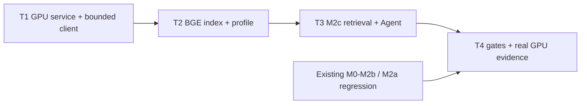

# Glodex M2c 自托管 Retrieval Model Service 实施任务

| 字段 | 值 |
|---|---|
| Tasks ID | `GLO-TASKS-009` |
| 版本 | `0.1.0` |
| 状态 | Approved |
| 对应规格 | [`GLO-SPEC-009 v0.1.0`](./spec.md)（Approved） |
| 对应计划 | [`GLO-PLAN-009 v0.1.0`](./plan.md)（Approved） |
| 里程碑 | M2c：GPU BGE embedding 与 cross-encoder reranker service |
| 创建日期 | 2026-07-30 |
| 最后更新 | 2026-07-30 |
| 批准日期 | 2026-07-30 |

## 1. 实施边界与完成定义

本任务单只实现 M2c 的**固定私有 GPU BGE 检索闭环**。M0–M2b 的默认 CLI/API/SSE、M1d
AgentLoop/九工具/fork、M2a DashScope composition、M2b PostgreSQL/Redis durable API、M1f
Showcase、Canonical/Evidence/Hard Gates 和既有 OpenSearch indexes 都必须保留入口、合同和默认
零 socket 行为。

实施按 **T1 → T2 → T3 → T4 四个大交付任务**进行。每个任务先建立 fake/contract/
architecture evidence 再写 production adapter；GPU/CUDA/tunnel/DeepSeek 只在对应的 explicit
Operator smoke 使用。不得提交 GPU 权重、私有 manifest、checkpoint path/hash、tunnel host/
command、raw query/profile/document、embedding/score、credential、`.env`、service log、Docker
volume 或 `项目架构/` 的 26 张 PNG。

完成 M2c 的最低结论是：Operator 可在 GPU 上运行由新仓库提供的 manifest-verified service，
通过固定 loopback tunnel 健康核验它，以真实 BGE vectors 从 validated M1d assets 建立独立
M2c indexes，写入一条显式 BGE profile，并执行真实 M2c Agent query 的 product/Card
cross-encoder rerank；结果仍由现有 Canonical/Evidence/Hard Gates 发布。legacy `/health` 或
DashScope/M2a 结果不可替代该证据。

## 2. 交付任务

### T1 — GPU model service、私有 manifest 与固定 bounded client

**目标。** 交付新仓库拥有的最小 GPU service 和应用端的固定 loopback client，使服务身份、
模型 manifest、1024-d embedding、cross-encoder scores 和输入/输出边界可验证。此任务不
重建 OpenSearch index、不接入 Agent、不读取/迁移 profile。

**实现内容。**

- 在 GPU-only optional dependency group 中固定 PyTorch、sentence-transformers 与兼容 CUDA
  runtime；默认 package/runtime/test 不安装、不 import 它们。新增 GPU deployment entrypoint，
  只在 Operator 给出的私有 manifest 下加载固定 `glodex-bge-m3-v1` 与
  `glodex-bge-reranker-v1` 权重；
- 实现 private manifest schema/validator：weight SHA-256、model IDs、dimension=1024、sequence/
  batch limits 与 service build digest 只驻留 GPU private path。service startup 验证权重、model
  output dimension/normalization 与 CUDA/GPU class，不通过不监听；
- 实现并严格测试 `GET /v1/health`、`POST /v1/embed`、`POST /v1/rerank`：identity encoding、
  固定 body/response limits、single inference lock、无 access log/echo/exception text、无
  redirect、没有任意模型/path/admin/debug route；
- 新增 `M2cModelIdentity`、`M2cEmbedding`、`M2cReranker` 与 health verifier。client 只能连接
  `127.0.0.1:18000`、`trust_env=False`、2/15 s deadline，严格验证 manifest digest、device/GPU
  class、limits、1024-d finite normalized vectors 与 score count/finite closure；
- client 使用既有 `EmbeddingPort`、`EmbeddingBatch`、M2a `RerankRequest`/`RerankResult`
  边界，不新增 provider registry、API key、动态 URL/model/path 选项或 DashScope fallback。

**先行验证。** fake model/fake HTTP transport 覆盖 private manifest rejection、health exact
schema/digest/GPU class、loopback-only、proxy/redirect、identity encoding、header/body/response
bounds、deadline、bad JSON、wrong dimension/non-finite/non-normalized vector、score 缺失/重复。
architecture tests 证明 CUDA/PyTorch only 可由 GPU entrypoint import，M0–M2b factories/default
tests 不导入 M2c service/client，也不连接 18000。

**验收证据。** `GLO-M2C-P0-001`、`GLO-M2C-P0-002`、`M2C-AC-001`（health）、
`GLO-M2C-NFR-001`、`GLO-M2C-NFR-002`、`GLO-M2C-NFR-004`、`GLO-M2C-NFR-005`。
真实 GPU smoke 只核验 health 和一个固定非敏感 embedding/rerank probe；若 legacy server
仍存在但没新 manifest health，必须报告 `M2C_MODEL_UNAVAILABLE`，不可标记 T1 完成。

**完成条件。** `m2c-model-verify --live` 能仅输出 safe manifest digest prefix、dimension、
device class、状态或 stable safe code；没有 OpenSearch、Agent 或 profile 路径。

- [x] T1 完成（2026-07-30：离线门禁通过；新 A100 service 的 manifest health、固定 loopback
      tunnel、非敏感 embedding/rerank probe 均已实际验证）

### T2 — BGE reindex、M2c model-bound aliases 与 typed Profile

**目标。** 从现有 hash-closed M1d assets 以 T1 的真实 BGE embedding 建立与 M2a 完全隔离的
Product/Card/Profile OpenSearch identity。此任务实现跨模型安全，而不改变 Agent runtime。

**实现内容。**

- 新增 `M2cIndexManifest`、M2c physical index/alias builder 与 verifier。它复用 M2a 唯一
  loopback OpenSearch client 和可信 `AgentIndexes` projection，但 mapping `_meta`、alias 和
  physical name 必须包含 M2c namespace / BGE model identity / manifest digest；不得写 M2a
  alias 或复用 M2a DashScope vector；
- index build 的固定顺序是 load validated M1d assets → T1 health verify → 重建可信 product/
  Card text → bounded GPU embed → validate vector closure → bulk physical index → mapping/count/
  source fingerprint verify → atomic M2c alias publish。任何 partial/unknown/duplicate/cross-
  platform identity 都不可 publish；
- 新增 M2c profile alias/store 与 `m2c-profile set|list|delete --live`。它只接受现有
  `soft/preference` shape，写入 BGE vector + manifest digest；list 只显示 opaque entry ID/
  revision。M2a/M2b/unknown-digest profile 一律 `M2C_PROFILE_MODEL_MISMATCH`，不转换、不复制、
  不做 User ANN；
- 新增 `m2c-index build|verify --live` 和 GPU-free `scripts/verify_m2c_local.py`：后者用 fake
  M2c service 验证 model-index/profile identity closure，实际 GPU reindex 仍是 operator smoke。

**先行验证。** mock OpenSearch/M2c client 覆盖 manifest canonicalization、BGE model digest
mismatch、asset hash/count/mapping/alias mismatch、invalid vector、atomic publish/reuse、no M2a
alias mutation、profile scope/ownership/list redaction/old-vector mismatch。M2a index/profile
commands 与 default socket behavior/golden output 必须不变。

**验收证据。** `GLO-M2C-P0-003`、`GLO-M2C-P0-004`、`M2C-AC-002`、`M2C-AC-003`、
`GLO-M2C-NFR-001`、`GLO-M2C-NFR-003`、`GLO-M2C-NFR-004`、`GLO-M2C-NFR-005`、
`GLO-M2C-NFR-006`。
真实 smoke 确认新的 M2c item/Card alias 由 8/8 个真实 BGE vectors 构建，并在一条受控
profile 上验证未混用 DashScope vector。

**完成条件。** 在 T1 service/tunnel 和本机 OpenSearch 已就绪时，M2c index/profile commands
可独立验证；M2a/M2b data、aliases、profile 与 durable runtime 不受影响。

- [x] T2 完成（2026-07-30：离线门禁通过；真实 BGE Product/Card 各 8 条索引、独立
      model-bound aliases、显式 profile set/list 与 index verify 均已验证）

### T3 — M2c Retrieval、真实 cross-encoder 与独立 Agent composition

**目标。** 将 T1/T2 的 model identity 通过一条 M2c-only Agent path 接入真实 Query/User/Item
retrieval 和 product/Card cross-encoder rerank，同时保留受保护的 Query pool 与所有可信发布
gates。

**实现内容。**

- 新增窄 M2c item/category retrieval adapters 与 `build_m2c_agent_service()`；它只注入
  `M2cEmbedding`、`M2cReranker`、verified M2c aliases 和 M2c typed profile，其他均复用现有
  DeepSeek selector、Agent runtime、`DemoItemSource` trusted back-read、CandidateManifest、
  Card reducer、SearchService、shipping rules、Canonical/Evidence/Hard Gates；
- Product path 固定 Query Hybrid Top-30、User ANN Top-10、current Required conflict judge、
  Query-protected merge 与最多 40 个去重 candidates 的真实 `/v1/rerank`；Card path 固定
  Hybrid Top-30 → GPU rerank Top-15 → 既有 reducer；
- 对 score 使用 exact input closure 和 `(-score, identity)` tie break。Query BGE/alias/model
  failure fail closed；User/profile/rerank failure 只走 M2c safe degraded rule：Query order 保留、
  User-only candidates 丢弃、Card 不生成无来源 insight；不调用 DashScope 或 lexical fake rerank；
- 新增 `m2c-agent-demo --live` 与 M2c safe trace。trace/SSE/CLI 仅携带 model digest prefix、
  counts、opaque IDs、safe code；不改 `AgentDemoResponse`、SSE schema、普通 `agent-demo`、
  `m2a-agent-demo` 或 `m2b-serve` backend。

**先行验证。** fake M2c embedding/rerank/indexes 覆盖 Query/User same-model binding、no profile/
old profile、conflict judge、Top-30/10/40/15 limits、identity injection、score tie/degradation、
trusted Product/Card readback、Hard Gate/Evidence closure、no DashScope fallback 或 sensitive trace。
architecture tests 证明 M2a/M2b composition 不 import M2c；test socket spy 证明 M2c command
以外仍不触发 service health/inference。

**验收证据。** `GLO-M2C-P0-005`、`GLO-M2C-P0-006`、`M2C-AC-003`、`M2C-AC-004`、
`M2C-AC-005`、`GLO-M2C-NFR-001`、`GLO-M2C-NFR-003`、`GLO-M2C-NFR-004`、
`GLO-M2C-NFR-005`、`GLO-M2C-NFR-006`。
真实 smoke 在 BGE index/profile 后分别完成 product 和 Card rerank，再运行一条 M2c Agent
query；最终结果必须继续通过所有 Canonical/Evidence/Hard Gates。

**完成条件。** `m2c-agent-demo --live` 成功时可以证明 BGE Query/User/Item 和 cross-encoder
都实际运行；失败时只输出 typed failure/degraded code，不将 M2a/DashScope 成功混入结果。

- [x] T3 完成（2026-07-30：离线门禁通过；真实 M2c Agent 的 Card/Product BGE retrieval、
      cross-encoder rerank、九工具、Canonical/Evidence/Hard Gates 均已完成并发布结果）

### T4 — CLI、评测、回归、GPU smoke 与交付门禁

**目标。** 使 M2c 可由学生按 README 复现，所有 default/offline evidence 与真实 GPU evidence
明确分离，并证明 M0–M2b/M2a baseline 没有退化。

**实现内容。**

- 完成/收紧 `m2c-gpu-service`、`m2c-model-verify`、`m2c-index`、`m2c-profile`、
  `m2c-agent-demo` CLI parsers/envelopes。application commands 全部拒绝 host/port/url/model/
  manifest/path/credential 参数，只有 GPU deploy entry 可接收 private manifest path；
- 新增 `tests/m2c/{unit,contract,acceptance,architecture,nfr}/`、traceability profile `m2c` 与
  `scripts/verify_m2c.py`。runner 先执行 M2b baseline，再执行 M2c format/lint/mypy/architecture/
  unit/contract/acceptance/coverage；它清除 provider/proxy/tunnel env、禁 socket、不会 import GPU
  dependencies；
- 新增 M1e isolated M2c aggregate comparison。候选先用 BGE rerank，之后才读 label；只输出
  aggregate coarse/BGE-reranked metrics，不让 ESCI label/source 进入 index、Agent、service
  request 或商品结果；
- 更新 README：GPU-only private manifest/dependency 前置、service/tunnel 的非敏感启动形状、
  model verify → BGE build/verify → profile → M2c Agent → stop 顺序、文本发送范围、限制、
  安全停止方式和 M2b/M2d 边界。不得记录 remote host、model path/hash、SSH command、credential
  或 service response；
- 执行并记录独立真实 smoke：GPU service manifest health → fixed non-sensitive embed/rerank →
  BGE index build/verify → M2c profile → M2c Agent product/Card paths → M1e aggregate
  comparison。只记录 safe summaries，外部前置不满足时如实报告而不宣称完成。

**先行验证。** CLI/parser/envelope snapshots、no `--live`/no tunnel/no service/bad manifest、
README safe-content checks、M0–M2b/M2a regression、M1f static server unaffected、dependency
direction、no socket default、no private manifest/volume/PNG tracking、traceability coverage。

**验收证据。** `GLO-M2C-P0-001`–`GLO-M2C-P0-007`、`M2C-AC-001`–`M2C-AC-006` 与全部
`GLO-M2C-NFR-001`–`GLO-M2C-NFR-006`；最终离线门禁：

```bash
uv run --locked python scripts/verify_m2c.py
```

真实 GPU smoke（不进入默认 pytest/CI）严格按本节顺序运行。最终报告必须分别列出离线 gate、
GPU service health、embedding/rerank、OpenSearch reindex、Agent 和 aggregate evaluation 的实际
结果。

**完成条件。** README 和新 commands 能让有受控 GPU/tunnel 的 Operator 重现完整闭环；
M2c 的任何成功主张都有真实 GPU evidence，且默认 M0–M2b/M2a baseline 仍可独立运行。

- [x] T4 完成（2026-07-30：离线 `verify_m2c.py` 通过；A100 manifest health、固定 probe、
      BGE index/profile、M2c Agent 与 500-query ESCI aggregate comparison 均已实际验证）

## 3. 依赖、测试顺序与不可变约束



| 阶段 | 允许的外部依赖 | 禁止事项 |
|---|---|---|
| 默认 unit/contract/acceptance/architecture/nfr | 无；fake model/service/transport、固定 assets | CUDA/GPU、tunnel/OpenSearch socket、DeepSeek/DashScope、credential、代理、private manifest。 |
| T1 GPU smoke | Operator 已启动的新 GPU service + loopback tunnel；固定 non-sensitive probe | legacy-only health 作为 identity evidence、任意 endpoint、权重/路径/host 输出、默认 runner 调 GPU。 |
| T2/T3 GPU smoke | T1 service/tunnel + local M2a OpenSearch + validated M1d assets；T3 另需现有 DeepSeek credential | M2a alias/vector/profile 复用、DashScope fallback、M2b backend 改造、自动 Docker/tunnel。 |
| T4 final smoke | T1–T3、显式 M1e artifact；Operator 按 README 启动 | 训练/下载权重、AG-UI/React、queue/multi-worker、自动发布、私密 data/PNG tracking。 |

不变约束：M2c service/model manifest 是唯一 BGE identity source；BGE and DashScope vectors
never mix；Query Top-30 结构性优先；User 只补充不改分；index/GPU/profile 不是商品事实源；
Canonical/Evidence/Hard Gates 仍是唯一发布 gate；服务/adapter 故障只能 fail closed 或明确
degraded；默认入口保持零新 socket/import。

## 4. Tasks Definition of Ready（进入 Implementation 前）

- [x] 用户批准本 Tasks，并将状态改为 `Approved`；
- [x] 用户确认 T1 → T2 → T3 → T4 是唯一实施顺序，不以 HTTP 字段、index mapping、error code
      或单个测试拆成等待节点；
- [x] 用户确认先用 fake/contract/architecture tests 固化边界，GPU service/tunnel/model 调用只在
      T1/T4 的明确 Operator smoke 使用；
- [x] 用户确认 T2 必须重建 BGE vectors/index/profile，T3 才可接入真实 retrieval/rerank，且
      M2a DashScope 和 M2b durable backend 不改变；
- [x] 用户确认 GPU-only optional dependencies、private manifest、loopback tunnel 与应用默认
      runtime/Git 输出隔离；
- [x] 用户确认 T4 对离线 gate、GPU health、embedding/rerank、reindex、Agent/evaluation 分别
      报告真实结果，不能以旧 service health 或 placeholder 代替。
