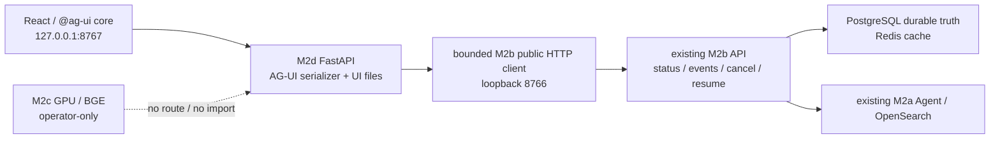

# Glodex M2d AG-UI / React 交互与运营闭环实施计划

| 字段 | 值 |
|---|---|
| Plan ID | `GLO-PLAN-010` |
| 版本 | `0.1.0` |
| 状态 | Approved |
| 对应规格 | [`GLO-SPEC-010 v0.1.0`](./spec.md)（Approved） |
| 父基线 | `GLO-SPEC-004`、`GLO-SPEC-007`、`GLO-SPEC-008`、`GLO-SPEC-009` |
| 里程碑 | M2d：AG-UI adapter、React 实时运行面与受控运营视图 |
| 创建日期 | 2026-07-31 |
| 最后更新 | 2026-07-31 |
| 批准日期 | 2026-07-31 |

## 1. 目标、前提与实施预算

M2d 在现有 M2b durable HTTP API（`127.0.0.1:8766`）之前增加一个同机、loopback-only 的
AG-UI / React 运行面（`127.0.0.1:8767`）。它通过 HTTP 调用 M2b 的五条已经验收的 public
routes，不读取 DB/Redis/checkpoint/profile，不改 M2b worker 或 M2a agent composition。React 页面
只消费 M2d 的安全 AG-UI projection，不直接连接 M2b、OpenSearch、Provider 或 M2c GPU service。

实施固定为 **A → B → C → D 四个大交付块**。Tasks 阶段不能把一个 event 字段、一个按钮或
一个测试拆成独立小任务，也不得把生产 queue、多 worker、WebSocket、账号、M2c durable backend
或完整 AG-UI 偷渡进来。

- M2b `m2b-serve --live` 是唯一 durable upstream；M2d operator 必须先显式启动它和其现有的
  PostgreSQL/Redis/OpenSearch/credential 前提。M2d 不自行迁移、启动 Docker、加载 `.env` 或建立
  Provider/GPU connection；
- 新 Python runtime 只使用现有 FastAPI/httpx；`httpx.AsyncClient` 目标固定为
  `http://127.0.0.1:8766`，`trust_env=False`、无 redirect、固定 connect/read/body deadline。
  不提供 host/port/url/profile/model/credential 覆盖参数；
- 新 Node runtime 只用于 `frontend/` 的 build/test。React、TypeScript、Vite、`@ag-ui/core` 和
  `@ag-ui/client` 使用 committed npm lockfile；没有 CDN、远程字体、analytics 或 browser storage；
- M2d live server 只监听 `127.0.0.1:8767`。M1f showcase 仍为 `127.0.0.1:8765` 的静态录制回放；
  M2b API 仍为 `8766`，三者不合并、互不改写；
- M2c 保持 `m2c-* --live` 的 operator-only GPU 路径。M2d 不调用 `18000`，不读取 GPU manifest，
  不改变 BGE index/profile，也不把 M2b durable backend 换成 M2c；
- 浏览器安全输入只是当前 `SearchRequest` 的可见字段；浏览器安全输出是冻结的 AG-UI subset 与
  `AgentDemoResponse` 的受限 terminal view，绝不含 raw query 回显、CoT、tool args/output、
  profile、Provider/DB/Redis/GPU 原文。

## 2. 增量架构与复用缝



| 现有缝 | M2d 的精确处理 |
|---|---|
| `DurableCreateRunRequest`、`DurableRunAccepted`、`DurableRunStatusResponse` | 新 `M2dDurablePublicClient` 只序列化/验证现有 HTTP DTO 与 safe error envelope；不能 import store/coordinator 或实现 Postgres adapter。 |
| M2b SSE `glodex.agent.event.v1` | 新 strict parser 读取 immutable public event，并由纯 `AgUiProjector` 投影；不更改老 DTO、SSE id、event order 或 M2b app。 |
| `AgentDemoResponse` | 新 terminal-view projector 白名单渲染已有安全 terminal 字段；不改变 M1d/M2b response schema，也不从 OpenSearch 回读。 |
| M2b cancel/resume | 新 M2d routes 仅校验 UI precondition 后 proxy 现有 endpoint；M2b 仍唯一决定状态是否合法、是否可恢复。 |
| FastAPI / body limit / error envelope | 复用既有 request-size、Accept negotiation、safe error pattern；为 M2d 自己新增窄 DTO 和 route factory，不能扩大全局 middleware 行为。 |
| M1f static showcase | 完全不改。M2d 引入独立 `frontend/` build，不把录制 JSON 或网页资源复制进实时 console。 |
| M2c client/service | 不复用、不 import、不暴露。M2d 的 architecture test 要证明它不会打开 GPU/private tunnel。 |

### 2.1 进程与固定入口

```bash
# Terminal 1：已有 durable upstream，前提仍由 M2b operator 满足
uv run --locked glodex m2b-serve --live

# Terminal 2：M2d app；只允许同机调用固定 8766，页面在 8767
uv run --locked glodex m2d-serve --live

# 首次/前端变更后：离线构建，产物再由 M2d app 托管
cd frontend && npm ci && npm run build
```

`m2d-serve` parser 只接受既有 config path 与必填 `--live`；不接受 host、port、M2b URL、GPU URL、
model、profile、queue/worker 数或 credential。M2d app 启动时不得向 M2b 发 health/request；只有
用户提交、状态读取、重连、取消/恢复才产生已有公开 HTTP 调用。M2b 不可达时 server 仍可提供
静态页面和明确 `M2D_UPSTREAM_UNAVAILABLE`，不得启动替代 backend。

### 2.2 Projector 的最小形状

新增窄 `AgUiRunInput`、`AgUiEvent` union、`GlodexM2dState`、`M2dTerminalView`、
`M2dRelayCode` 和 `AgUiProjector`，全部 strict/frozen/extra-forbid。projector 是纯函数：

1. 严格解析一个 M2b public event；验证 run/thread identity、source sequence 和 terminal legality；
2. 依据 Spec 5.1 生成一组 ordered AG-UI JSON events，给每一项 `(sourceCursor, projectionOrdinal)`；
3. 在每个 source event 后生成 bounded `STATE_SNAPSHOT`；终态才生成 terminal view 与 assistant
   text lifecycle；
4. unknown、oversize、cursor gap、cross-run 或 JSON/schema failure 生成一条固定 `RUN_ERROR`，不把
   原文装入 `RAW`/`CUSTOM`/error；
5. React reducer 与 Python tests 都消费同一 fixture matrix，验证 first-stream/replay state 等价。

不实现 generic event mapper、schema registry、raw event passthrough、JSON Patch/delta engine 或
完整 Agent client framework。

## 3. 四个交付块

### A. 严格合同、M2b public client 与 AG-UI adapter

新增 `m2d_contracts.py`、`m2d_agui.py`、`m2d_durable_client.py` 和独立 FastAPI factory。先完成：

- 输入 parser：第 4.1 节的 exact `RunAgentInput` subset → 已验证 `SearchRequest`；任何 media、
  multi-message、non-empty state/tools/context、unknown forwarded prop 皆在 submit 前 reject；
- fixed loopback HTTP client：仅调用 M2b 创建/status/events/cancel/resume；严格 content type、body
  上限、redirect/proxy/timeout/error parsing；不会记录 request/response body；
- public M2b SSE parser、source cursor/sequence verifier、纯 AG-UI projector 和 serializer；
  输出只为 `RUN_*`、`STEP_*`、`TOOL_CALL_START/END`、`STATE_SNAPSHOT`、受限 `CUSTOM` 及 terminal
  assistant text；
- 新 M2d routes：标准 `POST /api/v1/m2d/ag-ui`，以及 status/events/cancel/resume 的 reattach
  extension。静态 asset 仅由同一 app serve；
- `m2d-serve --live` composition：`127.0.0.1:8767`、关闭 access-log request body、在没有 built
  assets 时安全提示 operator build；默认 test 不 import/启动 uvicorn 或发 socket。

完成 A 时使用 fake M2b public client 做合同测试；不引入 Node、React 或 M2b live connection。

### B. React Console 与同源 AG-UI 消费

新增锁定的 `frontend/` workspace。页面只包括一个 run console：

- 表单严格构造 A 的 input（query/locale/currency/top-k/snapshot）；只保存在 React memory；
- fetch-stream 处理标准 `POST` SSE，EventSource/stream 处理 reattach `GET` SSE；`@ag-ui/core`
  schema 作为 event decoding gate，reducer 以 `(sourceCursor, projectionOrdinal)` 去重；
- 运行面展示 status、round/tool/fork timeline、source cursor、terminal answer/results/evidence/成本
  安全视图、NO_MATCH 与 `M2D_*` failures；不渲染 tool args/output、reasoning 或 raw upstream JSON；
- Cancel/Resume/Reconnect/New run 的可见性严格随 snapshot state；浏览器不得自行推测 terminal
  result，不能调用 `8766` 或任一 M2c/private endpoint；
- 使用单元/组件测试与 browser acceptance 测试验证真实 SSE 消费、DOM privacy、reload/reducer
  idempotency、没有 storage/CDN/外部网络。页面视觉以清楚可验证为先，不做 dashboard、图表或账号 UI。

完成 B 时，M2d 可以离线连接 fake adapter 并在浏览器运行。仍不改变 M1f/M2b/M2c。

### C. Durable reattach、控制代理与受控故障

将 A/B 接到真实 M2b public API，只增加已冻结的本机行为：

- status route 在 reload 后给出完整安全 snapshot；events route 将 M2b `Last-Event-ID` suffix
  投影成可幂等重放的 AG-UI stream；同一 source event 的 event group 不能被截断或重排；
- cancel/resume route 只返回由 M2b 最新 status 构建的 snapshot。UI 可预禁用不合法按钮，但 API
  结果完全遵循 M2b；
- 连接失败、invalid M2b public event、cursor mismatch、HTTP stream 早断分别投影唯一 M2D safe
  code；保留最后完整 state；不自动 retry、不会向 durable run 写入故障，也不推出 fake terminal；
- 真实 local smoke：用 M2b deterministic durable path 证明 create → live events → reload/replay →
  cancel/terminal；另以 M2b 已有 recoverable fixture 验证 resume。真实 Provider/DeepSeek run 为
  独立 optional browser acceptance，不进入 default test。

此块绝不实现 background polling service、retry queue、reconnect backoff、global breaker、worker
health dashboard 或生产 observability stack。

### D. 验证、文档与交付门禁

新增 `tests/m2d/{unit,contract,acceptance,architecture,nfr}`、前端测试和 `scripts/verify_m2d.py`：

- unit/contract：输入 reject、AG-UI event Zod/strict schema、全部 M2b → AG-UI mapping、terminal
  legality、cursor replay equivalence、bad upstream fail-closed、HTTP/body/redirect/proxy/loopback 限制；
- React：form encoding、SSE event reducer、timeline/terminal/no-match/error render、button state、
  DOM 不含 raw payload、reload dedupe、无 storage/CDN/external request；
- architecture/NFR：M2d 不 import M2b store/coordinator、DB/Redis/M2c GPU/Provider adapters；默认
  socket-blocked；built assets、logs、SSE/CLI/README/Git diff 不含敏感字段、`.env`、volume、GPU/tunnel
  信息或 `项目架构/` PNG；
- runner 顺序：Python format/lint/mypy → M0–M2c default regression → M2d Python tests → npm locked
  install/build/test（禁 network 后的已安装依赖使用）→ static/asset privacy scan。runner 不启动 M2b，
  不读取 credential，不执行 browser live smoke；
- README 增补两进程启动、页面地址、M1f/M2b/M2d 端口分工、数据/隐私边界、停止方法与 limitation；
  不记录 secrets、raw payload、remote/GPU host、tunnel、manifest 或 `.env` 值。

## 4. 验证矩阵与最终门禁

| 验证层 | 最小证据 | 覆盖 |
|---|---|---|
| Python unit | strict DTO、M2b event parser、projection ordering/size、terminal-view whitelist、safe codes | `P0-001`、`P0-002`、`P0-005` |
| Python contract | fake public M2b HTTP/SSE、input/Accept/body rejection、loopback/redirect/proxy、control proxy | `P0-001`、`P0-004`、`P0-006` |
| React | locked build、AG-UI event parsing、reducer/idempotency、DOM render/privacy、button states | `P0-003`、`P0-004`、`NFR-004` |
| acceptance | fake end-to-end POST/SSE/reattach/cancel/resume/degraded flow | `M2D-AC-001`–`005` |
| architecture/NFR | zero socket default、no upstream private imports/outputs, no M1f/M2c regression, no PNG/secret | `M2D-AC-006`、`NFR-001`–`006` |
| local live smoke | existing M2b API + deterministic durable run + browser console; optional live M2a provider run | `AC-003`–`005` |

最终默认门禁为：

```bash
uv run --locked python scripts/verify_m2d.py
```

它清除 Provider/proxy/GPU environment、禁 Python socket、不会启动 Docker/M2b/uvicorn，也不会把
Node 下载变为隐式网络。若前端依赖尚未安装，runner 明确报告 prerequisite；不以临时 `npm install`
绕过 lockfile。真实 live smoke 只在 operator 已启动 `m2b-serve --live` 后单独执行。

## 5. Plan Definition of Ready（进入 Tasks 前）

- [x] 用户批准本 Plan，并将状态改为 `Approved`；
- [ ] 用户确认 M2d 是第二个 loopback app（8767）消费 M2b public API（8766），不是把 React 塞进
      M2b DB/worker 或修改既有 durable contract；
- [ ] 用户确认 AG-UI 是固定、可验证的事件子集，`@ag-ui` 版本由 committed lockfile 固定，不追求
      full protocol、WebSocket、reasoning/tool args 或前端工具；
- [ ] 用户确认 React console 只做单活动 run 的提交/查看/重连/取消/恢复，不做账户、历史、存储、
      dashboard、队列或 multi-worker；
- [ ] 用户确认 verification 先离线 fake/contract/built assets，再独立运行 M2b local/live browser
      smoke；M2d 不连接 M2c GPU；
- [ ] 四个交付块、固定 8765/8766/8767 端口分工、默认门禁和敏感数据/PNG 排除边界均可接受。
