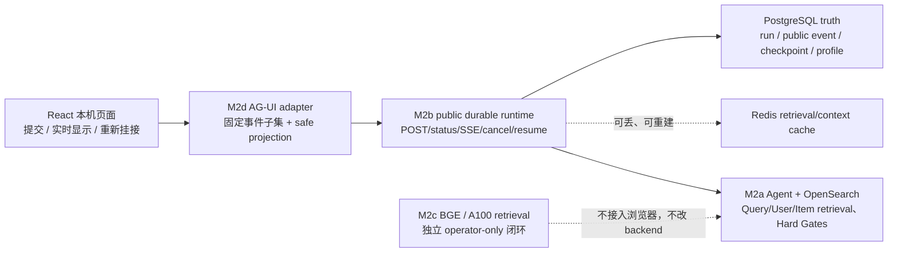

# Glodex M2d AG-UI / React 交互与运营闭环规格

| 字段 | 值 |
|---|---|
| Spec ID | `GLO-SPEC-010` |
| 版本 | `0.1.0` |
| 状态 | Approved |
| 里程碑 | M2d：AG-UI adapter、React 实时运行面与受控运营视图 |
| 父规格 | [`GLO-SPEC-007`](../007-glodex-m2a-opensearch-hybrid-retrieval/spec.md)、[`GLO-SPEC-008`](../008-glodex-m2b-durable-agent-runtime/spec.md)、[`GLO-SPEC-009`](../009-glodex-m2c-retrieval-model-service/spec.md) |
| 创建日期 | 2026-07-31 |
| 最后更新 | 2026-07-31 |
| 批准日期 | 2026-07-31 |

## 1. 目的与完成定义

项目架构图中的「实时可视化 / AG-UI 事件协议 / React 前端页面」尚未交付。M1f 的
`127.0.0.1:8765` 是静态录制回放；M2b 的 `glodex.agent.event.v1` 是安全、可重放的持久运行
事件；两者都**不是** AG-UI。M2d 在不改变这些合同的前提下，交付一个可在本机实际操作的
React 页面和一个独立 AG-UI 投影 adapter：用户提交一个受限的购物请求，页面能实时显示 M2b
durable run 的安全生命周期、工具/子任务进度、终态可信结果及安全故障；刷新或断线后能从 M2b
持久事件重新挂接，而不是伪造一段前端动画。



这里的完成不是“页面能打开”或“把旧 SSE 改一个名字”，而是：

1. 标准 AG-UI HTTP `POST` 能启动 M2b durable M2a run，并收到结构和顺序正确的 AG-UI SSE；
2. React 用该公开 adapter 展示运行中和 terminal state，且刷新/断线后可从 M2b durable events
   恢复相同安全状态；
3. 取消、可恢复 run 的 resume、relay 故障和无结果均诚实可见；
4. M2a Query-first、Canonical/Evidence/Hard Gates，M2b PostgreSQL truth/Redis fail-open，及
   M2c 独立受控 GPU 检索闭环均不被重写、削弱或伪称由浏览器驱动。

## 2. 范围

### 2.1 In Scope

- 独立 M2d FastAPI composition：**只通过 M2b 已冻结的 public durable contract** 创建、读取、
  取消、恢复 run 并消费安全 SSE；不直接读取 Postgres 表、checkpoint、Redis key 或私有 profile；
- 一个 `POST + text/event-stream` AG-UI endpoint，将 M2b `glodex.agent.event.v1` 显式投影为
  第 4 节冻结的 AG-UI 事件子集；另有明确标为 Glodex extension 的 durable 重连端点；
- 一个 TypeScript + React + Vite 本机页面，使用锁定的 `@ag-ui/core` 类型验证 adapter event，
  展示提交区、run 状态、阶段/工具/子任务时间线、可信终态结果及安全 code；
- 用 `STATE_SNAPSHOT` 承载 bounded UI state，用 `CUSTOM` 承载有限的 `glodex.m2d.*` 运营事实；
- operator 命令、离线 fake adapter/React contract tests、M2b compose 的明确 live smoke，及一条
  真实 durable M2a browser acceptance；
- loopback-only 的 relay health / stream-degraded 显示。它只说明 M2d 能否安全投影，不能充当
  Provider、GPU、OpenSearch 或基础设施监控平台。

### 2.2 Out of Scope

- 生产队列、worker pool、多 worker lease、分布式 fan-out、WebSocket、SSE broker、HA、
  autoscaling、Kubernetes、远程部署、TLS；
- 登录、账号、多租户、权限、用户画像、跨设备会话、cookie/session、分析追踪、第三方 telemetry
  或通用运营后台；
- 改写 M2b durable schema/公开路由/状态机、checkpoint、Redis cache、profile revision，或把 M2b
  的 M2a backend 静默替换为 M2c；
- 浏览器访问 M2c `127.0.0.1:18000`、GPU、health/embed/rerank、model manifest、向量、score、
  SSH tunnel 或凭据。M2c 仍只由既有 operator CLI 触发；
- 新 Agent 工具、改变九个业务工具或 `dispatch_tool`、展示 tool args/output、CoT/reasoning、
  prompt、Provider body、私有 profile、raw query history、市场抓取，或改变 Hard Gates；
- 取代 M1f `8765` 静态 showcase，或把 M1f 录制数据误标为实时 AG-UI；
- 多模态、human-in-the-loop、frontend tool、AG-UI handoff、activity/state delta/reasoning 事件、
  binary transport，或“完整 AG-UI 全部功能”的主张。

## 3. 不变量

1. **新 adapter，不篡改旧协议。** `glodex.agent.event.v1`、M2b public SSE 与 event ID 语义不变；
   只有 M2d adapter 可生成 AG-UI event。旧 endpoint 不能宣称 AG-UI compatible。
2. **M2b 是 durable truth。** React state、AG-UI snapshot、relay memory 都只是投影。刷新/重连
   必须从 M2b status/events 重建，不向 PostgreSQL 回写 UI 状态，也不补造、重排或吞掉 durable event。
3. **安全投影单向收缩。** M2d 只读取 M2b 已公开的安全字段，进一步最小化后才发送到 browser。
   未知 event/type/field、非法 JSON、sequence 缺口或跨 run 混入皆为安全 `RUN_ERROR`，不输出原 payload。
4. **结果仍由可信链裁定。** 页面只是 `AgentDemoResponse` 的受控 render；产品、费用、库存、
   evidence 与最终答案继续由 M2a/M1d 的 Canonical/Evidence/Hard Gates 产生。
5. **无隐式网络能力。** 启动 M2d、页面构建和默认 test 均不连 Provider、OpenSearch、Postgres、
   Redis、GPU 或 browser。真实运行只能由 explicit `--live` operator composition 启动。
6. **同 run 可重放。** 同一 M2b public event prefix 在首次 stream 与合法 cursor 重连后，产生
   相同 AG-UI 投影和最终 UI state；不会新建 run、调用模型或重做工具。
7. **本地而非生产。** M2d 仅绑定 `127.0.0.1`；无认证不等于可以公网暴露，也不承诺多用户、
   吞吐、可靠投递、灾备或生产可用性。

## 4. 固定 AG-UI 兼容基线

M2d 固定兼容 [AG-UI 的 HTTP `RunAgentInput` + JSON SSE 模式](https://docs.ag-ui.com/concepts/architecture)，
字段以 [官方 JavaScript event schema](https://docs.ag-ui.com/sdk/js/core/events) 为准。实现时
`@ag-ui/core` 和 `@ag-ui/client` 必须写入 committed lockfile；升级依赖、扩展 event 集合或改变
本节字段均视为协议变更，必须先修订本 Spec。

**兼容仅指下表的 wire subset 可被标准 HTTP AG-UI client 解析，不是全协议功能齐全。** HTTP
使用 JSON SSE；每个 data frame 正好一个 event object，`timestamp` 为 epoch milliseconds。M2d
不使用 `rawEvent`，以避免把上游 payload 泄漏到 browser。

| AG-UI event | 是否发出 | 固定字段与来源 | 目的 |
|---|---|---|---|
| `RUN_STARTED` | 必须 | `threadId`、`runId`，无 `input` | 已接受的 M2b run；不回显用户输入。 |
| `STEP_STARTED` / `STEP_FINISHED` | 必须 | `stepName` 仅为 `model_round`、`tool:<ToolName>`、`fork:<depth>` | 安全进度。 |
| `TOOL_CALL_START` / `TOOL_CALL_END` | 必须 | 稳定 `toolCallId`、固定 `toolCallName` | 九工具/dispatch 生命周期。 |
| `STATE_SNAPSHOT` | 必须 | 第 5.3 节 `GlodexM2dState` | React/重连恢复渲染。 |
| `CUSTOM` | 必须 | `name="glodex.m2d.run"` 或 `"glodex.m2d.relay"` | safe code、source cursor、fork、relay 状态。 |
| `TEXT_MESSAGE_START` / `CONTENT` / `END` | 仅 terminal success/no-match | `messageId`、`role="assistant"`、`AgentAnswer.text` | 显示已可信发布的最终回答；不是 token streaming。 |
| `RUN_FINISHED` | success/no-match 必须 | `threadId`、`runId`，无任意 `result` | 正常结束。 |
| `RUN_ERROR` | failed/aborted/relay error 必须 | 固定 `message="Run could not be completed."`、stable `code` | 受控失败，无 exception/provider text。 |

明确不发送也不接受：`TOOL_CALL_ARGS`、`TOOL_CALL_RESULT`、`STATE_DELTA`、`MESSAGES_SNAPSHOT`、
`ACTIVITY_*`、`RAW`、全部 `REASONING_*` 和未列出的未来 event。它们会携带不必要的参数/状态，
不属于本切片所需的实时状态、工具进度或可信结果展示。

### 4.1 标准启动请求

`POST /api/v1/m2d/ag-ui` 是标准 AG-UI HTTP endpoint，只接受以下严格子集。未知字段、非 JSON、
body 大于 64 KiB、非 `Accept: text/event-stream` 均返回既有安全 envelope，且零 durable run。

```json
{
  "threadId": "ui-thread-001",
  "runId": "ui-run-001",
  "state": {},
  "messages": [{"id": "msg-001", "role": "user", "content": "推荐一台适合出差的轻薄本"}],
  "tools": [],
  "context": [],
  "forwardedProps": {
    "locale": "zh-CN",
    "displayCurrency": "USD",
    "topK": 3,
    "snapshotVersion": "m1d-demo-v1"
  }
}
```

- `threadId` 和 `runId` 都须为 Glodex `Identifier`。client `runId` 只作 correlation；M2b 服务
  生成的 durable `run_id` 是随后 AG-UI event 的唯一 run ID；
- `messages` 恰一条 `role="user"` 纯文本，trim 后 1–2,000 字符。它映射为 `SearchRequest.query`；
  不接受 assistant/system/developer/tool/reasoning、数组 content、URL、image/audio/video/document；
- `state` 必须空 object；`tools`/`context` 必须空数组；不接受 `parentRunId`；`forwardedProps`
  只允许 `locale`、`displayCurrency`、`topK`、`snapshotVersion`，逐项映射现有 `SearchRequest`；
- adapter 用 M2b 的 `POST /api/v1/durable-agent-runs` 创建 run，再消费 M2b public status/events；
  不调用内部 coordinator/store，也不接受 profile ID；
- durable run 创建后若上游在 `RUN_STARTED` 前失败，adapter 可从 M2b public status 恢复；绝不为
  “补偿”再次 submit。

### 4.2 Durable replay extension

标准 `POST` 结束后，React 以下列 **Glodex extension** 恢复同一个 run；它不是 AG-UI 标准 client
的必需能力。

| 方法 | 路径 | 行为 |
|---|---|---|
| `GET` | `/api/v1/m2d/runs/{run_id}` | 从 M2b public status 生成只含安全 run state/terminal render 的 M2d snapshot。 |
| `GET` | `/api/v1/m2d/runs/{run_id}/events` | 按 `Last-Event-ID` 重放之后的**投影后 AG-UI events**。 |
| `POST` | `/api/v1/m2d/runs/{run_id}/cancel` | 纯代理 M2b public cancel，返回安全 M2d snapshot。 |
| `POST` | `/api/v1/m2d/runs/{run_id}/resume` | 纯代理 M2b public resume；仅 `RECOVERABLE` 可用。 |

extension 先以 M2b public status 验证 run/cursor。SSE `id` 固定为 `{run_id}:{M2b-sequence}`，即
source cursor；连续 source event 可投影多个 AG-UI event。重连会从 cursor 后首个 source event
重新发其完整投影；React reducer 必须以 `(sourceCursor, projectionOrdinal)` 幂等去重。

## 5. 安全投影与 React 状态

### 5.1 M2b → AG-UI 固定映射

| M2b event | AG-UI projection | UI 可见事实 |
|---|---|---|
| `AGENT_STARTED` | `RUN_STARTED` + `STATE_SNAPSHOT` | `ACCEPTED/RUNNING` 与 durable run/thread identity。 |
| `MODEL_STARTED` | `STEP_STARTED(model_round)` + snapshot | round 仅作 progress count。 |
| `MODEL_FINISHED` | `STEP_FINISHED(model_round)` + `STEP_STARTED(tool:<name>)` | 已选 tool 名称。 |
| `TOOL_STARTED` | `TOOL_CALL_START` + snapshot | tool 名称和投影 call ID。 |
| `TOOL_FINISHED` | `TOOL_CALL_END` + `STEP_FINISHED` + `CUSTOM` + snapshot | tool 名称和 safe outcome；无 args/result。 |
| `FORK_STARTED` / `FORK_FINISHED` | `STEP_STARTED/FINISHED(fork:<depth>)` + `CUSTOM` + snapshot | child opaque ID、depth、status；无 demand/context。 |
| `AGENT_RESULT` | terminal snapshot、assistant text lifecycle、`RUN_FINISHED` | 已发布 answer、结果卡、evidence ID。 |
| `AGENT_ERROR` 或 durable `ABORTED` | terminal snapshot + `RUN_ERROR` | status 与 stable safe code。 |

adapter 最大可读字段为 M2b event 的 `threadId`、`runId`、`sequence`、`timestamp`、`scope`、
`round`、`toolName`、`childId`、`depth`、`status`、`safeCode`。它不能透传其余 JSON、synthesize
tool args/output，或由 timing 推断模型、Provider、cache、retrieval/GPU 细节。

### 5.2 终态结果卡

`AgentDemoResponse` 已是 public safe response；M2d 仍只 render：`status`、`answer.kind/text`、至多
三项 `SearchResult` 的 title/category/selected offer market/currency/display landed cost、
`matchedRequirements`、`unknowns`、`reason`、evidence IDs，以及现有 `webEvidence`、
`LandedCostAdvisory`、`toolSummary` 的安全字段。它不显示 config fingerprint、内部 diagnostics、
query span、未选 candidate；也不解析 evidence ID 为外站请求。

### 5.3 `GlodexM2dState`

`STATE_SNAPSHOT.snapshot` 固定 schema 为 `glodex.m2d.ui-state.v1`，最大 32 KiB，未知字段拒绝：

```json
{
  "schemaVersion": "glodex.m2d.ui-state.v1",
  "threadId": "thread-opaque",
  "runId": "durable-run-opaque",
  "state": "RUNNING",
  "sourceCursor": "durable-run-opaque:7",
  "stages": [{"name": "tool:item_search", "state": "FINISHED", "safeCode": "OK", "toolCallId": "tool-opaque"}],
  "forks": [{"childId": "child-opaque", "depth": 1, "state": "RUNNING"}],
  "terminal": null,
  "relay": {"state": "HEALTHY", "safeCode": null}
}
```

`state` 只能是 M2b public durable state；stage 最多 64、fork 最多 20，按 source sequence 稳定
排序；stage 的可选 `toolCallId` 仅用于配对 `TOOL_CALL_START/END`，不得包含 arguments、result 或
任何可逆推业务输入的内容；`terminal` 仅为第 5.2 节的受限 `M2dTerminalView` 或 `null`。未完成 run
不能含 partial answer/products。超过大小/数量上限的 source input 以 `M2D_PROJECTION_INVALID` 终止，
不能截断后继续声称完整。

### 5.4 `CUSTOM` 与受控故障

`CUSTOM` 只允许：

| name | 固定 value 字段 | 用途 |
|---|---|---|
| `glodex.m2d.run` | `schemaVersion`、`sourceCursor`、`scope`、`childId?`、`depth?`、`status?`、`safeCode?` | 进度、fork、safe outcome。 |
| `glodex.m2d.relay` | `schemaVersion`、`state`、`safeCode` | adapter relay 状态。 |

新增 stable code 仅有：

| code | 含义 | browser 动作 |
|---|---|---|
| `M2D_UPSTREAM_UNAVAILABLE` | 无法通过 M2b public API 得到 status/events。 | 显示连接不可用，允许重新挂接。 |
| `M2D_PROJECTION_INVALID` | source 不满足冻结 projection/sequence/size 合同。 | `RUN_ERROR`，显示安全投影失败。 |
| `M2D_STREAM_INTERRUPTED` | relay 在 terminal 前失去可验证 stream。 | 保留最后 snapshot，提示重新挂接。 |
| `M2D_REQUEST_REJECTED` | AG-UI input 不属于第 4.1 节子集。 | 固定表单错误，零 durable run。 |

这不是对模型/Provider 的 circuit breaker：它不重试 Agent、不终止 M2b worker、不保存全局失败计数。
每个 browser relay stream 最多一次安全失败；只有用户点击 Reconnect 才建立新的 HTTP stream。

## 6. React 页面与本机交付形态

M2d 提供单页 `Glodex Run Console`，用于操作**一个活动 durable run**：

1. 输入区：query、locale、currency、top-k、snapshot version；提交时编码第 4.1 节 input。browser
   只在内存保存当前输入；reload 后不恢复 query/history。
2. 实时运行区：status badge、source cursor、阶段/工具时间线、fork depth、safe outcome；不显示
   tool args/output、模型过程或思考。
3. 结果区：仅 terminal success/no-match 渲染第 5.2 节卡片；failed/aborted 时清空 partial business
   result，只显示 safe code。
4. 操作区：`Cancel` 仅 active state；`Resume` 仅 `RECOVERABLE`；`Reconnect` 仅 stream degraded。
   它们调用第 4.2 节代理，不能改变 profile、模型、工具或 backend。
5. `New run` 只清空 browser memory view，不删除 Postgres run、Redis、profile 或 checkpoint。

新前端位于 `frontend/`，使用 React、TypeScript、Vite 和 npm committed lockfile；无 CDN、远程
字体、analytics、外部 script。`npm ci` 为安装入口，`npm run build` 产物由 M2d FastAPI app 同源
提供。M2d server 仅监听 `127.0.0.1:8767`；Vite dev 也仅 loopback；production acceptance 不依赖
Vite dev server。与 M1f `8765` 并存，不改其端口、文件或回放行为。

前端不得读取 `.env`、包含 Provider/GPU/DB client，或在 `localStorage`、`sessionStorage`、URL、
console 持久/写入 query、profile、terminal payload 或 event payload。页面必须有 loading、empty、
NO_MATCH、failed/aborted、relay degraded 与 local server 不可达状态；不以 placeholder product、
模拟进度或乐观 terminal result 掩盖错误。

## 7. API、隐私与运行安全

| 面 | 允许 | 禁止 |
|---|---|---|
| Browser → M2d | 当前 shopping query、固定 SearchRequest 参数、opaque thread/client run ID。 | profile value/ID、credential、model/provider/endpoint override、工具定义、任意 context/state、media/URL。 |
| M2d → M2b | 已验证 SearchRequest、M2b public status/events/cancel/resume。 | DB/Redis direct access、checkpoint、private profile、重写 event 或新 worker。 |
| M2d → Browser | 第 4–5 节 AG-UI subset、安全 terminal render、stable code。 | CoT、prompt、raw query 回显、action args、tool output、Provider body、cache payload、vector/score、GPU/tunnel/path/host、secret。 |
| Browser / M2d → M2c | 无。 | health、embedding、rerank、manifest 或 GPU service 连接。 |

M2d error body、SSE、screen、test snapshot、CLI、access log 和 README 示例只记录 opaque run/thread ID、
source cursor、event type、tool name、bounded count、status、stable code。默认关闭 request body log。
提交前扫 Git diff，拒绝 `.env`、M2b volume、M2c manifest/tunnel、raw request/response 与
`项目架构/` 下 26 张 PNG。

## 8. P0 功能需求

| ID | 需求 | 失败行为 |
|---|---|---|
| `GLO-M2D-P0-001` | **独立 AG-UI adapter。** 标准 `POST` 严格接受固定 RunAgentInput 子集，调用 M2b public durable routes，发出第 4 节 event subset。 | 输入/event schema 不合格，或旧 M2b SSE 直接被当 AG-UI 时安全拒绝/失败。 |
| `GLO-M2D-P0-002` | **一一可审计投影。** 每个 M2b public event 按第 5.1 节稳定投影，SSE id/source cursor、顺序、terminal 可由 durable source 重建。 | 漏、重、乱序、跨 run、未知字段透传或补造 progress 皆失败。 |
| `GLO-M2D-P0-003` | **真实 React runtime。** 页面由同源 M2d app 提供，用锁定 AG-UI types 消费 stream，显示表单、九工具/dispatch、fork、结果、safe error。 | static mock/录制回放、人工字符串解析、CDN 页面或直接访问 DB/GPU 不满足。 |
| `GLO-M2D-P0-004` | **durable reattach / controls。** reload、断线后的 cursor replay，及 Cancel/Resume 经 M2b public API 工作；无新 run/model/tool。 | 重连失去进度、重复结果、越权恢复或直接改 DB 失败。 |
| `GLO-M2D-P0-005` | **受控运营故障。** 页面显示 terminal/relay code，adapter 对坏上游/中断 fail closed；仅用户点击才 reattach。 | exception/payload/secret、假成功、无边界自动 retry 或通用监控系统失败。 |
| `GLO-M2D-P0-006` | **父里程碑隔离。** M0–M2c contracts、M1f、M2b backend、M2c operator-only GPU path 不变。 | M2d 默认行为触发 Provider/OpenSearch/Postgres/Redis/GPU 或改变 Hard Gates 即失败。 |

## 9. Given–When–Then 验收场景

### `M2D-AC-001` 标准 AG-UI 启动与严格边界

**Given** M2b fake public client 与精确 `RunAgentInput` 子集；

**When** 标准 HTTP client `POST /api/v1/m2d/ag-ui` 并接收 SSE；

**Then** adapter 仅创建一个 M2b durable run，首个 lifecycle 为 `RUN_STARTED`，每个 event 被
`@ag-ui/core` schema 接受，终态精确为 `RUN_FINISHED` 或 `RUN_ERROR`。`input`、raw query、
tool args/output、reasoning、profile、上游 raw payload 均不存在。多消息、非 user、non-empty
tools/context/state、media、未知 forwarded prop 或 oversize body 在 submit 前 `M2D_REQUEST_REJECTED`，
且零 durable run。

### `M2D-AC-002` 投影、终态与安全结果

**Given** 包含九业务工具、`dispatch_tool`、child fork、NO_MATCH、FAILED、ABORTED 的确定性 M2b
public event fixtures；

**When** 它们经 M2d adapter 投影；

**Then** `MODEL/TOOL/FORK/RESULT/ERROR` 得到第 5.1 节合法 AG-UI sequence，tool lifecycle 严格
配对，fork 保持 depth/status，terminal snapshot 仅在可信 terminal response 后包含结果卡。bad JSON、
未知字段/type、cursor gap、run/thread mismatch 或 32 KiB 溢出只产生无原文的
`RUN_ERROR(M2D_PROJECTION_INVALID)`。

### `M2D-AC-003` React 实时展示

**Given** 已构建 React 页面与一条真实运行中的 M2b durable M2a run；

**When** 用户在 `127.0.0.1:8767` 提交固定 demo shopping request；

**Then** 页面不依赖 M1f 录制 JSON，显示 accepted/running、模型回合、已开始/完成的 tool、fork 和
最终可信卡片或 `NO_MATCH`，且 UI 文本与安全 snapshot 一致。browser network recorder 只有同源 M2d
routes；没有 GPU tunnel、Provider、OpenSearch、Postgres 或 Redis endpoint。

### `M2D-AC-004` 刷新、断线、取消与恢复

**Given** source cursor `N` 后断开的 active/terminal run，以及一个 `RECOVERABLE` run；

**When** 页面 reload 或 Reconnect，对后者 Resume，另一个 active run Cancel；

**Then** adapter 用 `Last-Event-ID=N` 重放之后 source projection，React 的 `(cursor, ordinal)`
reducer 不重复阶段/卡片；不会再 submit 或调用 Agent/tool。Resume/Cancel terminal state 与 M2b
public status 相同；非法控制只显示既有 safe error。

### `M2D-AC-005` 受控 relay 失败

**Given** M2b public status/events 不可达、invalid source event 或中途断开；

**When** adapter/React 处理；

**Then** 未终态 run 保留最后有效 snapshot，显示相应 `M2D_*` code 和 Reconnect；不显示
exception/body，不自动 submit/retry、不改变 upstream run。恢复后只能从 durable cursor 继续，不能把
transient relay failure 伪造成 durable `FAILED`。

### `M2D-AC-006` 默认隔离、隐私与 M2c 保留

**Given** 未启动 M2b compose/M2d live server、没有 Provider/GPU credential 的 default test process；

**When** 执行 format、mypy、M0–M2c default suite、M1f showcase 和 M2d fake contract tests；

**Then** 默认过程零 socket/零 Node runtime network/零 GPU import，M1f 仍在 `8765`，M2b routes/M2c
CLI/backend 不变。对 M2d diff、DOM、SSE、logs、snapshots、built asset 扫描后，不含 raw query/profile、
CoT、args/output、credential、vector/score、GPU/tunnel/path/host、DB/Redis payload 或架构 PNG。

## 10. 非功能需求

| ID | 要求 |
|---|---|
| `GLO-M2D-NFR-001` | 默认 Python/React tests 离线、socket-blocked、可重复；M2d live path explicit opt-in 且仅 loopback。 |
| `GLO-M2D-NFR-002` | public request/body、SSE frame、snapshot、stage/fork、terminal render 全有固定上限；unknown/oversize fail closed。 |
| `GLO-M2D-NFR-003` | 同一 M2b source fixture 给出 byte-stable JSON field ordering、projection sequence、React reduced state；timestamp 外不依赖 wall clock。 |
| `GLO-M2D-NFR-004` | React 无 CDN/analytics/persistent browser storage；依赖锁定，build artifact 不含 credential 或 private endpoint。 |
| `GLO-M2D-NFR-005` | M2d 只作单机安全投影层；不承诺全 AG-UI、跨浏览器同步、多用户隔离、可靠消息投递、生产 monitoring/circuit breaker 或 SLO。 |
| `GLO-M2D-NFR-006` | 完整 regression 保持 M0–M2c parent contracts 通过；M2d backend 不跨 application/domain 直接耦合 DB/Redis/GPU/Provider adapter。 |

## 11. Definition of Ready（进入 Plan 前）

- [x] 用户批准本 Spec，并将状态改为 `Approved`；
- [ ] 用户确认交付是本机 React + AG-UI **固定子集** + M2b durable replay/controls，不是静态 Demo 或完整 AG-UI 平台；
- [ ] 用户确认不实现生产 queue、多 worker、WebSocket、账号/认证/多租户或远程部署；
- [ ] 用户确认 M2c BGE/A100 保持 operator-only，不暴露 GPU endpoint，也不替换 M2b 的 M2a durable backend；
- [ ] 用户确认 browser 可显示安全 terminal answer/结果卡，但不显示 CoT、tool args/output、profile、raw query history、Provider/GPU/DB/Redis 私有数据；
- [ ] `6 P0 / 6 AC / 6 NFR` 均有 fake/contract/React/明确 M2b live smoke 验收路径。

## 12. 后续切片与治理

M2d 完成后只能宣称：“Glodex 已有基于 M2b durable truth 的本机 AG-UI 兼容子集与 React 实时
交互闭环。”它不宣称完整 AG-UI、生产 agent 平台、worker queue、账号体系、实时 marketplace、
生产监控，或 browser 端可访问 A100/GPU。

未来如需 WebSocket、M2b durable M2c backend、多个并行 worker、账户/持久聊天、frontend tool、
AG-UI state delta/reasoning/handoff、多模态、远程部署，或改变第 4 节 event/request profile，必须
作为新 Spec，重新评估安全投影、durability、权限和验收；不能在 M2d implementation 中顺手加入。
