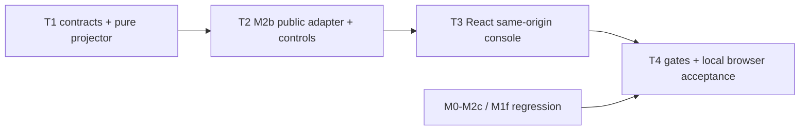

# Glodex M2d AG-UI / React 交互与运营闭环实施任务

| 字段 | 值 |
|---|---|
| Tasks ID | `GLO-TASKS-010` |
| 版本 | `0.1.0` |
| 状态 | Approved |
| 对应规格 | [`GLO-SPEC-010 v0.1.0`](./spec.md)（Approved） |
| 对应计划 | [`GLO-PLAN-010 v0.1.0`](./plan.md)（Approved） |
| 里程碑 | M2d：AG-UI adapter、React 实时运行面与受控运营视图 |
| 创建日期 | 2026-07-31 |
| 最后更新 | 2026-07-31 |
| 批准日期 | 2026-07-31 |

## 1. 实施边界与完成定义

本任务单只交付一个本机 M2d interaction layer：在 `127.0.0.1:8767` 提供固定 AG-UI HTTP/SSE
subset 和 React Run Console；它只通过固定 `127.0.0.1:8766` 的 M2b public durable HTTP API
创建/读取/重连/取消/恢复 run。PostgreSQL、Redis、checkpoint、private profile、M2a Agent、
OpenSearch、Provider 和 M2c GPU 都不进入 M2d implementation surface。

实施按 **T1 → T2 → T3 → T4 四个大任务**进行。每个任务先建立 fake/contract/architecture
evidence，再接入 production composition；不按单 event 字段、单按钮、单 CSS 或单测试文件拆成
等待节点。不得提交 `.env`、credential、raw query/profile、CoT、tool args/output、Provider/M2b
body、DB/Redis value、GPU/tunnel/manifest 信息、`node_modules`、build cache、Docker volume 或
`项目架构/` 的 26 张 PNG。

最低完成结论是：M2b 的真实 durable run 可以经新 adapter 成为经过 `@ag-ui/core` 校验的安全
AG-UI stream，在 React 页面中展示状态/工具/fork/可信 terminal result；刷新或断线从 M2b
durable cursor 重连后保持相同 view；Cancel/Resume 和 relay failure 不伪造状态。M1f 静态页面、
M2b API、M2a/M2c backend 与默认 offline 行为必须不变。

## 2. 交付任务

### T1 — AG-UI 严格合同、纯 projector 与安全输入/状态模型

**目标。** 建立 M2d 自己的冻结 DTO、M2b public event parser 和纯 AG-UI projector，使旧
`glodex.agent.event.v1` 仍保持旧合同，而 M2d 可以被独立验证为 AG-UI compatible subset。
本任务不启动 HTTP server、不调用 M2b、也不创建 React 页面。

**实现内容。**

- 新增 strict/frozen `AgUiRunInput`：仅接收一个 user text message、空 state/tools/context 和四项
  SearchRequest forwarded props；验证 64 KiB body、Identifier、text/enum/top-k/snapshot 边界，拒绝
  `parentRunId`、多消息、non-text/multimodal、client tool、profile/model/endpoint 字段；
- 新增 AG-UI event union/serializer：只实现 Spec 4 的 `RUN_*`、`STEP_*`、`TOOL_CALL_START/END`、
  `STATE_SNAPSHOT`、`CUSTOM` 与 terminal assistant text；字段 camelCase、`timestamp`、SSE frame
  JSON、source cursor 和 projection ordinal 全部固定；不实现 `RAW`、reasoning、activity、tool args/
  result、state delta 或 generic mapper；
- 新增 strict `GlodexM2dState`、`M2dTerminalView`、stage/fork models 和四个 `M2D_*` safe codes。
  terminal view 以白名单投影 `AgentDemoResponse`，限制结果/阶段/fork/byte size，never expose
  config diagnostics、query span、unselected candidate 或上游 raw payload；
- 新增纯 `AgUiProjector`：严格 parse M2b public event，验证 source sequence/run/thread/terminal
  legality，按 Spec 5.1 建立 ordered events/state。坏 JSON、unknown event/field、cursor gap、
  cross-run、oversize、非法 terminal 都只生成固定 `RUN_ERROR(M2D_PROJECTION_INVALID)`；
- 新增 M2d fixture matrix：九个业务工具、`dispatch_tool`、fork、COMPLETED、NO_MATCH、FAILED、
  ABORTED、unknown/invalid event；以 `@ag-ui/core` schema（前端 test）和 Python contract（后端）
  共同证明序列可解析、tool start/end 配对、无敏感字段、首流/重放的 reducer state 等价；
- architecture tests 证明新模块不 import M2b store/coordinator、DB/Redis/M2c/Provider adapter，且
  default test 零 socket；旧 `agent_events.py`、M2b endpoint/fixtures 和 M1f output 不改。

**先行验证。** exact input accept/reject、event JSON schema、event order、cursor/ordinal idempotency、
terminal whitelist/size、safe-code-only failure、no `rawEvent`/query/args/output/reasoning leak、parent
contract regression。Node dependency 仅在本 task 的 locked test setup 用于官方 event validation，
不创建 browser server 或 external network。

**验收证据。** `GLO-M2D-P0-001`、`GLO-M2D-P0-002`、部分 `P0-005`、`M2D-AC-001`、
`M2D-AC-002`、`GLO-M2D-NFR-002`、`NFR-003`、`NFR-006`。

**完成条件。** 给定任何合法 M2b public event fixture，T1 能生成固定、安全、可被 AG-UI schema
接受的投影；错误 fixture 仅产生 M2D safe code。没有 TCP/HTTP/M2b live/React 依赖。

- [x] T1 完成

### T2 — 固定 M2b public HTTP client、M2d FastAPI adapter 与 durable controls

**目标。** 将 T1 的纯投影接入一个仅调用 M2b public HTTP API 的 loopback app，交付标准 AG-UI
POST、durable reattach extension 和 Cancel/Resume proxy；M2d 不直接碰 M2b 存储层。

**实现内容。**

- 新增 `M2dDurablePublicClient` 与 narrow port。live implementation 的目标只允许
  `http://127.0.0.1:8766`，使用 `httpx`、`trust_env=False`、no redirect、固定 connect/read/body
  limits；只调用 M2b 的 create/status/events/cancel/resume，严格验证 content type、safe error
  envelope、SSE `Last-Event-ID`/id 和 body bounds；无 arbitrary host/url/profile/model/credential；
- 新增独立 M2d FastAPI factory/routes：`POST /api/v1/m2d/ag-ui` 先严格映射 SearchRequest，再以
  M2b create + status/events 投影为 AG-UI SSE；`GET /runs/{id}`、`GET /runs/{id}/events`、
  `POST /cancel`、`POST /resume` 按 Spec 4.2 代理；每个 route 只输出 M2d DTO/SSE；
- 实现 source group 写出和 reattach：将一个 source event 的所有 projection events 原子写完后才
  推进 browser cursor；replay 以 `(sourceCursor, ordinal)` 重发完整 group，React 可幂等去重；
  cursor/status mismatch、upstream 4xx/5xx/timeout/early close 只产生对应 `M2D_*`，不重试/
  submit/修改 durable state；
- 新增 `m2d-serve --live`：固定 8767 loopback，app startup 不向 8766 发请求；同源静态 assets
  若缺失则安全说明 build prerequisite。关闭 access log body，不能读取 `.env` 或启动 Docker；
- fake M2b HTTP/SSE transport 证明 exact request route/body/header、loopback enforcement、proxy/
  redirect/oversize/bad JSON rejection、one-submit rule、status/event replay、cancel/resume state and
  error propagation；以受控 deterministic M2b local smoke 验证实际两个 loopback processes 的
  create → stream → cancel/resume/replay，不用 Provider/GPU。

**先行验证。** M2b API unavailable 不阻止静态 app 启动；first stream/replay item 与 T1 fixture
等价；每个 control 只访问既有 M2b route；direct Postgres/Redis imports、M2b coordinator/store
access 和任何 `18000` network 被 architecture/socket tests 拒绝。

**验收证据。** `GLO-M2D-P0-001`、`P0-002`、`P0-004`、`P0-005`、`P0-006`，以及
`M2D-AC-001`、`AC-002`、`AC-004`、`AC-005`、`NFR-001/002/003/006`。

**完成条件。** curl/standard AG-UI HTTP client 能以 fake 或 deterministic local M2b upstream
完成一个安全 stream，重连和 controls 不创建第二个 run，也没有 UI/Node 必要依赖。

- [x] T2 完成

### T3 — React Run Console、同源展示与浏览器重连

**目标。** 建立真正的 React 页面，使用户能从 `8767` 提交一条购物请求、消费 T2 AG-UI SSE、
展示安全运行/终态，并控制重连/取消/恢复。页面不成为另一个 Agent/backend。

**实现内容。**

- 新增 `frontend/` TypeScript/React/Vite workspace 与 committed npm lockfile，锁定
  `@ag-ui/core`/`@ag-ui/client`。安装/build/test 无 CDN、remote font、analytics、script injection
  或 external request；production `npm run build` 输出由 T2 app 同源 serve；
- 实现单一 `Glodex Run Console`：表单构建 exact `AgUiRunInput`；stream client 在每个 event 经
  `@ag-ui/core` schema validate 后才交 reducer；reducer 以 `(sourceCursor, projectionOrdinal)`
  去重，绝不用 timing/字符串猜测 Agent state；
- render loading/empty/running、round/tool/fork timeline、source cursor、COMPLETED/NO_MATCH
  terminal view、FAILED/ABORTED、`M2D_*` relay degraded/inaccessible server。只显示 T1 state 的
  safe fields；没有 prompt/CoT/tool args/output、profile/raw query history、Provider/DB/Redis/GPU
  debug view，failed/aborted 清除 partial business results；
- 仅在合法 snapshot 显示 Cancel/Resume/Reconnect；New run 只清 React memory。标准 POST 使用
  fetch stream；重新挂接使用 T2 GET events/status；browser 永远不请求 8766、18000 或其他 host；
- 组件/reducer/browser tests 使用 fake server 验证 form encode、AG-UI parser、timeline/terminal
  render、reload dedupe、button state、safe error、no storage/URL/console persistence、无外部
  network。visual acceptance 以清晰状态和可测试 DOM 为准，不新增 dashboard/chart/account UI。

**先行验证。** `npm ci && npm run build && npm test` 可在锁定依赖下通过；built asset scan 不含
credential/private endpoint/raw fixtures；页面可用 fake stream 展示九工具、fork、NO_MATCH 和
controlled failure，且刷新重连不重复 stage/card。

**验收证据。** `GLO-M2D-P0-003`、`P0-004`、`P0-005`、`M2D-AC-003`、`AC-004`、`AC-005`、
`NFR-004`、`NFR-005`。

**完成条件。** production build 被 M2d app 实际托管，页面实际消费 T2 SSE，而非录制回放/静态
mock；network audit 只出现同源 M2d route。

- [x] T3 完成

### T4 — 全量门禁、真实本机验收、文档与发布 hygiene

**目标。** 把 T1–T3 变为可复现的学生本机交互闭环，分开报告 offline/default evidence 与 explicit
M2b browser smoke，并证明不丢失 M0–M2c 的亮点或安全边界。

**实现内容。**

- 新增 `tests/m2d/{unit,contract,acceptance,architecture,nfr}`、前端 tests、traceability profile
  和 `scripts/verify_m2d.py`。runner 顺序为 Python format/lint/mypy → M0–M2c default regression
  → M2d Python suite → locked frontend build/test → DOM/SSE/log/asset/Git hygiene scan；清除
  Provider/proxy/GPU environment、禁 socket、不启动 Docker/uvicorn/M2b，也不下载依赖；
- 实现明确 local smoke helper/document：Operator 先按 M2b README 启动 existing compose/index/
  `m2b-serve --live`，再启动 `m2d-serve --live`，浏览器访问 `127.0.0.1:8767`。deterministic
  M2b path 验证 create/live/replay/cancel/resume；provider-backed M2a run 只能是额外、自愿、
  明确标注的 browser acceptance；
- 更新 README 与 CLI help：解释 8765 static showcase、8766 M2b durable API、8767 M2d console 的
  分工；列出 build/start/stop/reconnect 条件、M2b/M2c 边界和 sensitive-data 限制。不得记录
  credential、private host/GPU/tunnel/manifest、raw payload 或 query/profile；
- 执行 final review：无 M2b public contract change、无 M1f modifications、无 M2c imports/routes、
  no direct DB/Redis, no WebSocket/queue/worker/account code，`.gitignore` 覆盖 node_modules/build/
  cache，Git staged set 排除 `.env`、volume 与 PNG；
- 记录真实验收结果，只报告 safe summaries：offline gate、front build/test、M2b local smoke、
  browser same-origin network audit、replay/control 结果与 optional provider run。外部前提缺失时
  报告其缺失，不以 fake 代替真实 local evidence。

**先行验证。** `verify_m2d.py` 默认网络隔离；M0–M2c/M1f regression；packaged static asset
privacy; CLI parser restrictions；loopback-only server; fake/living upstream separation；Git diff
contains only intended source/docs/lockfiles and no architecture images.

**验收证据。** 全部 `GLO-M2D-P0-001`–`P0-006`、`M2D-AC-001`–`AC-006`、
`GLO-M2D-NFR-001`–`NFR-006`；最终默认门禁：

```bash
uv run --locked python scripts/verify_m2d.py
```

**完成条件。** README 能让拥有既有 M2b local prerequisite 的学生复现真实 React/AG-UI/durable
replay closure；M2d 成功声明同时有 offline gate 和 explicit M2b local/browser evidence，且 M2c
GPU/其他父里程碑的真实边界仍被证明保留。

- [x] T4 完成

## 3. 依赖、测试顺序与不可变约束



| 阶段 | 允许的外部依赖 | 禁止事项 |
|---|---|---|
| T1 default tests | 无；fixture/AG-UI schema/locked local Node dependency | socket、M2b/DB/Redis/OpenSearch/Provider/GPU、browser server、敏感 event payload。 |
| T2 fake/contract | fake public M2b HTTP/SSE transport | direct store/coordinator、任意 host、Docker、Provider/GPU/M2c、自动 retry/queue。 |
| T2/T3 local smoke | operator 已启动的 M2b 8766 和其 existing local prerequisite | 改 M2b backend/schema、连接 18000、读取 secret/`.env`、公网监听。 |
| T4 final evidence | T1–T3；optional explicit M2a credential run | Node/Python default runner 访问网络、录制回放冒充实时、storage/account/WebSocket/multi-worker。 |

不变约束：M2b public API 是唯一 durable truth interface；M2d AG-UI 是独立投影而不是旧 SSE
rename；M2a Canonical/Evidence/Hard Gates 不由 UI 改写；Redis 仍仅 cache；M2c GPU 仍是
operator-only；M1f 仍为 static replay；所有 browser output 和 Git 仍执行最小安全投影。

## 4. Tasks Definition of Ready（进入 Implementation 前）

- [x] 用户批准本 Tasks，并将状态改为 `Approved`；
- [ ] 用户确认 T1 → T2 → T3 → T4 是唯一实施顺序，不把单 event、按钮、CSS 或测试拆成等待节点；
- [ ] 用户确认 M2d 通过固定 8766 public API 建立第二个 8767 interaction app，绝不进入
      M2b DB/worker、也不改变其 M2a backend；
- [ ] 用户确认 React 使用 locked `@ag-ui` subset、同源页面和内存态；不做 WebSocket、storage、
      account、队列/multi-worker、dashboard 或 full AG-UI；
- [ ] 用户确认 T4 默认 gate 与 M2b local/browser smoke 分离，M2c GPU 不参与 M2d；
- [ ] 用户确认 T4 的 Git hygiene 清单包含 26 张 PNG、`.env`、credentials、raw payload、private
      M2b/Redis/GPU/tunnel data、node_modules/build cache 和 Docker volume。
