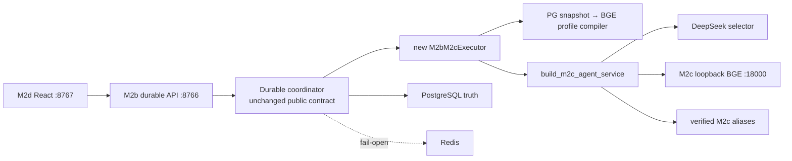

# Glodex M2e Durable BGE Composition 技术实施计划

| 字段 | 值 |
|---|---|
| Plan ID | `GLO-PLAN-011` |
| 版本 | `0.1.0` |
| 状态 | Approved |
| 对应规格 | [`GLO-SPEC-011 v0.1.0`](./spec.md)（Approved） |
| 父基线 | `GLO-SPEC-008`、`GLO-SPEC-009`、`GLO-SPEC-010` |
| 里程碑 | M2e：durable DeepSeek + A100 BGE live composition |
| 创建日期 | 2026-07-31 |
| 批准日期 | 2026-07-31 |

## 1. 目标、边界与实施策略

M2e 不重做 Agent、M2c GPU service 或 M2d 前端，而是替换一个明确的 composition seam：
`m2b-serve --live` 和 `m2b-durable-agent-demo --live` 从 M2a executor 切到 M2c executor。正式
浏览器链路保持 `8767 → 8766`，但其内部成为 `DeepSeek action selector + 127.0.0.1:18000 BGE
embedding/reranker + M2c OpenSearch aliases`。DashScope 只保留在独立 M2a baseline，不可进入
M2e runtime。

实施固定为 **A → B → C → D 四个交付块**。不加入新的 Provider abstraction、模型开关、队列、
worker、前端功能、数据库/HTTP schema 或 GPU deployment；也不删除 M2a baseline。

- 已验证的 M2c service、独立 BGE aliases 和 `build_m2c_agent_service()` 是唯一可复用模型路径；
- PostgreSQL 仍是 Run/Event/Checkpoint/Profile 的唯一 durable truth；Redis 仍只是 fail-open cache；
- 已存 durable Profile 的 `value`/revision 才是跨模型可迁移语义，旧 1024 维 vector 无论维度相同与否
  均不可信、不可复用；
- 每个 M2e run 的 asset version 含当前 M2c manifest prefix。因此切换或 manifest 漂移不会让新的
  backend resume 旧外部执行；
- 真正 Provider/GPU 调用只留给 explicit live smoke。默认 gate 使用 fake M2c/DeepSeek transport，
  清除 credential/proxy/tunnel 环境。

## 2. 增量架构与复用缝



| 现有缝 | M2e 精确处理 |
|---|---|
| `M2bM2aExecutor` | 保留其文件供独立历史/M2a baseline 使用；新增并列 `M2bM2cExecutor`，M2b live command 不再 import 它。 |
| `build_m2c_agent_service()` | 复用其 DeepSeek selector、M2c health/index verification、BGE embedding/reranker、Query/User/Item retrieval 与可信发布链；增加 profile manifest exact-match validation。 |
| M2b PostgreSQL Profile | 继续持久化 typed value、entry ID、revision 和写入时的 BGE vector；M2e execution 仅消费 value/ID/revision 并重新 BGE 编码。 |
| M2c Profile Entry | 新增 M2b-only compiler：health → bounded embed frozen values → manifest-bound `M2cProfileEntry`。它不写 M2c operator profile alias，也不读取 legacy vector。 |
| Durable coordinator | 保持 HTTP/SSE/event state machine；在 resume 前比较 run asset/config identity，不匹配以稳定 safe code abort。 |
| M2d | 不改 adapter、React 或端口；它只继续读取 M2b public contract，天然展示 M2e 事件和终态。 |

## 3. 四个交付块

### A. M2e executor、preflight 与 identity fence

新增小型 `M2bM2cExecutor`。它从 PostgreSQL 获取一个已冻结的 profile revision，编译 BGE profile
entries，然后构造 M2c Agent service 并把既有 observer 原样交给 AgentLoop。`m2b-serve` 和一次性
durable demo 都由该 executor 组成；asset version 以在启动时验证的 M2c manifest prefix 生成。

更新 coordinator resume path，使 `asset_version` 或 config fingerprint 不同的非终态 run 安全 abort，
而不是把 M2a checkpoint 交给 M2c。M2c health、M2c aliases、可信 assets 任一失败均发生在 DeepSeek
外部步骤前。M2b route、DTO、event projector 与 M2d 不修改。

完成 A 时用 fake store/GPU/Agent factory 验证 M2c composition、identity binding、preflight order 和
old-run fail-closed；不启动 Docker/GPU 或调用 DeepSeek。

### B. Durable Profile 的 BGE 重编码

新增一个只接受 `DurableProfileSnapshot` 的 compiler。它以当前 M2c health identity 对最多 16 条
已冻结 preference value 做有界 embedding，使用原 profile/entry IDs 创建 `M2cProfileEntry`，并将
其交给 M2c User ANN。旧 `user_vector` 仅可留在 PostgreSQL 的历史字段，任何 M2e code path 都不读它。

将 `m2b-profile set --live` 的写入 embedding 从 DashScope 换为 M2c；list/delete、opaque CLI output
和 revision 保持原合同。`build_m2c_agent_service()` 对 caller-supplied entries 校验 digest 与本次
health identity 相同，防止 health 重检后出现模型漂移。

完成 B 时 fake tests 覆盖旧 vector poisoning、BGE text batching/entry identity、digest mismatch、
Profile 嵌入失败的受控降级，以及无 DashScope import/call；不迁移、复制或泄露 Profile 原文。

### C. 合同回归、architecture proof 与可追溯性

新增 `tests/m2e/{unit,contract,acceptance,architecture,nfr}`，并登记 `m2e` traceability profile。测试
将覆盖 M2e six P0、three AC 与 four NFR：M2b command composition、profile compiler、asset-version
resume fence、M2d public compatibility、zero-socket default 和 provider/vector/privacy boundaries。

更新旧 M2c isolation assertions：它们仍禁止 M2a baseline 与默认路径接触 GPU，但不再禁止这条已批准
的 M2e durable composition import M2c。新增 `scripts/verify_m2e.py`，顺序为既有 M2d regression、
M2e tests、format、mypy 与 M2e traceability；runner 不使用 credential、Docker、GPU tunnel 或 browser。

### D. 文档、切换与真实验收

更新 README 和 M2b/M2c/M2d runbook：先启动 PostgreSQL/Redis/OpenSearch，验证 M2c health/index，
仅注入 `DEEPSEEK_API_KEY`，再启动 `m2b-serve --live` 和 `m2d-serve --live`。明确 `8765` 是录制
Showcase，`8767` 才是 live acceptance。

真实验收顺序固定为：停止旧 M2a-backed `8766` process → 以 M2e 启动新服务 → provider-free health/
index verification → 浏览器在 `8767` 创建一条受控请求 → 读取 M2b durable status/SSE 证明 model/tool
lifecycle 与 terminal truth。输出只记录安全状态、event 数量、manifest prefix 和结果类别；不记录 query、
profile、Provider request、vector/score 或 credential。

## 4. 验证矩阵

| 层级 | 最小证据 | 覆盖 |
|---|---|---|
| unit | profile compiler、BGE entry digest、legacy-vector ignore、asset identity comparison | `P0-003`–`005`、`NFR-002` |
| contract | CLI/composition、fixed M2c loopback、M2d DTO/SSE compatibility、safe error shape | `P0-001`、`P0-002`、`P0-004` |
| acceptance | fake durable create/run/replay/resume、M2a historical terminal reads、manifest drift abort | `M2E-AC-002`、`M2E-AC-003` |
| architecture/NFR | M2e no DashScope/M2a executor import, default zero socket, no private data/PNG/secret output | `NFR-001`–`004` |
| real local live | M2c health/index + DeepSeek durable browser run through 8767/8766 | `M2E-AC-001` |

最终离线门禁为：

```bash
uv run --locked python scripts/verify_m2e.py
```

真实验收是独立 Operator action，不进 pytest。它需要已验证 A100 loopback service、M2c index、
PostgreSQL/Redis/OpenSearch，以及显式 DeepSeek credential。

## 5. Plan Definition of Ready（进入 Tasks 前）

- [x] 用户批准本 Plan（2026-07-31）；
- [x] 用户确认正式 live 链路固定为 DeepSeek + A100 本地 BGE，DashScope 不属于 M2e runtime；
- [x] 用户确认旧 durable vector 不可跨模型复用，Profile value/revision 由 PostgreSQL 保持长期记忆；
- [x] 用户确认 M2a baseline 保留，但不能继续充当 `8766/8767` 正式演示 backend；
- [x] 用户确认真实验收可使用已有 DeepSeek credential、已验证的 private BGE loopback 与本地 Docker 服务；
- [x] 四个交付块、默认离线门禁与独立真实 Provider/GPU browser acceptance 获得批准。
