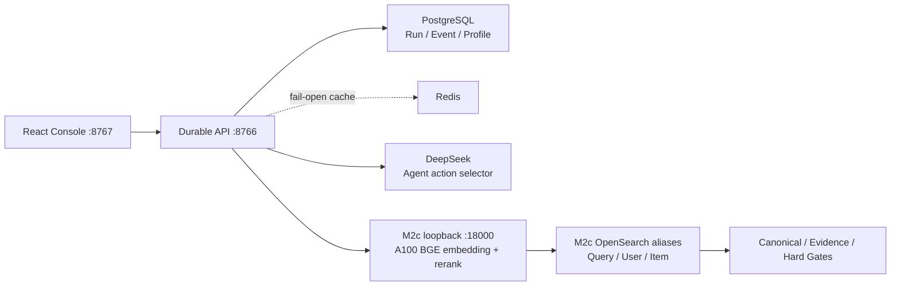

# Glodex M2e Durable BGE Composition 规格

| 字段 | 值 |
|---|---|
| Spec ID | `GLO-SPEC-011` |
| 版本 | `0.1.0` |
| 状态 | Approved |
| 里程碑 | M2e：DeepSeek Agent + 私有 A100 BGE 的 durable live backend |
| 父规格 | [`GLO-SPEC-008`](../008-glodex-m2b-durable-agent-runtime/spec.md)、[`GLO-SPEC-009`](../009-glodex-m2c-retrieval-model-service/spec.md)、[`GLO-SPEC-010`](../010-glodex-m2d-agui-react-operations/spec.md) |
| 创建日期 | 2026-07-31 |
| 批准日期 | 2026-07-31 |

## 1. 目的

当前 `8766` M2b durable backend 使用 M2a：DeepSeek 负责 Agent action，DashScope 负责
embedding 与 rerank。用户确认正式 live 演示应改为 **DeepSeek + 私有 A100 BGE**，不再依赖
DashScope。M2e 将 M2b/M2d 的正式运行链路切至已经验收的 M2c BGE service；`8765` 仍只是
离线 Showcase，不能作为本规格的 live 验收。

这里的“真实”要求是：一次成功 live run 实际访问 DeepSeek 与固定 loopback M2c service，
并使用 BGE vector 和 cross-encoder score；不得以录制事件、fixture、关键词排序、DashScope
fallback 或只 health 检查冒充完成。

## 2. 范围

### In scope

- 新增 `M2bM2cExecutor`，使 `m2b-serve --live` 与 `m2b-durable-agent-demo --live` 调用
  `build_m2c_agent_service()`，保留现有 PostgreSQL run/event/checkpoint、Redis 语义、M2b HTTP
  路由、M2d AG-UI 投影和九工具/可信发布链；
- 保留 DeepSeek 作为唯一 Agent 推理与 action-selection Provider；M2c 固定回环 service 负责
  BGE-M3 embedding 和 BGE cross-encoder rerank；
- 将 durable Profile 的 PostgreSQL value/revision 作为唯一长期记忆真相。每次 M2e run 对冻结的
  soft preference value 通过 M2c BGE 重新编码为本次 User ANN 所需的 `M2cProfileEntry`，并绑定
  当前 manifest digest；**不读取、不转换、不复用**已保存的 DashScope `user_vector`；
- `m2b-profile set --live` 改用固定 M2c BGE 生成新 vector；list/delete、opaque entry ID 和
  PostgreSQL revision 语义不变；
- 将 durable asset version 绑定为 `m2b-m2c-agent-<manifest-prefix>`。旧 M2a run 可以继续读取
  已持久化的 status/events，但任何非终态 M2a run 或 manifest 不匹配 run 都只能安全 `ABORTED`，
  不得在新 backend resume；
- 更新 README、M2b/M2c/M2d 架构说明和 operator 操作顺序；正式 live 前置条件为
  PostgreSQL、Redis、OpenSearch、已验证的 M2c service/index 与 `DEEPSEEK_API_KEY`，不再需要
  `DASHSCOPE_API_KEY`。

### Out of scope

- 删除或修改独立 `m2a-*` 命令、M2a/DashScope baseline、既有实验数据，或承诺它们也改用 BGE；
- 改变 M2b/M2d 已冻结 HTTP、SSE、AG-UI wire contracts，增加浏览器到 GPU 的直连、任意 endpoint/
  模型选择，或暴露 GPU host、模型路径、向量、score、profile 原文、Provider body 或凭据；
- 模型训练、A100 集群、远程部署、队列、并行 worker、性能/召回率承诺，或真实 marketplace 数据源。

## 3. 不变量

1. **职责不混淆。** DeepSeek 只负责 Agent action；M2c 只负责 embedding/rerank。二者都是实际
   模型调用，M2c 不生成回答或工具决策。
2. **无 DashScope 运行时路径。** `m2b-serve`、`m2b-durable-agent-demo`、`m2b-profile` 和
   `M2bM2cExecutor` 不得 import/call DashScope 或 `M2bM2aExecutor`。M2c 不可用、index 或 manifest
   不匹配时 fail closed/degraded，绝不静默回退。
3. **长期记忆不跨模型污染。** PostgreSQL 的 typed value/revision 是 durable truth；旧 vector 不参加
   M2e 推理。每个 M2e User ANN vector 必须由当前 manifest 对当前冻结 value 编码。
4. **可信结果边界不变。** BGE vector、rerank score、OpenSearch `_source` 与 Profile 都不能直接产生
   商品、价格、证据或最终回答；Canonical/Evidence/Hard Gates 仍是唯一发布边界。
5. **恢复不猜测。** backend/manifest/config/profile revision 或 checkpoint 不匹配、以及任何
   `REMOTE_PENDING` run 均终止为安全 `ABORTED`；不重放外部模型调用。
6. **默认隔离。** 默认 test、M0–M2d 非 live 命令、M1f Showcase 不访问 DeepSeek、GPU、Docker、
   OpenSearch 或凭据；M2c socket 仅由明确 `--live` M2e composition 访问。

## 4. 功能需求

| ID | 要求 |
|---|---|
| `GLO-M2E-P0-001` | `m2b-serve --live` 和 durable demo 采用 M2c executor，并把 M2c manifest identity 写入 asset version；M2b public API/M2d 页面无需改 endpoint。 |
| `GLO-M2E-P0-002` | M2e preflight 必须先验证固定 `127.0.0.1:18000` health、M2c BGE aliases/index 与当前 manifest，再允许 DeepSeek 外部 Agent step。 |
| `GLO-M2E-P0-003` | 每次 durable Profile snapshot 仅以 PostgreSQL value/entry ID/revision 为输入，经 M2c embedding 构造 manifest-bound entry；旧 DashScope vector 不得输入 User ANN。 |
| `GLO-M2E-P0-004` | M2b profile 写入使用 M2c embedding；读取只显示 opaque ID/revision，不暴露 value/vector/digest。已有 Profile value 在首个 M2e run 可安全重新编码，无需复制或手工导出。 |
| `GLO-M2E-P0-005` | M2a→M2e 切换后，terminal historical run 的 GET/SSE 仍可读；active/recoverable M2a 或 identity drift run 不可 resume，必须产生稳定安全 code。 |
| `GLO-M2E-P0-006` | README 明确区分 `8765` 离线 Showcase 与 `8767 → 8766 → DeepSeek + M2c` 正式 live demo，并给出不含 DashScope 的启动/停止/验收命令。 |

## 5. 验收场景

### `M2E-AC-001` 真实最终链路

**Given** PostgreSQL、Redis、OpenSearch、M2c BGE service/index 已就绪，当前 shell 仅提供
`DEEPSEEK_API_KEY`

**When** Operator 启动 `m2b-serve --live`，从 `8767` 提交受控购物请求

**Then** M2b durable event 中出现实际 model/tool 生命周期，M2d 显示可信 terminal 或安全业务
terminal；A100 service 实际完成 embedding 与 rerank；没有 DashScope 请求或凭据前提。

### `M2E-AC-002` 长期 Profile 重编码

**Given** PostgreSQL 有旧 profile revision 和任意旧 1024 维 stored vector

**When** M2e durable run 冻结该 revision

**Then** 只发送其 typed value 到 M2c embedding，User ANN 使用当前 manifest vector；篡改/替换旧
stored vector 不改变该输入，也不触发 DashScope。

### `M2E-AC-003` 安全切换与回归

**Given** 一个历史 M2a active/recoverable run、一个 terminal historical run 和一个 manifest drift

**When** M2e backend 启动/尝试 resume

**Then** terminal status/events 仍可读；其余只能 `ABORTED` 并带稳定 safe code；M2a CLI baseline、
M1f 和 M2d offline contract tests 均保持通过。

## 6. 非功能需求

| ID | 要求 |
|---|---|
| `GLO-M2E-NFR-001` | 默认门禁零 Provider/GPU/socket；live 验收仅使用固定 loopback M2c endpoint 和显式 DeepSeek credential。 |
| `GLO-M2E-NFR-002` | 新增 architecture tests 证明 M2b live composition 无 DashScope/M2a executor import，且 BGE profile projection 忽略旧 vector。 |
| `GLO-M2E-NFR-003` | 不在 HTTP/SSE/Redis/log/README/Git 输出 raw query/profile、vector、score、manifest 全文、GPU/SSH host 或 credential。 |
| `GLO-M2E-NFR-004` | 保留 M2b durable truth/cache semantics、M2d public compatibility 和 M2a/M2c 既有离线 suites；不为演示引入生产基础设施。 |

## 7. Definition of Ready（进入 Plan 前）

- [x] 用户确认正式链路为 **DeepSeek + A100 本地 BGE**，去除 DashScope；
- [x] `m2c-model-verify --live` 已验证固定 loopback BGE service 可用（1024 维、manifest 已验证）；
- [x] 用户批准本规格（2026-07-31）；
- [ ] `6 P0 / 3 AC / 4 NFR` 在 Plan 中逐项映射实现与测试；
- [ ] 真实验收前由 Operator 提供 DeepSeek credential，并确认 M2c index 与本地基础设施就绪。

## 8. 完成定义

完成不等于 `8765` 能播放，也不等于仅通过 GPU health。完成时，`8767` 的一次真实 durable run
在不使用 DashScope 的前提下，经过 DeepSeek Agent、当前 A100 BGE embedding/rerank、M2c
OpenSearch retrieval 和既有可信发布 gates，留下可重放的 PostgreSQL status/events，并有离线回归
与安全切换证据。
