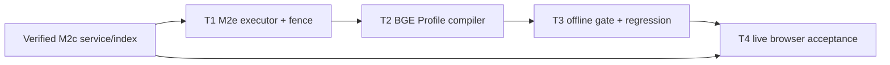

# Glodex M2e Durable BGE Composition 实施任务

| 字段 | 值 |
|---|---|
| Tasks ID | `GLO-TASKS-011` |
| 版本 | `0.1.0` |
| 状态 | Approved |
| 对应规格 | [`GLO-SPEC-011 v0.1.0`](./spec.md)（Approved） |
| 对应计划 | [`GLO-PLAN-011 v0.1.0`](./plan.md)（Approved） |
| 里程碑 | M2e：durable DeepSeek + A100 BGE live composition |
| 创建日期 | 2026-07-31 |
| 批准日期 | 2026-07-31 |

## 1. 实施边界与完成定义

本任务单只将 M2b/M2d 的**正式 live composition**由 M2a DashScope backend 切换为 M2c BGE
backend。它保留 `8766` M2b public API、`8767` React Console、PostgreSQL durable truth、Redis
fail-open cache、DeepSeek Agent selector、M2c OpenSearch aliases、Canonical/Evidence/Hard Gates
与九工具。`8765` 继续是离线 Showcase；独立 `m2a-*` baseline 继续存在，但不再是最终演示后端。

实施固定为 **T1 → T2 → T3 → T4**。每个任务先写 fake/contract/architecture evidence，再连到
production composition。禁止提交 `.env`、credential、query/profile 原文、Provider body、vector、
score、manifest 全文、GPU/SSH host、Docker volume、build cache 或 `项目架构/` 的 26 张 PNG。

最低完成结论是：只注入 DeepSeek credential 的 Operator 可启动 `m2b-serve --live`，从 `8767`
运行一次 durable Agent；该运行实际使用 M2c BGE embedding/rerank 和 DeepSeek action selector，
并保留 PostgreSQL replay。DashScope 不属于此路径，也不能作为 M2c 不可用时的 fallback。

## 2. 交付任务

### T1 — M2e durable executor、M2c preflight 与恢复 identity fence

**目标。** 用专用 M2c executor 替换 M2b live composition，同时让 backend/model identity 成为
durable resume 的安全边界。

**实现内容。**

- 新增 `M2bM2cExecutor`，复用 `build_m2c_agent_service()` 与现有 durable executor shape；M2b
  server 和 durable demo 改用它，不导入 `M2bM2aExecutor` 或 DashScope adapter；
- 在 live startup/durable demo 先取得固定 M2c manifest identity，生成
  `m2b-m2c-agent-<manifest-prefix>` asset version；M2c health、M2c aliases/index、trusted assets
  或 model identity 异常必须在 DeepSeek 外部 Agent 步骤前安全失败；
- 收紧 coordinator resume：asset version/config fingerprint 不同的 M2a historical run 或 manifest
  drift run 只能 `ABORTED` 并使用稳定 safe code；terminal historical status/SSE 仍可读取；
- 保持现有 M2b HTTP DTO、SSE event contract、PostgreSQL schema、Redis namespace、M2d code 和
  M1f 资源不变。

**先行验证。** fake M2c identity/index/Agent/store 覆盖 exact composition、preflight order、asset
version binding、M2a active/recoverable fail-closed、terminal replay 与默认 zero socket。architecture
test 证明新 M2b live composition 不 import DashScope/M2a executor。

**验收证据。** `GLO-M2E-P0-001`、`GLO-M2E-P0-002`、`GLO-M2E-P0-005`、`M2E-AC-003`、
`GLO-M2E-NFR-001`、`GLO-M2E-NFR-002`、`GLO-M2E-NFR-004`。

**完成条件。** 一个 fake M2e durable run 与 resume/replay 测试证明 8766 的新 composition 使用
M2c，旧 active run 不会被错误恢复；仍不调用真实 DeepSeek/GPU。

- [x] T1 完成（2026-07-31）

### T2 — PostgreSQL 长期 Profile 的 BGE 重编码与无 DashScope 写入

**目标。** 让 durable Profile 保持长期记忆，同时完全消除旧 DashScope vector 对 M2e User ANN
的影响。

**实现内容。**

- 新增 M2b-only BGE profile compiler：对冻结 `DurableProfileSnapshot` 的最多 16 条 typed value
  调用固定 M2c embedding，以原 profile/entry ID 与当前 manifest digest 构造 `M2cProfileEntry`；
  绝不读取 snapshot 内的 legacy `user_vector`；
- 在 `build_m2c_agent_service()` 对外部传入的 profile entries 检查 manifest digest 与本次 health
  identity 严格相同；不匹配不做 User ANN，走明确安全行为；
- `m2b-profile set --live` 从 DashScope embedding 改为 M2c BGE embedding；PostgreSQL 的
  value/revision/opaque list-delete CLI 合同不变，旧 profile value 无需导出即可在 M2e run 安全重编；
- M2c 不可用、embedding 异常或 Profile manifest mismatch 时不回退 DashScope/关键词排序，且不使
  Query-first retrieval、Hard Gates 或 durable truth 失效。

**先行验证。** fake M2c client 证明 value-only input、legacy-vector poisoning 无效、bounded batch、
entry ID/revision closure、digest drift 与 error path；source/AST architecture tests 证明 M2e
Profile code 没有 DashScope import/call，也不把 value/vector 输出到 event/log/CLI。

**验收证据。** `GLO-M2E-P0-003`、`GLO-M2E-P0-004`、`M2E-AC-002`、
`GLO-M2E-NFR-002`、`GLO-M2E-NFR-003`、`GLO-M2E-NFR-004`。

**完成条件。** fake durable Profile with legacy vector 经 BGE compiler 只发送 frozen values；M2b
profile 写入与 M2c Agent supplied-profile path 都已通过合同测试。

- [x] T2 完成（2026-07-31）

### T3 — M2e regression、traceability 与离线交付门禁

**目标。** 让 M2e 的切换边界可重复验证，同时修订 M2c 原有“不得接入 M2b”的隔离测试，使其
只允许已批准的 M2e composition。

**实现内容。**

- 新增 `tests/m2e/{unit,contract,acceptance,architecture,nfr}`，覆盖 executor/profile/resume/
  M2d public compatibility/no-DashScope/default zero-socket/privacy；
- 在 traceability scanner 登记 M2e spec inventory/profile，建立 `scripts/verify_m2e.py`：先跑
  既有 M2d regression，再跑 M2e suite、format、mypy 和 coverage；默认 runner 清除
  credential/proxy/tunnel/GPU 环境，不能启动 Docker/uvicorn/browser；
- 有针对性地更新 M2c architecture assertions 与文档，不再声称 M2b 永远不可 import M2c，但继续
  阻止 M2a baseline、默认路径、M2d browser 和任意非-M2e code 访问 GPU；
- 复验 M0–M2d offline gates、前端 build 和 Git hygiene；不把实测 Provider/GPU 当作 fake test
  的成功条件。

**先行验证。** traceability reverse coverage、test marker inventory、runner sanitized environment、
AST/import boundary、socket spy、README/Git ignore checks；M2a/M1f/M2d old contracts 必须维持。

**验收证据。** 全部 `GLO-M2E-P0-001`–`P0-005`、`M2E-AC-002`–`AC-003` 与
`GLO-M2E-NFR-001`–`NFR-004` 的离线证据。

**完成条件。** `uv run --locked python scripts/verify_m2e.py` 在无 credential、无 Docker/GPU
network 的环境通过；所需模型调用只存在于 explicit live paths。

- [x] T3 完成（2026-07-31）

### T4 — Operator runbook、M2b/M2d 切换与真实 DeepSeek + A100 验收

**目标。** 将已完成的 M2e composition 作为学生可复现的正式演示闭环，而不是把 8765 回放页
当作 live 结果。

**实现内容。**

- 更新 README/spec cross-reference：清晰列出 `8765` static Showcase、`8766` M2e durable API、
  `8767` live React Console；正式前置仅含 PostgreSQL/Redis/OpenSearch、verified M2c service/index
  和 `DEEPSEEK_API_KEY`，无 DashScope credential；
- 提供安全运行顺序：验证 M2c → 验证 index → 停止旧 M2a-backed 8766 → 启动 M2e 8766 → 启动/保留
  8767 → 浏览器提交一条受控请求 → status/SSE replay；不自动创建 tunnel、下载模型或删除 volume；
- 执行真实验收：记录 M2c health/index、DeepSeek Agent model/tool lifecycle、M2d 同源显示、M2b
  terminal/replay 的安全摘要，并确认没有 DashScope runtime dependency；
- 最终检查 Git 变更只含所需 source/tests/docs，不包含凭据、`.env`、runtime data、PNG 或 frontend
  build artifact。

**先行验证。** README command shape、local port preflight、M2b/M2d process switch、M2d same-origin
network audit、SSE replay；外部前置缺失只能报告 `M2C_MODEL_UNAVAILABLE` 或相应 safe condition，
不得回退到离线 Showcase/fixture。

**验收证据。** `GLO-M2E-P0-006`、`M2E-AC-001`、`GLO-M2E-NFR-003`、`GLO-M2E-NFR-004`。

**完成条件。** `8767` 的真实 durable request 通过 DeepSeek 与 A100 BGE 到达可信 terminal 或诚实
safe terminal；结果及 status/SSE 可重放，且最终报告与 README 不再把 DashScope/8765 说成正式路径。

- [x] T4 完成（2026-07-31）

## 3. 依赖、测试顺序与不可变约束

| 阶段 | 允许的外部依赖 | 禁止事项 |
|---|---|---|
| T1–T3 default tests | fake M2c/DeepSeek/store、固定 assets | DeepSeek、GPU tunnel/OpenSearch/PG/Redis socket、credential、proxy、Docker、browser。 |
| T4 preflight | 已启动的 M2c service、OpenSearch、PostgreSQL、Redis | 自动建 tunnel/下载权重/删 volume、DashScope fallback、外网暴露。 |
| T4 live acceptance | T4 preflight + 明确 DeepSeek credential + 8766/8767 | 录制回放冒充 live、输出敏感正文/向量/score/credential、生产化 queue/worker。 |

不变约束：M2c service manifest 是 BGE identity 唯一来源；Profile value/revision 在 PostgreSQL；
M2b public contract 是 M2d 唯一上游；Redis 不变成真相源；DashScope baseline 与 M2e runtime
隔离；可信结果继续通过 Canonical/Evidence/Hard Gates。

## 4. Tasks Definition of Ready（进入 Implementation 前）

- [x] 用户批准本 Tasks（2026-07-31）；
- [x] 用户确认 T1 → T2 → T3 → T4 是唯一实施顺序，不拆成小型等待节点；
- [x] 用户确认 M2e 只替换 8766 的 live backend，不改 M2d wire contract、M1f 或独立 M2a baseline；
- [x] 用户确认旧 durable vector 不复用，BGE 根据 PostgreSQL frozen value/revision 重新编码；
- [x] 用户确认真实验收允许既有 DeepSeek credential 与 private A100 loopback，只记录安全摘要；
- [x] 用户确认默认离线 gate 与 T4 真实 Provider/GPU/browser acceptance 分离。
